# Table of Contents

1. [Integration-Service On-Premises DevSecOps - Azure App Register and Installer Download Pipeline - Introduction](#integration-service-on-premises-devsecops---azure-app-register-and-installer-download-pipeline---introduction)
2. [Data plane Role Based Access Control - RBAC](#data-plane-role-based-access-control---rbac)
3. [Integration-Service On-Premise Authentication and Authorization](#integration-service-on-premise-authentication-and-authorization)
4. [Matrix Table with App-Core Components](#matrix-table-with-app-core-components)
5. [Download Workflow of Integration-Service On-Premise](#download-workflow-of-integration-service-on-premise)
6. [Sharepoint Links with editable reference architecture diagrams](#sharepoint-links-with-editable-reference-architecture-diagrams)
7. [Toolchain](#toolchain)
8. [Environments](#environments)
9. [Requirements](#requirements)
    1. [Azure DevOps Extensions](#azure-devops-extensions)
    2. [Service Connection in Azure DevOps Project Settings - Environment names in pipeline](#service-connection-in-azure-devops-project-settings---environment-names-in-pipeline)
    3. [Azure Artifacts Permissions and Settings](#azure-artifacts-permissions-and-settings)
    4. [Matrix Table with permissions in Service Principal SP](#matrix-table-with-permissions-in-service-principal-sp)
    5. [Matrix Table with permissions in Azure Devops - Service User PAT](#matrix-table-with-permissions-in-azure-devops---service-user-pat)
    6. [Bitbucket repo settings with Integration-Service On-Prem source code](#bitbucket-repo-settings-with-integration-service-on-prem-source-code)
    7. [Configuration files with settings per environment](#configuration-files-with-settings-per-environment-software-development-life-cycle---running-this-pipeline-manually-and-validating-the-download-url)
        1. [Conditional Flags defined in configuration files](#conditional-flags-defined-in-configuration-files)
10. [Inventory of Files](#inventory-of-files)
    1. [Source Code](#source-code)
        1. [Development Files and Folders](#development-files-and-folders)
        2. [Lombok Java Library](#lombok-java-library)
        3. [Licenses folder](#licenses-folder)
        4. [Maven Wrapper](#maven-wrapper)
        5. [Maven POM Profile with Azure Artifacts settings](#maven-pom-profile-with-azure-artifacts-settings)
        6. [Spring Java Format Config Maven Plugin](#spring-java-format-config-maven-plugin)
    2. [Pipelines](#pipelines)
    3. [Scripts](#scripts)
    4. [Boilerplates and Samples](#boilerplates-and-samples)
    5. [Rendering maven variables in application properties](#rendering-maven-variables-in-application-properties)
    6. [Jinja2 template with winSW Configuration](#jinja2-template-with-winsw-configuration)
    7. [Jinja2 template with innoSetup Configuration](#jinja2-template-with-innosetup-configuration)
11. [Trigger Azure DevOps pipelines using REST API - How to run this pipeline via REST API](#trigger-azure-devops-pipelines-using-rest-api---how-to-run-this-pipeline-via-rest-api)
    1. [List of API Endpoints](#list-of-api-endpoints)
    2. [Setting up the default branch in Azure Devops Pipelines](#pipelines)
12. [Software Development Life Cycle - Running this pipeline manually and validating the download URL](#configuration-files-with-settings-per-environment-software-development-life-cycle---running-this-pipeline-manually-and-validating-the-download-url)
13. [Known Issues and Solutions](#known-issues-and-solutions)
14. [PowerShell Cheat Sheet](#powershell-cheat-sheet)
15. [VSCode settings](#vscode-settings)
16. [App-Core API Security and OAuth 2](#app-core-api-security-and-oauth-2)
17. [API Security and OAuth 2 in AAD - Microsoft APIs - Securing APIs and Authentication Flow](#api-security-and-oauth-2-in-aad---microsoft-apis---securing-apis-and-authentication-flow)
18. [Enterprise References](#enterprise-references)
19. [External References](#external-references)

## Integration-Service On-Premises DevSecOps - Azure App Register and Installer Download Pipeline - Introduction

- **Integration-Service is a tool developed to connect facilities with our App-Core products.** To ensure secure and seamless communication, it links facilities with our products through this connector, enabling the exchange of information and sanitization of each case. Integration-Service is also responsible for delivering the final results of each asset back to the facility.
- We want to authorize Integration-Service instances running on-premises to access Azure PaaS Services (where App-Core runs).
- This is achieved via Azure AD (AAD) Application Security: Each Integration-Service On-Prem instance is registered in AAD before being deployed. This process is called “App Registration”.
- Each App Registration requires a new app building process with a unique generated password. This is a must to authenticate against AAD in a controlled and secure manner once Integration-Service On-Prem has been deployed and runs outside Azure Cloud.
- We want to automate this workflow via Azure DevOps Pipelines, a DevSecOps pipeline.

## Data plane Role Based Access Control - RBAC

- IAM Roles (RBAC) can be attached to App Registrations: authorization of registered Integration-Service On-Prem instances to access specific Azure PaaS Services (i.e. an Storage Account instance with App-Core data).
- **Data Plane RBAC** removes the challenges we have with:
    - **Access Keys** that need to be stored somewhere.
    - **Shared Access Signatures (SAS)** signed by an access key. A more granular set of permissions on a subset of the objects. They need to be generated and stored somewhere.
- **Data plane Role Based Access Control (RBAC)** can be used for **blob, table and queue** within Azure Storage Accounts. Check [this video](https://www.youtube.com/watch?v=hjaP7u5d0x8)
- The **Service Principal (SP) of our application** (a registered Integration-Service On-Premise instance) can be given a data plane RBAC after getting an OAuth token from AAD. It can then by the REST API to get whatever permission we set on a blob, queue or table.
- **Data plane RBAC works now on Azure File Shares. Kerberos** is required when authenticating to Azure File Shares (SMB):
    - Two options: **AD DS** (Active Directory Domain Services) or **AAD DS** (Azure Active Directory Domain Services)
    - A **third option** is now available: [AAD Kerberos](https://www.youtube.com/watch?v=fevwz8O954A). This is the solution we might be interested in. Check [ref1](https://docs.microsoft.com/en-us/azure/virtual-desktop/create-profile-container-azure-ad) , [ref2](https://techcommunity.microsoft.com/t5/itops-talk-blog/deep-dive-how-azure-ad-kerberos-works/ba-p/3070889)
- **Data plane RBAC is not currently implemented in Integration-Service Cloud.** Instead, access to data resources is authorized via a **SAS** (generated by Integration-Service Cloud from an Access Key  saved in key-vault).

[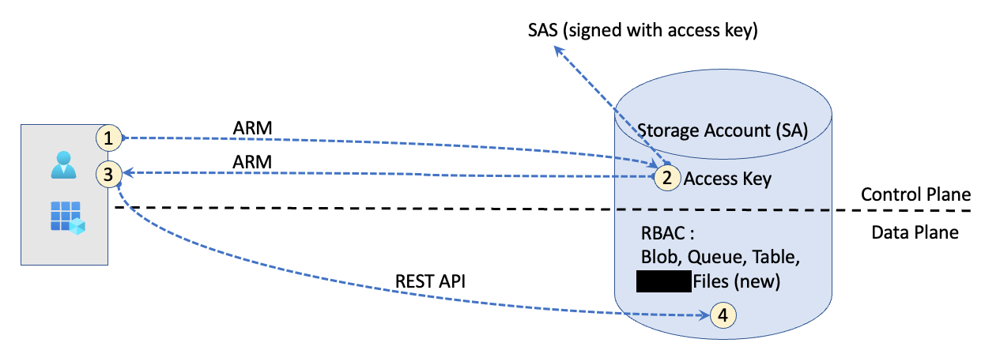](https://enterprise.atlassian.net/wiki/spaces/DEV/pages/00000000)<br/>

## Integration-Service On-Premise Authentication and Authorization

Integration-Service On-Premise is a daemon process with no user interaction that lacks of GUI. It's a **client application** (outside Azure Cloud) that authenticates against Azure AD with [OIDC - OpenID Connnect](https://openid.net/connect/). Two endpoints in Azure AD are used: **Authorization Endpoint** + **Token endpoint**. Once the **bearer token** is granted, **Integration-Service-Cloud** API can be directly reached out by **Integration-Service On-Premise** since it is publicly exposed on the internet.

**Integration-Service On-Premise app needs to be registered in Azure AD (AAD)** before it can authenticate against Azure AD via **OIDC**. This App Registration is done during the [Download Workflow of Integration-Service On-Premise](#download-workflow-of-integration-service-on-premise) described below. Once **Integration-Service On-Premise** has been **1) Registered in AAD**, and **2) installed on-premise**, it can then be **3) authenticated against Azure AD via OIDC**. **4) Integration-Service On-Premise** is now **authorized to get access to Azure PaaS Services** (Azure Key Vault, Azure File Share) and to **5) Integration-Service-Cloud, which is reached out via App Gateway** (retrieving the config settings of the registered Integration-Service On-Premise instance from __MongoDB__).

A **Service Principal** representing Integration-Service ON-Premise in flow is created to deal with permissions and authorizations during the App Registration (ON-BEHALF-OF Integration-Service On-Premise). **A Service Principal is just an instance of an application with the scope of an Azure Cloud Tenant (an Azure Region).**. The OIDC specification defines authorization flows that can be used to coordinate authentication of a user/app and grant access to resources owned by that user/app. Check [this video](https://www.youtube.com/watch?v=rC1TV0_sIrM) about **Managed Identities** where Service Principals and OIDC are also explained.

**Authorization:** Once Integration-Service On-Premise is registered in Azure AD from Enterprise Portal, authorization in Public Cloud is achieved via [OpenID Conect (OIDC)](https://openid.net/connect/), which is based on **OAuth2.0 Authorization (on-behalf-of, I’m consenting something can work on my behalf)**, check [this reference (a delegated permission)](https://docs.microsoft.com/en-us/azure/active-directory/develop/v2-oauth2-auth-code-flow) and [this other one](https://docs.microsoft.com/es-es/azure/active-directory/develop/v2-protocols-oidc). The app invokes a service/web API which in turn needs to call another service/web API. A service-to-service **Bearer Token** is requested and granted (with the token grant being automatically renewed).

Two possible solutions:

1. Based on **Azure AD Application Security**
2. Based on **Azure AD Managed Identity**

**Identity Management: Managed Identities are not valid in Integration-Service On-Premise since it is located on-Premises and not in Azure. Authorization with Managed Identities only apply when both origin and target resources are located on Azure.**

**Managed Identities are not being used in the current design of App-Core. Classic App Registration is the implemented solution at this moment.**

**Azure Files belongs to an instance of a Storage Account, an Azure PaaS Service exposed on Internet with public IP Address. It is directly reached by Integration-Service On-Premise. An Azure Private Link (a private endpoint with a private IP addr) is setup to connect both Integration-Service Cloud and the Storage Account instance containing the Azure File Share (SMB).**

## Matrix Table with App-Core Components

**Integration-Service** stands for *"Enterprise Data Universal Connector"* and it is one of the components we can find on app-core:

| Item 	| Location 	| Developed By 	| Cloud Type<br>VNet (IaaS) 	| Azure Resource 	| Stateful 	| Multi-Tenant? 	| RG 	| Connects to 	| Details 	|
|---	|---	|---	|---	|---	|---	|---	|---	|---	|---	|
| Integration-Service On-Premise 	| on-premise (1 per client) 	| Enterprise 	| NA 	| NA 	| NA 	| No 	| NA 	| - AAD<br>- Storage-Node<br>- Integration-Service-Cloud 	| Enterprise Data Universal Connector, an *Storage and Communication Unit* deployed on each client's data center 	|
| Storage-Node 	| on-premise (1 per client) 	| Third Party 	| NA 	| NA 	| No 	| NA 	| NA 	| - Integration-Service On-Premise 	| Core-Data Node (i.e. Storage-Node or edge_system) - Storage Unit with Images 	|
| Customer's browser 	| on-premise<br>Internet 	| Enterprise 	| NA 	| NA 	| NA 	| NA 	| NA 	| - App-Core Frontend 	| Runs App-Core Frontend JavaScript 	|
| Azure AD 	| Azure 	| Microsoft 	| Identity as a Service (IDaaS) 	| Yes 	| Yes 	| Yes 	| NA 	| NA 	| Azure Active Directory (AAD)<br><br>Azure AD is a multi-tenant cloud-based identity and access management solution for the Azure platform. Azure AD is great at managing user access to cloud applications 	|
| App Gateway 	| Azure 	| Microsoft 	| IaaS <br>coreVNet (127.0.0.1/24) 	| App Gateway 	| No 	| Yes 	| rg-core 	| - App-Core Frontend 	| Multi-tenant (shared between App-Core clients) 	|
| App-Core Frontend 	| Azure 	| Enterprise 	| IaaS<br>coreVNet (127.0.0.1/24) 	| Azure App Service 	| No 	| yes 	| rg-core 	| - Integration-Service On-Cloud<br>- App-Core Backend 	| Multi-tenant (shared between App-Core clients) 	|
| App-Core Backend 	| Azure 	| Enterprise 	| IaaS <br>AKSComputationcoreVNet (127.0.0.1/24) 	| AKS (cluster 1) 	| No 	| yes 	| rg-aks-computation-core<br><br>rg-aks-computation-node-core 	| - Azure-Key-Vault<br>- MongoDB Cloud<br>- AKS (App-Core Backend) 	| Kubernetes cluster with computational workload 	|
| Integration-Service-Cloud 	| Azure 	| Enterprise 	| IaaS<br>coreVNet (127.0.0.1/24) 	| Azure App Service 	| No 	| Yes 	| rg-core 	| - Azure Files<br>- MongoDB Cloud<br>- Azure-Key-Vault<br>- Omni 	| Enterprise Data Universal Connector, Services running on Azure 	|
| Azure-Key-Vault 	| Azure 	| Microsoft 	| PaaS 	| Azure Key Vault (Managed Service) 	| Yes 	| No 	| rg-core 	| NA 	| Vault with secrets 	|
| Container Registry 	| Azure 	| Microsoft 	| PaaS 	| Azure Container Registry 	| Yes 	| Yes 	| rg-infrastructure-core 	| - 	| Private Container Registry 	|
| MongoDB 	| Azure 	| MongoDB 	| MongoDB’s PaaS Service (Managed Service with public IP) 	| VNET with MongoDB  (cloud.mongodb.com) 	| Yes 	| Yes 	| NA (managed by cloud.mongodb.com) 	| NA 	| NoSQL Database. Where config is saved and grabbed from every several minutes. To be replaced by Azure CosmoDB in the near future. 	|
| File Share (SMB) 	| Azure 	| Microsoft 	| PaaS Service (public IP) 	| Azure Files (Azure Managed Service) 	| Yes 	| No 	| rg-core 	| NA 	| An Azure Storage Service within an Azure Storage Account 	|
| Storage Account 	| Azure 	| Microsoft 	| PaaS Service (public IP) 	| Azure Storage Account 	| Yes 	| Yes 	| rg-core 	| NA 	| Shared between several clients (multi-tenant) 	|
| Blob File with Integration-Service On-Premise installer 	| Azure 	| Microsoft 	| PaaS Service (public IP) 	| Azure Storage Account 	| Yes 	| No 	| rg-core 	| NA 	| An Azure Storage Service within an Azure Storage Account 	|
| Monitoring Dashboard 	| Azure 	| Third Party (Open Source) 	| IaaS<br>AksDashboardcoreVNet (127.0.0.1/24) 	| AKS (cluster 2) 	| Yes 	| Yes 	| rg-aks-monitoring-core<br><br>rg-aks-monitoring-node-core 	| NA 	| Monitoring Dashboard (Prometheus + Grafana + Logs/ELK/EFK) 	|
| Omni 	| Azure 	| Enterprise 	| - 	| ? 	| - 	| - 	| - 	| NA 	| Enterprise Product 	|
| Azure DevOps Pipeline 	| Azure 	| Microsoft (Azure DevOps)<br><br>Enterprise (Pipeline) 	| PaaS Service (Managed Service with Public IP).<br><br>A **‘service user’ Personal Access Token** is required to trigger this Pipeline via an API REST Call from App-Core Portal (automation outside pipelines) 	| NA 	| Yes 	| Yes 	| NA 	| - Azure DevOps Git Repo<br>- Azure Artifacts<br>- Any Azure Subscription via an **Azure Service Connection** (SP) 	| - A fully automated pipeline that builds a custom Integration-Service On-Premise installer per client.<br>- **There is no Service Account in Azure DevOps and we need to create an additional user and use PAT token to make automation outside pipelines.**<br>- This pipeline is triggered by customers from App-Core Portal 	|
| Azure Repos 	| Azure 	| PaaS Service (public IP) 	| NA 	| NA 	| NA 	| Yes 	| NA 	| NA 	| - Git Repos<br>- Belongs to Azure Devops 	|
| Azure Artifacts 	| Azure 	| PaaS Service (public IP) 	| NA 	| NA 	| NA 	| Yes 	| NA 	| - Public Feeds (maven & java) 	| - Belongs to Azure Devops<br>- Fully integrated package management to your continuous integration/continuous delivery (CI/CD) pipelines 	|
| Bitbucket 	| Atlassian Cloud 	| PaaS Service (public IP) 	| NA 	| NA 	| NA 	| Yes 	| NA 	| - Container Registry 	| - Git Repos 	|

**Tip**: use [this tool](https://www.tablesgenerator.com/) or [this other one](https://marketplace.visualstudio.com/items?itemName=csholmq.excel-to-markdown-table) to edit the above table.
## Download Workflow of Integration-Service On-Premise

This is a summary of what this DevSecOps pipeline pretend to achieve.

Authentication Procedure based on Azure AD Application Security:

1. Create an [Azure App Register entry](https://docs.microsoft.com/en-us/azure/active-directory/develop/quickstart-register-app)
2. Obtain randon **clientID** and **clientSecret** from Azure App Register to be applied on the pipeline variables
3. Clone [origin bitbucket project](https://bitbucket.org/enterprise_org/data_router/src/develop/) with the source code to be compiled. This should be a temporary approach since it is recommended to migrate bitbucket repo and bitbucket pipelines to this one in Azure DevOps.
4. Java code is built with maven. Maven variables defined in [application.properties](boilerplates/application.properties) are rendered with **clientID** and **clientSecret** variables grabbed from AAD App Registry.
5. Move the generated jar file to a shared folder
6. Run innoSetupScript with the jar file path included in its settings
7. Push the created .exe installer to an Azure Storage Account
8. Send a notification to Integration-Service Cloud: the process is over. The path of the installer file is saved in MongoDB's Collection.

[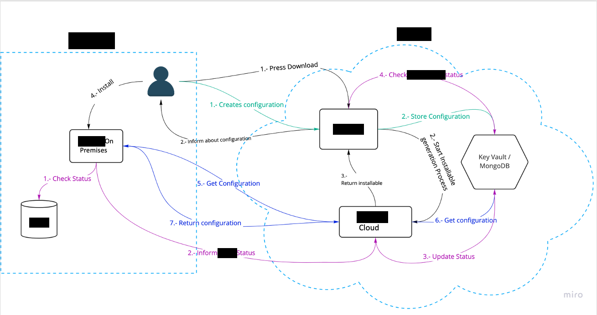](https://enterprise.atlassian.net/wiki/spaces/DEV/pages/00000000)<br/>
[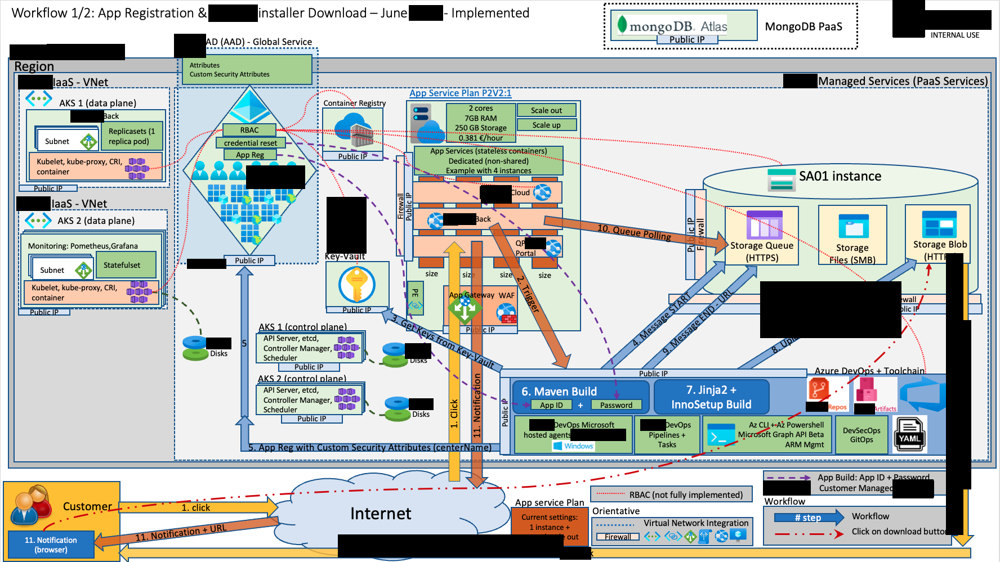](https://enterprise.atlassian.net/wiki/spaces/DEV/pages/00000000)<br/>
[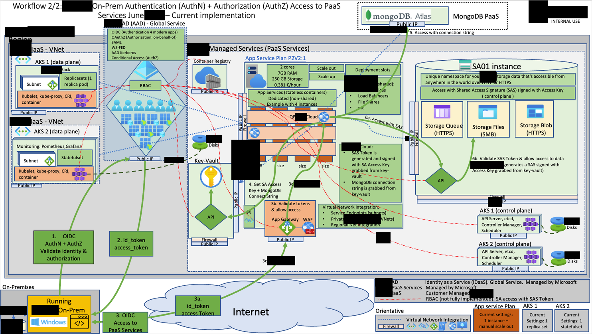](https://enterprise.atlassian.net/wiki/spaces/DEV/pages/00000000)<br/>
[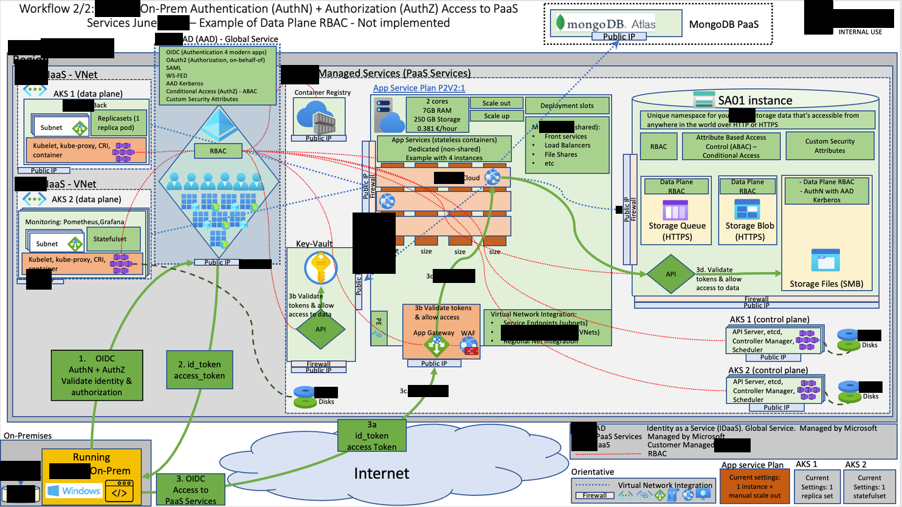](https://enterprise.atlassian.net/wiki/spaces/DEV/pages/00000000)<br/>
[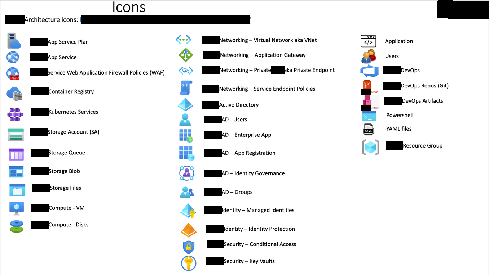](https://enterprise.atlassian.net/wiki/spaces/DEV/pages/00000000)<br/>

## Sharepoint Links with editable reference architecture diagrams

- Grab an editable powerpoint containing the above diagrams from [this sharepoint link](https://enterprise.sharepoint.com/:p:/s/cloudops/EdjJJgFhh5RCnWsK1MnR06MBXmNykiTOaQBgV_eqmT8pNA?e=o9rf7C).<br/>
- Grab the corresponding PDF from [this other sharepoint link](https://enterprise.sharepoint.com/:b:/s/cloudops/ETsJRzf-GylDlGkjekJbCWcBjZFMlLWXE_lvVIG5eZGzuQ?e=Ffp26A).

## Toolchain

- [Inno Setup](https://jrsoftware.org/isinfo.php): Setup manually by an user with permissions in your Azure DevOps Organization (see [Requirements](#requirements)).
- [winSW](https://github.com/winsw/winsw): Downloaded by the pipeline
- [JRE 11](https://github.com/adoptium/temurin11-binaries/releases/download/jdk-127.0.0.1%2B1/OpenJDK11U-jre_x64_windows_hotspot_11.0.14.1_1.zip): Downloaded by the pipeline
- [Jinja2-cli](https://pypi.org/project/jinja2-cli/)

## Environments

- **Dev** environment is used for developer’s tasks, like merging commits in the first place, running unit tests. Dev environment is usually not guaranteed to be stable. The operation can be disrupted by commit, and it doesn’t do harm for the whole company. DEV environment is usually hooked to some CI/CD system. When developers do code merge, the build is automatically triggered, and application code is automatically redeployed to Dev.
- **QA** is for testing by Quality Assurance team, both manual and automated, including running automated integration tests. It’s considered to be more stable than Dev, because code doesn’t change so often on every merge, as in Dev.
  So, developers cannot disrupt ongoing work of QA engineers by “risky” change.
- **UAT (User Acceptance Testing)** environment is for pre-release testing, the environment in which user acceptance testing is performed. Note the emphasis on user - your QA testing is different, UAT is a chance for actual users (or at least your training team, sales, support staff etc...) to try out new features and evaluate the software before it is deployed to their production systems. It is used by QA engineers, business analysts, product owners, for verifying functional requirements. UAT is required to be stable, because it’s used not only by developers but also by business users , who serve as “functional testers”. It also can be used as demo environment for showing new features to the customers. What this means exactly will depend on your processes:
    - UAT (the environment) might be "level" with production, and is essentially a sandbox for users to try new features with.
    - UAT (the environment) might be "ahead" of production, so that new features are not deployed to production until they have been evaluated. (I'm not keen on this approach as it necessarily means you have longer lead times).
    - It you have a multi-tenant system you might not even need a UAT environment, instead you could choose to have users evaluate new features in production systems by making use of feature flags.
- **Staging aka Pre-production** environment is often set up with a copy of production data, sometimes sanitized. Many organizations regularly "refresh" their staging database from a production snapshot. The primary focus is to ensure that the application will work in production the same way it worked in UAT. Instead of setting up new data, testers will search the database for profiles and products that match an essential set of test cases. Often the "real" data have quirks in them that give rise to unexpected edge cases that were missed during UAT. Also, any data migration testing would need to take place in the staging environment.
- **Prod** is production environment, serving primary business purpose. Access of developers to it usually limited only to perform technical support duties.

Sometimes, there are more intermediate test environments, called IT, SIT (for integration testing ), or Regression (pre-release regression testing). From testing perspective, these environments ordered in such way, so application migrates to the next environment only after it is passed all tests at previous stage. **Example:** DEV (dev tests passed) -> deploy to QA (QA integration tests passed) - > deploy to UAT (UAT acceptance tests passed) -> deploy to PRE aka STAGING (Staging tests passed) -> deploy to PRO

In terms of Continuous Deployment / Continuous Delivery, the staging environment is used to test software in a "production-like" environment, as its likely that developers will be working in an environment with significant differences to production (e.g. no load balancing, a smaller dataset etc..).

## Requirements

### Azure DevOps Extensions

Deploy the following extensions in your [Azure DevOps Organization](https://dev.azure.com/EnterpriseDev/_settings/extensions?tab=installed) from [marketplace.visualstudio.com](https://marketplace.visualstudio.com/):

- [Inno Setup Build Tools - Ricardo G. Pignone](https://marketplace.visualstudio.com/items?itemName=RicardoPignone.ricardopignone-InnoSetupBuildTools)

Other Azure Extensions not currently consumed by this pipeline:

- [SonarCloud](https://marketplace.visualstudio.com/items?itemName=SonarSource.sonarcloud)

### Service Connection in Azure DevOps Project Settings - Environment names in pipeline

- Create a **Service Connection** at the "scope" level of your Subscription ID in Azure DevOps Project Settings
- Choose an *"Azure Resource Manager using service principal (manual)"* Service Connection
- Insert an existing and dedicated Service Principal name (i.e. sp-Integration-Service-enterprise-dev) with its corresponding credential (key or certificate)
- Make sure the service connection name is referenced in YAML based pipelines (i.e. 'svccon-Integration-Service-dev')
- Click on "Grant access permissions to all pipelines"

| Service Connection in Azure Devops | Env            | Legacy Env name  | Subscription                                                                                                                              | SP                    | IAM Role with subscription scope | Details                                                                                                                                                                  |
|------------------------------------|----------------|------------------|-------------------------------------------------------------------------------------------------------------------------------------------|-----------------------|----------------------------------|--------------------------------------------------------------------------------------------------------------------------------------------------------------------------|
| svccon-integration-dev                 | Dev,QA,UAT,Pre | devcore,test-app | [Enterprise DevTest Subscription](https://portal.azure.com/#@enterprise.com/resource/subscriptions/00000000-0000-0000-0000-000000000000/overview) | sp-integration-enterprise-dev | Contributor                      | Azure Resource Manager using service principal (manual)<br>Security: Grant access permissions to all pipelines<br>No RG is specified during the Service Connection Setup |
| svccon-integration-pro                 | Pro            | core             | [Enterprise Pro Subscription](https://portal.azure.com/#@enterprise.com/resource/subscriptions/00000000-0000-0000-0000-000000000000/overview)     | sp-integration-enterprise-pro | Contributor                      | Azure Resource Manager using service principal (manual)<br>Security: Grant access permissions to all pipelines<br>No RG is specified during the Service Connection Setup |
| svccon-bitbucket 	         | Dev,QA,UAT,Pre, Pro | -	| NA 	| [Bitbucket Cloud](https://bitbucket.org/enterprise_org/) 	| NA 	| Access to Bitbucket Cloud<br>OAuth Configuration: Bitbucket Azure Pipelines<br>Security: Grant access permissions to all pipelines 	| |

**Tip**: use [this tool](https://www.tablesgenerator.com/) or [this other one](https://marketplace.visualstudio.com/items?itemName=csholmq.excel-to-markdown-table) to edit the above table.

<details>
  <summary>Service Connection Example. Click to expand!</summary>

  [](https://dev.azure.com/EnterpriseDev/GitOps/_settings/adminservices)
</details>
<br/>

### Azure Artifacts Permissions and Settings

Setup the following permissions on [Integration-Service-Artifacts-Feed2](https://dev.azure.com/EnterpriseDev/GitOps/_artifacts/feed/Integration-Service-Artifacts-Feed2) -> Feed Settings -> click on **Permissions** tab:

| User/Group                                   | Permissions |
|----------------------------------------------|-------------|
| GitOps Build Service (EnterpriseDev)             | Contributor |
| Project Collection Build Service (EnterpriseDev) | Contributor |
| [GitOps]\GitOps Dev Team                     | Reader      |

### Matrix Table with permissions in Service Principal SP

Check the below table to see a summary of all the permissions required by the SP that runs our azure devops pipelines:

| SP 	| Azure Scope 	| Azure Subscription 	| Env 	| Env in Pipeline 	| RBAC 	| Vault Access Policy (indicative) 	| API Permissions - Delegated 	| API Permissions - Application (Microsoft Graph) 	| Details (indicative)	|
|---	|---	|---	|---	|---	|---	|---	|---	|---	|---	|
| sp-integration-enterprise-dev 	| **Subscription** 	| [Enterprise DevTest Subscription](https://portal.azure.com/#@enterprise.com/resource/subscriptions/00000000-0000-0000-0000-000000000000/users) 	| Dev 	| devcore 	| **Subscripion Level:**<br>- Contributor<br><br>Key Vault RBAC disabled (Vault access policy enabled) 	| **devcoreResourceGroup<br> kv-enterprise-devcore<br> Access Policy:**<br><br>- Key Permissions: Get,List<br>- Secret Permissions: Get,List<br>- Certificate Permissions: None 	| User.Read 	| - 	| - Assign the **role "Contributor"** to the Service Principal (i.e. sp-integration-enterprise-dev) setup in Azure DevOps Service Connection<br><br>- **Azure Subscription Access Control Permissions (IAM)** is setup in Azure UI -> \ -> Access Control (IAM) -> Role assignments 	|
| sp-integration-enterprise-dev 	| **Management** 	| - 	| Dev 	| devcore 	| -**Application Administrator**<br>- **Attribute assignment administrator**<br>| - 	| - 	| - 	| if we want a Service Principal to create an app registration in Azure AD we need the role **Application Administrator** which is part of the Azure AD roles:<br>1. [Click on Enterprise.com's Azure Active Directory - Roles and administrators](https://aad.portal.azure.com/#blade/Microsoft_AAD_IAM/ActiveDirectoryMenuBlade/RolesAndAdministrators)<br>2. Click on **Application administrator** role<br>3. Click on **Attribute assignment administrator** role<br>4. Assign your Service Principal to these roles<br><br>- Required by **customSecurityAttributes**.<br>- Setup RBAC in [Management Scope](https://portal.azure.com/#blade/Microsoft_AAD_IAM/RolesManagementMenuBlade/AllRoles)<br>- Azure DevOps Service Connection leverages sp-Integration-Service-enterprise-dev<br>- [Scope Overview](https://docs.microsoft.com/en-us/azure/role-based-access-control/scope-overview)<br>- Management groups are a level of scope above subscriptions 	|
| sp-integration-enterprise-pro	| **Subscription** 	| [Enterprise Production Subscription](https://portal.azure.com/#@enterprise.com/resource/subscriptions/00000000-0000-0000-0000-000000000000/users) 	| Pro 	| appcne | **Subscripion Level:**<br>- Contributor<br><br>Key Vault RBAC disabled (Vault access policy enabled) 	| **rg-app-core-nepro<br> kv-upmc-appcne<br> Access Policy:**<br><br>- Key Permissions: Get,List<br>- Secret Permissions: Get,List<br>- Certificate Permissions: None 	| User.Read 	| - 	| - Assign the **role "Contributor"** to the Service Principal (i.e. sp-integration-enterprise-pro) setup in Azure DevOps Service Connection<br><br>- **Azure Subscription Access Control Permissions (IAM)** is setup in Azure UI -> \ -> Access Control (IAM) -> Role assignments 	|
| sp-integration-enterprise-pro 	| **Management** 	| - 	| Pro | appcne	| -**Application Administrator**<br>- **Attribute assignment administrator**<br>| - 	| - 	| - 	| if we want a Service Principal to create an app registration in Azure AD we need the role **Application Administrator** which is part of the Azure AD roles:<br>1. [Click on Enterprise.com's Azure Active Directory - Roles and administrators](https://aad.portal.azure.com/#blade/Microsoft_AAD_IAM/ActiveDirectoryMenuBlade/RolesAndAdministrators)<br>2. Click on **Application administrator** role<br>3. Click on **Attribute assignment administrator** role<br>4. Assign your Service Principal to these roles<br><br>- Required by **customSecurityAttributes**.<br>- Setup RBAC in [Management Scope](https://portal.azure.com/#blade/Microsoft_AAD_IAM/RolesManagementMenuBlade/AllRoles)<br>- Azure DevOps Service Connection leverages sp-integration-enterprise-pro<br>- [Scope Overview](https://docs.microsoft.com/en-us/azure/role-based-access-control/scope-overview)<br>- Management groups are a level of scope above subscriptions 	|

**Tip**: use [this tool](https://www.tablesgenerator.com/) or [this other one](https://marketplace.visualstudio.com/items?itemName=csholmq.excel-to-markdown-table) to edit the above table.

Take into account that the following Microsoft Graph Application API permissions are NOT required:

- CustomSecAttributeAssignment.ReadWrite.All
- CustomSecAttributeDefinition.ReadWrite.All

**Tip:** Key Vault RBAC Permission Model within the RG Scope is probably a simpler solution due to "AAD Groups", "Built-in Roles" and "Conditional Access".

### Matrix Table with permissions in Azure Devops - Service User PAT

| Item 	| Details 	|
|---	|---	|
| **srv-user-pipeline-integration-onprem** 	| A ‘service user’ Personal Access Token<br> There is no Service Account you need to create additional user and use PAT token to make automation outside pipelines.<br>A ‘service user’ Personal Access Token is required to trigger this Pipeline via an API REST Call from App-Core Portal (automation outside pipelines).<br>**There is no Service Account in Azure DevOps and we need to create an additional user and use PAT token to make automation outside pipelines.** 	|

<details>
  <summary>Example of a Service User Personal Access Token. Click to expand!</summary>

  [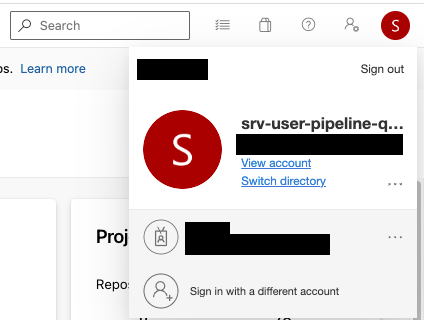](https://enterprise.atlassian.net/wiki/spaces/DEV/pages/00000000)<br/>
  [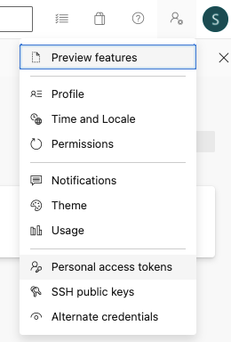](https://enterprise.atlassian.net/wiki/spaces/DEV/pages/00000000)<br/>
  [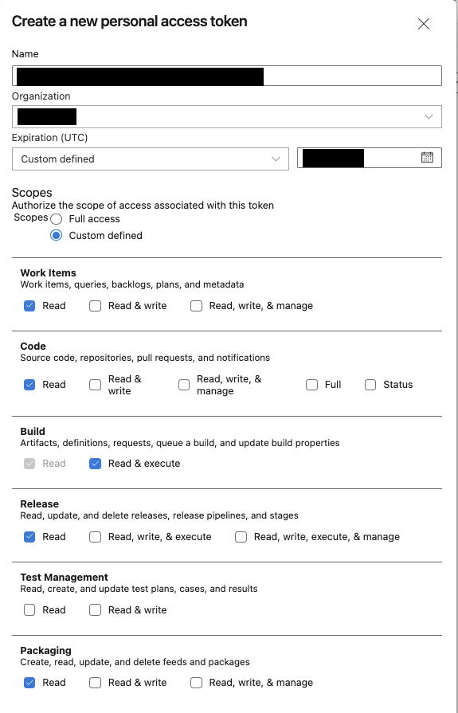](https://enterprise.atlassian.net/wiki/spaces/DEV/pages/00000000)<br/>
  [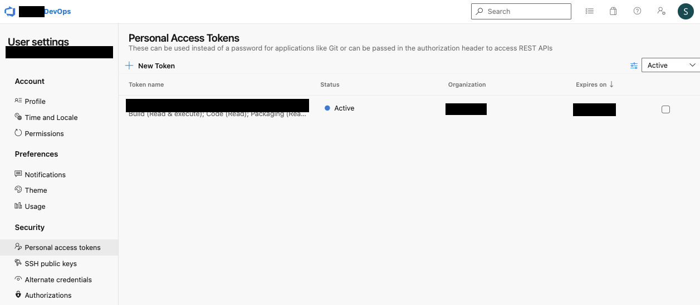](https://enterprise.atlassian.net/wiki/spaces/DEV/pages/00000000)
</details>
<br/>

### Bitbucket repo settings with Integration-Service On-Prem source code

Defined in [azure-pipelines.yml](azure-pipelines.yml) within the ```resources``` section:

```yaml
resources:
  repositories:
  - repository: Integration-Service-Bitbucket-Repo   # This repository with these settings is shared among all the environments defined on this pipeline (dev, qa, uat, pre, pro)
    type: bitbucket
    endpoint: svccon-bitbucket
    name: enterprise/data_router
    #ref: master    # check out a specific ref/branch (master)
    #ref: gitattributes_poc    # check out a specific ref/branch
    ref: refs/tags/1.0.2     # check out a specific tag
```

### Configuration files with settings per environment. Software Development Life Cycle - Running this pipeline manually and validating the download URL

Setup configuration files accordingly.

See below an indicative list of available environments suitable for Software Development Life Cycle (SDLC):

 | Environment in pipeline parameters         | Azure Region | Environment | User Principal Name (upn) in pipeline parameters (indicative)                             | Center Name (AETitle Custom Security Attribute) in pipeline parameters | Config File in this repo                   |
 |:-------------------------------------------|--------------|:------------|:------------------------------------------------------------------------------------------|:-----------------------------------------------------------------------|:-------------------------------------------|
 | devcore  (legacy, infra manually deployed) | North Europe | Dev         | cloud-admin@example.com                                                                | enterprise                                                                 | [devcore.yml](configuration/devcore.yml)   |
 | test-app (legacy, infra manually deployed) | North Europe | UAT         | cloud-admin@example.com                                                                            | partner-org                                                                  | [test-app.yml](configuration/test-app.yml) |
 | core (legacy, infra manually deployed)     | North Europe | Pro         | cloud-admin@example.com                                                                            | partner-org                                                                  | [core.yml](configuration/core.yml)         |
 | appcnedev                                   | North Europe | Dev         | developer@enterprise.com<br/>admin@enterprise.com | center1                                                                | [appcnedev.yml](configuration/appcnedev.yml) |
 | appcneqa                                    | North Europe | QA          | developer@enterprise.com<br/>admin@enterprise.com   | center1                                                                | [appcneqa.yml](configuration/appcneqa.yml)   |
 | appcneuat                                   | North Europe | UAT         | developer@enterprise.com<br/>admin@enterprise.com | center1                                                                | [appcneuat.yml](configuration/appcneuat.yml) |
 | appcnepre                                   | North Europe | Pre         | developer@enterprise.com<br/>admin@enterprise.com       | upmc                                                                   | [appcnepre.yml](configuration/appcnepre.yml) |
 | appcne                                      | North Europe | Pro         | cloud-admin@example.com                                                                  | upmc                                                                   | [appcne.yml](configuration/appcne.yml)       |

<details>
  <summary>Example of how to run this pipeline manually and validating the download URL. Click to expand!</summary>

  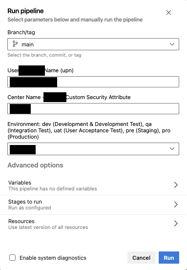<br/>
  [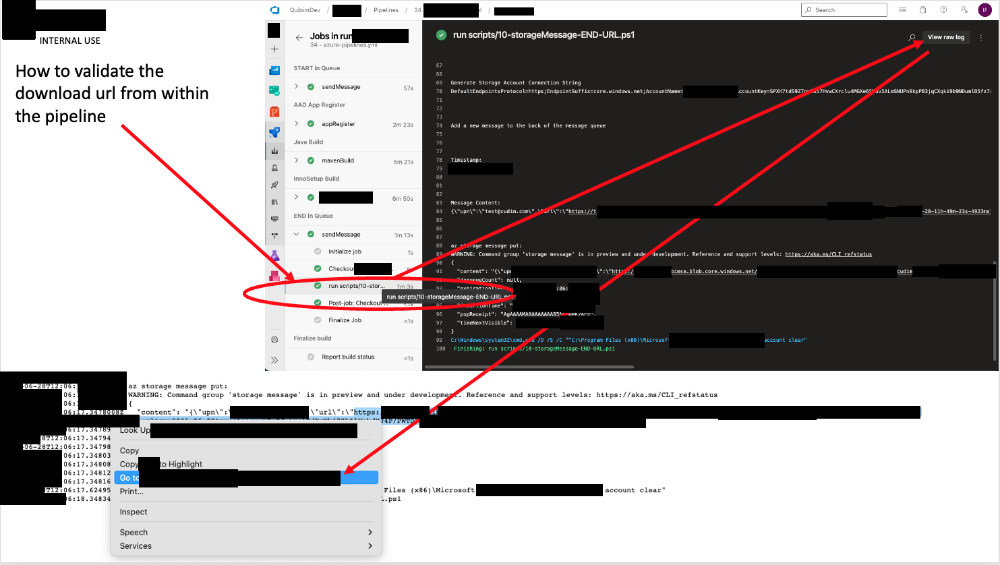](https://enterprise.atlassian.net/wiki/spaces/DEV/pages/00000000)<br/>
</details>
<br/>

#### Conditional Flags defined in configuration files

Take into the account the following flags defined in [configuration files](configuration/):

| Conditional Flag                        | Example Value | Meaning                                                                                    |
|:----------------------------------------|:-------------:|:-------------------------------------------------------------------------------------------|
| enableConditionAzureArtifacts           |     true      | Do we enable Azure Artifacts ?                                                             |
| enableConditionGitCloneSrcFromBitBucket |     true      | Do we enable a git clone from bitbucket repo with Integration-Service source code obtained from there? |
| enableConditionCopyPomFileFromBitBucket |     true      | Do we copy pom.xml from Bitbucket                                                          |
| enableConditionSonarQubeRunAnalysis     |     false     | Do we enable SonarQubeRunAnalysis in Azure Task Maven@3 ?                                  |

**Tip**: use [this tool](https://www.tablesgenerator.com/) or [this other one](https://marketplace.visualstudio.com/items?itemName=csholmq.excel-to-markdown-table) to edit the above table.

## Inventory of Files

### Source Code

Other files are being managed by developers, which can be referenced during the CI process, for example:

#### Development Files and Folders

- [src/](src/): Folder with source code to be built
    - [src/main](src/main): Source Code
    - [src/test](src/test): Test Code (maven tests). These tests are currently disabled in Azure DevOps Pipelines. They have already been run in BitBucket Pipelines.
- [contracts/pacts/integration-onpremise-Integration-Service-cloud.json](contracts/pacts/integration-onpremise-Integration-Service-cloud.json): A **Contract Test (pact)**. File used for testing purposes when runnign maven tests. It includes secrets and bearer tokens.

#### Lombok Java Library

- [Lombok java library](https://projectlombok.org/)
- Files:
    - [lombok.config](lombok.config)

#### Licenses folder

- [licenses](licenses/)

#### Maven Wrapper

- [Maven Wrapper](https://maven.apache.org/wrapper/)
- Maven Wrapper is not run by Azure DevOps Pipelines since Azure Task "Maven@3" is declarative and fully integrated with i.e. Azure Artifacts (mavenAuthenticateFeed: true).
- Maven Wrapper files run by bitbucket's pipeline can be found here:
    - [mavenWrapper/mvn/wrapper](mavenWrapper/mvn/wrapper): origin **.mvn/wrapper** folder
    - [mavenWrapper/mvnw](mavenWrapper/mvnw)
    - [mavenWrapper/mvnw.cmd](mavenWrapper/mvnw.cmd)
    - [mavenWrapper/mvnwDebug](mavenWrapper/mvnwDebug)
    - [mavenWrapper/mvnwDebug.cmd](mavenWrapper/mvnwDebug.cmd)

#### Maven POM Profile with Azure Artifacts settings

Make sure the following **[maven profile](https://maven.apache.org/guides/introduction/introduction-to-profiles.html)** with a **maven feed** setup in [Azure Artifacts](https://dev.azure.com/EnterpriseDev/GitOps/_artifacts) is added to [pom.xml](pom.xml), **currently grabbed from Bitbucket repo** before the maven build step. Therefore this Profile defined in pom.xml should be copied to bitbucket repo. This maven profile is enabled via the parameter ```-PazureDevOps``` in [include-java-build-steps.yml](templates/include-java-build-steps.yml) (setup as ```azureArtifactsMavenProfile``` environment var). At the moment this POM file is shared between Dev, Test and Prod environments:

```xml
  <repositories>
    <repository>
      <id>repo_dcm4che</id>
      <name>dcm4che</name>
      <url>https://www.dcm4che.org/maven2/</url>
    </repository>
  </repositories>

<!--
repo_dcm4che cannot be added as "Custom Public Upstream Source" in Azure Artifacts' Feeds.
Azure Artifacts doc: Set up upstream sources for your feed: Custom public upstream sources are only supported with npm registries.
https://docs.microsoft.com/en-us/azure/devops/artifacts/how-to/set-up-upstream-sources
-->

<!-- https://maven.apache.org/guides/introduction/introduction-to-profiles.html -->
<profiles>

   <profile>
     <id>azureDevOps</id>
     <activation>
       <activeByDefault>false</activeByDefault>
     </activation>
     <!-- Azure Artifacts is enabled -->
    <repositories>
      <repository>
        <id>Integration-Service-Artifacts-Feed2</id>
        <url>https://pkgs.dev.azure.com/EnterpriseDev/GitOps/_packaging/Integration-Service-Artifacts-Feed2/maven/v1</url>
        <releases>
            <enabled>true</enabled>
        </releases>
        <snapshots>
            <enabled>true</enabled>
        </snapshots>
      </repository>
    </repositories>
    <distributionManagement>
      <repository>
      <id>Integration-Service-Artifacts-Feed2</id>
      <url>https://pkgs.dev.azure.com/EnterpriseDev/GitOps/_packaging/Integration-Service-Artifacts-Feed2/maven/v1</url>
      <releases>
          <enabled>true</enabled>
      </releases>
      <snapshots>
          <enabled>true</enabled>
      </snapshots>
      </repository>
    </distributionManagement>
  </profile>

</profiles>

```

#### Spring Java Format Config Maven Plugin

- [.springjavaformatconfig](.springjavaformatconfig)

### Pipelines

1. [azure-pipelines.yml](azure-pipelines.yml):
	- **Main Pipeline**: **Designed for Dev, Test & Production App-Core environments.**
	- **App Registration is done on each pipeline run with a different and unique app name.**
	- Integration-Service On-Premise is built with maven and its windows installer is created by [innoSetup](https://jrsoftware.org/isinfo.php)
	- Public artifacts **JRE** and **winSW.exe** can be downloaded from Internet of from Azure Artifacts (internal repo). Setup the **'enableConditionAzureArtifacts'** flag/variable found in this file accordingly.
	- The resulting installer is uploaded to a Storage Container within a Storage Account.
	- This pipeline **DOES NOT create/destroy existing Azure Resources (RG and SA)** already setup and shared within a App-Core environment.
2. [azure-pipelines-publish-public-artifacts-in-azure-artifacts.yml](azure-pipelines-publish-public-artifacts-in-azure-artifacts.yml):
	- Public artifacts **JRE** and **winSW.exe** are downloaded from Internet and published in Azure Artifacts internal repository.
	- Once the artifacts have been published on our internal repo, they can be consumed by [azure-pipelines.yml](azure-pipelines.yml) when **'enableConditionAzureArtifacts'** variable is setup as **false**.

### Scripts

- Folder [scripts/01-azure-pipelines](scripts/01-azure-pipelines):
    - **Scripts run by Main Pipeline**.
    - This folder contains the scripts used by [azure-pipelines.yml](azure-pipelines.yml), the main pipeline developed in this repo.
    - This folder contains the scripts used by [boilerplates/azure-pipelines-DEMO-integration-onpremise-AppSecurity.yml](boilerplates/azure-pipelines-DEMO-integration-onpremise-AppSecurity.yml).
- Folder [boilerplates/scripts/02-azure-pipelines-AzureAD-AppSecurity-Demo](boilerplates/scripts/02-azure-pipelines-AzureAD-AppSecurity-Demo/). **Azure AD Application Security:** Example of how to register an app in Azure AD
- Folder [boilerplates/scripts/03-azure-pipelines-Storage-Queue-Demo](boilerplates/scripts/03-azure-pipelines-Storage-Queue-Demo): This folder contains scripts used by [boilerplates/azure-pipelines-DEMO-Storage-Queue.yml](boilerplates/azure-pipelines-DEMO-Storage-Queue.yml), a pipeline demo for testing messaging with a Storage Queue.
- Folder [boilerplates/scripts/04-scripts-to-run-from-macOS-cli](boilerplates/scripts/04-scripts-to-run-from-macOS-cli/): Scripts used during the development of the automated pipelines. These scripts can be run manually from a macbook with powershell. The [code-snippets.ps1](boilerplates/scripts/04-scripts-to-run-from-macOS-cli/code-snippets.ps1) only contains code snippets and cannot be run as a script.

### Boilerplates and Samples

- The folder [boilerplates](boilerplates/) contains examples of other Azure DevOps Pipelines that can be used as samples, being the following the most relevant:

1. [azure-pipelines.yml](boilerplates/azure-pipelines.yml): A working big pipeline with everything needed by Integration-Service. This was the stable pipeline before splitting it up in several chunks to make it readable and reusable via [Azure Templates](https://docs.microsoft.com/en-us/azure/devops/pipelines/process/templates).
2. [azure-pipelines-DEMO-integration-onpremise-AppSecurity.yml](boilerplates/azure-pipelines-DEMO-integration-onpremise-AppSecurity.yml):
    - [azure-pipelines.yml](azure-pipelines.yml) is based on this YAML file.
    - This pipeline is run against an isolated Azure Subscription that lacks of App-Core components (it is not integrated with App-Core).
    - Existing Azure Resources (Resource Group, Storage Account and App Registration) are destroyed and created from scratch with the same resource name each time this pipeline is triggered.
    - The purpose of this pipeline is to help with initial development in an isolated environment.
3. [azure-pipelines-DEMO-AzureAD-AppSecurity.yml](boilerplates/azure-pipelines-DEMO-AzureAD-AppSecurity.yml): Example of how to register an app in Azure AD with AZ CLI & Az Powershell. Features included:
    - Deletion of Existing Storage Container, App Registration and RG: [boilerplates/scripts/02-azure-pipelines-AzureAD-AppSecurity-Demo/01-destroyRG-destroyApp.ps1](boilerplates/scripts/02-azure-pipelines-AzureAD-AppSecurity-Demo/01-destroyRG-destroyApp.ps1)
    - Creation of RG and App Registration: [boilerplates/scripts/02-azure-pipelines-AzureAD-AppSecurity-Demo/02-createRG-createSA-createAppRegister.ps1](boilerplates/scripts/02-azure-pipelines-AzureAD-AppSecurity-Demo/02-createRG-createSA-createAppRegister.ps1)
    - Assign Custom Security Attribute with a string value: [boilerplates/scripts/02-azure-pipelines-AzureAD-AppSecurity-Demo/03-assign-customSecurityAttributes.ps1](boilerplates/scripts/02-azure-pipelines-AzureAD-AppSecurity-Demo/03-assign-customSecurityAttributes.ps1)
    - Creation of a Storage Account and a Blob File with a download link secured with a SAS Token that expires after 30 min: [boilerplates/scripts/02-azure-pipelines-AzureAD-AppSecurity-Demo/04-createStorageContainer-createBlob-DownloadUrlFromBlob.ps1](boilerplates/scripts/02-azure-pipelines-AzureAD-AppSecurity-Demo/04-createStorageContainer-createBlob-DownloadUrlFromBlob.ps1)
4. [azure-pipelines-DEMO-Storage-Queue.yml](boilerplates/azure-pipelines-DEMO-Storage-Queue.yml): A pipeline demo for testing messaging with a Storage Queue.
5. [azure-pipelines-TEST.yml](boilerplates/azure-pipelines-TEST.yml):
    - Same pipeline as [azure-pipelines.yml](azure-pipelines.yml) but for demos purposes.
    - A new App Registration is re-created on each run with the same name ('appr-Integration-ServiceOnPrem-test'), **being destroyed first if it is already registered on AAD.**
    - Storage Queue is NOT re-created on each run.
6. [azure-pipelines-multi-checkout.yml](boilerplates/azure-pipelines-multi-checkout.yml): Example of a multi checkout pipeline.
7. innoSetup Files:
    - [innoSetupScript.iss](boilerplates/innoSetupScript.iss): Origin innoSetupScript.iss developed by Enterprise.
    - [innosetupScriptExample.iss](boilerplates/innosetupScriptExample.iss): Example of innoSetupScript.iss obtained from Stackoverflow.
8. [azure-pipelines-two-agents-windows-linux-PoC.yml](boilerplates/azure-pipelines-two-agents-windows-linux-PoC.yml): Proof of Concept. How to run **bash, powershell, pwsh & script** from two Azure DevOps Jobs, one run by a Windows Agent and the other one run by a Linux Agent. Linux Agents seem to be quicker.

### Rendering maven variables in application properties

- Maven Resource plugin provides filtering which is nothing but variable substitutions. In resource files, we can use ${...} placeholder as variables which are replaced by system or maven properties during build time.
- By default maven resource filtering is not enabled. If we extend our Spring Boot project from spring-boot-starter-parent the resource filtering is enabled by default. In that case @..@ delimiter is used instead of ${}, that is to avoid conflict with the spring-style placeholder ${}. Check [ref1](https://www.logicbig.com/tutorials/spring-framework/spring-boot/properties-place-holders.html) , [ref2](https://www.logicbig.com/tutorials/spring-framework/spring-boot/maven-resource-filtering.html)
- Our Java Spring Boot's [application.properties](boilerplates/application.properties) contains 3 maven variables that are rendered in this pipeline:
    - **clientId**: Obtained from AAD on each app registration
        - ```azure.login.clientId=@clientId@```
    - **clientSecret**: Obtained from AAD on each app registration via a **credential reset**. The idea is to replace them with dynamic values generated when registering a Integration-Service-OnPremise app in Azure AD.
        - ```azure.login.clientSecret=@clientSecret@```
    - **environment**: Obtained from a pipeline parameter. Examples: 'devcore', 'test-app' or 'core'
        - ```integration-authcloud.host=https://@cloud-admin@example.com/integration-authcloud/```

- The above maven variables are injected in the pipeline with the following code:

    ```powershell
    MAVEN_OPTIONS: "-Dmaven.repo.local=$(MAVEN_CACHE_FOLDER) -Denvironment=${{ lower(parameters.environment) }}"
    options: "$(MAVEN_OPTIONS) -DskipTests -DclientId=$(clientId) -DclientSecret=$(appSecret)"
    ```

### Jinja2 template with winSW Configuration

- [templates/innoSetup-service.j2](templates/innoSetup-service.j2): A Jinja2 template with the Settings file of [winSW](https://github.com/winsw/winsw)

### Jinja2 template with innoSetup Configuration

- [templates/innoSetupScript.j2](templates/innoSetupScript.j2):
    - A Jinja2 template file with innoSetup script settings
    - Please note the current value of ```MyAppId "{00000000-0000-0000-0000-000000000000}"```. This value is fixed and shared among all the clients to help us identify if Integration-Service is already installed by checking if that *AppID* is already registered in Windows Registry, asking the user to remove the existing Integration-Service instance. Perhaps an alternative could be to check the value of *"MyAppName"*, but so far we don't know how to programmatically deal with it (innoSetupScript.iss code is written in Pascal). Otherwise *MyAppId* could be unique per Integration-Service deployment by assigning the value of the registered app on Azure AD.
- [boilerplates/innoSetupScript.iss](boilerplates/innoSetupScript.iss): Example of a rendered innoSetupScript file.

## Trigger Azure DevOps pipelines using REST API - How to run this pipeline via REST API

Run the following REST API Call:

```POST https://dev.azure.com/<Azure DevOps Organization>/<Azure DevOps Project>/_apis/pipelines/<Build Definition Id>/runs?api-version=7.1-preview.1```

Where **\<Build Definition ID\>** can be grabbed from the arguments in the URI that show your pipeline (i.e. _build?definitionId=**96**)

**Current API REST Endpoint:** ```POST https://dev.azure.com/EnterpriseDev/GitOps/_apis/pipelines/96/runs?api-version=7.1-preview.1```

With the following Body in the API Call (example):

```json
{
  "templateParameters" : {"upn":"cloud-admin@example.com","AETitle":"Enterprise","environment":"appcnedev"}
}
```

Follow up with [this video](https://www.youtube.com/watch?v=PdFb35sXuIw), [its corresponding document](https://blog.geralexgr.com/cloud/trigger-azure-devops-build-pipelines-using-rest-api) and [this microsoft reference](https://learn.microsoft.com/en-us/rest/api/azure/devops/pipelines/runs/run-pipeline?view=azure-devops-rest-7.1)

### List of API Endpoints

The following API Endpoints are set up:

| Azure DevOps Pipeline                                                                     | Current Git Branch | API Endpoint                                                                                        | Details                                                  |
|:------------------------------------------------------------------------------------------|:------------------:|:----------------------------------------------------------------------------------------------------|:---------------------------------------------------------|
| [95 - azure-pipelines.yml](https://dev.azure.com/EnterpriseDev/GitOps/_build?definitionId=95) |      develop       | ```POST https://dev.azure.com/EnterpriseDev/GitOps/_apis/pipelines/95/runs?api-version=7.1-preview.1``` | Same pipeline currently pointing out to develop branch   |
| [96 - azure-pipelines.yml](https://dev.azure.com/EnterpriseDev/GitOps/_build?definitionId=96) |        main        | ```POST https://dev.azure.com/EnterpriseDev/GitOps/_apis/pipelines/96/runs?api-version=7.1-preview.1``` | The one being triggered by DEV Team during their testing |

### Setting up the default branch in Azure Devops Pipelines

API endpoints of existing Azure DevOps Pipelines don't change when setting up a different Git Branch:

<details>
  <summary>Example of how to setup the default branch in azure devops pipelines. Click to expand!</summary>

  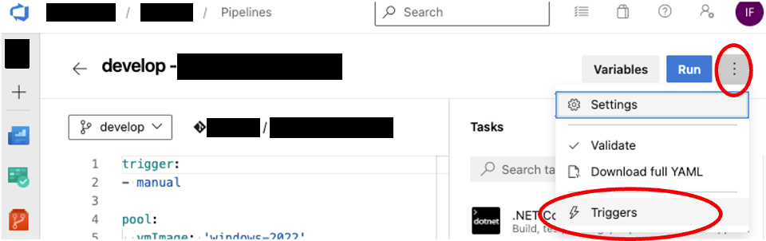<br/>
  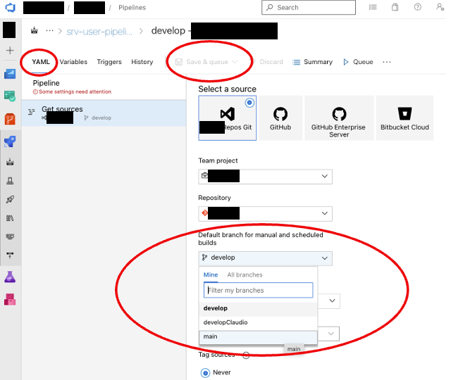<br/>
</details>
<br/>

## Known Issues and Solutions

1. Git clone from Bitbucket Repo rises this error during maven build: ```Failed to execute goal io.spring.javaformat:spring-javaformat-maven-plugin:0.0.31:validate (default) on project Integration-Service-OnPremise: Formatting violations found in the following files``` (spring-io/spring-javaformat requiring LF line separators).
    - **Problem**: Current output of **git config --system -l**: ```core.autocrlf=true```
    - **Solution 1**:
        - **Currently implemented.** It is recommended to have [this setting enabled here](templates/include-windows-agent-clone-bitbucket-steps.yml).
        - It currently **works on** Azure DevOps Windows Agents with spring-java-format-maven-plugin.version **0.0.31** ([check ref](https://github.com/spring-io/spring-javaformat/issues/202)) but apparently **not with** higher releases like java format **0.0.34**.
        - It does not work on Ubuntu or MacOS Agents.

        ```yaml
        steps:
        - checkout: Integration-Service-Bitbucket-Repo
        clean: true
        env:
            autocrlf: true
        ```

    - **Solution 2**: Set ```core.autocrlf=false``` everywhere ([ref](https://stackoverflow.com/questions/2825428/why-should-i-use-core-autocrlf-true-in-git)). Not yet applied on bitbucket repo.
    - **Solution 3**: [Git Attributes](https://git-scm.com/docs/gitattributes) approach on bitbucket repo, check this Azure Repo's [.gitattributes](.gitattributes) as an example with a tested solution on bitbucket.
        - Currently not implemented on Bitbucket Repo.
        - Java Format errors still arise with Ubuntu and MacOS agents, but it works on Windows Agents with solution 1 disabled. Perhaps *[refreshing a repository](https://docs.github.com/en/get-started/getting-started-with-git/configuring-git-to-handle-line-endings) after changing line endings* could help here ([When the file has been committed with CRLF, no conversion is done](https://git-scm.com/docs/gitattributes))
        - References: [ref1](https://docs.github.com/en/get-started/getting-started-with-git/configuring-git-to-handle-line-endings), [ref2](https://git-scm.com/docs/gitattributes), [ref3](https://stackoverflow.com/questions/170961/whats-the-strategy-for-handling-crlf-carriage-return-line-feed-with-git), [ref4](https://github.com/alexkaratarakis/gitattributes), [ref5](https://github.com/gitattributes/gitattributes.io/blob/master/.gitattributes), [ref6](https://stackoverflow.com/questions/42667996/enforce-core-autocrlf-input-through-gitattributes)

2. maven build error in Azure DevOps pipeline: ```[ERROR] Failed to execute goal org.codehaus.mojo:license-maven-plugin:2.0.0:add-third-party (add-third-party) on project integration: Unable to parse configuration of mojo org.codehaus.mojo:license-maven-plugin:2.0.0:add-third-party for parameter includedLicenses: Cannot set 'includedLicenses' in class org.codehaus.mojo.license.AddThirdPartyMojo: InvocationTargetException: Could not open connection to URL: file://D:\a\1\s/licenses/validLicenses: Unknown host D -> [Help 1]```
    - Solution: Add a third *forward slash* to the trouble file path:
        - From:

            ```xml
                <includedLicenses>file://${project.basedir}/licenses/validLicenses</includedLicenses>
                <licenseMergesUrl>file://${project.basedir}/licenses/licenseMerges</licenseMergesUrl>
                <artifactFiltersUrl>file://${project.basedir}/licenses/artifactFilters</artifactFiltersUrl>
            ```

        - To:

            ```xml
                <includedLicenses>file:///${project.basedir}/licenses/validLicenses</includedLicenses>
                <licenseMergesUrl>file:///${project.basedir}/licenses/licenseMerges</licenseMergesUrl>
                <artifactFiltersUrl>file:///${project.basedir}/licenses/artifactFilters</artifactFiltersUrl>
            ```

## PowerShell Cheat Sheet

<details>
  <summary>PowerShell Cheat Sheet. Click to expand!</summary>

  
</details>
<br/>

## VSCode settings

My VSCode's plugins:

- [Markdown All in One 🌟](https://marketplace.visualstudio.com/items?itemName=yzhang.markdown-all-in-one) Tables of Contents are automatically generated with this extension.
- [markdownlint 🌟](https://marketplace.visualstudio.com/items?itemName=DavidAnson.vscode-markdownlint)
- [GitLens — Git supercharged 🌟](https://marketplace.visualstudio.com/items?itemName=eamodio.gitlens)
- [JSON Crack 🌟](https://marketplace.visualstudio.com/items?itemName=AykutSarac.jsoncrack-vscode)
- [Azure Devops Pull Requests](https://marketplace.visualstudio.com/items?itemName=ankitbko.vscode-pull-request-azdo)
- [Azure Repos](https://marketplace.visualstudio.com/items?itemName=ms-vscode.azure-repos)
- [Argutec Azure Repos](https://marketplace.visualstudio.com/items?itemName=argutec.argutec-azure-repos)
- [Azure Pipelines](https://marketplace.visualstudio.com/items?itemName=ms-azure-devops.azure-pipelines)
- [Azure Account](https://marketplace.visualstudio.com/items?itemName=ms-vscode.azure-account)
- [Azure Resources](https://marketplace.visualstudio.com/items?itemName=ms-azuretools.vscode-azureresourcegroups)
- [Azure Databases](https://marketplace.visualstudio.com/items?itemName=ms-azuretools.vscode-cosmosdb)
- [Azure Storage](https://marketplace.visualstudio.com/items?itemName=ms-azuretools.vscode-azurestorage)
- [Azure DevOps Snippets](https://marketplace.visualstudio.com/items?itemName=DamienAicheh.azure-devops-snippets)

My VSCode's user settings.json:

```json
{
    "editor.renderWhitespace": "all",
    "markdown.extension.list.indentationSize": "inherit",
    "markdown.extension.tableFormatter.enabled": true,
    "markdown.extension.tableFormatter.normalizeIndentation": true,
    "markdown.extension.toc.levels": "2..6",
    "markdown.extension.completion.respectVscodeSearchExclude": false,
    "markdown.extension.toc.slugifyMode": "azureDevops",
    "markdown.extension.toc.orderedList": true,
    "markdown.extension.math.enabled": false,
    "markdown.math.enabled": false,
    "editor.minimap.enabled": false,
    "editor.detectIndentation": false,
    "editor.tabSize": 4,
    "terminal.integrated.detectLocale": "on",
    "terminal.integrated.defaultProfile.osx": "pwsh",
    "editor.bracketPairColorization.enabled": true,
    "editor.guides.bracketPairs": "active",
    "powerShellUniversal.samplesDirectory": "undefined",
    "team.showWelcomeMessage": false,
    "azdoPullRequests.orgUrl": "https://dev.azure.com/EnterpriseDev",
    "azdoPullRequests.projectName": "App-Core",
    "[markdown]": {
        "editor.defaultFormatter": "darkriszty.markdown-table-prettify"
    },
    "markdownlint.config": {
        "default": true,
        "MD013": false,
        "MD003": { "style": "atx" },
        "MD007": { "indent": 4 },
        "MD033": false,
        "editor.someSetting": true,
        "markdownlint.focusMode": true,
        "no-hard-tabs": false
    },
    "workbench.settings.useSplitJSON": true,
    "markdown.extension.toc.omittedFromToc": {
    },
    "files.autoSave": "afterDelay"
}
```

## App-Core API Security and OAuth 2

- [enterprise.atlassian.net: App-Core Authentication/Authorization](https://enterprise.atlassian.net/wiki/spaces/DEV/pages/00000000)
- [enterprise.atlassian.net: API Security and OAuth 2.0. Microsoft APIs, Securing APIs & Authentication Flow](https://enterprise.atlassian.net/wiki/spaces/DEV/pages/00000000)

## API Security and OAuth 2 in AAD - Microsoft APIs - Securing APIs and Authentication Flow

- [API Security and OAuth 2.0 in AAD. Microsoft APIs, Securing APIs & Authentication Flow 🌟🌟](docs/aad-api-security-oauth2.md)

## Enterprise References

- [enterprise.atlassian.net: Cloud Ops / DevOps / App-Core: Integration-Service On-Premise - Azure App Register and Installer Download Pipeline (DevSecOps)](https://enterprise.atlassian.net/wiki/spaces/DEV/pages/00000000)
- [enterprise.atlassian.net: Dev](https://enterprise.atlassian.net/wiki/spaces/DEV)
- [enterprise.atlassian.net: DEV - Notifications](https://enterprise.atlassian.net/wiki/spaces/DEV/pages/00000000)
- [enterprise.atlassian.net: DEV - Integration-Service on Premise Download Process](https://enterprise.atlassian.net/wiki/spaces/DEV/pages/00000000)
- [enterprise.atlassian.net: DEV - Integration-Service configuration page](https://enterprise.atlassian.net/wiki/spaces/DEV/pages/00000000)
- [enterprise.atlassian.net: DEV - Integration-Service - Upload Core-Data files to Cloud File System](https://enterprise.atlassian.net/wiki/spaces/DEV/pages/00000000)
- [enterprise.atlassian.net: DEV - Integration-Service Cloud - Components Arquitecture](https://enterprise.atlassian.net/wiki/spaces/DEV/pages/00000000)
- [enterprise.atlassian.net: DEV - Azure authentication flow](https://enterprise.atlassian.net/wiki/spaces/DEV/pages/00000000)

## External References

- [External References](docs/references.md)
