# Enterprise Cloud Infrastructure and DevSecOps Patterns

---

## Table of Contents

- [1. Architectural Strategy and High-Impact Blueprint](#1-architectural-strategy-and-high-impact-blueprint)
- [2. Strategic Presentations and Video Overviews](#2-strategic-presentations-and-video-overviews)
    - [2.1 AI-Generated Video Summaries (NotebookLM)](#21-ai-generated-video-summaries-notebooklm)
    - [2.2 Vision 2026 Architectural Executive Summary](#22-vision-2026-architectural-executive-summary)
    - [2.3 Vision 2026 Technical Engineering Patterns](#23-vision-2026-technical-engineering-patterns)
- [3. Document Inventory](#3-document-inventory)
- [4. Foundations and Engineering Onboarding](#4-foundations-and-engineering-onboarding)
    - [4.1 Engineering Requirements](#41-engineering-requirements)
    - [4.2 Global Regions and Carbon-Aware Naming](#42-global-regions-and-carbon-aware-naming)
        - [4.2.1 The Nomenclature Logic (prefix 'd')](#421-the-nomenclature-logic-prefix-d)
    - [4.3 Automation Glossary](#43-automation-glossary)
    - [4.4 Engineering Environment: VSCode Optimization](#44-engineering-environment-vscode-optimization)
- [5. Core Design Principles](#5-core-design-principles)
    - [5.1 Zero-Trust Identity and Compound Auth](#51-zero-trust-identity-and-compound-auth)
    - [5.2 IaC Sovereignty (100% Terraform)](#52-iac-sovereignty-100-terraform)
    - [5.3 Hybrid-First Integration and AppLink Pattern](#53-hybrid-first-integration-and-applink-pattern)
    - [5.4 Observability-by-Design](#54-observability-by-design)
    - [5.5 Immutable Infrastructure and Stateless Design](#55-immutable-infrastructure-and-stateless-design)
- [6. Lifecycle Strategy and Environment Matrix](#6-lifecycle-strategy-and-environment-matrix)
    - [6.1 IaC Engineering vs. Application Tiering](#61-iac-engineering-vs-application-tiering)
        - [6.1.1 IaC Engineering Phase (Branch: `develop` and prefix `d`)](#611-iac-engineering-phase-branch-develop-and-prefix-d)
        - [6.1.2 Stable IaC Execution (Branch: `main`)](#612-stable-iac-execution-branch-main)
        - [6.1.3 Application Tiering (The Developer's View)](#613-application-tiering-the-developers-view)
        - [6.1.4 Lifecycle Visualization and Environment Matrix](#614-lifecycle-visualization-and-environment-matrix)
    - [6.2 Detailed Infrastructure Lifecycle Matrix](#62-detailed-infrastructure-lifecycle-matrix)
    - [6.3 Tier Parity Strategy: ENG vs PRO](#63-tier-parity-strategy-eng-vs-pro)
    - [6.4 Global Environment and Subscription Matrix](#64-global-environment-and-subscription-matrix)
- [7. The Architecture Wiring: DRY Logic and Referential Linking](#7-the-architecture-wiring-dry-logic-and-referential-linking)
    - [7.1 Multi-Layer Logic Lifecycle](#71-multi-layer-logic-lifecycle)
    - [7.2 Logic Transformation Matrix: Module-Specific Evidence](#72-logic-transformation-matrix-module-specific-evidence)
    - [7.3 The "Instance Generator" Core Logic: Deep-Dive](#73-the-instance-generator-core-logic-deep-dive)
        - [7.3.1 Logic Transformation Matrix: Branch and Nomenclature Strategy](#731-logic-transformation-matrix-branch-and-nomenclature-strategy)
        - [7.3.2 Branch Awareness and The "d" Prefix Logic (IaC Lab Mode)](#732-branch-awareness-and-the-d-prefix-logic-iac-lab-mode)
        - [7.3.3 Shared Infrastructure Mapping: Tier Segregation](#733-shared-infrastructure-mapping-tier-segregation)
        - [7.3.4 Dynamic App Registration and FQDN Naming](#734-dynamic-app-registration-and-fqdn-naming)
    - [7.4 Multi-Region Fan-Out: The Regional Logic](#74-multi-region-fan-out-the-regional-logic)
        - [7.4.1 Regional Short-Notation Matrix](#741-regional-short-notation-matrix)
- [8. Architecture Blueprint: Visualizations and Deep-Dives](#8-architecture-blueprint-visualizations-and-deep-dives)
    - [8.1 High-Fidelity Infrastructure Visualization and Traffic Flow](#81-high-fidelity-infrastructure-visualization-and-traffic-flow)
    - [8.2 Global Traffic Engineering and Regional Failover](#82-global-traffic-engineering-and-regional-failover)
    - [8.3 App Service and Microservices Ecosystem](#83-app-service-and-microservices-ecosystem)
    - [8.4 AKS and Machine Learning Inference Ecosystem](#84-aks-and-machine-learning-inference-ecosystem)
    - [8.5 Scaling Intelligence: Autoscale and Elasticity](#85-scaling-intelligence-autoscale-and-elasticity)
        - [8.5.1 Cluster Autoscaler (CA) - The Compute Backbone](#851-cluster-autoscaler-ca-the-compute-backbone)
        - [8.5.2 Workload Scaling (HPA and VPA)](#852-workload-scaling-hpa-and-vpa)
        - [8.5.3 App Service Elasticity](#853-app-service-elasticity)
        - [8.5.4 Scaling Strategy Comparison Matrix](#854-scaling-strategy-comparison-matrix)
    - [8.6 Global CI/CD Pipeline Orchestration: The IaC Lifecycle](#86-global-cicd-pipeline-orchestration-the-iac-lifecycle)
        - [8.6.1 Pipeline Architecture and Dependency Flow](#861-pipeline-architecture-and-dependency-flow)
        - [8.6.2 Pipeline Inventory and Matrix (IaC Lifecycle Order)](#862-pipeline-inventory-and-matrix-iac-lifecycle-order)
        - [8.6.3 The "Immutable Deployment" Execution Flow](#863-the-immutable-deployment-execution-flow)
    - [8.7 Secure Secret Management and Pipeline Integration](#87-secure-secret-management-and-pipeline-integration)
        - [8.7.1 The "Zero-Secret" Trust Fabric](#871-the-zero-secret-trust-fabric)
        - [8.7.2 Secret Access and Governance Matrix](#872-secret-access-and-governance-matrix)
        - [8.7.3 AKS "Triad" Certificate Provisioning and Day2 Lifecycle](#873-aks-triad-certificate-provisioning-and-day2-lifecycle)
    - [8.8 Automated Secret and Certificate Rotation](#88-automated-secret-and-certificate-rotation)
        - [8.8.1 Secret Rotation Inventory Matrix](#881-secret-rotation-inventory-matrix)
    - [8.9 Backup, DR and Business Continuity Plan (BCP)](#89-backup-dr-and-business-continuity-plan-bcp)
        - [8.9.1 Multi-Region Data Resiliency: Atlas vs. Cosmos DB (POC)](#891-multi-region-data-resiliency-atlas-vs-cosmos-db-poc)
    - [8.10 Business Continuity Implementation Details](#810-business-continuity-implementation-details)
- [9. Terraform Module Architecture: Domain-Driven Composition](#9-terraform-module-architecture-domain-driven-composition)
    - [9.1 Categorization: Why "Composite" over "Atomic"?](#91-categorization-why-composite-over-atomic)
    - [9.2 Master Ecosystem Inventory and Deployment Order](#92-master-ecosystem-inventory-and-deployment-order)
    - [9.3 Architectural Dependency Chain (Logical Hierarchy)](#93-architectural-dependency-chain-logical-hierarchy)
        - [9.3.1 Dependency Visualization](#931-dependency-visualization)
    - [9.4 Internal Execution Flow (High-Fidelity Diagram)](#94-internal-execution-flow-high-fidelity-diagram)
        - [9.4.1 The 5-Stage Lifecycle Breakdown](#941-the-5-stage-lifecycle-breakdown)
    - [9.5 Referential Attribute Linking](#95-referential-attribute-linking)
    - [9.6 Real-World Code Evidence](#96-real-world-code-evidence)
    - [9.7 Orchestration Strategy](#97-orchestration-strategy)
    - [9.8 Advanced Architectural Patterns](#98-advanced-architectural-patterns)
        - [9.8.1 Data Transformation: YAML-Driven IaC](#981-data-transformation-yaml-driven-iac)
        - [9.8.2 Advanced RBAC Matrixing and Granular Control](#982-advanced-rbac-matrixing-and-granular-control)
        - [9.8.3 Collection-Driven Scaling Logic](#983-collection-driven-scaling-logic)
    - [9.9 Repository Engineering Metrics and Analytics](#99-repository-engineering-metrics-and-analytics)
        - [9.9.1 Visual Distribution Analysis](#991-visual-distribution-analysis)
- [10. Engineering Strategy: Federated Multi-Repo vs. Mono-Repo](#10-engineering-strategy-federated-multi-repo-vs-mono-repo)
    - [10.1 The "Enterprise Stack" Pattern](#101-the-enterprise-stack-pattern)
    - [10.2 Architecture Comparison Matrix](#102-architecture-comparison-matrix)
    - [10.3 Implementation Evidence: The Decoupling Logic](#103-implementation-evidence-the-decoupling-logic)
- [11. DevSecOps: Identity, Secrets and OAuth Flow](#11-devsecops-identity-secrets-and-oauth-flow)
    - [11.1 Governance-First Identity Model](#111-governance-first-identity-model)
        - [11.1.1 OAuth 2.0 and OBO Flow Deep-Dive](#1111-oauth-20-and-obo-flow-deep-dive)
        - [11.1.2 Advanced DevSecOps: The Compound Identity Model](#1112-advanced-devsecops-the-compound-identity-model)
    - [11.2 Identity Flow and OAuth Deep-Dive](#112-identity-flow-and-oauth-deep-dive)
    - [11.3 Token Comparison Table](#113-token-comparison-table)
    - [11.4 Technical Flow Constraints](#114-technical-flow-constraints)
- [12. Zero-Trust Identity and OIDC Flow (Secretless CI/CD)](#12-zero-trust-identity-and-oidc-flow-secretless-cicd)
    - [12.1 The Workload Identity Trust Chain](#121-the-workload-identity-trust-chain)
    - [12.2 Workload Identity Federation (OIDC) Evidence](#122-workload-identity-federation-oidc-evidence)
- [13. Security-by-Design Checklist](#13-security-by-design-checklist)
- [14. GreenOps and Sustainability](#14-greenops-and-sustainability)
- [15. Validated Reference Library (Official and Community)](#15-validated-reference-library-official-and-community)
    - [15.1 Foundational and Governance](#151-foundational-and-governance)
    - [15.2 Infrastructure as Code (Terraform)](#152-infrastructure-as-code-terraform)
    - [15.3 Security and Zero-Trust Identity](#153-security-and-zero-trust-identity)
    - [15.4 Networking and Traffic Orchestration](#154-networking-and-traffic-orchestration)
    - [15.5 Compute and Kubernetes (AKS)](#155-compute-and-kubernetes-aks)
    - [15.6 SRE, FinOps and Sustainability](#156-sre-finops-and-sustainability)
    - [15.7 Community and Expert Influences](#157-community-and-expert-influences)

---

## 1. Architectural Strategy and High-Impact Blueprint

[](https://www.terraform.io/)
[](https://azure.microsoft.com/)
[](https://azure.microsoft.com/en-us/services/devops/)
[](https://kubernetes.io/)

<p align="center">
  
</p>

This repository is a definitive technical blueprint for orchestrating a production-ready, multi-tenant ecosystem on **Microsoft Azure**. It showcases the synergy between **Managed PaaS (App Services)**, **High-Performance Compute (AKS)**, and **Hybrid Connectivity**, underpinned by a strict **Zero-Trust Security model**.

> **Engineering Statement**: This architecture is designed to handle high-volume enterprise workloads with a "DRY-First" approach, where 100% of the infrastructure is managed as software, eliminating configuration drift and enabling rapid regional fan-outs.

## 2. Strategic Presentations and Video Overviews

This repository includes high-fidelity architectural presentations and AI-generated video summaries designed to provide an immediate visual and strategic understanding of the Vision 2026 infrastructure. These resources serve as an excellent starting point before diving into the detailed Markdown documentation.

### 2.1 AI-Generated Video Summaries (NotebookLM)
These videos provide a comprehensive audio-visual walkthrough of the entire project documentation (README and `docs/`). They are ideal for quick onboarding, offering a narrated dialogue that synthesizes the complex architectural patterns into an accessible format.
- **English Version:** [Vision 2026 Cloud Blueprint (English)](./videos/Vision_2026_Cloud_Blueprint_English.mp4)
- **Spanish Version:** [Vision 2026 Cloud Arch (Español)](./videos/Vision_2026__Cloud_Arch_Spanish.mp4)

### 2.2 Vision 2026 Architectural Executive Summary
- **Target Audience:** C-Level Executives, Engineering Directors, and Lead Cloud Architects.
- **Content:** A highly visual, strategic overview of the platform. It covers the core design principles (Zero-Trust Identity, IaC Sovereignty), high-level Hub & Spoke networking topography, global traffic engineering, and the roadmap for AI-ready infrastructure.
- **Downloads:** [PPTX Format (Animated/Editable)](./slides/Vision_2026_Architectural_Executive_Summary.pptx) | [PDF Format (Static/Viewable)](./slides/Vision_2026_Architectural_Executive_Summary.pdf)

### 2.3 Vision 2026 Technical Engineering Patterns
- **Target Audience:** Platform Engineers, DevOps Specialists, SREs, and Security Architects.
- **Content:** An exhaustive, schematic breakdown of the engineering machinery. It details the custom "DRY Logic Engine", Tier Parity matrices (ENG vs PRO), strict CI/CD lifecycle pipelines, and the internal dependency flow of Terraform composite modules.
- **Downloads:** [PPTX Format (Animated/Editable)](./slides/Vision_2026_Technical_Engineering_Patterns.pptx) | [PDF Format (Static/Viewable)](./slides/Vision_2026_Technical_Engineering_Patterns.pdf)

## 3. Document Inventory

| Code | Primary Category | Sub-Category | Document | Description |
| :--- | :--- | :--- | :--- | :--- |
| **111** | Foundations and Strategy | Vision | [Architecture Strategy](./docs/111-ARCHITECTURE_2026.md) | Enterprise Architecture Strategy and evolution towards AI-assisted engineering. |
| **112** | Foundations and Strategy | Vision | [Presentation Notebook](./docs/112-PRESENTATION_NOTEBOOK.md) | High-level summary and reference architecture for notebook environments. |
| **121** | Foundations and Strategy | Legal | [Provenance and Legal](./docs/121-PROVENANCE_AND_LEGAL.md) | Code provenance, technical references, and legal disclaimers. |
| **131** | Foundations and Strategy | Platform | [Internal Developer Platform](./docs/131-INTERNAL_DEVELOPER_PLATFORM.md) | Platform Engineering strategy and IDP for elevating Developer Experience. |
| **211** | IaC Engineering and Patterns | Terraform Architecture | [Module Design Patterns](./docs/211-TERRAFORM_MODULE_DESIGN_PATTERNS.md) | Deep-dive into module philosophy: Composite vs. Atomic patterns. |
| **212** | IaC Engineering and Patterns | Terraform Architecture | [Variable Architecture](./docs/212-TERRAFORM_VARIABLE_ARCHITECTURE_AND_DATA_STRATEGY.md) | Orchestration of variables, dynamic locals, and YAML-driven data. |
| **221** | IaC Engineering and Patterns | Visualization | [Visualizations](./docs/221-TERRAFORM_VISUALIZATIONS_AND_DEPENDENCY_GRAPHS.md) | Visualizing infrastructure dependencies and resource graphing. |
| **311** | Infrastructure Pillars | Networking | [Hub-Spoke Backbone](./docs/311-SHARED_INFRA_NETWORKING_HUB_SPOKE_BACKBONE.md) | Hub-Spoke network backbone and shared infrastructure design. |
| **312** | Infrastructure Pillars | Networking | [DNS Ecosystem](./docs/312-NETWORKING_AND_DNS_ECOSYSTEM.md) | Private DNS orchestration and global resolution strategy. |
| **313** | Infrastructure Pillars | Networking | [App Gateway Deep Dive](./docs/313-APP_GATEWAY_DEEP_DIVE.md) | Advanced L7 traffic orchestration and Application Gateway v2. |
| **314** | Infrastructure Pillars | Networking | [Azure WAF Improvements](./docs/314-AZURE_WAF_IMPROVEMENTS.md) | Web Application Firewall policies and edge security hardening. |
| **321** | Infrastructure Pillars | Identity and Security | [Microsoft Entra ID Integration](./docs/321-MICROSOFT_ENTRA_ID_INTEGRATION.md) | Modern Auth, RBAC governance, and Identity Perimeter design. |
| **322** | Infrastructure Pillars | Identity and Security | [Identity Governance Automation](./docs/322-ENTRA_ID_IDENTITY_GOVERNANCE_AUTOMATION.md) | YAML-driven user provisioning and lifecycle automation. |
| **323** | Infrastructure Pillars | Identity and Security | [Key Vault Trust Architecture](./docs/323-KEY_VAULT_TRUST_ARCHITECTURE.md) | Secret management, RBAC vs Access Policies, and Compound Identity. |
| **324** | Infrastructure Pillars | Identity and Security | [Security-by-Design Checklist](./docs/324-SECURITY_BY_DESIGN_CHECKLIST.md) | Technical deep-dive into hardening, Private Link, and DDoS protection. |
| **331** | Infrastructure Pillars | Compute | [AKS Compute Hub](./docs/331-AKS_COMPUTE_HUB_AND_ML_ORCHESTRATION.md) | Managed Kubernetes, specialized node pools, and ML workloads. |
| **332** | Infrastructure Pillars | Compute | [AKS Networking Masterclass](./docs/332-AKS_NETWORKING_MASTERCLASS.md) | CNI, API Server integration, and advanced K8s networking. |
| **341** | Infrastructure Pillars | Data | [Database Architecture](./docs/341-DATABASE_ARCHITECTURE_AND_PERSISTENCE_STRATEGY.md) | Hybrid data orchestration (Atlas vs Cosmos DB). |
| **342** | Infrastructure Pillars | Data | [Storage Governance](./docs/342-STORAGE_GOVERNANCE_AND_LIFECYCLE.md) | Data persistence, isolation, and recovery service vaults. |
| **411** | DevSecOps and Operations | Orchestration and Security | [Azure DevOps Pipelines](./docs/411-AZURE_DEVOPS_PIPELINES_ORCHESTRATION.md) | Global CI/CD orchestration and multi-layer lifecycle management. |
| **412** | DevSecOps and Operations | Orchestration and Security | [Pipeline Security and Governance](./docs/412-AZURE_DEVOPS_PIPELINE_SECURITY_AND_GOVERNANCE.md) | Pipeline hardening, branch policies, and environment gates. |
| **421** | DevSecOps and Operations | Day 2 Ops | [Observability and Day2 Operations](./docs/421-OBSERVABILITY_AND_DAY2_OPERATIONS.md) | Unified monitoring, logging, and self-healing infrastructure. |
| **811** | Analytical and Governance (GRC) | Resilience | [DR and BCP Arch Analysis](./docs/811-DR_BCP_ARCH_ANALYSIS.md) | Disaster Recovery and Business Continuity architectural audit. |
| **821** | Analytical and Governance (GRC) | Economics | [FinOps Arch Analysis](./docs/821-FINOPS_ARCH_ANALYSIS.md) | Cloud financial management and cost reverse engineering. |
| **911** | Reference and Closure | SRE and Runbooks | [Troubleshooting and Runbooks](./docs/911-TROUBLESHOOTING_AND_OPERATIONAL_RUNBOOKS.md) | SRE guide for diagnosing and resolving complex failures. |
| **999** | Reference and Closure | Roadmap and Backlog | [Future Roadmap and Strategic Architectural Backlog](./docs/999-FUTURE_ROADMAP_AND_IMPROVEMENT_BACKLOG.md) | Strategic evolution path and engineering improvement backlog. |


## 4. Foundations and Engineering Onboarding

### 4.1 Engineering Requirements
Before initiating the first deployment, ensure the following prerequisites are met:

| Category | Requirement | Source of Truth |
| :--- | :--- | :--- |
| **Azure** | 2x Enterprise Subscriptions (ENG, PRO) | [Section 6.3](#63-global-environment--subscription-matrix) |
| **SCM** | `git` (CLI version `>= 2.40`) | [Git Docs](https://git-scm.com/) |
| **Terraform** | CLI Version `>= 1.5.2` | [`providers.tf`](./App-Core/terraform-manifests/providers.tf) |
| **ADO** | Terraform Extension by Microsoft DevLabs | [Pipelines](./AKS/01-terraform-provision-AKS-pipeline.yml) |
| **Identity** | Global Admin (for initial SPN / OIDC setup) | [Entra ID](./docs/321-MICROSOFT_ENTRA_ID_INTEGRATION.md) |
| **Tools** | `az cli`, `pwsh` (7+), `bash`, `kubelogin`, `kubectl`, `helm` | [`scripts/`](./Shared-Infra/scripts/) |
| **IDE** | `VSCode` + [HashiCorp Terraform Extension](https://marketplace.visualstudio.com/items?itemName=HashiCorp.terraform) | [Section 4.4](#44-engineering-environment-vscode-optimization) |

### 4.2 Global Regions and Carbon-Aware Naming
Naming in this platform is a functional identifier. It encapsulates the geographical footprint, the carbon intensity of the datacenter, and the branch lifecycle status.

| Region Name | Logical Code | Carbon Intensity | Primary Use Case | Source of Truth |
| :--- | :---: | :--- | :--- | :--- |
| **North Europe** | `ne` | Low (Wind/Hydro) | Primary Production & High-Scale Tiers | [`03-locals.tf`](./App-Core/terraform-manifests/modules/appcore_module/03-locals.tf) |
| **West Europe** | `we` | Moderate | Disaster Recovery & Staging | [`03-locals.tf`](./App-Core/terraform-manifests/modules/appcore_module/03-locals.tf) |
| **East US** | `eus` | High | North American Edge & Global Expansion | [`03-locals.tf`](./App-Core/terraform-manifests/modules/appcore_module/03-locals.tf) |

#### 4.2.1 The Nomenclature Logic (prefix 'd')
As detailed in [Section 6.1](#61-iac-engineering-vs-application-tiering), the platform distinguishes between stable and experimental code via branch-based prefixes.
- **Shadow Infrastructure (prefix 'd')**: Automatically prepended when deploying from `develop` (e.g., `stdnedev`). This allows engineers to safely test IaC logic without affecting production-grade resources.
- **Production Sovereignty (no prefix)**: Reserved for resources deployed from `main` (e.g., `stnepro`), ensuring that mission-critical resources follow a clean, immutable naming standard.
- **Logic Verification**: `gitbranch = (var.gitbranch != 'main') ? 'd':''` in [`03-locals.tf`](./App-Core/terraform-manifests/modules/appcore_module/03-locals.tf).


### 4.3 Automation Glossary
- **IaC (Infrastructure as Code)**: The practice of managing and provisioning infrastructure through machine-readable definition files.
- **Idempotency**: A property of our Terraform manifests where multiple executions of the same code result in the same state without side effects.
- **Zero-Trust**: A security framework requiring all users/devices, whether in or out of the network, to be authenticated and authorized.
- **OIDC (OpenID Connect)**: An identity layer on top of OAuth 2.0 used for secretless pipeline authentication.
- **Private Link / Endpoint**: A technology that provides private connectivity between a VNet and an Azure PaaS service, removing public internet exposure.
- **UDR (User Defined Route)**: A manual routing rule used here to force all spoke traffic through the central Firewall.

### 4.4 Engineering Environment: VSCode Optimization
For the best engineering experience, use the following `settings.json` configuration:

```json
{
  "terraform.languageServer": true,
  "terraform.indexing.enabled": true,
  "terraform.validation.enable": true,
  "editor.formatOnSave": true,
  "[terraform]": {
    "editor.defaultFormatter": "hashicorp.terraform"
  }
}
```

## 5. Core Design Principles

### 5.1 Zero-Trust Identity and Compound Auth
We eliminate the concept of "Trusted Networks" by requiring every service interaction to be authenticated.
- **Managed Identities (MSI)**: Microservices use User-Assigned Managed Identities to authenticate against Azure services (Key Vault, Storage) without static secrets.
- **Workload Identity Federation**: Azure DevOps pipelines authenticate to Azure using OIDC, removing long-lived service principal keys.
- **Evidence**: [`15-app-register-service-principals.tf`](./App-Core/terraform-manifests/modules/appcore_module/15-app-register-service-principals.tf) and [`shared-azure-devops-pipeline-vars.yml`](./Shared-Infra/configuration/shared-azure-devops-pipeline-vars.yml).

### 5.2 IaC Sovereignty (100% Terraform)
The infrastructure is treated as software. Any change made via the Azure Portal is considered "Configuration Drift" and is automatically rectified by the next pipeline run.
- **Declarative State**: 100% of resources are defined in HCL.
- **Idempotency**: Rerunning the code with the same inputs produces zero changes, guaranteeing deterministic environments.
- **Evidence**: [`AKS/01-terraform-provision-AKS-pipeline.yml`](./AKS/01-terraform-provision-AKS-pipeline.yml).

### 5.3 Hybrid-First Integration and AppLink Pattern
Seamless connectivity between modern Cloud-Native APIs and legacy On-Premises systems.
- **AppLink Signaling**: A custom pattern that allows secure, mTLS-encrypted tunnels for data exchange across hybrid networks.
- **Evidence**: [`Integration-Service/README.md`](./Integration-Service/README.md) and [`Shared-Infra/terraform-manifests/modules/sharedinfra_dns_module/`](./Shared-Infra/terraform-manifests/modules/sharedinfra_dns_module/).

### 5.4 Observability-by-Design
Infrastructure is "born" with monitoring. No resource exists without telemetry.
- **Evidence**: [`35-log-analytics-workspace.tf`](./App-Core/terraform-manifests/modules/appcore_module/35-log-analytics-workspace.tf) and [`36-application-insights.tf`](./App-Core/terraform-manifests/modules/appcore_module/36-application-insights.tf).

### 5.5 Immutable Infrastructure and Stateless Design
We prioritize resource replacement over patching.
- **Evidence**: [`18-app-service-back-api.tf`](./App-Core/terraform-manifests/modules/appcore_module/18-app-service-back-api.tf).


## 6. Lifecycle Strategy and Environment Matrix

### 6.1 IaC Engineering vs. Application Tiering
It is critical to distinguish between the **Lifecycle of the Infrastructure Code (IaC)** and the **Functional Tiering of the Applications**.

#### 6.1.1 IaC Engineering Phase (Branch: `develop` and prefix `d`)
The **`develop` branch** is the laboratory for the Platform Engineering team. All changes to Terraform manifests and pipelines are developed and tested here first.
- **The "d" Prefix Logic**: When deploying from any branch other than `main` (typically `develop` or feature branches), the Logic Engine automatically prepends a **`d`** to all resource names.
- **Purpose**: This creates a "Shadow Infrastructure" where engineers can test IaC changes across **all tiers** (Dev, QA, and even Pro) without overwriting or impacting the stable, "gold" resources.
- **Evidence**: [`03-locals.tf`](./App-Core/terraform-manifests/modules/appcore_module/03-locals.tf) logic: `gitbranch = (var.gitbranch != "main") ? "d":""`.

#### 6.1.2 Stable IaC Execution (Branch: `main`)
The **`main` branch** contains the validated, "Productive" version of the infrastructure code.
- **Clean Naming**: Resources deployed from `main` lack the `d` prefix, representing the official state of the environment.
- **Dual Support**: Both Engineering Tiers (Dev/QA) and Production Tiers (Pro/Demo) use the code from their respective `main` states once validated.

#### 6.1.3 Application Tiering (The Developer's View)
Independent of the IaC branch, the architecture provides two distinct **Subscription Tiers** for application developers:
1.  **Engineering Spoke (ENG)**: Hosting functional environments for day-to-day development: **DEV, QA, UAT, and PRE**.
2.  **Production Spoke (PRO)**: Hosting mission-critical environments: **PRO and DEMO**.

#### 6.1.4 Lifecycle Visualization and Environment Matrix

The following diagram illustrates the flow of code and the separation between the **Engineering of the Code (IaC)** and the **Production of the Resources**.

<details>
<summary><b>Click to expand: Lifecycle Visualization and Environment Matrix</b></summary>

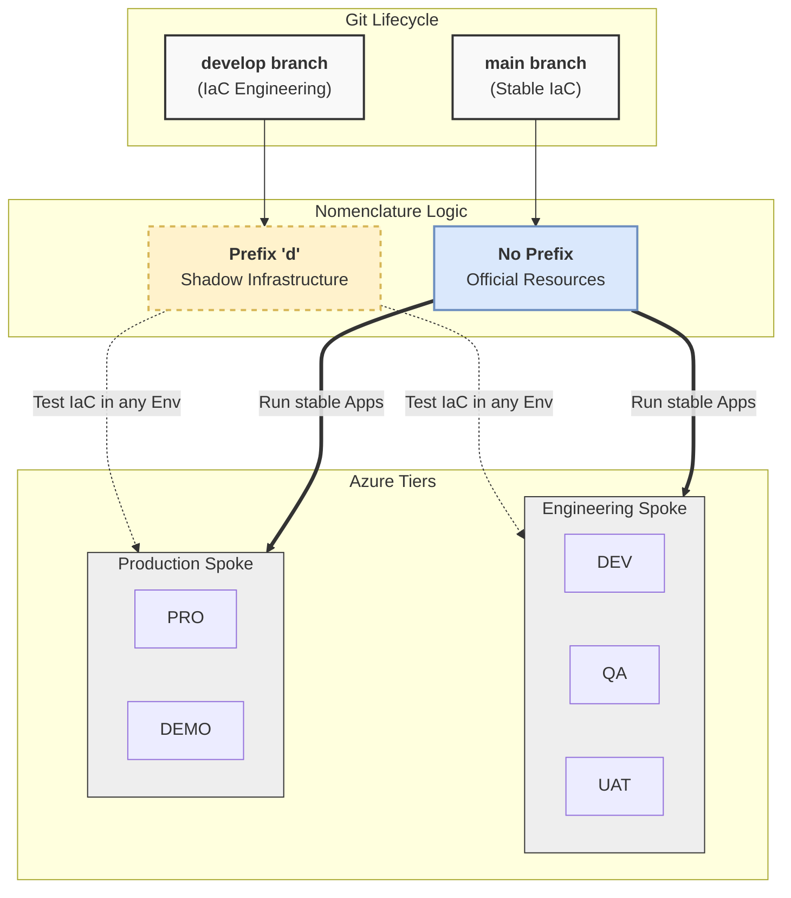
```mermaid
graph TD
    %% Class Definitions
    classDef branch fill:#f9f9f9,stroke:#333,stroke-width:2px
    classDef prefix_d fill:#fff2cc,stroke:#d6b656,stroke-width:2px,stroke-dasharray: 5 5
    classDef prefix_none fill:#dae8fc,stroke:#6c8ebf,stroke-width:2px
    classDef tier fill:#eeeeee,stroke:#333,stroke-width:1px
    subgraph Git_Branches [Git Lifecycle]
        DEV_B["<b>develop branch</b><br/>(IaC Engineering)"]
        MAIN_B["<b>main branch</b><br/>(Stable IaC)"]
    end
    subgraph Resource_Generation [Nomenclature Logic]
        direction LR
        P_D["<b>Prefix 'd'</b><br/>Shadow Infrastructure"]
        P_N["<b>No Prefix</b><br/>Official Resources"]
    end
    subgraph Subscriptions [Azure Tiers]
        direction LR
        subgraph Sub_ENG [Engineering Spoke]
            E1[DEV]
            E2[QA]
            E3[UAT]
        end
        subgraph Sub_PRO [Production Spoke]
            PR1[PRO]
            PR2[DEMO]
        end
    end
    %% Flows
    DEV_B --> P_D
    MAIN_B --> P_N
    P_D -.->|"Test IaC in any Env"| Sub_ENG
    P_D -.->|"Test IaC in any Env"| Sub_PRO
    P_N ===>|"Run stable Apps"| Sub_ENG
    P_N ===>|"Run stable Apps"| Sub_PRO
    class DEV_B,MAIN_B branch
    class P_D prefix_d
    class P_N prefix_none
    class Sub_ENG,Sub_PRO tier
```

</details>

### 6.2 Detailed Infrastructure Lifecycle Matrix
| Dimension | Engineering IaC (develop/d) | Stable IaC (main) |
| :--- | :--- | :--- |
| **Primary Goal** | Test new Terraform logic & patterns | Host production-ready workloads |
| **Naming Prefix** | **`d`** (e.g., `rg-d-appcore-ne-pro`) | **None** (e.g., `rg-appcore-ne-pro`) |
| **Collision Risk** | **Zero** (Isolated by naming) | High (Requires strict PR approval) |
| **Billing Tag** | `Engineering / Sandbox` | `Production / Business` |
| **Environments** | **ANY** (Dev, QA, UAT, PRO, DEMO) | **ANY** (Dev, QA, UAT, PRO, DEMO) |
| **Target Audience** | Platform Engineers / SRE | App Developers / End Users |
| **Evidence** | [`App-Core/03-locals.tf`](./App-Core/terraform-manifests/modules/appcore_module/03-locals.tf) | [`AKS/01-provisioning-pipeline.yml`](./AKS/01-terraform-provision-AKS-pipeline.yml) |

### 6.3 Tier Parity Strategy: ENG vs PRO
We enforce strict **Tier Parity** to ensure that code tested in ENG behaves identically in PRO, with the only differences being **Scale** and **Cost**.

| Feature | Engineering (ENG) | Production (PRO) | Code Evidence |
| :--- | :--- | :--- | :--- |
| **App Service SKU** | `B1` or `P1v2` | `P2v2` or `P3v3` | [`variables.tf`](./App-Catalog/terraform-manifests/variables.tf) |
| **AKS Node Pool** | `Standard_DS2_v2` | `Standard_D4s_v3` (Auto-healing) | [`06-aks-cluster.tf`](./AKS/terraform-manifests/modules/sharedinfra_aks_module/06-aks-cluster.tf) |
| **MongoDB Tier** | `M10` (Standard) | `M30+` (High-Availability) | [`15-mongodb.tf`](./App-Catalog/terraform-manifests/modules/appanalysis_module/15-mongodb.tf) |
| **Replication** | LRS (Local) | GRS / ZRS (Geo/Zone) | [`07-storage-account.tf`](./App-Core/terraform-manifests/modules/appcore_module/07-storage-account.tf) |
| **Backup** | 7 Days Retention | 180+ Days Retention | [`10-backup-policy.tf`](./App-Core/terraform-manifests/modules/appcore_module/10-file-share-clients-backup-policy.tf) |

### 6.4 Global Environment and Subscription Matrix
The platform utilizes a **Spoke-Per-Tier** subscription model to ensure absolute billing and quota isolation. **Source of Truth**: Mapping logic in [`App-Core/03-locals.tf`](./App-Core/terraform-manifests/modules/appcore_module/03-locals.tf) where `sharedinfra_environment` is calculated.

| Shared-Infra Env | App Env | Subscription Role | Service Connection | SPN Permission Level |
| :--- | :--- | :--- | :--- | :--- |
| **ENG** | DEV, QA, UAT | `Enterprise DevTest` | `svccon-ent-dev` | `Contributor` + `User Access Administrator` |
| **PRO** | PRO, DEMO | `Enterprise Prod` | `svccon-ent-pro` | `Contributor` (Strict JIT required) |

- **Service Connection Isolation**: Each environment tier is bound to a dedicated Azure DevOps Service Connection, preventing a "Dev" pipeline from accidentally touching "Prod" resources.
- **Quota Management**: By separating ENG and PRO into different subscriptions, we avoid AKS core-limit exhaustion during heavy testing phases.

## 7. The Architecture Wiring: DRY Logic and Referential Linking

This repository transcends traditional IaC by implementing a **Custom Logic Engine**. It ensures that high-level architectural intent is automatically translated into hundreds of low-level Azure resources, enforcing organizational standards without duplicating a single line of code.

### 7.1 Multi-Layer Logic Lifecycle

The following diagram illustrates how raw inputs are processed by the Engine (`locals.tf`) to produce a deterministic environment.

<details>
<summary><b>Click to expand: Multi-Layer Logic Lifecycle</b></summary>

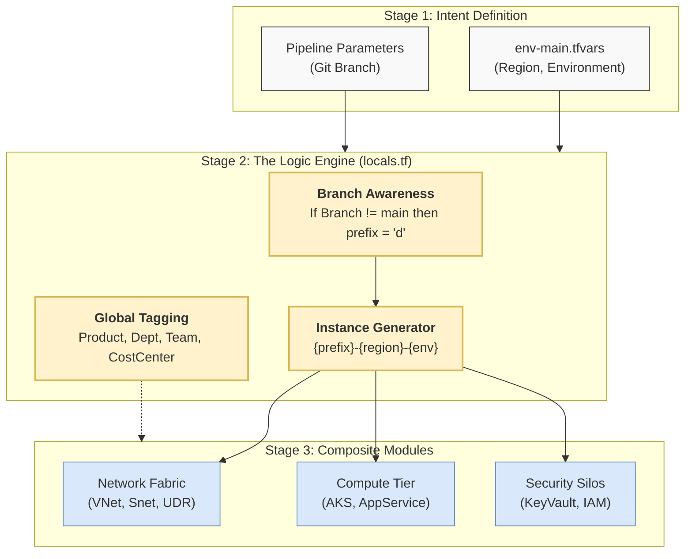
```mermaid
graph TD
    %% Class Definitions
    classDef input fill:#f9f9f9,stroke:#333,stroke-width:1px
    classDef engine fill:#fff2cc,stroke:#d6b656,stroke-width:2px
    classDef resource fill:#dae8fc,stroke:#6c8ebf,stroke-width:1px
    subgraph Inputs ["Stage 1: Intent Definition"]
        direction LR
        TFVARS["env-main.tfvars<br/>(Region, Environment)"]
        PARAM["Pipeline Parameters<br/>(Git Branch)"]
    end
    subgraph Engine ["Stage 2: The Logic Engine (locals.tf)"]
        direction TB
        B_A["<b>Branch Awareness</b><br/>If Branch != main then prefix = 'd'"]
        I_G["<b>Instance Generator</b><br/>{prefix}-{region}-{env}"]
        TAG["<b>Global Tagging</b><br/>Product, Dept, Team, CostCenter"]
    end
    subgraph Output ["Stage 3: Composite Modules"]
        direction TB
        NET["Network Fabric<br/>(VNet, Snet, UDR)"]
        COMP["Compute Tier<br/>(AKS, AppService)"]
        SEC["Security Silos<br/>(KeyVault, IAM)"]
    end
    TFVARS --> Engine
    PARAM --> Engine
    B_A --> I_G
    I_G --> NET
    I_G --> COMP
    I_G --> SEC
    TAG -.-> Output
    class TFVARS,PARAM input
    class B_A,I_G,TAG engine
    class NET,COMP,SEC resource
```

</details>

### 7.2 Logic Transformation Matrix: Module-Specific Evidence

The Engine is distributed across specialized `locals.tf` files. Each module handles its own logic transformations to maintain strict encapsulation while adhering to global standards.

| Logical Domain | Primary Responsibility | Key Files (Source of Truth) |
| :--- | :--- | :--- |
| **Global Environment** | Branch awareness (`d` prefix) and global tag synthesis. | [`App-Core/03-locals.tf`](./App-Core/terraform-manifests/modules/appcore_module/03-locals.tf) |
| **AKS Cluster** | Naming for clusters, registries, and AD groups. | [`AKS/locals.tf`](./AKS/terraform-manifests/modules/sharedinfra_aks_module/locals.tf) |
| **Network & DNS** | Calculation of FQDNs and DNS Zone resource groups. | [`Shared-Infra/locals.tf`](./Shared-Infra/terraform-manifests/modules/dns_top_level_domain_module/locals.tf) |
| **Day2 Ops** | Mapping of operational tools and monitoring prefixes. | [`Day2-ops/locals.tf`](./Day2-ops/terraform-manifests/modules/day2_ops_module/locals.tf) |
| **User Identity** | Dynamic YAML mapping for user provisioning. | [`App-Users/06-locals.tf`](./App-Users/terraform-manifests/06-locals.tf) |

### 7.3 The "Instance Generator" Core Logic: Deep-Dive

The **Environment Instance Generator** is the deterministic function that defines the "DNA" of the stack. It synthesizes inputs to ensure environment parity and cost isolation, strictly adhering to the **IaC Engineering vs. Application Tiering** strategy defined in Section 6.1.

#### 7.3.1 Logic Transformation Matrix: Branch and Nomenclature Strategy

The Logic Engine applies distinct transformation rules based on the resource category. A critical feature is the **Branch Awareness** logic, which automatically segregates Engineering from Production resources.

| Resource Category | Logic Applied | Naming Pattern (ENG vs PRO) | Evidence (Source of Truth) |
| :--- | :--- | :--- | :--- |
| **Foundation** | RG naming follows the instance identity. | `rg-appcore-dne-dev` vs `rg-appcore-ne-pro` | [`03-locals.tf`](./App-Core/terraform-manifests/modules/appcore_module/03-locals.tf) |
| **SaaS/PaaS** | Storage accounts lack dashes and use restricted lengths. | `stdnedev` vs `stnepro` | [`07-storage-account.tf`](./App-Core/terraform-manifests/modules/appcore_module/07-storage-account.tf) |
| **Compute** | App Services include the framework and branch context. | `app-back-dnedev` vs `app-back-nepro` | [`18-app-service-back-api.tf`](./App-Core/terraform-manifests/modules/appcore_module/18-app-service-back-api.tf) |
| **Identity** | Automated Service Principal mapping. | `appr-appcore-back-dnedev` | [`12-app-register-back-api.tf`](./App-Core/terraform-manifests/modules/appcore_module/12-app-register-back-api.tf) |
| **DNS** | Child zones are generated based on branch status. | `deng.enterprise.com` vs `apps.enterprise.com` | [`Shared-Infra/locals.tf`](./Shared-Infra/terraform-manifests/modules/dns_top_level_domain_module/locals.tf) |

#### 7.3.2 Branch Awareness and The "d" Prefix Logic (IaC Lab Mode)
The master switch for nomenclature is the Git branch detection.

- **High-Level Intent**: Ensure that IaC development work (in `develop` or feature branches) never conflicts with stable production naming, regardless of the target subscription.
- **Low-Level Implementation**:
  ```hcl
  # Source: App-Core/terraform-manifests/modules/appcore_module/03-locals.tf
  # This switch enables "Lab Mode" by adding a 'd' prefix for any branch other than main
  gitbranch = (var.gitbranch != "main") ? "d" : "" # d = develop branch , "" = main branch
  ```

  When the pipeline runs on the `develop` branch, every resource name starts with `d`, such as `stdnedev` (Engineering Storage) vs `stnepro` (Production Storage).

  This creates a **Shadow Infrastructure** (e.g., `stdnedev`) that mirrors the structure of official resources (`stnepro`) for testing purposes.

#### 7.3.3 Shared Infrastructure Mapping: Tier Segregation
The engine distinguishes between **Engineering (ENG)** and **Production (PRO)** Shared-Infra tiers, including non-standard environments.

- **PRO-Grade**: Environments `pro`, `dem` (Demo), and `res` (Research) are treated as **Production**.
- **ENG-Grade**: Environments `dev`, `qa`, `uat`, and `pre` are treated as **Engineering**.

- **High-Level Intent**: Apply production-grade security standards (Firewall, WAF, Private Link) to Demo and Research environments by mapping them to the PRO Shared-Infra tier.
- **Low-Level Implementation**:
  ```hcl
  # Source: App-Core/terraform-manifests/modules/appcore_module/03-locals.tf
  # PRO, DEM (Demo), and RES (Research) are treated as PRODUCTION-grade tiers
  sharedinfra_environment = (var.environment != "pro" && var.environment != "dem" && var.environment != "res") ? "eng" : "pro"
  ```

  **DNS Child Zone Dynamics:**
  ```hcl
    # Source: Day2-ops/terraform-manifests/modules/day2_ops_module/locals.tf
    dns_child_zone = (var.environment != "pro") ? "${local.gitbranch}eng":"${local.gitbranch}apps"
  ```

#### 7.3.4 Dynamic App Registration and FQDN Naming
To prevent identity collisions, even **Entra ID App Registrations** and **DNS Zones** follow the branch-aware logic.

- **Naming Pattern**: `appr-{product}-{service}-{prefix}{region}{env}`
- **DNS Pattern**: `${dns_prefix}${gitbranch}{env}.enterprise.com`
- **Technical Evidence**: Defined via the `suffix_name` and `appcore_dns_name` variables in [`App-Core/03-locals.tf`](./App-Core/terraform-manifests/modules/appcore_module/03-locals.tf). This ensures that an engineer testing a new AAD permission in `develop` branch creates a separate App Registration (`appr-...-dnedev`) rather than modifying the stable one.

### 7.4 Multi-Region Fan-Out: The Regional Logic
The architecture is designed for global scale, allowing for the independent activation of geographical footprints via Terraform "Feature Flags".

- **Activation Flags**: Managed in `.tfvars` files.
    - `deploy_Europe = true`: Activates the European stack.
    - `deploy_United_States = true`: Activates the North American stack.
- **Regional Nomenclature**:
  The Logic Engine synthesizes regional codes into every resource name to prevent global namespace collisions.

#### 7.4.1 Regional Short-Notation Matrix
| Region | Short Code | DNS Prefix | Example Resource |
| :--- | :---: | :---: | :--- |
| **North Europe** | `ne` | `ne` | `stdnedev` |
| **East US** | `us` | `us` | `stuspro` |
| **West Europe** | `we` | `we` | `stwedev` |

## 8. Architecture Blueprint: Visualizations and Deep-Dives

### 8.1 High-Fidelity Infrastructure Visualization and Traffic Flow

<details>
<summary><b>Click to expand: High-Fidelity Infrastructure Visualization and Traffic Flow</b></summary>

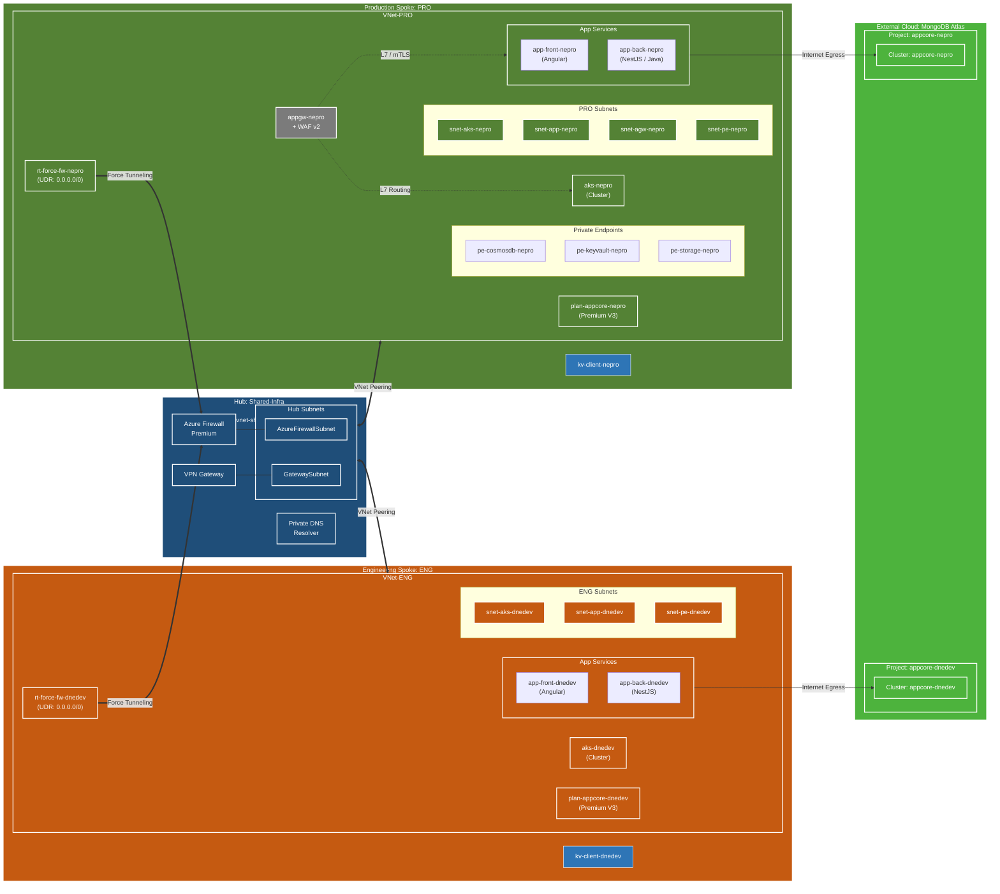
```mermaid
graph LR
    %% Class Definitions
    classDef hub fill:#1f4e79,stroke:#fff,stroke-width:2px,color:#fff
    classDef eng fill:#c55a11,stroke:#fff,stroke-width:2px,color:#fff
    classDef pro fill:#548235,stroke:#fff,stroke-width:2px,color:#fff
    classDef security fill:#7b7b7b,stroke:#fff,stroke-width:2px,color:#fff
    classDef storage fill:#2e75b6,stroke:#fff,stroke-width:1px,color:#fff
    classDef atlas fill:#4db33d,stroke:#fff,stroke-width:2px,color:#fff
    subgraph Hub ["Hub: Shared-Infra<br/><br/>(vnet-sharedinfra-pro)"]
        direction TB
        FW["Azure Firewall<br/>Premium"]
        DNS["Private DNS<br/>Resolver"]
        VPN["VPN Gateway"]
        subgraph HubSubnets ["Hub Subnets"]
            S_FW["AzureFirewallSubnet"]
            S_GW["GatewaySubnet"]
        end
    end
    subgraph ENG ["Engineering Spoke: ENG<br/><br/>(vnet-appcore-dnedev)"]
        direction TB
        subgraph VNet_ENG ["VNet-ENG"]
            AKS_E["aks-dnedev<br/>(Cluster)"]
            AS_Plan_E["plan-appcore-dnedev<br/>(Premium V3)"]
            subgraph Apps_ENG [App Services]
                direction TB
                APP_FRONT_E["app-front-dnedev<br/>(Angular)"]
                APP_BACK_E["app-back-dnedev<br/>(NestJS)"]
            end
            subgraph ENGSubnets [ENG Subnets]
                S_AKS_E["snet-aks-dnedev"]
                S_APP_E["snet-app-dnedev"]
                S_PE_E["snet-pe-dnedev"]
            end
            RT_E["rt-force-fw-dnedev<br/>(UDR: 0.0.0.0/0)"]
        end
        KV_E["kv-client-dnedev"]
    end
    subgraph PRO ["Production Spoke: PRO<br/><br/>(vnet-appcore-nepro)"]
        direction TB
        subgraph VNet_PRO ["VNet-PRO"]
            AKS_P["aks-nepro<br/>(Cluster)"]
            AS_Plan_P["plan-appcore-nepro<br/>(Premium V3)"]
            WAF["appgw-nepro<br/>+ WAF v2"]
            subgraph Apps_PRO [App Services]
                direction TB
                APP_FRONT_P["app-front-nepro<br/>(Angular)"]
                APP_BACK_P["app-back-nepro<br/>(NestJS / Java)"]
            end
            subgraph PROSubnets [PRO Subnets]
                S_AKS_P["snet-aks-nepro"]
                S_APP_P["snet-app-nepro"]
                S_AGW_P["snet-agw-nepro"]
                S_PE_P["snet-pe-nepro"]
            end
            subgraph PEndpoints_P [Private Endpoints]
                PE_DB_P["pe-cosmosdb-nepro"]
                PE_KV_P["pe-keyvault-nepro"]
                PE_SA_P["pe-storage-nepro"]
            end
            RT_P["rt-force-fw-nepro<br/>(UDR: 0.0.0.0/0)"]
        end
        KV_P["kv-client-nepro"]
    end
    subgraph Atlas ["External Cloud: MongoDB Atlas"]
        direction TB
        subgraph Atlas_ENG [Project: appcore-dnedev]
            DB_E["Cluster: appcore-dnedev"]
        end
        subgraph Atlas_PRO [Project: appcore-nepro]
            DB_P["Cluster: appcore-nepro"]
        end
    end
    VPN --- S_GW
    FW --- S_FW
    HubSubnets <==>|"VNet Peering"| VNet_ENG
    HubSubnets <==>|"VNet Peering"| VNet_PRO
    RT_E ==>|"Force Tunneling"| FW
    RT_P ==>|"Force Tunneling"| FW
    WAF -.->|"L7 / mTLS"| Apps_PRO
    WAF -.->|"L7 Routing"| AKS_P
    Apps_ENG -- "Internet Egress" --> DB_E
    Apps_PRO -- "Internet Egress" --> DB_P
    class Hub,HubSubnets,S_FW,S_GW,FW,DNS,VPN hub
    class ENG,VNet_ENG,AKS_E,AS_Plan_E,Apps_ENG,S_AKS_E,S_APP_E,S_PE_E,RT_E eng
    class PRO,VNet_PRO,AKS_P,AS_Plan_P,Apps_PRO,RT_P,S_AKS_P,S_APP_P,S_AGW_P,S_PE_P pro
    class KV_P,KV_E storage
    class WAF security
    class Atlas,Atlas_ENG,Atlas_PRO,DB_E,DB_P atlas
```

</details>

- **Strategic Overview (High-Level)**:
  This architecture implements a **Symmetrical Hub-Spoke model** to achieve absolute environment isolation while centralizing egress security. The Hub (Shared-Infra) acts as the single inspection point for all internet-bound traffic, enforcing a **Zero-Trust** posture. By mirroring the Engineering (ENG) and Production (PRO) spokes, we eliminate configuration drift and ensure environment parity across the delivery lifecycle.

- **Technical Implementation (Low-Level)**:
  - **Forced Tunneling (UDR)**: Workload subnets (`snet-aks-*`, `snet-app-*`) are associated with Route Tables that implement a `0.0.0.0/0` route with the **Azure Firewall Premium** IP as the next hop. This is evidenced in [`05-vnet.tf`](./App-Core/terraform-manifests/modules/appcore_module/05-vnet.tf).
  - **Naming Convention Synergy**: Resources use the `d` prefix for ENG (e.g., `vnet-appcore-dnedev`) and clean naming for PRO (e.g., `vnet-appcore-nepro`), as defined in [`03-locals.tf`](./App-Core/terraform-manifests/modules/appcore_module/03-locals.tf).
  - **Edge Security**: The **Application Gateway WAF v2** terminates SSL and routes traffic to Spokes over peering links, ensuring L7 protection for all public-facing services.

### 8.2 Global Traffic Engineering and Regional Failover

<details>
<summary><b>Click to expand: Global Traffic Engineering and Regional Failover</b></summary>

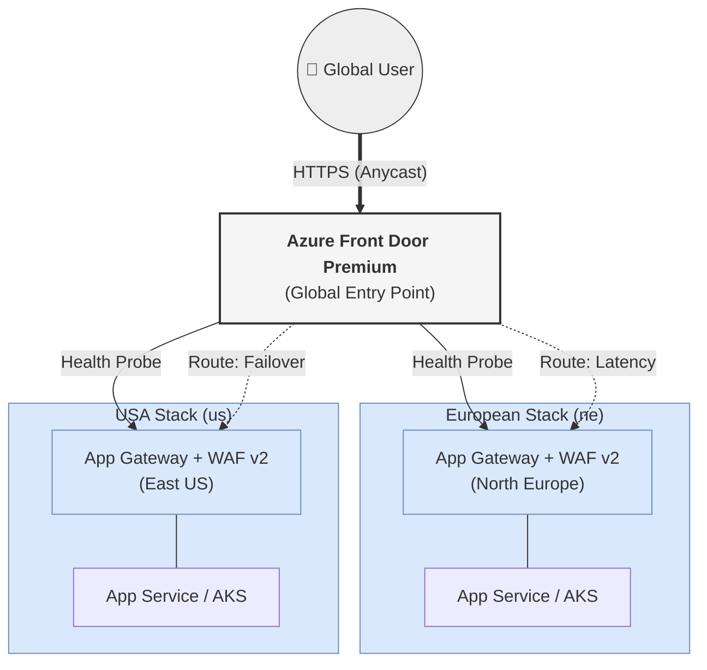
```mermaid
graph TB
    classDef global fill:#f5f5f5,stroke:#333,stroke-width:2px,color:#333
    classDef regional fill:#dae8fc,stroke:#6c8ebf,stroke-width:1px,color:#333
    classDef user fill:#eeeeee,stroke:#333,stroke-width:1px,color:#333
    USER((👤 Global User))
    AFD["<b>Azure Front Door Premium</b><br/>(Global Entry Point)"]
    subgraph EU_Stack ["European Stack (ne)"]
        AGW_EU["App Gateway + WAF v2<br/>(North Europe)"]
        APP_EU["App Service / AKS"]
    end
    subgraph US_Stack ["USA Stack (us)"]
        AGW_US["App Gateway + WAF v2<br/>(East US)"]
        APP_US["App Service / AKS"]
    end
    USER ==>|"HTTPS (Anycast)"| AFD
    AFD -- "Health Probe" --> AGW_EU
    AFD -- "Health Probe" --> AGW_US
    AFD -.->|"Route: Latency"| AGW_EU
    AFD -.->|"Route: Failover"| AGW_US
    AGW_EU --- APP_EU
    AGW_US --- APP_US
    class USER user
    class AFD global
    class EU_Stack,US_Stack,AGW_EU,AGW_US regional
```

</details>

### 8.3 App Service and Microservices Ecosystem

Detailed view of the polyglot application ecosystem (Angular, NestJS, Java) and its secure integration with MongoDB Atlas.

<details>
<summary><b>Click to expand: App Service and Microservices Ecosystem</b></summary>

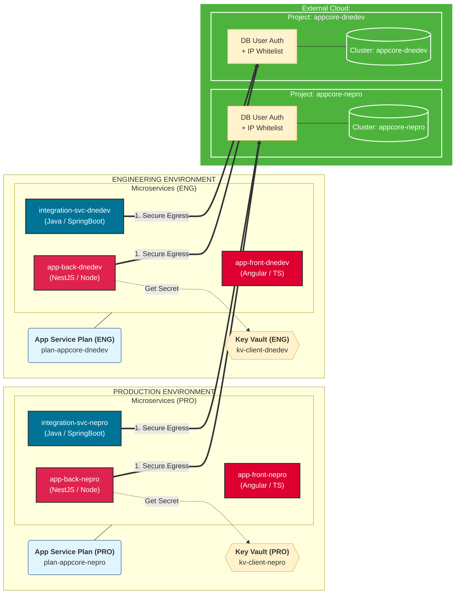
```mermaid
graph LR
    %% Class Definitions
    classDef angular fill:#dd0031,stroke:#333,stroke-width:2px,color:#fff
    classDef nest fill:#e0234e,stroke:#333,stroke-width:2px,color:#fff
    classDef java fill:#007396,stroke:#333,stroke-width:2px,color:#fff
    classDef plan fill:#e1f5fe,stroke:#1f4e79,stroke-width:1px
    classDef atlas fill:#4db33d,stroke:#fff,stroke-width:2px,color:#fff
    classDef security fill:#fff2cc,stroke:#d6b656,stroke-width:1px
    %% PRODUCTION ENVIRONMENT
    subgraph PRO_Tier ["PRODUCTION ENVIRONMENT"]
        direction TB
        PLAN_P("<b>App Service Plan (PRO)</b><br/>plan-appcore-nepro")
        subgraph PRO_Apps ["Microservices (PRO)"]
            SPA_P["app-front-nepro<br/>(Angular / TS)"]
            API_P["app-back-nepro<br/>(NestJS / Node)"]
            INTEG_P["integration-svc-nepro<br/>(Java / SpringBoot)"]
        end
        KV_P{{"<b>Key Vault (PRO)</b><br/>kv-client-nepro"}}
        PLAN_P --- PRO_Apps
        API_P -.->|"Get Secret"| KV_P
    end
    %% ENGINEERING ENVIRONMENT
    subgraph ENG_Tier ["ENGINEERING ENVIRONMENT"]
        direction TB
        PLAN_E("<b>App Service Plan (ENG)</b><br/>plan-appcore-dnedev")
        subgraph ENG_Apps ["Microservices (ENG)"]
            SPA_E["app-front-dnedev<br/>(Angular / TS)"]
            API_E["app-back-dnedev<br/>(NestJS / Node)"]
            INTEG_E["integration-svc-dnedev<br/>(Java / SpringBoot)"]
        end
        KV_E{{"<b>Key Vault (ENG)</b><br/>kv-client-dnedev"}}
        PLAN_E --- ENG_Apps
        API_E -.->|"Get Secret"| KV_E
    end
    %% EXTERNAL DATA - MONGODB ATLAS
    subgraph Atlas_Cloud ["External Cloud:<br/>MongoDB Atlas"]
        direction TB
        subgraph Proj_PRO ["Project: appcore-nepro"]
            C_PRO[("Cluster: appcore-nepro")]
            AUTH_P["DB User Auth<br/>+ IP Whitelist"]
        end
        subgraph Proj_ENG ["Project: appcore-dnedev"]
            C_ENG[("Cluster: appcore-dnedev")]
            AUTH_E["DB User Auth<br/>+ IP Whitelist"]
        end
        AUTH_P --- C_PRO
        AUTH_E --- C_ENG
    end
    %% Logical Connections (Securized)
    API_P ==>|"1. Secure Egress"| AUTH_P
    INTEG_P ==>|"1. Secure Egress"| AUTH_P
    API_E ==>|"1. Secure Egress"| AUTH_E
    INTEG_E ==>|"1. Secure Egress"| AUTH_E
    %% Assign Classes
    class SPA_P,SPA_E angular
    class API_P,API_E nest
    class INTEG_P,INTEG_E java
    class PLAN_P,PLAN_E plan
    class Atlas_Cloud,Proj_PRO,Proj_ENG,C_PRO,C_ENG atlas
    class KV_P,KV_E,AUTH_P,AUTH_E security
```

</details>

- **Strategic Overview (High-Level)**:
  The ecosystem is built on a **Polyglot Microservices** philosophy. By using specialized frameworks (**NestJS** for orchestration and **Java/SpringBoot** for core integration), we optimize developer productivity while maintaining a consistent **Angular** frontend. The architecture ensures that each service is horizontally scalable and independently deployable.

- **Technical Implementation & Security (Low-Level)**:
  - **Runtime & Isolation**: All applications are deployed as **Linux Docker Containers** on **Premium V3 App Service Plans** ([`18-app-service-back-api.tf`](./App-Core/terraform-manifests/modules/appcore_module/18-app-service-back-api.tf)). Segregation between **PRODUCTION** and **ENGINEERING** tiers is enforced at the Service Plan level to prevent resource contention.
  - **MongoDB Atlas Securization**:
    - **Isolation**: Each Azure environment is mapped to a dedicated **MongoDB Atlas Project** (e.g., `appcore-nepro`).
    - **Authentication**: Backends authenticate using database users with secrets stored and rotated in **Azure Key Vault** ([`23-key-vault-clients.tf`](./App-Core/terraform-manifests/modules/appcore_module/23-key-vault-clients.tf)).
    - **Network Security**: Connection is restricted via **IP Whitelisting** (IP Access List) in Atlas, allowing traffic only from the NAT Gateways or Public IPs of the corresponding Azure Spokes.
  - **Identity Propagation**: User identity is maintained via **MSAL** on the frontend and the **OAuth 2.0 OBO (On-Behalf-Of) Flow** on the backend to propagate the security context to downstream services.

### 8.4 AKS and Machine Learning Inference Ecosystem

This sub-architecture details the high-performance compute layer dedicated to **ML Model Inference** within the AKS cluster, including its strict network isolation and DevSecOps integrations.

<details>
<summary><b>Click to expand: AKS and Machine Learning Inference Ecosystem</b></summary>

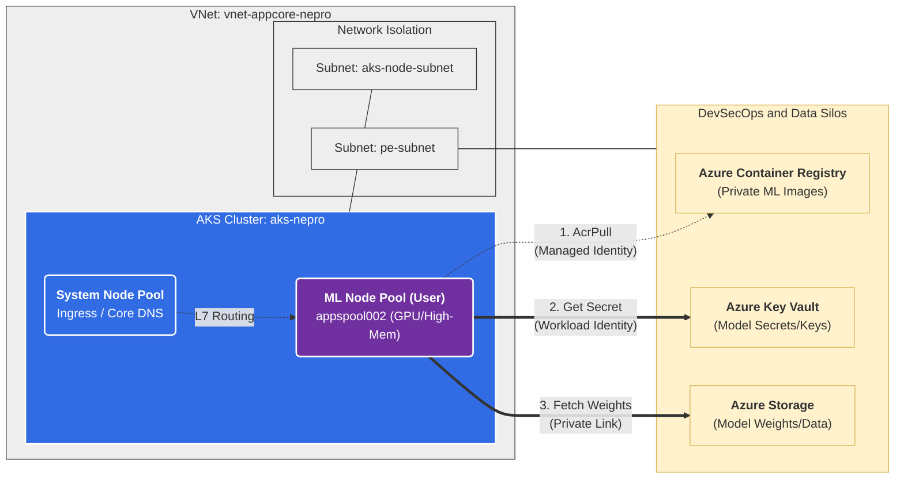
```mermaid
graph LR
    %% Class Definitions
    classDef k8s fill:#326ce5,stroke:#fff,stroke-width:2px,color:#fff
    classDef ai fill:#7030a0,stroke:#fff,stroke-width:2px,color:#fff
    classDef net fill:#eeeeee,stroke:#333,stroke-width:1px
    classDef security fill:#fff2cc,stroke:#d6b656,stroke-width:1px,color:#333
    subgraph VNet ["VNet: vnet-appcore-nepro"]
        direction LR
        subgraph AKS ["AKS Cluster: aks-nepro"]
            direction TB
            P_SYS("<b>System Node Pool</b><br/>Ingress / Core DNS")
            P_ML("<b>ML Node Pool (User)</b><br/>appspool002 (GPU/High-Mem)")
            P_SYS -.->|"L7 Routing"| P_ML
        end
        subgraph Subnets ["Network Isolation"]
            direction TB
            S_AKS["Subnet: aks-node-subnet"]
            S_PE["Subnet: pe-subnet"]
        end
    end
    subgraph Security ["DevSecOps and Data Silos"]
        direction TB
        ACR["<b>Azure Container Registry</b><br/>(Private ML Images)"]
        KV["<b>Azure Key Vault</b><br/>(Model Secrets/Keys)"]
        SA["<b>Azure Storage</b><br/>(Model Weights/Data)"]
    end
    %% Network mapping
    AKS --- S_AKS
    S_PE --- Security
    %% DevSecOps and Data Flows
    P_ML -.->|"1. AcrPull<br/>(Managed Identity)"| ACR
    P_ML ==>|"2. Get Secret<br/>(Workload Identity)"| KV
    P_ML ==>|"3. Fetch Weights<br/>(Private Link)"| SA
    class AKS,P_SYS k8s
    class P_ML ai
    class VNet,Subnets,S_AKS,S_PE net
    class Security,ACR,KV,SA security
```

</details>

- **Strategic Overview (High-Level)**:
  By segregating ML inference workloads into dedicated, purpose-built node pools (High-Memory or GPU-enabled), we ensure that resource-intensive AI models do not cause compute contention for core business APIs. The architecture enforces a strict **Zero-Trust** boundary: models are pulled from private registries, secrets are fetched dynamically via identity, and datasets are accessed exclusively through the Azure network backbone.

- **Technical Implementation & Security (Low-Level)**:
  - **Dedicated Node Pools (Compute Isolation)**: The ML pool (`appspool002`) is configured as a `User` mode pool utilizing powerful VMs (e.g., `Standard_E8as_v4` or N-Series GPU instances) with `enable_auto_scaling = true` (Min: 0, Max: 6). It is labeled with `"app" = "mljobs"` to ensure precise pod scheduling ([`08-aks-cluster-nodepool-002-enterprise-ml-jobs.tf`](./AKS/terraform-manifests/modules/sharedinfra_aks_module/08-aks-cluster-nodepool-002-enterprise-ml-jobs.tf)).
  - **Network Fabric**: The nodes and pods are injected directly into dedicated subnets (`vnet_subnet_id = azurerm_subnet.aks_nodes_data_plane.id` and `pod_subnet_id = azurerm_subnet.aks_pods_data_plane.id`), ensuring all egress traffic is subject to the UDR forcing it through the Azure Firewall Premium.
  - **DevSecOps Integration (Registry)**: The AKS cluster's Kubelet Managed Identity is programmatically granted the `AcrPull` RBAC role over the private Azure Container Registry (`acr-{env}`). This eliminates the need to manage Kubernetes ImagePullSecrets manually ([`14-rbac.tf`](./AKS/terraform-manifests/modules/sharedinfra_aks_module/14-rbac.tf)).
  - **Secure Data & Secrets (Private Link)**: When an ML pod spins up, it uses **Workload Identity** to securely authenticate against Azure Key Vault to retrieve decryption keys or external API tokens. It then fetches multi-gigabyte model weights from Azure Blob Storage via a **Private Endpoint**, guaranteeing that sensitive AI assets are never exposed to the public internet.

### 8.5 Scaling Intelligence: Autoscale and Elasticity

This architecture implements a **Four-Tier Scaling Model** to handle massive enterprise throughput while optimizing cost during idle periods.

- **Strategic Overview (High-Level)**:
  This architecture implements a **Multi-Layer Scaling Strategy** designed to handle unpredictable enterprise workloads. By combining automatic cluster expansion with fine-grained pod-level scaling, we ensure high availability during traffic spikes and extreme cost-efficiency during idle hours (GreenOps).

- **Technical Implementation (Low-Level - Reverse Engineering):**

#### 8.5.1 Cluster Autoscaler (CA) - The Compute Backbone
The AKS cluster is configured to automatically adjust the number of nodes in the system node pool based on resource requests.
- **Master Switch**: `enable_auto_scaling = true` in [`06-aks-cluster.tf`](./AKS/terraform-manifests/modules/sharedinfra_aks_module/06-aks-cluster.tf).
- **Profile Tuning**:
  - `expander = "most-pods"`: Logic that prioritizes nodes capable of scheduling the largest number of pending pods.
  - `scale_down_utilization_threshold = 0.5`: Triggers node removal when the average load drops below 50%, optimized for cost.

#### 8.5.2 Workload Scaling (HPA and VPA)
- **Horizontal Pod Autoscaler (HPA)**: Enforced via Helm values for core components like Nginx Ingress.
  - **Logic**: `targetCPUUtilizationPercentage = 50`, ensuring that new replicas are spawned before the existing ones reach exhaustion.
- **Vertical Pod Autoscaler (VPA)**: Utilized in the [`kube-prometheus-stack`](./Day2-ops/terraform-manifests/helm/kube-prometheus-stack/values.yaml) to automatically size monitoring pods based on historical metrics.

#### 8.5.3 App Service Elasticity
App Service Plans are configured with metric-based autoscale rules.
- **Evidence**: [`16-app-service-plan.tf`](./App-Core/terraform-manifests/modules/appcore_module/16-app-service-plan.tf).
- **Rules**: Scale-out triggered by **CPU > 70%** or **RAM > 80%**, maintaining a minimum of 2 instances in PRO for high availability.

#### 8.5.4 Scaling Strategy Comparison Matrix
| Tier | Component | Method | Metric | Source of Truth |
| :--- | :--- | :--- | :--- | :--- |
| **Compute (Nodes)** | AKS | **Autoscaler (CA)** | Pending Pods | [`06-aks-cluster.tf`](./AKS/terraform-manifests/modules/sharedinfra_aks_module/06-aks-cluster.tf) |
| **Compute (Pods)** | AKS | **HPA / VPA** | CPU / RAM / Metrics | [`Day2-ops/helm/`](./Day2-ops/terraform-manifests/helm/) |
| **PaaS (Web)** | App Service | **Scale-Out** | CPU > 70% | [`16-app-service-plan.tf`](./App-Core/terraform-manifests/modules/appcore_module/16-app-service-plan.tf) |
| **Edge (WAF)** | App Gateway | **Autoscale Units** | Throughput | [`21-app-gateway.tf`](./App-Core/terraform-manifests/modules/appcore_module/21-app-gateway.tf) |

### 8.6 Global CI/CD Pipeline Orchestration: The IaC Lifecycle

The repository acts as the **Central Control Plane** for the entire enterprise cloud estate. Infrastructure is deployed through a multi-tiered pipeline strategy that ensures architectural consistency, security compliance, and zero-drift environments.

- **High-Level Intent**: Automate the full lifecycle of the Hub-Spoke ecosystem, from foundational networking to application-level microservices, using a "Plan-First, Verify-Always" approach.

#### 8.6.1 Pipeline Architecture and Dependency Flow

Infrastructure must be provisioned in a specific order to satisfy network and identity dependencies. The following diagram illustrates the **Sequential Provisioning Logic**:

<details>
<summary><b>Click to expand: Pipeline Architecture and Dependency Flow</b></summary>

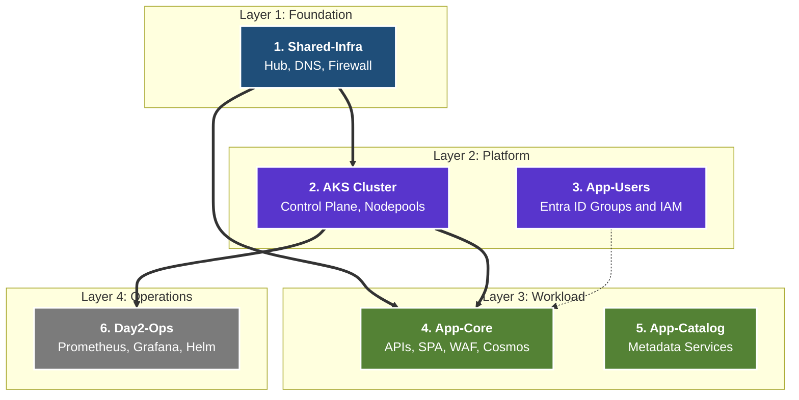
```mermaid
graph TD
    %% Class Definitions
    classDef foundation fill:#1f4e79,stroke:#fff,stroke-width:2px,color:#fff
    classDef platform fill:#5835CC,stroke:#fff,stroke-width:2px,color:#fff
    classDef workload fill:#548235,stroke:#fff,stroke-width:2px,color:#fff
    classDef ops fill:#7b7b7b,stroke:#fff,stroke-width:2px,color:#fff
    subgraph Tier1 [Layer 1: Foundation]
        P1["<b>1. Shared-Infra</b><br/>Hub, DNS, Firewall"]
    end
    subgraph Tier2 [Layer 2: Platform]
        P2["<b>2. AKS Cluster</b><br/>Control Plane, Nodepools"]
        P3["<b>3. App-Users</b><br/>Entra ID Groups and IAM"]
    end
    subgraph Tier3 [Layer 3: Workload]
        P4["<b>4. App-Core</b><br/>APIs, SPA, WAF, Cosmos"]
        P5["<b>5. App-Catalog</b><br/>Metadata Services"]
    end
    subgraph Tier4 [Layer 4: Operations]
        P6["<b>6. Day2-Ops</b><br/>Prometheus, Grafana, Helm"]
    end
    P1 ==> P2
    P1 ==> P4
    P2 ==> P4
    P2 ==> P6
    P3 -.-> P4
    class P1 foundation
    class P2,P3 platform
    class P4,P5 workload
    class P6 ops
```

</details>

#### 8.6.2 Pipeline Inventory and Matrix (IaC Lifecycle Order)

| Order | Pipeline Name | Responsibility | Orchestrator YAML (Source of Truth) |
| :--- | :--- | :--- | :--- |
| **1** | **Shared-Infra** | Foundational Hub-Spoke networking, Private DNS Zones, and Azure Firewall Premium. | [`Shared-Infra/01-terraform-provision-sharedinfra-pipeline.yml`](./Shared-Infra/01-terraform-provision-sharedinfra-pipeline.yml) |
| **2** | **AKS** | Managed Kubernetes Clusters (ENG/PRO), system/user node pools, and OIDC issuer setup. | [`AKS/01-terraform-provision-AKS-pipeline.yml`](./AKS/01-terraform-provision-AKS-pipeline.yml) |
| **3** | **App-Users** | Lifecycle management of Entra ID (Azure AD) users, security groups, and administrative roles. | [`App-Users/01-terraform-provision-appcore-users-pipeline.yaml`](./App-Users/01-terraform-provision-appcore-users-pipeline.yaml) |
| **4** | **App-Core** | Core Business Microservices (Angular/NestJS), Application Gateways (WAF v2), and Persistence. | [`App-Core/01-terraform-provision-appcore-pipeline.yml`](./App-Core/01-terraform-provision-appcore-pipeline.yml) |
| **5** | **App-Catalog** | Dynamic catalog services and metadata management for client analysis. | [`App-Catalog/01-terraform-provision-catalog3-pipeline.yml`](./App-Catalog/01-terraform-provision-catalog3-pipeline.yml) |
| **6** | **Day2-Ops** | Post-deployment orchestration: Helm-based monitoring stacks, Ingress controllers, and Dashboards. | [`Day2-ops/01-terraform-provision-day2ops-pipeline.yml`](./Day2-ops/01-terraform-provision-day2ops-pipeline.yml) |

#### 8.6.3 The "Immutable Deployment" Execution Flow

Every pipeline follows a strict **four-stage gate** to ensure that production is never compromised by unverified changes.

<details>
<summary><b>Click to expand: Immutable Deployment Execution Flow</b></summary>

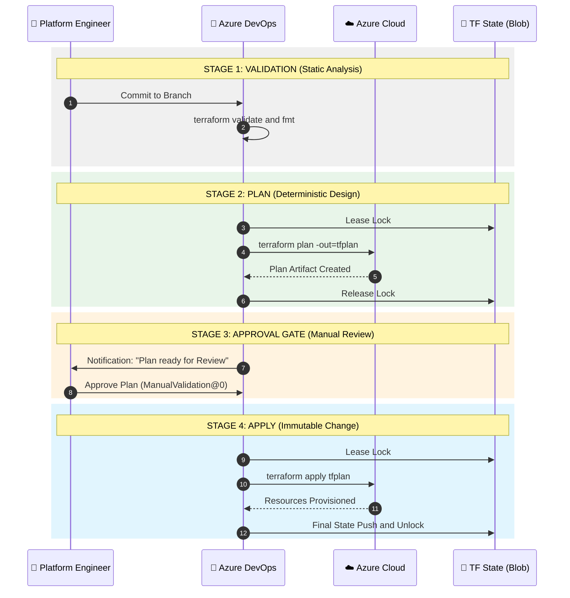
```mermaid
sequenceDiagram
    autonumber
    participant Eng as 👤 Platform Engineer
    participant ADO as 🚀 Azure DevOps
    participant Azure as ☁️ Azure Cloud
    participant State as 💾 TF State (Blob)
    rect rgb(240, 240, 240)
        Note over Eng, State: STAGE 1: VALIDATION (Static Analysis)
        Eng->>ADO: Commit to Branch
        ADO->>ADO: terraform validate and fmt
    end
    rect rgb(232, 245, 233)
        Note over Eng, State: STAGE 2: PLAN (Deterministic Design)
        ADO->>State: Lease Lock
        ADO->>Azure: terraform plan -out=tfplan
        Azure-->>ADO: Plan Artifact Created
        ADO->>State: Release Lock
    end
    rect rgb(255, 243, 224)
        Note over Eng, State: STAGE 3: APPROVAL GATE (Manual Review)
        ADO->>Eng: Notification: "Plan ready for Review"
        Eng->>ADO: Approve Plan (ManualValidation@0)
    end
    rect rgb(225, 245, 254)
        Note over Eng, State: STAGE 4: APPLY (Immutable Change)
        ADO->>State: Lease Lock
        ADO->>Azure: terraform apply tfplan
        Azure-->>ADO: Resources Provisioned
        ADO->>State: Final State Push and Unlock
    end
```

</details>

### 8.7 Secure Secret Management and Pipeline Integration

This architecture implements a **Zero-Secret Pipeline** model, where credentials are never stored in the repository, hardcoded in YAML, or persistent on build agents. Secrets are treated as ephemeral assets retrieved *Just-In-Time* (JIT).

#### 8.7.1 The "Zero-Secret" Trust Fabric

<details>
<summary><b>Click to expand: Zero-Secret Trust Fabric</b></summary>

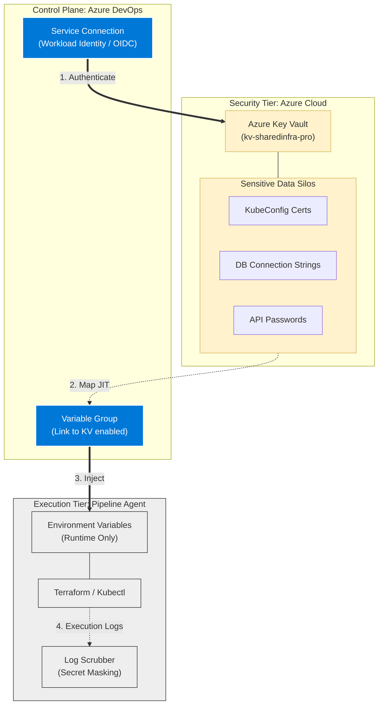
```mermaid
graph TB
    %% Class Definitions
    classDef vault fill:#f4b183,stroke:#333,stroke-width:2px,color:#333
    classDef ado fill:#0078d7,stroke:#fff,stroke-width:2px,color:#fff
    classDef agent fill:#eeeeee,stroke:#333,stroke-width:1px,color:#333
    classDef security fill:#fff2cc,stroke:#d6b656,stroke-width:1px,color:#333
    subgraph Security_Tier [Security Tier: Azure Cloud]
        direction TB
        KV["Azure Key Vault<br/>(kv-sharedinfra-pro)"]
        subgraph Secrets [Sensitive Data Silos]
            S1["KubeConfig Certs"]
            S2["DB Connection Strings"]
            S3["API Passwords"]
        end
    end
    subgraph Control_Plane [Control Plane: Azure DevOps]
        direction TB
        SC["Service Connection<br/>(Workload Identity / OIDC)"]
        VG["Variable Group<br/>(Link to KV enabled)"]
    end
    subgraph Build_Runtime [Execution Tier: Pipeline Agent]
        direction TB
        ENV["Environment Variables<br/>(Runtime Only)"]
        MASK["Log Scrubber<br/>(Secret Masking)"]
        TF["Terraform / Kubectl"]
    end
    %% Flow
    SC ==>|"1. Authenticate"| KV
    KV --- Secrets
    Secrets -.->|"2. Map JIT"| VG
    VG ==>|"3. Inject"| ENV
    ENV --- TF
    TF -.->|"4. Execution Logs"| MASK
    %% Assign Classes
    class KV,Secrets security
    class SC,VG ado
    class Build_Runtime,ENV,MASK,TF agent
```

</details>

#### 8.7.2 Secret Access and Governance Matrix

| Secret Category | Storage Location | Access Protocol | Source of Truth |
| :--- | :--- | :--- | :--- |
| **Pipeline Secrets** | `kv-sharedinfra-pro` | Workload Identity (OIDC) | [`Shared-Infra/01-pipeline.yml`](./Shared-Infra/01-terraform-provision-sharedinfra-pipeline.yml) |
| **Application Secrets** | `kv-{client}-{env}` | On-Behalf-Of (OBO) Flow | [`23-key-vault-clients.tf`](./App-Core/terraform-manifests/modules/appcore_module/23-key-vault-clients.tf) |
| **K8s Credentials** | `kv-sharedinfra-pro` | Azure AD RBAC | [`06-aks-cluster.tf`](./AKS/terraform-manifests/modules/sharedinfra_aks_module/06-aks-cluster.tf) |

#### 8.7.3 AKS "Triad" Certificate Provisioning and Day2 Lifecycle

A critical security bridge in this architecture is the manual/automated transition from **AKS Provisioning** to **AKS Configuration (Day2 Ops)**. Because the CI/CD agent needs cluster-admin rights to deploy Helm charts, we use a **Triple Certificate Auth** pattern.

1.  **Extraction**: Upon AKS creation, the `client-cert`, `client-key`, and `ca-cert` are extracted from the kubeconfig.
2.  **Vaulting**: These are stored as individual secrets in the Shared-Infra Key Vault.
3.  **Consumption**: Pipelines for [**Day2-ops**](./Day2-ops) and [**App-Catalog**](./App-Catalog) retrieve these JIT to authenticate the Helm and Kubernetes providers.

### 8.8 Automated Secret and Certificate Rotation

- **High-Level Strategic Intent**: Eliminate "Static Credential Risk" by ensuring that no password or certificate lives long enough to be effectively exploited.

#### 8.8.1 Secret Rotation Inventory Matrix

| Secret Type | Rotation Mechanism | Frequency | Evidence |
| :--- | :--- | :--- | :--- |
| **AAD App Passwords** | Terraform `time_rotating` | **7 Days** | [`14-app-register-secrets.tf`](./App-Core/terraform-manifests/modules/appcore_module/14-app-register-secrets.tf) |
| **TLS/SSL Certs** | KV Versionless Reference | Automatic | [`28-rbac-azurerm-clients.tf`](./App-Core/terraform-manifests/modules/appcore_module/28-rbac-azurerm-clients.tf) |
| **Service Tokens** | OAuth 2.0 Short-Lived JWT | **1 Hour** | [`App-Core/03-locals.tf`](./App-Core/terraform-manifests/modules/appcore_module/03-locals.tf) |

### 8.9 Backup, DR and Business Continuity Plan (BCP)

#### 8.9.1 Multi-Region Data Resiliency: Atlas vs. Cosmos DB (POC)

To ensure business continuity across geographical boundaries, the persistence layer utilizes a multi-cloud and multi-region replication strategy.

<details>
<summary><b>Click to expand: Multi-Region Data Resiliency: Atlas vs. Cosmos DB (POC)</b></summary>

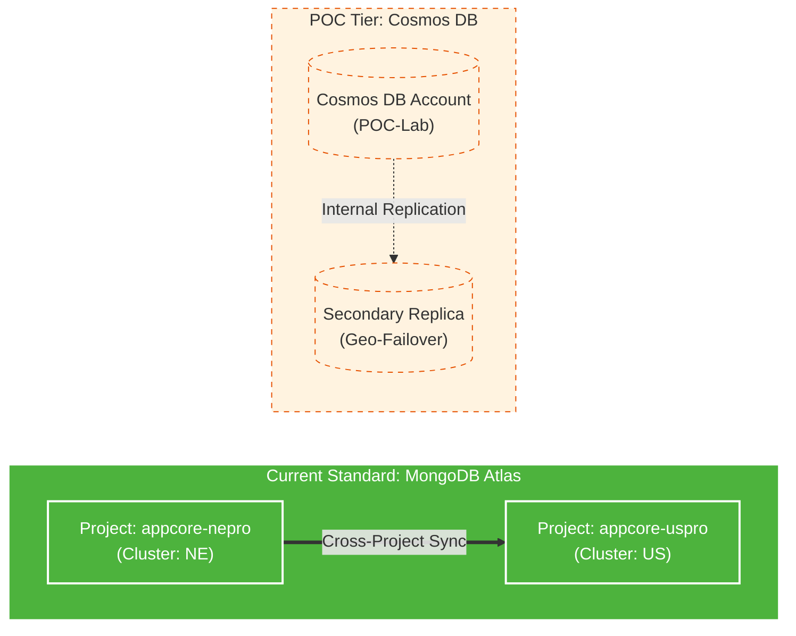
```mermaid
graph LR
    %% Class Definitions
    classDef primary fill:#e8f5e9,stroke:#1b5e20,stroke-width:2px,color:#333
    classDef poc fill:#fff3e0,stroke:#e65100,stroke-width:1px,color:#333,stroke-dasharray: 5 5
    classDef atlas fill:#4db33d,stroke:#fff,stroke-width:2px,color:#fff
    subgraph Atlas_Global ["Current Standard: MongoDB Atlas"]
        direction LR
        P_EU["Project: appcore-nepro<br/>(Cluster: NE)"]
        P_US["Project: appcore-uspro<br/>(Cluster: US)"]
        P_EU == "Cross-Project Sync" ==> P_US
    end
    subgraph Azure_POC ["POC Tier: Cosmos DB"]
        direction TB
        C_DB[("Cosmos DB Account<br/>(POC-Lab)")]
        C_REP[("Secondary Replica<br/>(Geo-Failover)")]
        C_DB -. "Internal Replication" .-> C_REP
    end
    class P_EU,P_US,Atlas_Global atlas
    class Azure_POC,C_DB,C_REP poc
```

</details>

### 8.10 Business Continuity Implementation Details
The architecture enforces data survival through automated vaulting and regional redundancy.
- **Persistence Backup**: Managed via **Azure Recovery Services Vault** ([`10-backup-policy.tf`](./App-Core/terraform-manifests/modules/appcore_module/10-file-share-clients-backup-policy.tf)), providing daily snapshots for client data shares.
- **Failover Sovereignty**: Cosmos DB (POC) and MongoDB Atlas are configured with multi-region write/read capabilities and **Automatic Failover** enabled.

## 9. Terraform Module Architecture: Domain-Driven Composition

### 9.1 Categorization: Why "Composite" over "Atomic"?

| Feature | Composite Architecture (This Repo) | Atomic Architecture (AVM) |
| :--- | :--- | :--- |
| **Speed of Delivery** | 🚀 High (One module call = Full Tier) | 🐢 Medium (Requires 10-20 calls) |
| **Standardization** | ✅ Strict (Standards baked into logic) | ⚠️ Loose (Depends on caller inputs) |
| **Maintenance** | 🛠 Focused (Update domain logic once) | 🔄 Heavy (Update dozens of dependencies) |
| **Business Fit** | **Agile Mid/Large Multinational** | **Fragmented Giant Enterprise** |

### 9.2 Master Ecosystem Inventory and Deployment Order

The following table serves as the **Source of Truth** for the entire ecosystem, mapping logical tiers to physical folders and defining their primary responsibilities and mandatory deployment sequence.

| Tier | Azure DevOps Repo | Mono-Repo Folder (Physical) | Logical Role & Primary Responsibility |
| :---: | :--- | :--- | :--- |
| **1** | `Shared-Infra` | [`/Shared-Infra`](./Shared-Infra/terraform-manifests/modules/) | **Foundation Backbone**: Private DNS Hub, Global Security (Defender) & Hub Log Analytics. |
| **1.5** | `App-Users` | [`/App-Users`](./App-Users/terraform-manifests/) | **Identity Governance**: Entra ID Users, Groups, Conditional Access & YAML-driven RBAC. |
| **2** | `AKS` | [`/AKS`](./AKS/terraform-manifests/modules/) | **Platform Hub**: Hardened AKS Clusters, ACR (Registry), VNets & Specialized Nodepools (ML/Spot). |
| **3** | `App-Catalog` | [`/App-Catalog`](./App-Catalog/terraform-manifests/modules/) | **Service Registry**: Metadata Catalog, PDF Renderers & MongoDB Atlas (Catalog). |
| **3** | `App-Core (POC)`| [`/App-Core/poc-cosmosdb-mongo`](./App-Core/poc-cosmosdb-mongo/) | **Next-Gen Data**: Cosmos DB for MongoDB API & Private Link (Network-Sovereign). |
| **3** | `App-Core` | [`/App-Core`](./App-Core/terraform-manifests/modules/) | **Business Workload**: WAF Traffic (AppGW), Backend APIs, Portal SPAs & MongoDB Atlas (Business). |
| **4** | `Day2-ops` | [`/Day2-ops`](./Day2-ops/terraform-manifests/modules/) | **Observability & Ingress**: Prometheus, Grafana, Kubecost, Nginx Ingress & K8s Dashboards. |
| **4** | `Integration-Service` | [`/Integration-Service`](./Integration-Service/) | **Hybrid Connectivity**: AppLink Signaling, mTLS Tunnels and Legacy On-Premise Links. |

### 9.3 Architectural Dependency Chain (Logical Hierarchy)

Although this repository uses isolated Terraform states for safety (Blast Radius control), it follows a strict **3-Tier Logical Hierarchy** derived from the inventory above. Each tier provides the "hook points" required by the next layer.

#### 9.3.1 Dependency Visualization

<details>
<summary><b>Click to expand: Dependency Visualization</b></summary>

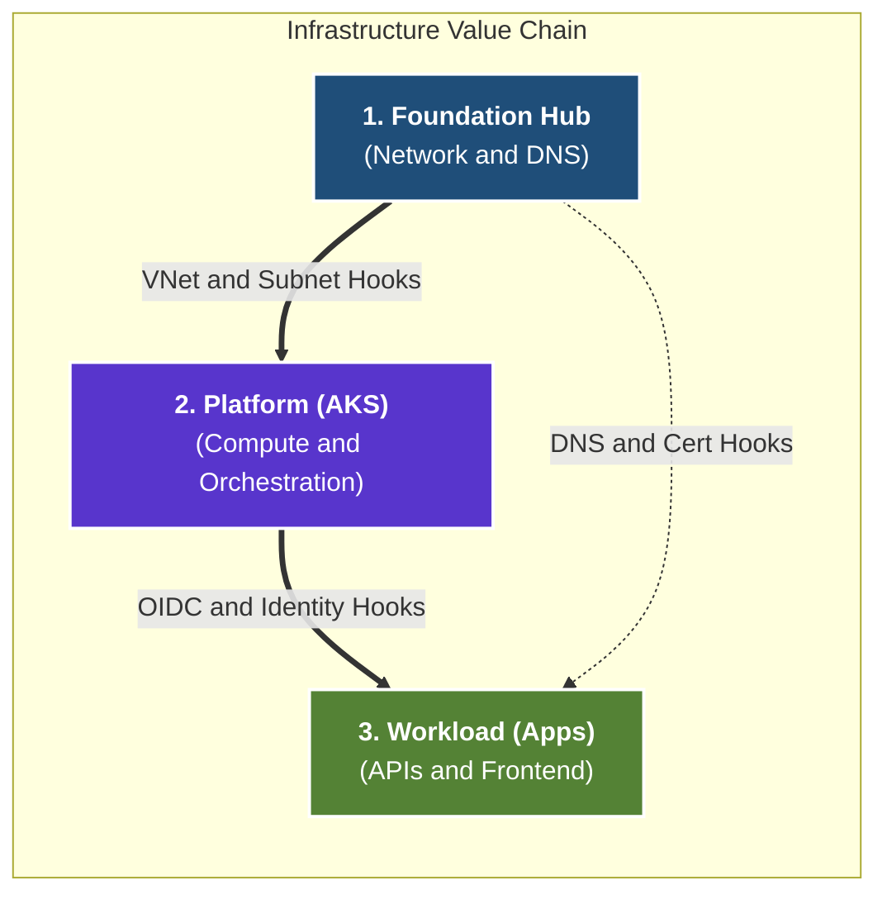
```mermaid
graph TD
    classDef foundation fill:#1f4e79,stroke:#fff,stroke-width:2px,color:#fff
    classDef platform fill:#5835CC,stroke:#fff,stroke-width:2px,color:#fff
    classDef workload fill:#548235,stroke:#fff,stroke-width:2px,color:#fff
    classDef link fill:#f9f9f9,stroke:#333,stroke-width:1px,stroke-dasharray: 5 5
    subgraph Hierarchy ["Infrastructure Value Chain"]
        direction TB
        M1["<b>1. Foundation Hub</b><br/>(Network and DNS)"]
        M2["<b>2. Platform (AKS)</b><br/>(Compute and Orchestration)"]
        M3["<b>3. Workload (Apps)</b><br/>(APIs and Frontend)"]
        M1 ==>|"VNet and Subnet Hooks"| M2
        M2 ==>|"OIDC and Identity Hooks"| M3
        M1 -.->|"DNS and Cert Hooks"| M3
    end
    class M1 foundation
    class M2 platform
    class M3 workload
```

</details>

##### **Why this hierarchy?**
This "Stacking" approach allows for **Partial Lifecycle Management**. For example, you can perform maintenance on the `App-Core` layer (Tier 3) without risk of locking or impacting the `Shared-Infra` (Tier 1) backbone, ensuring maximum availability.

---


### 9.4 Internal Execution Flow (High-Fidelity Diagram)

Every major module in this repository follows a deterministic **5-Stage Execution Lifecycle**. This pattern ensures that logic is separated from provisioning, and that security is wired into the resource at the moment of creation.

#### 9.4.1 The 5-Stage Lifecycle Breakdown

1.  **Input Transformation (The Logic Engine)**: 
    Raw variables are ingested and transformed using `locals.tf`. This is where complex logic (like the `"d"` prefix for branches) is calculated before any resource is touched.
    *   **Evidence**: [`03-locals.tf`](./App-Core/terraform-manifests/modules/appcore_module/03-locals.tf).

2.  **Identity Generation (The Trust Anchor)**: 
    User-Assigned Managed Identities (MSI) and Entra ID (AAD) Applications are created. These serve as the "security context" for the subsequent resources.
    *   **Evidence**: [`11-app-register-front-spa.tf`](./App-Core/terraform-manifests/modules/appcore_module/11-app-register-front-spa.tf).

3.  **Networking Fabric (The Perimeter)**: 
    VNet integrations, subnets, and Private Endpoints are wired. No compute resource is deployed until its networking boundaries are defined.
    *   **Evidence**: [`05-vnet.tf`](./App-Core/terraform-manifests/modules/appcore_module/05-vnet.tf).

4.  **Resource Provisioning (The Core)**: 
    The primary resources (App Services, AKS Clusters, Databases) are instantiated, referencing the identities and networking defined in the previous stages.
    *   **Evidence**: [`18-app-service-back-api.tf`](./App-Core/terraform-manifests/modules/appcore_module/18-app-service-back-api.tf).

5.  **Access & RBAC Wiring (The Final Lock)**: 
    Role assignments and Key Vault access policies are applied to grant the newly created resources the minimum necessary permissions to operate.
    *   **Evidence**: [`27-rbac-azurerm.tf`](./App-Core/terraform-manifests/modules/appcore_module/27-rbac-azurerm.tf).

##### **Technical Lifecycle Visualization:**

<details>
<summary><b>Click to expand: Technical Lifecycle Visualization</b></summary>

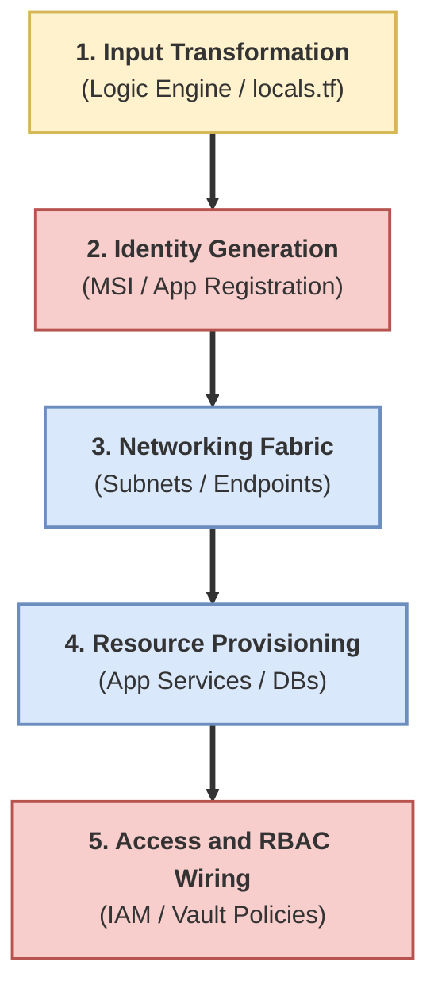
```mermaid
graph TD
    classDef logic fill:#fff2cc,stroke:#d6b656,stroke-width:2px,color:#333
    classDef security fill:#f8cecc,stroke:#b85450,stroke-width:2px,color:#333
    classDef infra fill:#dae8fc,stroke:#6c8ebf,stroke-width:2px,color:#333
    L1["<b>1. Input Transformation</b><br/>(Logic Engine / locals.tf)"]
    L2["<b>2. Identity Generation</b><br/>(MSI / App Registration)"]
    L3["<b>3. Networking Fabric</b><br/>(Subnets / Endpoints)"]
    L4["<b>4. Resource Provisioning</b><br/>(App Services / DBs)"]
    L5["<b>5. Access and RBAC Wiring</b><br/>(IAM / Vault Policies)"]
    L1 ==> L2
    L2 ==> L3
    L3 ==> L4
    L4 ==> L5
    class L1 logic
    class L2,L5 security
    class L3,L4 infra
```

</details>

---


### 9.5 Referential Attribute Linking

In this repository, we strictly avoid hardcoding resource IDs or names. Instead, we utilize **Referential Attribute Linking**—the practice of passing the output attribute of one resource directly as the input of another.

This principle is what we call **IaC Sovereignty**: the HCL code is the single source of truth that defines its own relationships, making the infrastructure self-contained and portable.

##### **Why it matters:**
1.  **Implicit Dependency Graph**: Terraform automatically calculates the execution order. It knows it must create the `Subnet` before the `App Service` because the latter requires the `subnet_id` attribute.
2.  **State Integrity**: By referencing attributes (like `.id` or `.name`), we ensure that if a resource name changes or is recreated, all dependent resources are updated automatically without manual intervention.
3.  **No "Data Source" Spaghetti**: Within the same module, we never use `data` blocks to lookup resources we just created. This reduces API calls and prevents "Chicken and Egg" deployment errors.

##### **Comparative Visualization (Bad vs Good Practice):**

<details>
<summary><b>Click to expand: Comparative Visualization (Bad vs Good Practice)</b></summary>

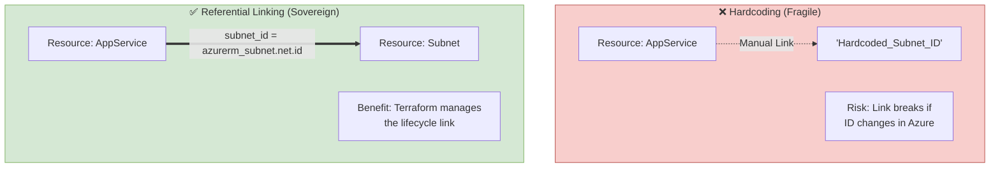
```mermaid
graph TD
    subgraph Bad_Practice ["❌ Hardcoding (Fragile)"]
        H1["Resource: AppService"]
        H2["'Hardcoded_Subnet_ID'"]
        H1 -.->|Manual Link| H2
        note1["Risk: Link breaks if<br/>ID changes in Azure"]
    end
    subgraph Good_Practice ["✅ Referential Linking (Sovereign)"]
        R1["Resource: Subnet"]
        R2["Resource: AppService"]
        R2 ==>|"subnet_id = azurerm_subnet.net.id"| R1
        note2["Benefit: Terraform manages<br/>the lifecycle link"]
    end
    classDef bad fill:#f8cecc,stroke:#b85450,color:#333
    classDef good fill:#d5e8d4,stroke:#82b366,color:#333
    class Bad_Practice bad
    class Good_Practice good
```

</details>

### 9.6 Real-World Code Evidence
*   **App Service Plan Link**: In [`18-app-service-back-api.tf`](./App-Core/terraform-manifests/modules/appcore_module/18-app-service-back-api.tf), the `service_plan_id` is linked directly to the plan's attribute: `service_plan_id = azurerm_service_plan.appcore_service_plan.id`.
*   **WAF Policy Link**: In [`21-app-gateway.tf`](./App-Core/terraform-manifests/modules/appcore_module/21-app-gateway.tf), the Application Gateway references the WAF Policy ID and the Public IP ID dynamically.
*   **Identity Wiring**: Managed Identities and Role Assignments (RBAC) are wired using `.principal_id` and `.id` attributes in [`27-rbac-azurerm.tf`](./App-Core/terraform-manifests/modules/appcore_module/27-rbac-azurerm.tf).

##### **Validated References:**
*   **[Terraform: Resource Attributes](https://developer.hashicorp.com/terraform/language/resources/syntax#resource-attributes)**
*   **[Terraform: Implicit Dependencies](https://developer.hashicorp.com/terraform/language/resources/behavior#dependencies)**
*   **[Azure: App Service VNet Integration Logic](https://learn.microsoft.com/en-us/azure/app-service/overview-vnet-integration)**

### 9.7 Orchestration Strategy

The repository transitions from an **External Orchestration** model (Legacy) to a **Native HCL Orchestration** model (2026 Standard).

##### **A. Current Implementation (Pipeline-Driven)**
Dependencies are managed externally via Azure DevOps. Each layer is isolated, requiring sequential execution and remote data lookups.

<details>
<summary><b>Click to expand: Current Implementation (Pipeline-Driven)</b></summary>

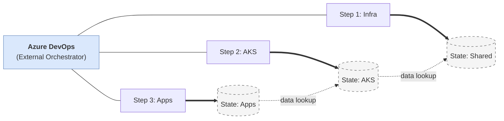
```mermaid
graph LR
    classDef ados fill:#dae8fc,stroke:#6c8ebf,stroke-width:1px
    classDef state fill:#f5f5f5,stroke:#666,stroke-width:1px,stroke-dasharray: 5 5
    ADO["<b>Azure DevOps</b><br/>(External Orchestrator)"]
    S1[("State: Shared")]
    S2[("State: AKS")]
    S3[("State: Apps")]
    ADO --- P1["Step 1: Infra"]
    ADO --- P2["Step 2: AKS"]
    ADO --- P3["Step 3: Apps"]
    P1 ==> S1
    P2 ==> S2
    P3 ==> S3
    S2 -.->|data lookup| S1
    S3 -.->|data lookup| S2
    class ADO ados
    class S1,S2,S3 state
```

</details>

##### **B. Future Vision (Native Terraform Stacks)**
Dependencies are natively understood by Terraform. A single logic object orchestrates all components with automatic parallelization and unified planning.

<details>
<summary><b>Click to expand: Future Vision (Native Terraform Stacks)</b></summary>

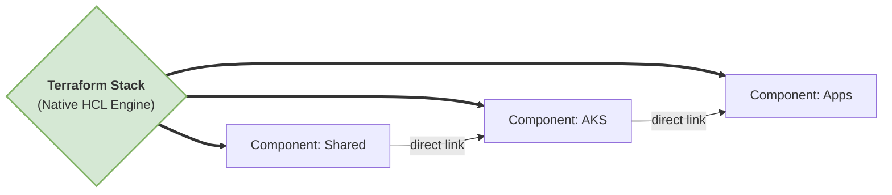
```mermaid
graph LR
    classDef stack fill:#d5e8d4,stroke:#82b366,stroke-width:2px
    TS{"<b>Terraform Stack</b><br/>(Native HCL Engine)"}
    C1[Component: Shared]
    C2[Component: AKS]
    C3[Component: Apps]
    TS ==> C1
    TS ==> C2
    TS ==> C3
    C1 -- "direct link" --> C2
    C2 -- "direct link" --> C3
    class TS stack
```

</details>

For a deep-dive technical analysis of this shift, refer to:
👉 **[Doc 01: Enterprise Architecture Strategy 2026 - Section 5](./docs/111-ARCHITECTURE_2026.md#5-deep-dive-terraform-stacks-2026-vs-pipeline-orchestration)**

### 9.8 Advanced Architectural Patterns

#### 9.8.1 Data Transformation: YAML-Driven IaC
The platform goes beyond simple variable inputs by utilizing **YAML-Driven Orchestration** for complex identity management.
- **The Logic**: Instead of defining each user manually, the `App-Users` module ingests structured YAML files.
- **Reverse Engineering Evidence**: In [`App-Users/06-locals.tf`](./App-Users/terraform-manifests/06-locals.tf), we utilize nested `flatten()` functions to parse multi-layered user objects.
- **Strategic Benefit**: This allows the "Business" (e.g., HR or Security departments) to manage user access via simple YAML commits without touching core Terraform logic.

#### 9.8.2 Advanced RBAC Matrixing and Granular Control
The repository implements a **Decoupled Identity Mapping** strategy to manage permissions at scale.
- **Implicit Standardization**: Role assignments are derived from the **Logical Tiers**. For example, the Kubelet identity of the AKS cluster is programmatically granted `AcrPull` on the registry without human intervention.
- **Evidence**: [`14-rbac.tf`](./AKS/terraform-manifests/modules/sharedinfra_aks_module/14-rbac.tf).
  ```hcl
  resource "azurerm_role_assignment" "aks_acr_pull" {
    principal_id                     = azurerm_kubernetes_cluster.aks.kubelet_identity[0].object_id
    role_definition_name             = "AcrPull"
    scope                            = azurerm_container_registry.acr.id
  }
  ```
- **Impact**: This "Self-Healing Identity" pattern ensures that every new cluster is automatically wired to its registry, fulfilling the Zero-Trust requirement of **Automatic Least Privilege**.

#### 9.8.3 Collection-Driven Scaling Logic
The repository utilizes advanced HCL patterns to handle enterprise-scale workloads.
- **Dynamic Orchestration**: Every backend pool, listener, and rule in the Application Gateway is generated via **Dynamic Blocks** iterating over client collections.
- **Evidence**: [`21-app-gateway.tf`](./App-Core/terraform-manifests/modules/appcore_module/21-app-gateway.tf).

### 9.9 Repository Engineering Metrics and Analytics

| Domain / Stack | Terraform Resources | YAML Pipelines | Total Files |
| :--- | :---: | :---: | :---: |
| **`App-Core`** | 133 | 23 | 126 |
| **`App-Catalog`** | 43 | 13 | 61 |
| **`AKS Hub`** | 27 | 20 | 49 |
| **`Shared-Infra`** | 22 | 19 | 57 |
| **`Day2 Ops`** | 26 | 43 | 78 |
| **`Integration`** | 0 | 37 | 106 |
| **`Identity (Users)`** | 8 | 15 | 38 |
| **`TOTAL`** | **259** | **170** | **515** |

#### 9.9.1 Visual Distribution Analysis
| 1. Terraform Resources | 2. YAML Pipelines | 3. Total Files |
| :---: | :---: | :---: |
| See Chart Below | See Chart Below | See Chart Below |

##### . Terraform Resources
<details>
<summary><b>Click to expand: Resource Distribution Analysis</b></summary>

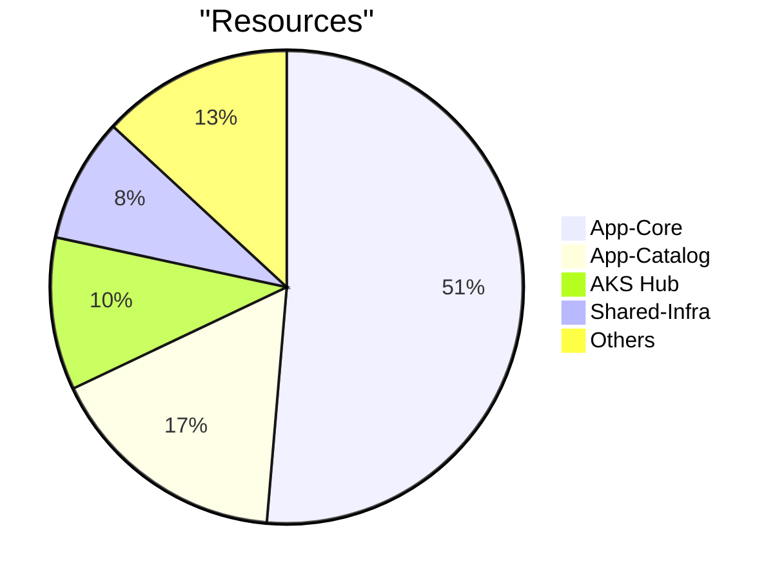
```mermaid
pie title "Resources"
    "App-Core" : 133
    "App-Catalog" : 43
    "AKS Hub" : 27
    "Shared-Infra" : 22
    "Others" : 34
```

</details>

##### . YAML Pipelines
<details>
<summary><b>Click to expand: Pipeline Distribution Analysis</b></summary>

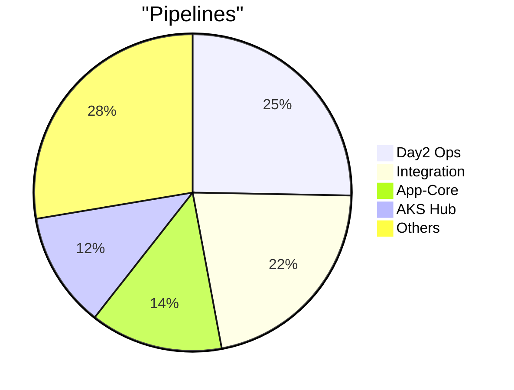
```mermaid
pie title "Pipelines"
    "Day2 Ops" : 43
    "Integration" : 37
    "App-Core" : 23
    "AKS Hub" : 20
    "Others" : 47
```

</details>

##### . Total Files
<details>
<summary><b>Click to expand: File Distribution Analysis</b></summary>

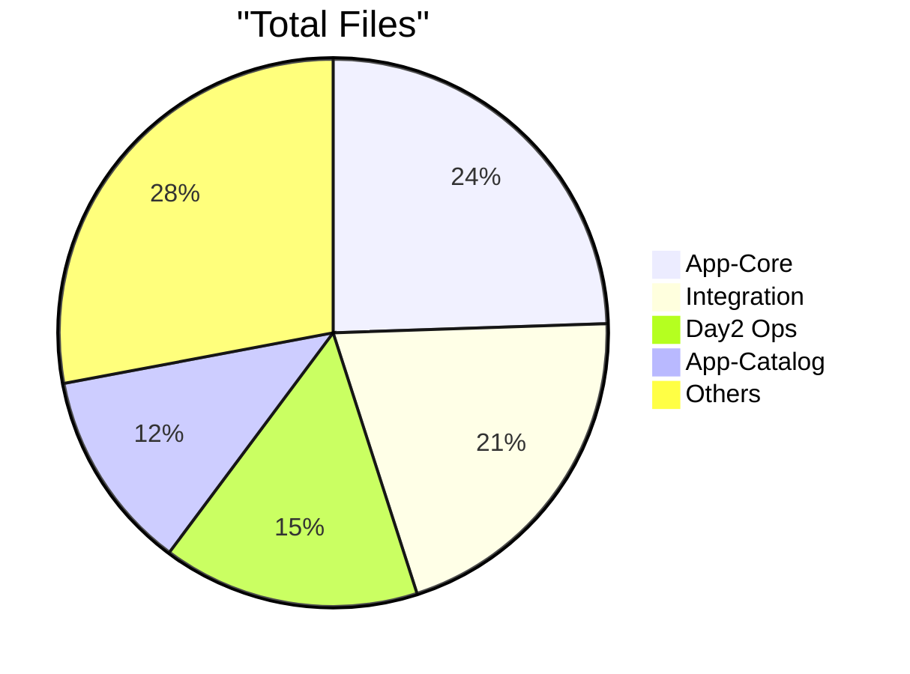
```mermaid
pie title "Total Files"
    "App-Core" : 126
    "Integration" : 106
    "Day2 Ops" : 78
    "App-Catalog" : 61
    "Others" : 144
```

</details>

## 10. Engineering Strategy: Federated Multi-Repo vs. Mono-Repo

This repository implements a **Hybrid Repository Strategy**. While presented as a **Mono-Repo** on GitHub, it was designed using a **Federated Multi-Repo** architecture.

### 10.1 The "Enterprise Stack" Pattern
In production, each tier defined in the **[Master Inventory (Section 8.2)](#82-master-ecosystem-inventory--deployment-order)** exists as a separate repository to ensure isolation.

<details>
<summary><b>Click to expand: Enterprise Stack Pattern</b></summary>

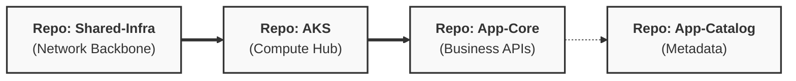
```mermaid
graph LR
    classDef repo fill:#f9f9f9,stroke:#333,stroke-width:2px
    SI["<b>Repo: Shared-Infra</b><br/>(Network Backbone)"] ==> AKS["<b>Repo: AKS</b><br/>(Compute Hub)"]
    AKS ==> CORE["<b>Repo: App-Core</b><br/>(Business APIs)"]
    CORE -.-> CAT["<b>Repo: App-Catalog</b><br/>(Metadata)"]
    class SI,AKS,CORE,CAT repo
```

</details>

### 10.2 Architecture Comparison Matrix

| Feature | Federated Multi-Repo (Production) | Mono-Repo (GitHub/Distribution) |
| :--- | :--- | :--- |
| **RBAC** | Fine-grained (Identity team only manages `App-Users`) | All-or-nothing access |
| **State Lock** | Independent per stack (No team blocking) | Potential for global state contention |
| **Blast Radius** | Minimized (Pipelines are isolated) | High (One typo can affect global CI) |
| **CI/CD Speed** | Fast (Only changed stack runs) | Slower (Requires complex filtering) |
| **Versioning** | Semantic tags per component | Global versioning |
| **Context** | Harder to see the "Big Picture" | **Excellent** (Total architectural visibility) |

**Conclusion**: We use **Multi-Repo** for development to ensure security and isolation, but we publish as a **Mono-Repo** to provide a "Single Pane of Glass" for architects to understand the entire ecosystem.

### 10.3 Implementation Evidence: The Decoupling Logic

- **State Decoupling**: Each stack maintains its own `terraform.tfstate` file stored in a centralized, locked Azure Storage Container. This prevents a single lock from blocking the entire engineering team.
- **Referential Integrity**: Downstream stacks (like `App-Core`) consume outputs from upstream stacks (like `Shared-Infra`) via **Data Sources** or **Pipeline Variables**, ensuring network IDs are always consistent.
- **Cross-Repo Promotion**: Changes are promoted through versioned module tags, allowing for "Canary Infrastructure" deployments.

## 11. DevSecOps: Identity, Secrets and OAuth Flow

### 11.1 Governance-First Identity Model
We move beyond basic secret management into a **Governance-First** model where identity is the primary perimeter.

#### 11.1.1 OAuth 2.0 and OBO Flow Deep-Dive

To protect downstream databases (MongoDB Atlas), we utilize the **On-Behalf-Of (OBO)** flow. The backend API never uses a "Master Service Account"; instead, it exchanges the user's JWT for a scoped token.

<details>
<summary><b>Click to expand: OAuth 2.0 and OBO Flow Deep-Dive</b></summary>

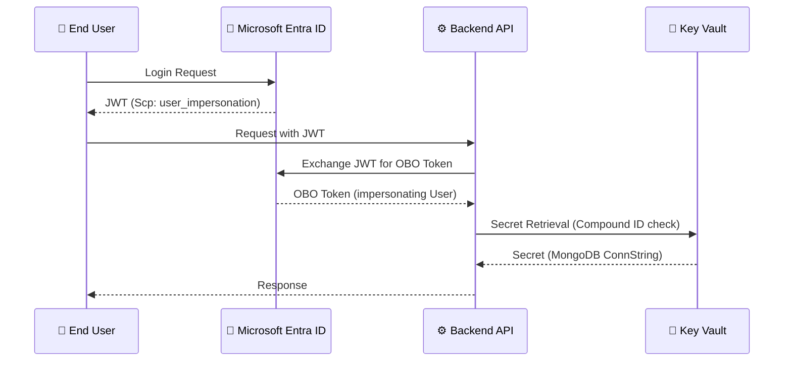
```mermaid
sequenceDiagram
    participant User as 👤 End User
    participant AAD as 🔑 Microsoft Entra ID
    participant API as ⚙️ Backend API
    participant KV as 🔐 Key Vault
    User->>AAD: Login Request
    AAD-->>User: JWT (Scp: user_impersonation)
    User->>API: Request with JWT
    API->>AAD: Exchange JWT for OBO Token
    AAD-->>API: OBO Token (impersonating User)
    API->>KV: Secret Retrieval (Compound ID check)
    KV-->>API: Secret (MongoDB ConnString)
    API-->>User: Response
```

</details>

#### 11.1.2 Advanced DevSecOps: The Compound Identity Model
Access to client-specific sensitive data is governed by a **Dual-Lock mechanism** known as **Compound Identity** (Application-plus-User).

- **The Logic**: A Key Vault secret is only released if the request satisfies TWO conditions simultaneously:
  1. **The Caller**: Must be the authorized **App-Core Backend API** Managed Identity (`application_id`).
  2. **The User**: Must be a human user belonging to a specific **Security Principal Group** (`object_id`).
- **Implementation**: This is enforced via `azurerm_key_vault_access_policy` where both `application_id` and `object_id` are defined. This prevents "Identity Theft" by a rogue application or "Direct Access" by an unauthorized user.
- **Evidence**: [`23-key-vault-clients.tf`](./App-Core/terraform-manifests/modules/appcore_module/23-key-vault-clients.tf).
  ```hcl
  resource "azurerm_key_vault_access_policy" "compound_identity" {
    key_vault_id   = azurerm_key_vault.client.id
    application_id = azuread_service_principal.api.application_id # Condition 1
    object_id      = azuread_group.authorized_users.object_id     # Condition 2
    secret_permissions = ["Get", "List"]
  }
  ```

### 11.2 Identity Flow and OAuth Deep-Dive
The [**On-Behalf-Of (OBO)**](./App-Core/terraform-manifests/modules/appcore_module/12-app-register-back-api.tf) flow ([MS Ref](https://learn.microsoft.com/en-us/entra/identity-platform/v2-oauth2-on-behalf-of-flow)) is the cornerstone of our multi-tenant security.

### 11.3 Token Comparison Table
| Token Type | Issuer | Life | Scope | Purpose |
| :--- | :--- | :--- | :--- | :--- |
| **ID Token** | Entra ID | 1hr | [`openid`](./App-Core/terraform-manifests/modules/appcore_module/11-app-register-front-spa.tf) ([MS Ref](https://learn.microsoft.com/en-us/entra/identity-platform/scopes-oidc#openid-connect-scopes)), [`profile`](./App-Core/terraform-manifests/modules/appcore_module/11-app-register-front-spa.tf) ([MS Ref](https://learn.microsoft.com/en-us/entra/identity-platform/scopes-oidc#profile-scope)) | User Identification (Frontend) |
| **Access Token** | Entra ID | 1hr | [`user_impersonation`](./App-Core/terraform-manifests/modules/appcore_module/12-app-register-back-api.tf) ([MS Ref](https://learn.microsoft.com/en-us/entra/identity-platform/v2-oauth2-on-behalf-of-flow)) | Calling Backend API |
| **OBO Token** | Entra ID | 1hr | [`https://vault.azure.net/.default`](./App-Core/terraform-manifests/modules/appcore_module/12-app-register-back-api.tf) ([MS Ref](https://learn.microsoft.com/en-us/azure/key-vault/general/authentication#authentication-in-a-backend-service)) | Backend calling Key Vault as User |

### 11.4 Technical Flow Constraints
- **Application ID URI**: Must be unique per environment (`api://appcore-back-dnedev`).
- **Claim Validation**: The backend validates the `iss` (Issuer) and `aud` (Audience) claims before requesting the OBO exchange.

## 12. Zero-Trust Identity and OIDC Flow (Secretless CI/CD)

We eliminate the most common attack vector in CI/CD: **Long-lived Service Principal Secrets**. By implementing **OpenID Connect (OIDC)**, the pipeline "trades" a short-lived token from Azure DevOps for an Azure access token.

### 12.1 The Workload Identity Trust Chain

<details>
<summary><b>Click to expand: Workload Identity Trust Chain</b></summary>

```mermaid
sequenceDiagram
    participant ADO as 🚀 Azure DevOps
    participant Entra as 🔑 Microsoft Entra ID
    participant Azure as ☁️ Azure Resource
    ADO->>Entra: 1. Request Token (OIDC JWT)
    Entra->>Entra: 2. Validate Federated Identity Subject
    Entra-->>ADO: 3. Ephemeral Access Token (60 min)
    ADO->>Azure: 4. Execute Terraform Apply
    Azure-->>ADO: 5. Provisioned / Updated
```

</details>

### 12.2 Workload Identity Federation (OIDC) Evidence
The platform enforces `use_oidc = true` across all core providers to ensure that build agents are always secretless.

- **Trust Subject Pattern**: `sc://{organization}/{project}/{service_connection}`.
- **Terraform Provider Configuration**:
  ```hcl
  # providers.tf
  provider "azurerm" {
    use_oidc = true # Enables OIDC JIT Authentication
  }
  ```

## 13. Security-by-Design Checklist

This repository undergoes automated security scanning to ensure compliance with the **Enterprise Security Guardrails**. For a high-fidelity technical deep-dive into the implementation of these controls (Private Link, Forced Egress, CMK, DDoS), please refer to the dedicated document:

👉 **[Doc 15: Security-by-Design Checklist](./docs/324-SECURITY_BY_DESIGN_CHECKLIST.md)**


## 14. GreenOps and Sustainability

Sustainability is treated as a first-class citizen through **Carbon-Aware Engineering**.

- **AKS Scale-to-Zero**: User node pools (ML/Jobs) are configured with `min_count = 0`, ensuring we consume zero energy when inference jobs are not running.
- **Spot Instances**: Integration of **Azure Spot VMs** in [`11-aks-cluster-nodepool-004-spot.tf`](./AKS/terraform-manifests/modules/sharedinfra_aks_module/11-aks-cluster-nodepool-004-spot.tf) for non-critical pods, utilizing "waste" capacity at a 70-90% discount.
- **Log Retention Governance**: Granular retention policies (30 days vs 90 days) reduce the "Cold Storage" energy footprint in Azure datacenters.
- **Geographical Selection**: Prioritizing regions like **North Europe** and **West Europe** which have high availability of renewable energy sources.

---

## 15. Validated Reference Library (Official and Community)

This library provides a curated list of authoritative resources that form the technical and strategic foundation of this architecture.

### 15.1 Foundational and Governance
*   **[Microsoft Cloud Adoption Framework (CAF)](https://learn.microsoft.com/en-us/azure/cloud-adoption-framework/)**: Best practices for cloud adoption.
*   **[Azure Well-Architected Framework (WAF)](https://learn.microsoft.com/en-us/azure/architecture/framework/)**: Five pillars of architectural excellence.
*   **[Enterprise-Scale Landing Zones](https://learn.microsoft.com/en-us/azure/cloud-adoption-framework/ready/enterprise-scale/)**: Design principles for large-scale Azure environments.

### 15.2 Infrastructure as Code (Terraform)
*   **[Terraform Standard Module Structure](https://developer.hashicorp.com/terraform/language/modules/develop/structure)**: Official guidance on module design.
*   **[Terraform Stacks (Vision 2026)](https://developer.hashicorp.com/terraform/cloud-docs/stacks)**: The future of native HCL orchestration.
*   **[Azure Verified Modules (AVM)](https://azure.github.io/Azure-Verified-Modules/)**: Industry-standard library for Azure resources.
*   **[Terraform Best Practices](https://www.terraform-best-practices.com/)**: Community-driven guide for scalable IaC.

### 15.3 Security and Zero-Trust Identity
*   **[Microsoft Zero Trust Model](https://www.microsoft.com/en-us/security/business/zero-trust)**: Principles of verify explicitly, least privilege, and assume breach.
*   **[OAuth 2.0 On-Behalf-Of (OBO) Flow](https://learn.microsoft.com/en-us/entra/identity-platform/v2-oauth2-on-behalf-of-flow)**: Securing multi-tier service calls.
*   **[Workload Identity Federation](https://learn.microsoft.com/en-us/entra/workload-id/workload-identity-federation)**: Eliminating secrets in AKS and CI/CD.
*   **[OWASP Top 10 Security Risks](https://owasp.org/www-project-top-ten/)**: Essential guide for web application security.

### 15.4 Networking and Traffic Orchestration
*   **[Hub-Spoke Topology in Azure](https://learn.microsoft.com/en-us/azure/architecture/reference-architectures/hybrid-networking/hub-spoke)**: Standard reference for regional network design.
*   **[Azure Private Link Deep-Dive](https://learn.microsoft.com/en-us/azure/private-link/private-link-overview)**: Keeping traffic within the Microsoft backbone.
*   **[WAF Policy Orchestration](https://learn.microsoft.com/en-us/azure/web-application-firewall/ag/ag-overview)**: Managing edge protection at scale.

### 15.5 Compute and Kubernetes (AKS)
*   **[AKS Baseline Architecture](https://learn.microsoft.com/en-us/azure/architecture/reference-architectures/containers/aks/baseline-aks)**: Production-ready cluster design.
*   **[Azure CNI Overlay](https://learn.microsoft.com/en-us/azure/aks/azure-cni-overlay)**: Advanced networking for high-density pod environments.
*   **[Helm: The Package Manager for Kubernetes](https://helm.sh/docs/)**: Managing complex K8s application lifecycles.

### 15.6 SRE, FinOps and Sustainability
*   **[The Google SRE Book](https://sre.google/sre-book/table-of-contents/)**: Foundational principles of Site Reliability Engineering.
*   **[Azure Monitor Overview](https://learn.microsoft.com/en-us/azure/azure-monitor/overview)**: Centralized observability for Azure resources.
*   **[FinOps Foundation](https://www.finops.org/)**: Cloud financial management best practices.
*   **[Infracost: Cloud Cost Estimates for Terraform](https://www.infracost.io/)**: Integrating cost visibility into CI/CD pipelines.
*   **[Green Software Foundation](https://greensoftware.foundation/)**: Carbon-aware engineering standards.


### 15.7 Community and Expert Influences
Special recognition to the experts whose architectural patterns influenced this repository:
*   **[John Savill](https://www.youtube.com/@ntfaqguy)**: Masterclass in Azure Networking and Identity.
*   **[Kalyan Reddy Daida](https://stacksimplify.com/)**: Founder of **StackSimplify** and author of the foundational AKS Masterclass patterns. Source code available at **[GitHub/stacksimplify](https://github.com/stacksimplify)**.
*   **[Sam Cogan](https://samcogan.com/)**: Azure governance and Multi-subscription strategies.
*   **[Chris Pietschmann](https://build5nines.com/)**: Terraform Feature Flag patterns.
*   **[Mark Tinderholt](https://medium.com/@marktinderholt)**: Principal Architect at Microsoft and creator of **Azure Terraformer**. Author of the book *[Mastering Terraform](https://marktinderholt.com/books/mastering-terraform)*. A leading expert in Azure IaC automation, sharing deep technical analysis via **[marktinderholt.com](https://marktinderholt.com)**, **[YouTube](https://www.youtube.com/@AzureTerraformer)**, **[LinkedIn](https://www.linkedin.com/in/marktinderholt/)**, and **[X.com](https://x.com/MarkTinderholt)**.
*   **[Ned Bellavance](https://www.nedinthecloud.com/)**: Founder of **Ned in the Cloud LLC**, Microsoft MVP, and HashiCorp Ambassador. Author of the *[Terraform Certified Associate Preparation Guide](https://www.nedinthecloud.com/books/)* and creator of dozens of Pluralsight courses. A recognized voice in the IaC community, sharing expert insights via **[YouTube](https://www.youtube.com/c/NedintheCloud)**, **[LinkedIn](https://www.linkedin.com/in/ned-bellavance-ba68a52)**, and his podcast **Day Two Cloud**.


[➡️ Next: Architecture Strategy 2026](./docs/111-ARCHITECTURE_2026.md)

---

*Technical Documentation: Enterprise Cloud Infrastructure and DevSecOps Patterns | Vision 2026 Architectural Guide*

---