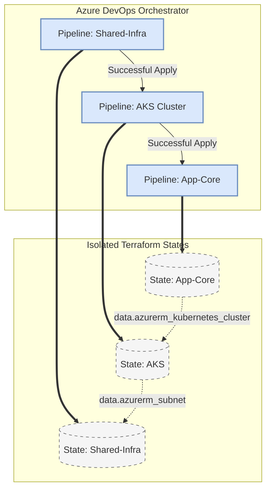
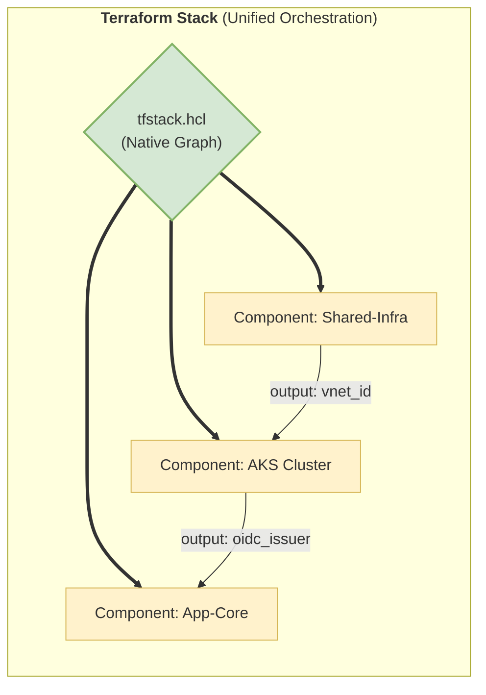

[ Home](../README.md) | [ Next: 112. Presentation Notebook](112-PRESENTATION_NOTEBOOK.md)

---

# 111. Architecture Strategy

---

##  Table of Contents

- [1. Evolution Towards AI-Assisted Cloud Engineering and Native IaC Orchestration](#1-evolution-towards-ai-assisted-cloud-engineering-and-native-iac-orchestration)
- [2. Hub-Spoke Topology Evolution](#2-hub-spoke-topology-evolution)
- [3. Federated Multi-Repo vs. Mono-Repo Strategy](#3-federated-multi-repo-vs-mono-repo-strategy)
- [4. AI-Agent Context and Autonomous Engineering](#4-ai-agent-context-and-autonomous-engineering)
- [5. Deep Dive: Terraform Stacks (2026) vs Pipeline Orchestration](#5-deep-dive-terraform-stacks-2026-vs-pipeline-orchestration)
    - [5.1 Current Implementation (Pipeline-Driven Orchestration)](#51-current-implementation-pipeline-driven-orchestration)
    - [5.2 The 2026 Target: Native Terraform Stacks](#52-the-2026-target-native-terraform-stacks)
    - [5.3 Feature Capability Comparison Matrix](#53-feature-capability-comparison-matrix)
    - [5.4 Why the Repo Was Built This Way (Historical Context)](#54-why-the-repo-was-built-this-way-historical-context)
    - [5.5 Orchestration Strategy: Simulated Terraform Stacks](#55-orchestration-strategy-simulated-terraform-stacks)
    - [5.6 Migration Recommendation Path](#56-migration-recommendation-path)
- [6. Top Architectural Risks and Recommendations (Reverse Engineered)](#6-top-architectural-risks-and-recommendations-reverse-engineered)
- [7. AI-Ready Infrastructure: Foundations for LLM-Ops and Agents](#7-ai-ready-infrastructure-foundations-for-llm-ops-and-agents)
- [8. Validated Reference Library (Official and Community)](#8-validated-reference-library-official-and-community)

---

## 1. Evolution Towards AI-Assisted Cloud Engineering and Native IaC Orchestration

This document outlines the strategic vision for the infrastructure ecosystem. It transitions from a "Traditional IaC" approach (sequential scripts and manual approvals) to an "Autonomous Orchestration" model designed for the year 2026.

## 2. Hub-Spoke Topology Evolution

The architecture is built on a high-fidelity **Hub-Spoke** model.

- **The Hub**: Managed in [`Shared-Infra/`](../Shared-Infra/), it provides the backbone (Connectivity, DNS, Shared Keys).
- **The Spokes**: Distributed across [`AKS/`](../AKS/), [`App-Core/`](../App-Core/), and [`App-Catalog/`](../App-Catalog/), these are isolated landing zones for specific workloads.
- **Symmetry**: Every resource in the spoke is mirrored across Engineering (ENG) and Production (PRO) using the deterministic prefix logic.

## 3. Federated Multi-Repo vs. Mono-Repo Strategy

While this repository is a Mono-Repo for educational purposes, it is designed to be **Federated**.

- **Decoupling**: Each major folder has its own `providers.tf` and state file.
- **Independence**: You can update the `AKS` cluster without locking the `Shared-Infra` state.
- **Distribution Consolidation (Mono-Repo)**: On GitHub, these are merged to provide a "Single Pane of Glass" view, allowing architects to trace dependencies across the entire stack in one place.

## 4. AI-Agent Context and Autonomous Engineering

This repository is "AI-First." We provide structured context to enable AI agents (like Gemini CLI, Copilot, or specialized autonomous agents) to assist in infrastructure management.

- **Context Rules ([`.well-known/ai-context.md`](./.well-known/ai-context.md))**:
    - **Security Constraints**: AI must never propose public endpoints for databases.
    - **Naming Conventions**: Strict adherence to the `type-app-env-region` pattern.
- **Autonomous Remediation**: Future-state includes agents that monitor `terraform plan` outputs and automatically suggest fixes for policy violations (e.g., Open Policy Agent (OPA) or Checkov).

## 5. Deep Dive: Terraform Stacks (2026) vs Pipeline Orchestration

Reverse engineering this repository reveals a common pre-2024 workaround: **using CI/CD Pipelines (Azure DevOps) to orchestrate Terraform dependencies**. 

The repository is split into isolated state boundaries:
*   [`Shared-Infra/`](../Shared-Infra/terraform-manifests/)
*   [`AKS/`](../AKS/terraform-manifests/)
*   [`App-Core/`](../App-Core/terraform-manifests/)
*   [`App-Catalog/`](../App-Catalog/terraform-manifests/)

### 5.1 Current Implementation (Pipeline-Driven Orchestration)

The current architecture relies on **External Orchestration** via Azure DevOps YAML.

### 5.2 The 2026 Target: Native Terraform Stacks

The 2026 vision moves this logic into HCL itself using **Terraform Stacks**.

### 5.3 Feature Capability Comparison Matrix

With Terraform Stacks reaching GA, the pipeline-driven orchestration in this repository is now considered a **technical debt anti-pattern**.

| Capability | Current Repo (ADO Pipelines + Data Sources) | Terraform Stacks (2026 GA Standard) | Impact on Engineering Team |
| :--- | :--- | :--- | :--- |
| **Dependency Graph** | Maintained blindly in human heads and YAML file triggers. | Natively understood by Terraform via `components`. | **High**: Eliminates pipeline spaghetti. |
| **Cross-Layer Planning** | Impossible. You must plan `Shared-Infra`, apply it, then plan `AKS`. | **Unified Plan**. You can see how a network change affects the app layer in one single output. | **Critical**: Prevents breaking downstream layers. |
| **Variable Passing** | Brittle `data` blocks that fail if the upstream resource doesn't exist yet. | Native output-to-input mapping (`component.network.subnet_id`). | **Medium**: Cleaner, faster code execution. |
| **Blast Radius Isolation** | High. State files are strictly separated. | High. Stacks maintain isolated state per component while orchestrating them together. | **Parity**: Both solve the isolation problem. |
| **Execution Speed** | Slow. Sequential pipeline execution with full init overhead per stage. | Fast. Terraform natively parallelizes independent components. | **Medium**: Faster CI/CD feedback loop. |

### 5.4 Why the Repo Was Built This Way (Historical Context)

Before Terraform Stacks, putting everything into one massive `main.tf` and a single state file created a **"Blast Radius" risk**. If a developer made a typo in the AKS cluster, the entire network (`Shared-Infra`) could be accidentally destroyed during a failed apply.

To solve this, the repo authors split the architecture into four distinct folders. However, since `App-Core` needs to know the IP address of the Application Gateway created in `Shared-Infra`, the authors relied on:
1.  **Hardcoded variables** across multiple [`.tfvars` files](../App-Core/terraform-manifests/pro-mainbranch.tfvars).
2.  **Remote Data Sources** (`data "azurerm_kubernetes_cluster"`) querying Azure directly. See [`App-Core/terraform-manifests/modules/appcore_module/21-app-gateway.tf`](../App-Core/terraform-manifests/modules/appcore_module/21-app-gateway.tf).

### 5.5 Orchestration Strategy: Simulated Terraform Stacks

| Feature | Simulated Stack (This Repo) | Terraform Stacks (2026 Std) |
| :--- | :--- | :--- |
| **Dependency Logic** | Managed in Azure DevOps YAML | Built-in HCL `stack` blocks |
| **State Management** | Fragmented (Isolated States) | Unified (Stacked State) |
| **Verdict** | **Production-Ready and Stable** | **Emerging / Experimental** |

### 5.6 Migration Recommendation Path
To modernize this repository to 2026 standards:
1.  Create a `deployments.tfdeploy.hcl` at the root.
2.  Convert `Shared-Infra`, `AKS`, `App-Core`, and `App-Catalog` into stack **components**.
3.  Remove all Azure DevOps pipelines ending in `-pipeline.yml` (e.g., [`01-terraform-provision-AKS-pipeline.yml`](../AKS/01-terraform-provision-AKS-pipeline.yml)) and replace them with a single `terraform stack apply` action.

## 6. Top Architectural Risks and Recommendations (Reverse Engineered)

Beyond IaC orchestration, an AI-driven reverse engineering of the repository has uncovered several "Dormant Risks" that must be addressed in the 2026 Roadmap.

1.  **Risk 1: The "Dormant" Security Posture (Defender for Cloud)**:
    - **Issue**: Most modules use the "Free" tier.
    - **Mitigation**: Switch to the **Standard** tier for Container Vulnerability Scanning and JIT VM Access.
2.  **Risk 2: Egress "Data Gravity" Hemorrhage**:
    - **Issue**: Heavy egress traffic from AKS to public storage backends.
    - **Mitigation**: Enforce **Service Endpoints** or **Private Link** for all storage traffic to keep data within the backbone and avoid egress fees.

## 7. AI-Ready Infrastructure: Foundations for LLM-Ops and Agents

By 2026, infrastructure not only supports applications but acts as the nervous system for **AI Agents** and large language models (LLMs).

This repository is designed so that the data powering AI remains within the Azure private perimeter, ensuring regulatory compliance.

*   **Secure AI Endpoints:** AKS clusters and App Services consume **Azure OpenAI** models exclusively through **Private Endpoints** integrated into the Hub VNet.
*   **Vector Database Readiness:** The modular architecture allows for the seamless insertion of **Azure Cosmos DB for MongoDB (Vector Search)** as a new component without breaking existing networking logic.
*   **Secret-less Access:** Agents performing tasks in AKS obtain Entra ID tokens to access Key Vault and Storage without handling passwords, reducing the risk of credential leakage. Refer to [`AKS/terraform-manifests/modules/aks_module/`](../AKS/terraform-manifests/modules/).
*   **N-Series Provisioning:** Terraform modules in [`AKS/terraform-manifests/`](../AKS/terraform-manifests/) are prepared to extend into **GPU Node Pools** for heavy inference tasks.
*   **AI Burst with Virtual Nodes:** Use of **AKS Virtual Nodes (ACI)** to scale instantly for demand spikes in AI data pre-processing tasks, paying only per second of use.
*   **Intelligent Telemetry:** Centralized logs in Log Analytics enable the use of **Azure Monitor AIOps** for proactive anomaly detection in WAF traffic and microservice behavior. Refer to [`Log Analytics Workspace`](../App-Core/terraform-manifests/modules/appcore_module/35-log-analytics-workspace.tf).

---

## 8. Validated Reference Library (Official and Community)

### AI and Autonomous Engineering
*   **[Open Policy Agent (OPA)](https://www.openpolicyagent.org/)**: Policy-based control for cloud-native environments.
*   **[Checkov](https://www.checkov.io/)**: Static code analysis for infrastructure as code.
*   **[Azure OpenAI Service](https://learn.microsoft.com/en-us/azure/ai-services/openai/overview)**: Enterprise-grade access to OpenAI models.
*   **[Azure Cosmos DB for MongoDB Vector Search](https://learn.microsoft.com/en-us/azure/cosmos-db/mongodb/vcore/vector-search-overview)**: Native vector database capabilities for RAG.
*   **[AKS GPU Node Pools](https://learn.microsoft.com/en-us/azure/aks/gpu-cluster)**: High-performance compute for AI/ML workloads.
*   **[AKS Virtual Nodes (ACI)](https://learn.microsoft.com/en-us/azure/aks/virtual-nodes-portal)**: Serverless Kubernetes compute for instant bursting.
*   **[Azure Monitor AIOps](https://learn.microsoft.com/en-us/azure/azure-monitor/alerts/aiops)**: AI-driven observability and anomaly detection.

---

[ Home](../README.md) | [ Next: 112. Presentation Notebook](112-PRESENTATION_NOTEBOOK.md)

---

*Technical Documentation: Enterprise Architecture Strategy | Vision 2026 Architectural Guide*