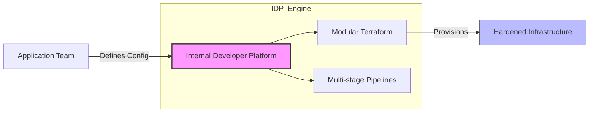

[ Previous: 121. Provenance and Legal](121-PROVENANCE_AND_LEGAL.md) | [ Home](../README.md) | [ Next: 211. Module Design Patterns](211-TERRAFORM_MODULE_DESIGN_PATTERNS.md)

---

# 131. Internal Developer Platform

---

##  Table of Contents

- [1. Strategy 2026: Elevating Developer Experience (DevEx) Through Infrastructure-as-a-Product](#1-strategy-2026-elevating-developer-experience-devex-through-infrastructure-as-a-product)
- [2. The "Golden Path" (Paved Road)](#2-the-golden-path-paved-road)
- [3. Managing Cognitive Load and Team Topologies](#3-managing-cognitive-load-and-team-topologies)
    - [3.1 Strategic Implementation](#31-strategic-implementation)
- [4. Responsible Self-Service and Federated Governance](#4-responsible-self-service-and-federated-governance)
- [5. Onboarding 2026: From 0 to Production in 5 Steps](#5-onboarding-2026-from-0-to-production-in-5-steps)
- [6. Vision 2026: AI-Native Platform Engineering](#6-vision-2026-ai-native-platform-engineering)
- [7. Deep Dive: Observability-as-a-Service (OaaS)](#7-deep-dive-observability-as-a-service-oaas)
- [8. Multi-Tenancy and Client Scaling Logic](#8-multi-tenancy-and-client-scaling-logic)
- [9. The "Branch-as-an-Environment" Pattern](#9-the-branch-as-an-environment-pattern)
- [10. Infrastructure Maturity and Human-Centric Design](#10-infrastructure-maturity-and-human-centric-design)
- [11. Validated Reference Library (Official and Community)](#11-validated-reference-library-official-and-community)

---

## 1. Strategy 2026: Elevating Developer Experience (DevEx) Through Infrastructure-as-a-Product

This repository serves as the core engine for an **Internal Developer Platform (IDP)**. Beyond simple automation, it implements a "Platform-as-a-Product" mindset designed to minimize cognitive load, enforce security guardrails, and accelerate the **Time-to-Market** for enterprise applications.

## 2. The "Golden Path" (Paved Road)

In this ecosystem, we have established a **Golden Path**: a pre-approved, secure, and supported workflow that enables developers to deploy mission-critical infrastructure without being Azure or Terraform experts.

*   **Complexity Abstraction**: Developers interact with high-level configuration files (e.g., [`pro-mainbranch.tfvars`](../App-Core/terraform-manifests/pro-mainbranch.tfvars)), while the platform layer automatically handles:
    *   **Automated TLS/SSL**: Certificate lifecycle management via [`key-vault-app-gateway.tf`](../App-Core/terraform-manifests/modules/appcore_module/22-key-vault-app-gateway.tf).
    *   **Perimeter Security**: WAF policy enforcement in the [`azurerm_application_gateway`](../App-Core/terraform-manifests/modules/appcore_module/21-app-gateway.tf).
    *   **Zero-Trust Networking**: Private Link and Private Endpoint integration for backend services.
*   **Security by Design**: By following the Golden Path, every application is born compliant, inheriting the organization's governance, identity management, and centralized logging.

## 3. Managing Cognitive Load and Team Topologies

Following **Team Topologies** principles, this IDP decouples infrastructure complexity from application logic, allowing product teams to focus exclusively on business value.

### 3.1 Strategic Implementation
*   **Standardized Blueprints**: The use of reusable templates in [`App-Core/templates/`](../App-Core/templates/) ensures that deployments are consistent across environments. Developers consume standards; they don't reinvent pipelines.
*   **Invisible Governance**: The platform automatically applies **Resource Quotas**, **Network Policies**, and **RBAC** within the assigned application "Spoke".
*   **Blast Radius Control**: As detailed in our [`111-ARCHITECTURE_2026.md`](./111-ARCHITECTURE_2026.md#52-why-the-repo-was-built-this-way-historical-context), the platform uses isolated state files to ensure that an error in one application doesn't impact the core network.

## 4. Responsible Self-Service and Federated Governance

We foster agility through a **Federated Governance** model:

1.  **Shared-Infra (Platform-Managed)**: The core AKS cluster and backbone network are managed by the Platform/SRE team ([`Shared-Infra/`](../Shared-Infra/)).
2.  **App-Spokes (Self-Service)**: Application teams have autonomy to provision their own resources (App Services, Databases) within their designated landing zone ([`App-Core/`](../App-Core/)).
3.  **Promotion Logic**: Environment promotion (from `DEV` to `PRO`) is fully automated and gate-kept by multi-stage pipelines with integrated manual approvals and automated health checks.

## 5. Onboarding 2026: From 0 to Production in 5 Steps

1.  **Fork/Branch**: Create a new feature branch following the **GitFlow** model.
2.  **Configure**: Edit the relevant `.tfvars` file with application-specific parameters (Name, SKU, Client list). See [`dev-developbranch.tfvars`](../App-Core/terraform-manifests/dev-developbranch.tfvars).
3.  **Pull Request**: Submit a PR. The validation pipeline ([`terraform-validate.yml`](../App-Core/templates/terraform-validate.yml)) automatically checks syntax, compliance, and estimated costs.
4.  **Merge and Plan**: Merging into `develop` triggers an automatic `terraform plan`, providing full visibility to SREs of the upcoming changes.
5.  **Apply**: Upon manual approval in the Azure DevOps environment, the infrastructure is deployed, and the app is exposed behind the corporate WAF.

## 6. Vision 2026: AI-Native Platform Engineering

As we evolve towards 2026, the IDP is being enhanced with **AI-Assisted** capabilities:
*   **Self-Healing Infrastructure**: Integration with AI agents to detect drift between the Terraform state and the actual Azure environment, automatically proposing remediation commits.
*   **Intelligent Scaling**: Using AIOps to analyze traffic patterns and dynamically adjust AKS node pools and App Service plan tiers for cost optimization (FinOps).
*   **Context-Aware Development**: Providing specialized context for AI assistants via [`.well-known/ai-context.md`](./.well-known/ai-context.md) to ensure that even AI-generated infrastructure changes adhere to our human-crafted quality standards.

## 7. Deep Dive: Observability-as-a-Service (OaaS)

A key pillar of our IDP is the automatic provisioning of advanced monitoring. Developers don't need to configure logging; it's part of the platform's DNA.

*   **Dynamic Logging Isolation**: The platform automatically creates dedicated **Log Analytics Workspaces** per environment and even per client (tenant) when necessary. Refer to [`35-log-analytics-workspace.tf`](../App-Core/terraform-manifests/modules/appcore_module/35-log-analytics-workspace.tf).
*   **App Insights Injection**: Every App Service instance is automatically linked to an **Application Insights** instance. See [`36-application-insights.tf`](../App-Core/terraform-manifests/modules/appcore_module/36-application-insights.tf).
*   **Unified Telemetry**: All platform logs (WAF, Network, Cluster) are routed to a centralized **Security Information and Event Management (SIEM)** via Microsoft Sentinel.

## 8. Multi-Tenancy and Client Scaling Logic

The platform is designed to scale horizontally across hundreds of clients with minimal manual effort.

*   **Logic for Scale**: We utilize Terraform `for_each` and `for` expressions to dynamically generate client-specific DNS names, redirect URIs, and resource tags. Refer to the complex mapping logic in [`03-locals.tf`](../App-Core/terraform-manifests/modules/appcore_module/03-locals.tf).
*   **Tenant Sandboxing**: Each client can have its own dedicated App Service backend or share a multi-tenant pool, controlled purely through the `client_names` variable in the `.tfvars` file.

## 9. The "Branch-as-an-Environment" Pattern

Our IDP implements a sophisticated **State Isolation Strategy** based on Git branches.

*   **Dynamic Backends**: The pipelines dynamically calculate the Terraform state key based on the current Git branch. This allows developers to spin up "Ephemeral Spokes" or feature environments just by creating a branch.
*   **Global Consistency**: Shared variables (like Azure Region codes or Product Names) are enforced through a global [`locals.tf`](../App-Core/terraform-manifests/modules/appcore_module/03-locals.tf), ensuring that naming conventions remain identical across all automated environments.

## 10. Infrastructure Maturity and Human-Centric Design

This platform reflects the highest level of IaC maturity:
1.  **Code is Law**: No manual changes are allowed via the Azure Portal.
2.  **Auditability**: Every change is tracked via Git history and Azure DevOps release logs.
3.  **Simplicity over Obfuscation**: Despite its complexity, the modules are designed to be "surgical"—allowing for targeted updates without disturbing the rest of the ecosystem.

---

## 11. Validated Reference Library (Official and Community)

- **[Microsoft Learn: What is Platform Engineering?](https://learn.microsoft.com/en-us/platform-engineering/what-is-platform-engineering)**
- **[Platform Engineering Journey: Moving from DevEx to IDP](https://learn.microsoft.com/en-us/platform-engineering/journey/overview)**
- **[Microsoft Platform Engineering Capabilities Model](https://learn.microsoft.com/en-us/platform-engineering/capabilities-model)**
- **[Humanitec: What is an Internal Developer Platform?](https://humanitec.com/blog/what-is-an-internal-developer-platform)**
- **[Team Topologies: Decoupling Teams for Fast Flow](https://teamtopologies.com/key-concepts)**
- **[CNCF Platform White Paper](https://tag-app-delivery.cncf.io/whitepapers/platforms/)**

---

[ Previous: 121. Provenance and Legal](121-PROVENANCE_AND_LEGAL.md) | [ Home](../README.md) | [ Next: 211. Module Design Patterns](211-TERRAFORM_MODULE_DESIGN_PATTERNS.md)

---

*Technical Documentation: Internal Developer Platform (IDP) and Platform Engineering | Vision 2026 Architectural Guide*