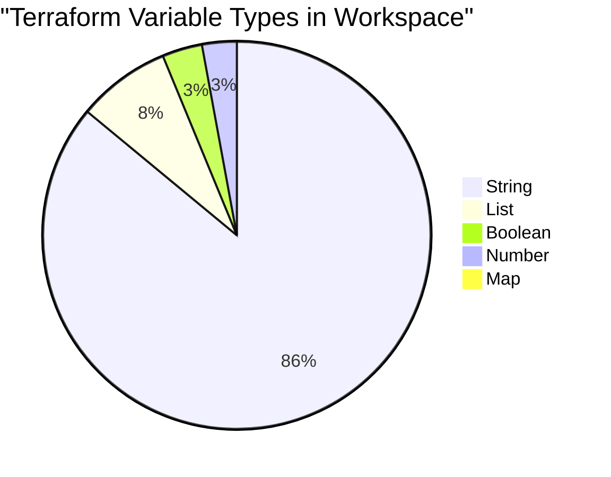
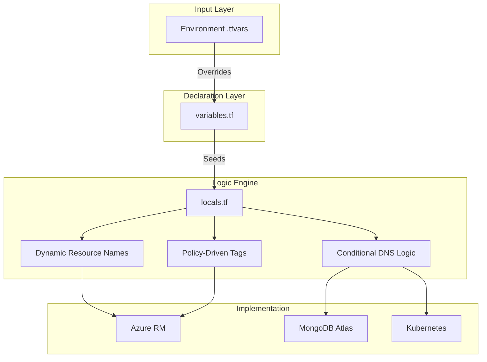
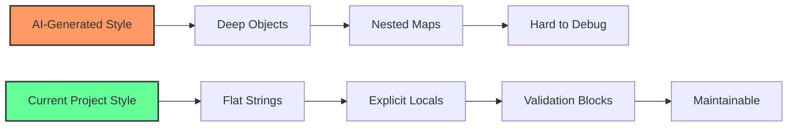

[ Previous: 211. Module Design Patterns](211-TERRAFORM_MODULE_DESIGN_PATTERNS.md) | [ Home](../README.md) | [ Next: 221. Visualizations](221-TERRAFORM_VISUALIZATIONS_AND_DEPENDENCY_GRAPHS.md)

---

# 212. Variable Architecture

---

##  Table of Contents

- [1. Variable Metrics and Distribution](#1-variable-metrics-and-distribution)
    - [1.1 Global Type Distribution](#11-global-type-distribution)
    - [1.2 Variable Type Distribution (Mermaid)](#12-variable-type-distribution-mermaid)
- [2. Variable Orchestration Strategy](#2-variable-orchestration-strategy)
    - [2.1 The Configuration Hierarchy (Mermaid)](#21-the-configuration-hierarchy-mermaid)
    - [2.2 Engineering Reverse Engineering: Why so few `.tfvars`?](#22-engineering-reverse-engineering-why-so-few-tfvars)
- [3. Advanced Logic and Dynamic Locals](#3-advanced-logic-and-dynamic-locals)
    - [3.1 The Nested Loop Pattern (Flattening)](#31-the-nested-loop-pattern-flattening)
    - [3.2 Dynamic Map Aggregation (`tomap` and `merge`)](#32-dynamic-map-aggregation-tomap-and-merge)
    - [3.3 Static Mapping Tables](#33-static-mapping-tables)
- [4. Human-Centric vs. AI-Generated Code](#4-human-centric-vs-ai-generated-code)
- [5. Data Types and Decision Matrix](#5-data-types-and-decision-matrix)
    - [5.1 Existing Data Types Matrix](#51-existing-data-types-matrix)
    - [5.2 The "Object" Question: When to use `type = object`?](#52-the-object-question-when-to-use-type--object)
        - [5.2.1 Deep Dive: The Hidden Costs of Objects](#521-deep-dive-the-hidden-costs-of-objects)
        - [5.2.2 Refactor Example (Proposed for High Complexity Only)](#522-refactor-example-proposed-for-high-complexity-only)
        - [5.2.3 Decision Matrix: When to Refactor?](#523-decision-matrix-when-to-refactor)
- [6. Validated Reference Library (Official and Community)](#6-validated-reference-library-official-and-community)

---

## 1. Variable Metrics and Distribution

The following metrics represent the total footprint of configuration elements across the entire workspace (Shared-Infra, App-Catalog, App-Core, AKS, Day2-Ops).

### 1.1 Global Type Distribution

| Element Type | Count | Percentage |
| :--- | :--- | :--- |
| **Total Input Variables** | 438 | 100% |
| String (`string`) | 387 | 88.3% |
| List (`list`) | 35 | 8.0% |
| Boolean (`bool`) | 15 | 3.4% |
| Number (`number`) | 13 | 3.0% |
| Map (`map`) | 1 | 0.2% |
| Object (`object`) | 0 | 0.0% |
| **Total Logic Definitions (`locals`)** | 103 | - |

### 1.2 Variable Type Distribution (Mermaid)


## 2. Variable Orchestration Strategy

The project employs a **"Low-Surface Configuration"** strategy. Instead of exposing every possible resource parameter as a variable in `.tfvars`, the architecture relies on a hierarchical derivation model.

### 2.1 The Configuration Hierarchy (Mermaid)

The flow below illustrates how a single environment variable propagates and transforms into multiple infrastructure settings.



### 2.2 Engineering Reverse Engineering: Why so few `.tfvars`?

A typical `.tfvars` file (e.g., [`App-Catalog/terraform-manifests/dev-developbranch.tfvars`](../App-Catalog/terraform-manifests/dev-developbranch.tfvars)) contains only ~10 variables, despite the module creating dozens of resources.

**How it's achieved:**
The `locals.tf` within the modules acts as a **"Name and Policy Engine"**. It uses 4-5 core variables to compute everything else.

**Matrix of Derivation Logic:**

| Derived Value | Logic Pattern | Example Outcome | Code Reference |
| :--- | :--- | :--- | :--- |
| **RG Name** | `rg-[prod]-[region]-[env]` | `rg-appanalysis-dnedev` | [locals.tf](../App-Catalog/terraform-manifests/modules/appanalysis_module/03-locals.tf) |
| **DNS Zone** | `[child].[parent]` | `deng.enterprise.com` | [locals.tf](../App-Catalog/terraform-manifests/modules/appanalysis_module/03-locals.tf) |
| **Shared Env** | `(env != pro) ? "eng" : "pro"` | `eng` | [locals.tf](../App-Catalog/terraform-manifests/modules/appanalysis_module/03-locals.tf) |
| **Env Gen** | `(env != pro) ? env : ""` | `dev` (Empty in Prod) | [locals.tf](../App-Catalog/terraform-manifests/modules/appanalysis_module/03-locals.tf) |

## 3. Advanced Logic and Dynamic Locals

### 3.1 The Nested Loop Pattern (Flattening)
Found in [`App-Core/boilerplates/03-locals-with-nested-loops.tf-template`](../App-Core/boilerplates/03-locals-with-nested-loops.tf-template), this pattern generates a Cartesian product of clients and users, essential for massive RBAC or user provisioning.

```hcl
locals {
  # Cartesian Product: Clients x Users
  list_of_clients_users = distinct(flatten([
    for client in local.client_names : [
      for user in local.user_names : {
        user    = user
        client  = client
      }
    ]
  ]))
}

resource "azuread_user" "test_users" {
  for_each = { for entry in local.list_of_clients_users: "${entry.client}.${entry.user}" => entry }
  user_principal_name = "${each.value.user}-${each.value.client}@${var.dns_zone}"
}
```

### 3.2 Dynamic Map Aggregation (`tomap` and `merge`)
Found in [`App-Core/terraform-manifests/modules/appcore_module/03-locals.tf`](../App-Core/terraform-manifests/modules/appcore_module/03-locals.tf), this is one of the most advanced patterns in the repo. It dynamically builds maps of resource IDs based on a list of clients, using `try()` to handle potential nulls during resource creation.

```hcl
locals {
  map_list_applink_onprem_log_analytics_workspaces = tomap(merge(
    { for e in var.client_names : "${e}" => try(azurerm_log_analytics_workspace.applink_onprem_myclient["${e}"].workspace_id, null) }
  ))
}
```
**Explanation:**
- `for e in var.client_names`: Iterates over the list of clients.
- `try(..., null)`: Safely attempts to access the workspace ID. If the resource isn't created yet or fails, it returns `null` instead of crashing the plan.
- `merge(...)`: Combines the generated objects into a single structure.
- `tomap(...)`: Explicitly casts the result to a map type for downstream consumption.

### 3.3 Static Mapping Tables
Used in [`App-Users/terraform-manifests/05-variables.tf`](../App-Users/terraform-manifests/05-variables.tf) to translate environment short-names to DNS zones.

```hcl
variable "dns_zone_per_env" {
  type = map
  default = {
    "nedev" = "eng"
    "nepro" = "apps"
    "dneuat" = "deng"
  }
}
```

## 4. Human-Centric vs. AI-Generated Code

The codebase reflects a **Human-Centric Engineering** approach. While AI agents often generate deeply nested objects and complex dynamic blocks, this repo prioritizes **Readability**.



## 5. Data Types and Decision Matrix

### 5.1 Existing Data Types Matrix

| Type | Frequency | Best Used For... | Example from Code |
| :--- | :--- | :--- | :--- |
| `string` | 88% | Names, SKU, Tiers, Regions. | [`var.location`](../App-Catalog/terraform-manifests/variables.tf) |
| `list(string)` | 8% | Client lists, subnet CIDRs. | [`var.client_names`](../App-Catalog/terraform-manifests/variables.tf) |
| `bool` | 3% | Feature flags, deployment toggles. | [`var.deploy_Europe`](../Shared-Infra/terraform-manifests/locals.tf) |
| `map` | <1% | Env-to-Zone lookups. | [`var.dns_zone_per_env`](../App-Users/terraform-manifests/05-variables.tf) |

### 5.2 The "Object" Question: When to use `type = object`?

The project currently has **zero** variables of type `object`. This is a deliberate architectural choice to maintain "Infrastructure Searchability" and "Config-Minimalism."

#### 5.2.1 Deep Dive: The Hidden Costs of Objects
1. **Input Burden**: In Terraform, if you define an `object`, the user MUST provide the ENTIRE object in the `.tfvars` file unless defaults are meticulously defined for every attribute. This leads to massive, redundant `.tfvars` files.
2. **Refactor Friction**: Renaming a single attribute inside an object requires updating every single `.tfvars` file and every reference in the code (`var.config.old_name` -> `var.config.new_name`), whereas flat variables are surgically independent.
3. **Type Safety vs. Complexity**: While objects provide a strict schema (e.g., ensuring a `port` is always a `number`), they often hide the "intent" of the variable inside a generic `config` or `settings` block.

#### 5.2.2 Refactor Example (Proposed for High Complexity Only)
If we were to group container settings, the refactor would look like this:
```hcl
variable "container_runtime" {
  type = object({
    image     = string
    tag       = string
    cpu       = optional(number, 2)
    memory    = optional(string, "4Gi")
    is_public = optional(bool, false)
  })
}
```
*Note: We only recommend this when a resource has 10+ parameters that are strictly coupled.*

#### 5.2.3 Decision Matrix: When to Refactor?

| Factor | Stay Flat (Current) | Move to Object |
| :--- | :--- | :--- |
| **Searchability** | **High**: `grep "app_tag" *` finds the exact usage. | **Low**: `grep "config" *` returns hundreds of unrelated hits. |
| **Input Effort** | **Minimal**: Override only what's needed in `.tfvars`. | **Heavy**: Must provide the full schema structure. |
| **Validation** | **Surgical**: Each variable has its own `validation` block. | **Monolithic**: One giant block validating nested fields. |
| **IntelliSense** | **Good**: Standard variable completion. | **Excellent**: IDEs can suggest specific object attributes. |
| **Composability** | **Best for Locals**: Easy to mix/match strings in `locals.tf`. | **Rigid**: Difficult to merge partial objects from multiple sources. |
| **DRY Compliance**| **Superior**: Deriving values in `locals.tf` is easier. | **Inferior**: Often leads to hardcoding values in tfvars. |
| **Conclusion** | **Recommended for this project** | **Only for stable, 3rd-party module wrappers** |

---

## 6. Validated Reference Library (Official and Community)

*   **[Terraform Best Practices - Variables](https://www.terraform-best-practices.com/naming-conventions)**
*   **[Spacelift: Terraform Variables Deep Dive](https://spacelift.io/blog/terraform-variables)**

---

[ Previous: 211. Module Design Patterns](211-TERRAFORM_MODULE_DESIGN_PATTERNS.md) | [ Home](../README.md) | [ Next: 221. Visualizations](221-TERRAFORM_VISUALIZATIONS_AND_DEPENDENCY_GRAPHS.md)

---

*Technical Documentation: Analysis of Terraform Variable Architecture and Data Strategy | Vision 2026 Architectural Guide*