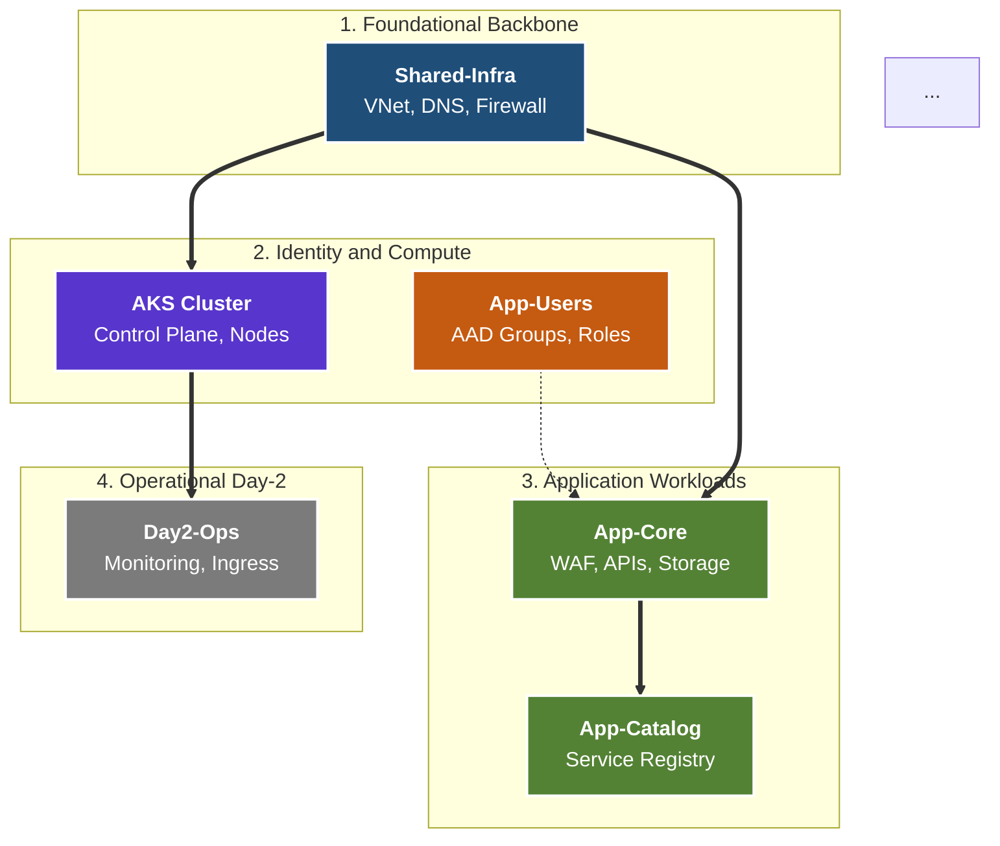
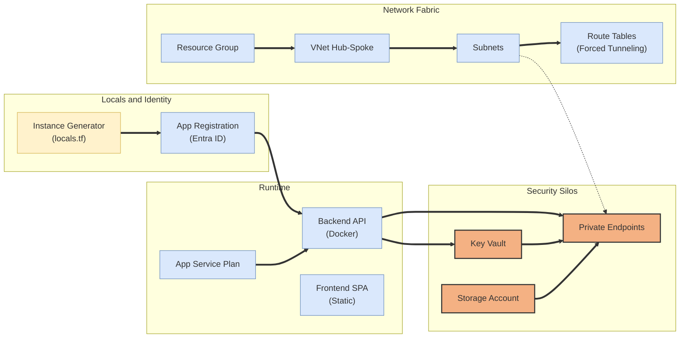

[ Previous: 212. Variable Architecture](212-TERRAFORM_VARIABLE_ARCHITECTURE_AND_DATA_STRATEGY.md) | [ Home](../README.md) | [ Next: 311. Hub-Spoke Backbone](311-SHARED_INFRA_NETWORKING_HUB_SPOKE_BACKBONE.md)

---

# 221. Visualizations

---

##  Table of Contents

- [1. Global Module Dependency Stack](#1-global-module-dependency-stack)
- [2. Internal Resource Dependency Graph (App-Core Example)](#2-internal-resource-dependency-graph-app-core-example)
- [3. Generating Graphs Manually](#3-generating-graphs-manually)
    - [3.1 Prerequisites](#31-prerequisites)
    - [3.2 Execution](#32-execution)
- [4. Architectural Insights: Dependency Types](#4-architectural-insights-dependency-types)
- [5. Validated Reference Library (Official and Community)](#5-validated-reference-library-official-and-community)

---

## 1. Global Module Dependency Stack

The following diagram illustrates the high-level orchestration order and data flow between the different infrastructure "Stacks" (Root Modules).

> **Architectural Note**: In production, each block below represents a sovereign Git repository within a **Federated Multi-Repo** setup. Dependencies are resolved via Data Sources or Pipeline artifacts rather than direct internal links.



## 2. Internal Resource Dependency Graph (App-Core Example)

This diagram visualizes how resources within a single module (App-Core) are programmatically linked. This is a representation of the implicit and explicit dependencies created via HCL referential linking.



## 3. Generating Graphs Manually

To generate a real-time dependency graph from the current state of any module, you can use the built-in Terraform command combined with Graphviz (`dot`).

### 3.1 Prerequisites

### 3.2 Execution
1. Navigate to the module directory (e.g., `Shared-Infra/terraform-manifests/`).
2. Initialize the module: `terraform init`.
3. Run the graph command:
```bash
terraform graph | dot -Tpng > architecture_dependency_graph.png
```

## 4. Architectural Insights: Dependency Types

| Dependency Type | Implementation in Code | Architectural Impact |
| :--- | :--- | :--- |
| **Implicit** | `subnet_id = azurerm_subnet.main.id` | Terraform automatically calculates the correct creation order. |
| **Explicit** | `depends_on = [azurerm_key_vault.main]` | Used for cross-provider dependencies (e.g., Helm waiting for AKS). |
| **Data-Driven** | `data.azurerm_vnet.hub.id` | Allows decoupling of "Stacks" (Shared-Infra vs App-Core). |
| **Identity-Driven** | `principal_id = azurerm_user_assigned_identity.main.id` | Core of the Zero-Trust security model. |

---

## 5. Validated Reference Library (Official and Community)

- **[HashiCorp: Terraform Graph Command Reference](https://developer.hashicorp.com/terraform/cli/commands/graph)**
- **[Pluralith: Automated Terraform Infrastructure Diagrams](https://www.pluralith.com/)**
- **[Rover: Interactive Terraform Visualizer](https://github.com/im2nguyen/rover)**
- **[Inframap: Read Terraform State and Draw a Graph](https://github.com/cycloidio/inframap)**
- **[Mermaid.js: Diagramming and Charting Tool](https://mermaid.js.org/)**
- **[Graphviz: Open Source Graph Visualization Software](https://graphviz.org/)**

---

[ Previous: 212. Variable Architecture](212-TERRAFORM_VARIABLE_ARCHITECTURE_AND_DATA_STRATEGY.md) | [ Home](../README.md) | [ Next: 311. Hub-Spoke Backbone](311-SHARED_INFRA_NETWORKING_HUB_SPOKE_BACKBONE.md)

---

*Technical Documentation: Terraform Visualizations and Dependency Graphs | Vision 2026 Architectural Guide*