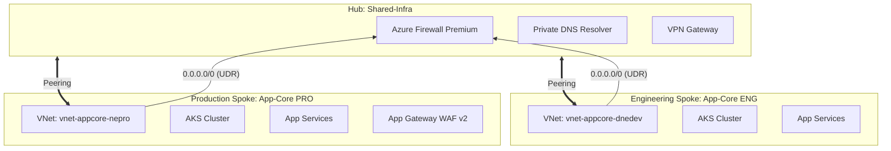
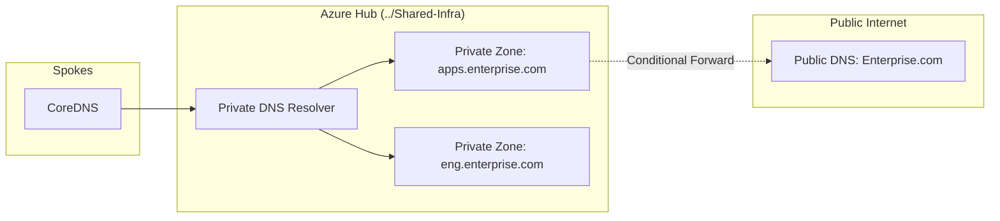

[ Previous: 221. Visualizations](221-TERRAFORM_VISUALIZATIONS_AND_DEPENDENCY_GRAPHS.md) | [ Home](../README.md) | [ Next: 312. DNS Ecosystem](312-NETWORKING_AND_DNS_ECOSYSTEM.md)

---

# 311. Hub-Spoke Backbone

---

##  Table of Contents

- [1. Architectural Blueprint: Symmetrical Hub-Spoke](#1-architectural-blueprint-symmetrical-hub-spoke)
    - [1.1 Key Principles:](#11-key-principles)
- [2. The Networking Hub (../Shared-Infra)](#2-the-networking-hub-shared-infra)
    - [2.1 Hub Components](#21-hub-components)
    - [2.2 Regional Naming Synergy](#22-regional-naming-synergy)
- [3. Spoke Connectivity and Isolation](#3-spoke-connectivity-and-isolation)
    - [3.1 VNet Peering](#31-vnet-peering)
    - [3.2 Private Endpoints (Private Link)](#32-private-endpoints-private-link)
- [4. DNS Orchestration: Private Resolver and Multi-Tier Resolution](#4-dns-orchestration-private-resolver-and-multi-tier-resolution)
    - [4.1 DNS Hierarchy](#41-dns-hierarchy)
    - [4.2 Implementation Detail](#42-implementation-detail)
- [5. Network Security: Forced Tunneling and Firewall Premium](#5-network-security-forced-tunneling-and-firewall-premium)
    - [5.1 Route Table Logic](#51-route-table-logic)
    - [5.2 Edge Security (WAF v2)](#52-edge-security-waf-v2)
- [6. Inventory of Networking Resources](#6-inventory-of-networking-resources)
- [7. Best Practices and Networking Roadmap](#7-best-practices-and-networking-roadmap)
    - [7.1 Modernization Path](#71-modernization-path)
- [8. Validated Reference Library (Official and Community)](#8-validated-reference-library-official-and-community)

---

## 1. Architectural Blueprint: Symmetrical Hub-Spoke

The ecosystem utilizes a **Symmetrical Hub-Spoke model** to achieve absolute environment isolation while centralizing security controls. The Hub acts as the single inspection point for all internet-bound traffic.



### 1.1 Key Principles:
*   **Zero-Trust Egress**: No spoke can reach the internet directly. All traffic is subject to IDPS and TLS inspection at the Hub.
*   **Regional Autonomy**: Hubs are deployed per region (e.g., `northeurope`, `centralus`) to minimize latency and ensure regional sovereignty.

## 2. The Networking Hub (../Shared-Infra)

The Hub is the "Central Nervous System" of the region. It hosts the shared services required by all spokes.

### 2.1 Hub Components
*   **Virtual Network**: The foundational VNet (e.g., `vnet-sharedinfra-pro`).
*   **Azure Firewall Premium**: Provides L3-L7 protection, including Intrusion Detection and Prevention (IDPS).
*   **Private DNS Resolver**: Enables seamless name resolution between Azure VNets and On-Premises environments.

### 2.2 Regional Naming Synergy
Resource names are derived from the Logic Engine defined in `locals.tf`:
*   **Pattern**: `vnet-sharedinfra-${local.instance_environment}`
*   **Evidence**: [`Shared-Infra/terraform-manifests/modules/sharedinfra_dns_module/05-vnet.tf`](../Shared-Infra/terraform-manifests/modules/sharedinfra_dns_module/05-vnet.tf).

## 3. Spoke Connectivity and Isolation

Spokes are isolated silos for specific workloads (e.g., `App-Core`, `AKS`).

### 3.1 VNet Peering
Connectivity is established via **Virtual Network Peering**. 
*   **Configuration**: `allow_forwarded_traffic = true` and `allow_gateway_transit = true` on the Hub to allow spokes to use the Hub's VPN and Firewall.
*   **Spoke Isolation**: Spokes are **not** peered with each other. All inter-spoke traffic must pass through the Hub (East-West inspection).

### 3.2 Private Endpoints (Private Link)
To ensure PaaS services (Key Vault, Storage, Cosmos DB) never touch the public internet, we utilize **Azure Private Link**.
*   **Implementation**: Services are injected into the spoke's `snet-pe-*` (Private Endpoint) subnet.
*   **DNS Integration**: Linked to Private DNS Zones in the Hub for automatic resolution.

## 4. DNS Orchestration: Private Resolver and Multi-Tier Resolution

The project implements a complex multi-tier DNS resolution strategy to handle Cloud-Native and Hybrid workloads.

### 4.1 DNS Hierarchy


### 4.2 Implementation Detail
Defined in [`06-dns.tf`](../Shared-Infra/terraform-manifests/modules/sharedinfra_dns_module/06-dns.tf):
*   **Resource**: `azurerm_dns_zone` and `azurerm_private_dns_zone`.
*   **Dynamic Linking**: Virtual Networks are programmatically linked to the corresponding DNS zones based on the environment tier (ENG vs PRO).

## 5. Network Security: Forced Tunneling and Firewall Premium

The "Crown Jewel" of the network security model is the implementation of **Forced Tunneling** via User Defined Routes (UDR).

### 5.1 Route Table Logic
Workload subnets are associated with a Route Table that redirects all non-local traffic to the Firewall.

```hcl
resource "azurerm_route_table" "force_tunneling" {
  name                          = "rt-force-fw-${local.instance_suffix}"
  route {
    name                   = "Firewall_Default"
    address_prefix         = "0.0.0.0/0"
    next_hop_type          = "VirtualAppliance"
    next_hop_in_ip_address = var.firewall_private_ip
  }
}
```

### 5.2 Edge Security (WAF v2)
For public-facing traffic, the **Application Gateway WAF v2** acts as the L7 entry point.
*   **TLS Termination**: Managed via Key Vault certificates.
*   **L7 Inspection**: OWASP 3.2 ruleset enabled in `Detection` or `Prevention` mode.

## 6. Inventory of Networking Resources

| Resource Type | Purpose | File Reference |
| :--- | :--- | :--- |
| `azurerm_virtual_network` | Regional backbone. | [`05-vnet.tf`](../Shared-Infra/terraform-manifests/modules/sharedinfra_dns_module/05-vnet.tf) |
| `azurerm_dns_zone` | External name resolution. | [`06-dns.tf`](../Shared-Infra/terraform-manifests/modules/sharedinfra_dns_module/06-dns.tf) |
| `azurerm_private_dns_zone` | Internal service discovery. | [`dns.tf`](../Shared-Infra/terraform-manifests/modules/dns_top_level_domain_module/dns.tf) |
| `azurerm_route_table` | Enforces forced tunneling. | [`05-vnet.tf`](../App-Core/terraform-manifests/modules/appcore_module/05-vnet.tf) |
| `azurerm_subnet` | Micro-segmentation (AKS, App, PE). | [`15-virtual-network.tf`](../AKS/terraform-manifests/modules/sharedinfra_aks_module/15-virtual-network.tf) |

## 7. Best Practices and Networking Roadmap

### 7.1 Modernization Path
1.  **Azure Virtual WAN (vWAN)**: Transition from manual Hub-Spoke to vWAN for global automated routing and improved SD-WAN integration.
2.  **Firewall Policy-as-Code**: Migrating from classic rules to `azurerm_firewall_policy` for centralized management across all regions.
3.  **DNS Private Resolver**: Full adoption of the managed resolver service to replace legacy VM-based forwarders.

---

## 8. Validated Reference Library (Official and Community)

*   **[Azure Networking Architecture Best Practices](https://github.com/Azure/azure-network-security)**
*   **[Terraform Provider: AzureRM Network](https://registry.terraform.io/providers/hashicorp/azurerm/latest/docs/resources/virtual_network)**
*   **[Advanced DNS Resolution Strategies](https://dzone.com/refcardz/dns)**

---

[ Previous: 221. Visualizations](221-TERRAFORM_VISUALIZATIONS_AND_DEPENDENCY_GRAPHS.md) | [ Home](../README.md) | [ Next: 312. DNS Ecosystem](312-NETWORKING_AND_DNS_ECOSYSTEM.md)

---

*Technical Documentation: Shared Infrastructure: Networking Backbone and Hub-Spoke Architecture | Vision 2026 Architectural Guide*