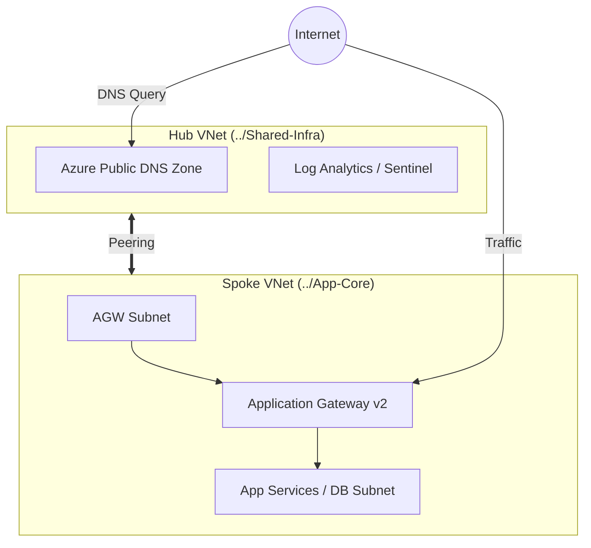
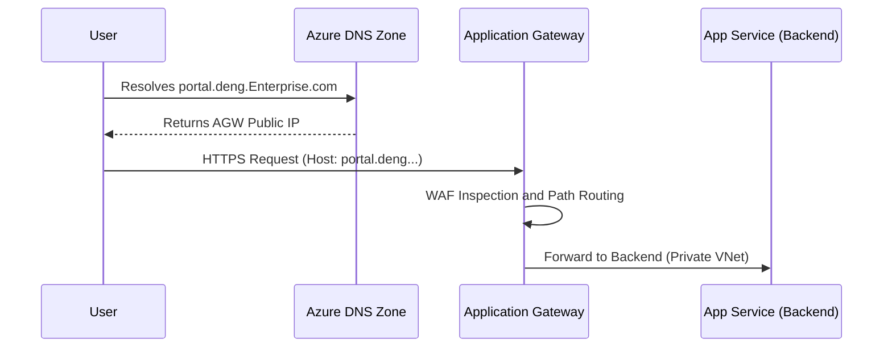

[ Previous: 311. Hub-Spoke Backbone](311-SHARED_INFRA_NETWORKING_HUB_SPOKE_BACKBONE.md) | [ Home](../README.md) | [ Next: 313. App Gateway Deep Dive](313-APP_GATEWAY_DEEP_DIVE.md)

---

# 312. DNS Ecosystem

---

##  Table of Contents

- [1. Reverse Engineering of Connectivity and Resolution (Vision 2026)](#1-reverse-engineering-of-connectivity-and-resolution-vision-2026)
- [2. Network Topology: Hub and Spoke Model](#2-network-topology-hub-and-spoke-model)
- [3. DNS Hierarchy and Delegation Strategy](#3-dns-hierarchy-and-delegation-strategy)
    - [3.1 The Hierarchy](#31-the-hierarchy)
    - [3.2 DNS Zones Logic](#32-dns-zones-logic)
- [4. Integration: DNS -> Application Gateway](#4-integration-dns---application-gateway)
- [5. Security: Private Link and VNet Isolation](#5-security-private-link-and-vnet-isolation)
- [6. Environment-Driven Naming Conventions](#6-environment-driven-naming-conventions)
- [7. Validated Reference Library (Official and Community)](#7-validated-reference-library-official-and-community)

---

## 1. Reverse Engineering of Connectivity and Resolution (Vision 2026)

This document provides a comprehensive analysis of the network fabric and DNS strategy implemented in this repository. It explains how the **Shared-Infra (Hub)** and **Application Spokes** are interconnected and how the DNS hierarchy enables seamless traffic flow to the Application Gateway.

## 2. Network Topology: Hub and Spoke Model

The repository implements a **decoupled networking strategy** to limit blast radius and centralize common services.

*   **Shared-Infra (Hub)**: Managed in [`Shared-Infra/terraform-manifests/modules/sharedinfra_dns_module/`](../Shared-Infra/terraform-manifests/modules/sharedinfra_dns_module/). It hosts the parent DNS zones and global monitoring resources.
*   **App-Core (Spoke)**: Defined in [`App-Core/terraform-manifests/modules/appcore_module/05-vnet.tf`](../App-Core/terraform-manifests/modules/appcore_module/05-vnet.tf). It uses a per-environment CIDR (`var.vnet_cidr`).

## 3. DNS Hierarchy and Delegation Strategy

We use a **Parent-Child DNS architecture** to manage domains across different environments and Git branches.

### 3.1 The Hierarchy
*   **Root (External)**: `Enterprise.com` (Managed externally or in a top-level subscription).
*   **Parent Zone (Hub)**: `deng.Enterprise.com` or `apps.Enterprise.com`.
*   **Child Zones (Spoke)**: Dynamically calculated in [`locals.tf`](../App-Core/terraform-manifests/modules/appcore_module/03-locals.tf).

### 3.2 DNS Zones Logic
The implementation in [`06-dns.tf`](../Shared-Infra/terraform-manifests/modules/sharedinfra_dns_module/06-dns.tf) creates zones based on the environment:
*   **ENG Environments**: `*.eng.Enterprise.com`
*   **PRO Environments**: `*.apps.Enterprise.com`
*   **Branch Isolation**: If on `develop`, the code prefixes names with `d` (e.g., `deng`), allowing parallel testing of DNS records without affecting production.

## 4. Integration: DNS -> Application Gateway

The connection between DNS and the Application Gateway (AGW) is the most critical part of the traffic flow.

1.  **Public IP**: The AGW uses a **Static Standard Public IP** defined in [`05-vnet.tf`](../App-Core/terraform-manifests/modules/appcore_module/05-vnet.tf#L46).
2.  **CNAME/A Records**: DNS records are created to point to this Public IP's FQDN or IP address.
3.  **Host Names**: The AGW Listeners (defined in [`21-app-gateway.tf`](../App-Core/terraform-manifests/modules/appcore_module/21-app-gateway.tf)) are configured with `host_names` that match the records in the DNS Zone.

## 5. Security: Private Link and VNet Isolation

To ensure a **Zero Trust** posture, the repository emphasizes private communication:

*   **Subnet Segmentation**: The AGW has its own subnet ([`appcore_agw`](../App-Core/terraform-manifests/modules/appcore_module/05-vnet.tf#L12)), isolated from the application logic.
*   **UDR and Routing**: The code includes commented-out logic for **User Defined Routes (UDRs)** to force traffic through a firewall if needed.
*   **Private Endpoints**: Integration for services like Key Vault and SQL (handled in the application modules) ensures that backends don't expose public IPs.

## 6. Environment-Driven Naming Conventions

The network resources follow a strict naming convention to ensure global uniqueness and clarity.

| Resource Type | Pattern | Example (Dev Branch) |
| :--- | :--- | :--- |
| **VNet** | `vnet-{product}-{instance_env}` | `vnet-appcore-dnedev` |
| **Subnet** | `snet-{product}-{instance_env}` | `snet-appcore-dnedev` |
| **Public IP** | `pip-agw-{product}-{instance_env}` | `pip-agw-appcore-dnedev` |
| **DNS Zone** | `{branch_env}.Enterprise.com` | `deng.Enterprise.com` |

*Refer to [`03-locals.tf`](../App-Core/terraform-manifests/modules/appcore_module/03-locals.tf) for the full naming logic.*

---

## 7. Validated Reference Library (Official and Community)

*   **[azurerm_virtual_network_dns_servers (Terraform)](https://registry.terraform.io/providers/hashicorp/azurerm/latest/docs/resources/virtual_network_dns_servers)**: Critical note on why we avoid in-line DNS definitions to prevent state conflicts.
*   **[Application Gateway UDR Direct Internet Issue](https://github.com/hashicorp/terraform-provider-azurerm/issues/7889)**: A known issue documented in our code regarding AGW and Route Tables.

---

[ Previous: 311. Hub-Spoke Backbone](311-SHARED_INFRA_NETWORKING_HUB_SPOKE_BACKBONE.md) | [ Home](../README.md) | [ Next: 313. App Gateway Deep Dive](313-APP_GATEWAY_DEEP_DIVE.md)

---

*Technical Documentation: Networking and DNS Ecosystem: The Backbone Architecture | Vision 2026 Architectural Guide*