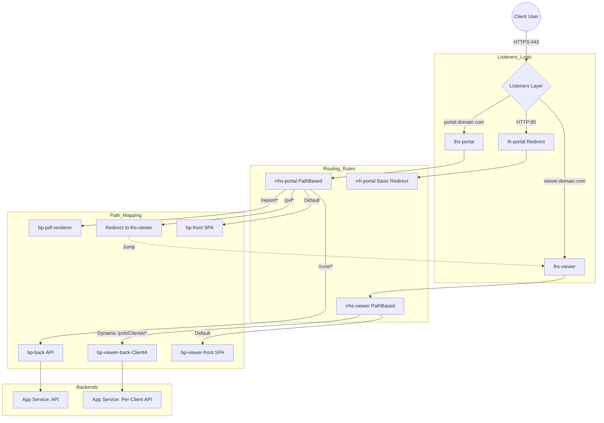

[ Previous: 312. DNS Ecosystem](312-NETWORKING_AND_DNS_ECOSYSTEM.md) | [ Home](../README.md) | [ Next: 314. Azure WAF Improvements](314-AZURE_WAF_IMPROVEMENTS.md)

---

# 313. App Gateway Deep Dive

---

##  Table of Contents

- [1. Technical Engineering and Reverse Engineering Manifesto (Vision 2026)](#1-technical-engineering-and-reverse-engineering-manifesto-vision-2026)
- [2. Core Architectural Topology](#2-core-architectural-topology)
- [3. Logical Traffic Flow](#3-logical-traffic-flow)
- [4. Deep Dive: Components and Configurations](#4-deep-dive-components-and-configurations)
    - [4.1 Frontend and Ports](#41-frontend-and-ports)
    - [4.2 Health Probes (The Sentinel)](#42-health-probes-the-sentinel)
- [5. The Magic of Dynamic Multi-Tenancy (Loops)](#5-the-magic-of-dynamic-multi-tenancy-loops)
    - [5.1 How the Loop Works](#51-how-the-loop-works)
    - [5.2 Matrix: Dynamic Logic Mapping](#52-matrix-dynamic-logic-mapping)
- [6. WAF and Perimeter Security Strategy](#6-waf-and-perimeter-security-strategy)
- [7. SSL/TLS and Key Vault Governance](#7-ssltls-and-key-vault-governance)
- [8. Advanced Routing: Rewrites and Redirects](#8-advanced-routing-rewrites-and-redirects)
    - [8.1 Rewrite Rule Set (`rh-default`)](#81-rewrite-rule-set-rh-default)
    - [8.2 The Cross-Listener Jump (`rchs-portal_rr-viewer`)](#82-the-cross-listener-jump-rchs-portal_rr-viewer)
- [9. Environment and Branch Matrix](#9-environment-and-branch-matrix)
- [10. Operations: Metrics and Monitoring](#10-operations-metrics-and-monitoring)
- [11. Validated Reference Library (Official and Community)](#11-validated-reference-library-official-and-community)

---

## 1. Technical Engineering and Reverse Engineering Manifesto (Vision 2026)

This document provides an exhaustive, line-by-line analysis of the Application Gateway (AGW) implementation in this repository. It serves as a master reference for Cloud Architects and DevOps Engineers, bridging the gap between basic configuration and enterprise-grade multi-tenant orchestration.

## 2. Core Architectural Topology

The AGW acts as the **Regional Entry Point** for all "App-Core" services. It is deployed within a dedicated subnet in the Spoke VNet, following the Hub-Spoke model.

*   **SKU**: `WAF_v2` (Standard v2 with integrated WAF capabilities).
*   **Capacity**: `Autoscale` enabled (`0 to 10` units), ensuring cost-optimization during idle times and high-availability during peaks.
*   **Networking**: Occupies a specialized subnet defined in [`05-vnet.tf`](../App-Core/terraform-manifests/modules/appcore_module/05-vnet.tf).
*   **IP Allocation**: Uses a Static Public IP (Standard SKU) to prevent FQDN breaks during updates.

## 3. Logical Traffic Flow

The following diagram illustrates how a request from a specific client (Tenant) is processed through the layers of the AGW, including the cross-listener redirect logic.

## 4. Deep Dive: Components and Configurations

### 4.1 Frontend and Ports
We expose three main interfaces:
*   **Port 80**: For HTTP to HTTPS redirection ([`Line 245`](../App-Core/terraform-manifests/modules/appcore_module/21-app-gateway.tf#L245)).
*   **Port 443**: Primary secure entry point for Portal and Viewer.
*   **Port 4200**: Dedicated port for specialized viewer traffic analysis ([`Line 322`](../App-Core/terraform-manifests/modules/appcore_module/21-app-gateway.tf#L322)).

### 4.2 Health Probes (The Sentinel)
Our probes are sophisticated. We don't just check for "200 OK"; we validate ranges `200-399` to allow for internal redirects or authorized challenges during the handshake ([`Line 210`](../App-Core/terraform-manifests/modules/appcore_module/21-app-gateway.tf#L210)).
*   **Host Persistence**: Probes pick the host name dynamically from the backend HTTP settings ([`pick_host_name_from_backend_http_settings = true`](../App-Core/terraform-manifests/modules/appcore_module/21-app-gateway.tf#L214)).

## 5. The Magic of Dynamic Multi-Tenancy (Loops)

This is the most advanced part of our Terraform logic. We use **Iterators** to manage hundreds of clients with a single block of code.

### 5.1 How the Loop Works
We iterate over `var.client_names` to generate:
1.  **Backend Address Pools**: One per client ([`Line 326`](../App-Core/terraform-manifests/modules/appcore_module/21-app-gateway.tf#L326)).
2.  **HTTP Settings**: Custom timeouts (1800s) for heavy data processing ([`Line 414`](../App-Core/terraform-manifests/modules/appcore_module/21-app-gateway.tf#L414)).
3.  **URL Path Rules**: Context-aware routing ([`Line 393`](../App-Core/terraform-manifests/modules/appcore_module/21-app-gateway.tf#L393)).

### 5.2 Matrix: Dynamic Logic Mapping

| Resource Type | Iterator | Key Suffix | Purpose | Code Ref |
| :--- | :--- | :--- | :--- | :--- |
| `backend_address_pool` | `myclient` | `-back-${val}` | Isolation of backend APIs. | [Line 326](../App-Core/terraform-manifests/modules/appcore_module/21-app-gateway.tf#L326) |
| `path_rule` | `path_rule.value` | `/pvb/${val}/*` | Dynamic URL routing per tenant. | [Line 393](../App-Core/terraform-manifests/modules/appcore_module/21-app-gateway.tf#L393) |
| `backend_http_settings`| `backend_http_settings`| `-back-${val}` | Specific timeouts per client. | [Line 414](../App-Core/terraform-manifests/modules/appcore_module/21-app-gateway.tf#L414) |

## 6. WAF and Perimeter Security Strategy

The AGW runs in **Detection Mode** with **OWASP 3.2**.

*   **Implementation**: [`Line 104`](../App-Core/terraform-manifests/modules/appcore_module/21-app-gateway.tf#L104).
*   **Security Insight**: The detection mode allows us to audit traffic before switching to `Prevention`, avoiding false positives in complex multi-tenant requests.

## 7. SSL/TLS and Key Vault Governance

We implement **Zero-Trust for Certificates**. The AGW fetches certificates via a **User-Assigned Managed Identity**.

*   **Key Vault Integration**: Managed in [`22-key-vault-app-gateway.tf`](../App-Core/terraform-manifests/modules/appcore_module/22-key-vault-app-gateway.tf).
*   **SNI Enforcement**: Mandatory to support multiple domains on a single IP ([`require_sni = true`](../App-Core/terraform-manifests/modules/appcore_module/21-app-gateway.tf#L198)).

## 8. Advanced Routing: Rewrites and Redirects

### 8.1 Rewrite Rule Set (`rh-default`)
We use a global rewrite set ([`Line 303`](../App-Core/terraform-manifests/modules/appcore_module/21-app-gateway.tf#L303)) to obfuscate the backend infrastructure.
*   **Action**: Modifies the `Server` response header to the value `Enterprise`.
*   **Purpose**: Prevents server-type fingerprinting (e.g., hiding that we are using Kestrel or Nginx).

### 8.2 The Cross-Listener Jump (`rchs-portal_rr-viewer`)
This is a high-level pattern ([`Line 402`](../App-Core/terraform-manifests/modules/appcore_module/21-app-gateway.tf#L402)).
*   **Scenario**: A user hits `portal.com/pvf`.
*   **Action**: The AGW performs a **Permanent Redirect** to the `lhs-viewer` listener.
*   **Why?**: This allows us to keep the main portal routing clean while offloading "Viewer" traffic to a dedicated logical pipeline.

## 9. Environment and Branch Matrix

| Branch | Environment | DNS Suffix | Resource Name Example |
| :--- | :--- | :--- | :--- |
| `main` | `pro` | `.apps.ent.com` | `agw-appcore-pro` |
| `develop` | `dev` | `.deng.ent.com` | `agw-appcore-dnedev` |
| `feature/x` | `qa` | `.deng.ent.com` | `agw-appcore-dneqa` |

*Refer to the complex `locals.tf` logic in [`03-locals.tf`](../App-Core/terraform-manifests/modules/appcore_module/03-locals.tf) for the environment generator details.*

## 10. Operations: Metrics and Monitoring

To manage this AGW in production, we monitor these 4 golden metrics:

1.  **Backend Last Byte Response Time**: Critical for our 1800s timeout settings.
2.  **WAF Total Requests**: Categorized by `Blocked` vs `Matched`.
3.  **Throughput**: Managed via the `Autoscale` units.
4.  **Failed Requests**: Filtered by backend pool to identify tenant-specific issues.

---

## 11. Validated Reference Library (Official and Community)

*   **[Dynamic Blocks Iterator Logic (Terraform)](https://www.terraform.io/language/expressions/dynamic-blocks)**: Best practices for managing `for_each` in complex resources like Application Gateway.
*   **[Azure Application Gateway Certificate Gotchas](http://blog.repsaj.nl/index.php/2019/08/azure-application-gateway-certificate-gotchas/)**: Critical troubleshooting for WAF v2 certificate chains.
*   **[Multi-Subscription Governance with Terraform](https://samcogan.com/deploying-to-multiple-azure-subscriptions-with-terraform/)**: Architectural blueprint for segregating environments across subscriptions.

---

[ Previous: 312. DNS Ecosystem](312-NETWORKING_AND_DNS_ECOSYSTEM.md) | [ Home](../README.md) | [ Next: 314. Azure WAF Improvements](314-AZURE_WAF_IMPROVEMENTS.md)

---

*Technical Documentation: Azure Application Gateway: The Ultimate Deep Dive | Vision 2026 Architectural Guide*