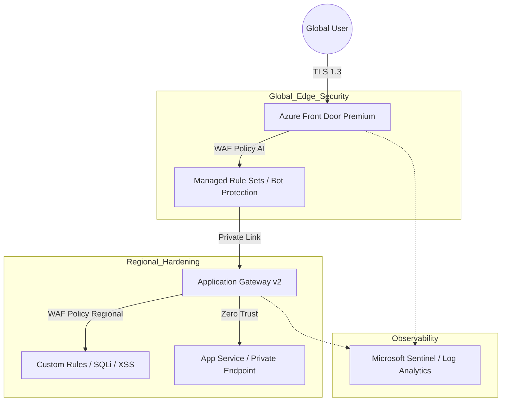

[ Previous: 313. App Gateway Deep Dive](313-APP_GATEWAY_DEEP_DIVE.md) | [ Home](../README.md) | [ Next: 321. Microsoft Entra ID Integration](321-MICROSOFT_ENTRA_ID_INTEGRATION.md)

---

# 314. Azure WAF Improvements

---

##  Table of Contents

- [1. Unified Defense-in-Depth and Intelligent Perimeter Protection](#1-unified-defense-in-depth-and-intelligent-perimeter-protection)
- [2. Current State Analysis (Legacy 2024)](#2-current-state-analysis-legacy-2024)
    - [2.1 Secure Traffic Flow Diagram (Zero Trust)](#21-secure-traffic-flow-diagram-zero-trust)
- [3. Technical Improvement Pillars](#3-technical-improvement-pillars)
    - [3.1 Policy Decoupling (Policy as Code)](#31-policy-decoupling-policy-as-code)
    - [3.2 Advanced Bot and Zero-Day Protection](#32-advanced-bot-and-zero-day-protection)
    - [3.3 Private Connectivity (Private Backends)](#33-private-connectivity-private-backends)
- [4. Implementation and Evidence Matrix](#4-implementation-and-evidence-matrix)
- [5. Observability and Security Operations (SecOps)](#5-observability-and-security-operations-secops)
- [6. Next Steps (Roadmap)](#6-next-steps-roadmap)
- [7. Validated Reference Library (Official and Community)](#7-validated-reference-library-official-and-community)

---

## 1. Unified Defense-in-Depth and Intelligent Perimeter Protection

This document redefines the perimeter security strategy for the repository's Cloud ecosystem, evolving from isolated regional configurations to a **Unified Edge Defense** architecture based on 2026 standards.

## 2. Current State Analysis (Legacy 2024)

Currently, the web security implementation is based on an *inline* configuration within the Application Gateway resource.

*   **Code Evidence:** [`App-Core/terraform-manifests/modules/appcore_module/21-app-gateway.tf`](../App-Core/terraform-manifests/modules/appcore_module/21-app-gateway.tf#L104-L109)
*   **Limitations:** 
    *   Use of embedded `waf_configuration` (makes policy reuse difficult).
    *   `Detection` mode (only detection, no active mitigation).
    *   Dependency on OWASP 3.2 (superseded by DRS 2.1).

In 2026, security does not reside at a single point but in orchestrated layers. We implement a combination of **Azure Front Door (Global Edge)** and **Application Gateway v2 (Regional WAF)**.

### 2.1 Secure Traffic Flow Diagram (Zero Trust)



## 3. Technical Improvement Pillars

### 3.1 Policy Decoupling (Policy as Code)
We are moving away from *inline* configuration to adopt `azurerm_web_application_firewall_policy`. This allows for granular policies per *listener* or even per *path*.

*   **Proposed Improvement:** Migrate the `waf_configuration` block to an independent resource in `App-Core/terraform-manifests/modules/appcore_module/21-app-gateway.tf`.

```hcl
resource "azurerm_web_application_firewall_policy" "waf_policy_2026" {
  name                = "waf-policy-pro-2026"
  resource_group_name = azurerm_resource_group.appcore_rg.name
  location            = local.location

  managed_rules {
    managed_rule_set {
      type    = "Microsoft_DefaultRuleSet"
      version = "2.1" # Advanced Rules Engine 2026
    }
    managed_rule_set {
      type    = "Microsoft_BotManagerRuleSet"
      version = "1.0" # AI-based Bot Protection
    }
  }

  policy_settings {
    enabled                     = true
    mode                        = "Prevention" # Active Mitigation
    request_body_check          = true
    max_request_body_size_in_kb = 128
  }
}
```

### 3.2 Advanced Bot and Zero-Day Protection
Integration of the **Bot Manager Rule Set** to mitigate:
*   **Scraping:** Protection of catalog data in `App-Catalog`.
*   **Credential Stuffing:** Protection of login flows in `App-Users`.

### 3.3 Private Connectivity (Private Backends)
Following the [Architecture Strategy 2026](./111-ARCHITECTURE_2026.md#2-hub-spoke-topology-evolution), backends should no longer expose public FQDNs in the `backend_address_pool`.

*   **Refactoring:** Use of **Private Link Service** to connect the WAF with the backend App Services, eliminating public internet access.

## 4. Implementation and Evidence Matrix

| Technical Improvement | Current State | 2026 Objective | Code Reference |
| :--- | :--- | :--- | :--- |
| **WAF Tier** | WAF_v2 (Inline) | WAF Policy (Decoupled) | [`21-app-gateway.tf:104`](../App-Core/terraform-manifests/modules/appcore_module/21-app-gateway.tf#L104) |
| **Operating Mode** | Detection | Prevention (Mitigation) | [`21-app-gateway.tf:106`](../App-Core/terraform-manifests/modules/appcore_module/21-app-gateway.tf#L106) |
| **OWASP Rules** | CRS 3.2 | DRS 2.1 (Microsoft) | [`21-app-gateway.tf:108`](../App-Core/terraform-manifests/modules/appcore_module/21-app-gateway.tf#L108) |
| **Backends** | Public FQDN | Private Link / Endpoints | [`21-app-gateway.tf:132`](../App-Core/terraform-manifests/modules/appcore_module/21-app-gateway.tf#L132) |
| **TLS** | 1.2 (Variable) | 1.3 Mandatory | [`21-app-gateway.tf:125`](../App-Core/terraform-manifests/modules/appcore_module/21-app-gateway.tf#L125) |

## 5. Observability and Security Operations (SecOps)

Telemetry is centralized in a unified **Log Analytics Workspace**, allowing KQL queries for Threat Hunting:

```kql
// Detection of SQL Injection attacks mitigated in 2026
AzureDiagnostics
| where ResourceProvider == "MICROSOFT.NETWORK" and Category == "ApplicationGatewayFirewallLog"
| where details_message_s contains "SQLi"
| project TimeGenerated, clientIp_s, requestUri_s, action_s, details_message_s
```

## 6. Next Steps (Roadmap)

1.  **Q1 2026:** Migration of `waf_configuration` to `azurerm_web_application_firewall_policy`.
2.  **Q2 2026:** Activation of Front Door Premium as global TLS termination.
3.  **Q3 2026:** Total closure of public access to App Services via NSG + Private Link.

---

## 7. Validated Reference Library (Official and Community)

- **[Microsoft Learn: Azure Web Application Firewall (WAF) Best Practices](https://learn.microsoft.com/en-us/azure/web-application-firewall/ag/best-practices)**
- **[Upgrade to Azure Application Gateway WAF policy](https://learn.microsoft.com/en-us/azure/web-application-firewall/ag/policy-upgrade)**
- **[Troubleshoot and tune Azure WAF for Application Gateway](https://learn.microsoft.com/en-us/azure/web-application-firewall/ag/web-application-firewall-troubleshoot)**
- **[Azure Default Rule Set (DRS) 2.1 for WAF](https://learn.microsoft.com/en-us/azure/web-application-firewall/ag/managed-rules)**
- **[Azure Front Door with WAF: Global Edge Security](https://learn.microsoft.com/en-us/azure/frontdoor/front-door-waf)**
- **[OWASP Top 10: API Security Risks](https://owasp.org/www-project-api-security/)**

---

[ Previous: 313. App Gateway Deep Dive](313-APP_GATEWAY_DEEP_DIVE.md) | [ Home](../README.md) | [ Next: 321. Microsoft Entra ID Integration](321-MICROSOFT_ENTRA_ID_INTEGRATION.md)

---

*Technical Documentation: Azure WAF and Edge Security Strategy | Vision 2026 Architectural Guide*