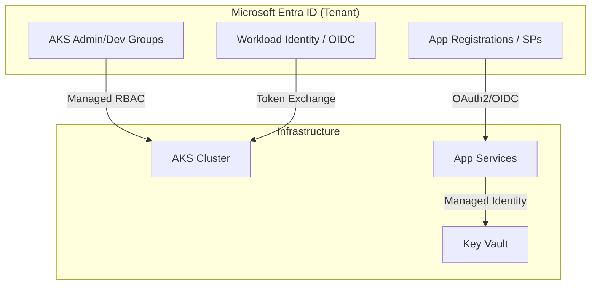

[ Previous: 314. Azure WAF Improvements](314-AZURE_WAF_IMPROVEMENTS.md) | [ Home](../README.md) | [ Next: 322. Identity Governance Automation](322-ENTRA_ID_IDENTITY_GOVERNANCE_AUTOMATION.md)

---

# 321. Microsoft Entra ID Integration

---

##  Table of Contents

- [1. Reverse Engineering of Modern Auth and RBAC Governance (Vision 2026)](#1-reverse-engineering-of-modern-auth-and-rbac-governance-vision-2026)
- [2. Identity Architecture: High-Level Overview](#2-identity-architecture-high-level-overview)
- [3. AKS Security: Managed RBAC and Workload Identity](#3-aks-security-managed-rbac-and-workload-identity)
    - [3.1 Managed Azure AD RBAC](#31-managed-azure-ad-rbac)
    - [3.2 Workload Identity (Modern OIDC)](#32-workload-identity-modern-oidc)
- [4. App Registrations: Multi-Tenant OAuth2 Flow](#4-app-registrations-multi-tenant-oauth2-flow)
    - [4.1 The "Pre-Authorization" Pattern](#41-the-pre-authorization-pattern)
    - [4.2 Dynamic App Regs per Client](#42-dynamic-app-regs-per-client)
- [5. Service-to-Service: Managed Identities (Zero Trust)](#5-service-to-service-managed-identities-zero-trust)
- [6. RBAC Matrix and Security Groups](#6-rbac-matrix-and-security-groups)
- [7. Validated Reference Library (Official and Community)](#7-validated-reference-library-official-and-community)

---

## 1. Reverse Engineering of Modern Auth and RBAC Governance (Vision 2026)

This document provides a deep-dive analysis of the identity and access management (IAM) strategy implemented in this repository. It explains how **Microsoft Entra ID** acts as the new security perimeter, orchestrating access for users, applications, and Kubernetes workloads.

## 2. Identity Architecture: High-Level Overview

The repository treats identity as a fundamental component of the "Infrastructure as Code" (IaC) fabric. We don't just manage users; we orchestrate **Service Principals**, **Managed Identities**, and **App Registrations**.

## 3. AKS Security: Managed RBAC and Workload Identity

We implement the most secure identity model available for AKS:

### 3.1 Managed Azure AD RBAC
Instead of local Kubernetes users, we use **Azure AD Security Groups** for cluster administration.
*   **Implementation**: [`05-aks-administrators-azure-ad.tf`](../AKS/terraform-manifests/modules/sharedinfra_aks_module/05-aks-administrators-azure-ad.tf).
*   **Group Logic**: Separate groups for `AKS Administrators` and `AKS Developers`, ensuring the **Principle of Least Privilege**.

### 3.2 Workload Identity (Modern OIDC)
We have enabled **Workload Identity** ([`06-aks-cluster.tf:41`](../AKS/terraform-manifests/modules/sharedinfra_aks_module/06-aks-cluster.tf#L41)) to eliminate the need for secrets in pods.
*   **Flow**: Pods use a Kubernetes Service Account token, which is exchanged for an Entra ID access token via an OIDC issuer URL.
*   **Code Evidence**: `oidc_issuer_enabled = true` and `workload_identity_enabled = true`.

## 4. App Registrations: Multi-Tenant OAuth2 Flow

The application layer uses sophisticated App Registrations to handle authentication for frontend SPAs and backend APIs.

### 4.1 The "Pre-Authorization" Pattern
We use `azuread_application_pre_authorized` ([`12-app-register-back-api.tf:101`](../App-Core/terraform-manifests/modules/appcore_module/12-app-register-back-api.tf#L101)) to allow the Frontend App to call the Backend API without a separate user consent screen.

### 4.2 Dynamic App Regs per Client
For the `App-Catalog` modules, we dynamically register applications for each tenant:
*   **Implementation**: [`09-app-register.tf`](../App-Catalog/terraform-manifests/modules/appanalysis_module/09-app-register.tf) uses `for_each` over client names.
*   **Permissions**: Each app is granted specific **Microsoft Graph** scopes (e.g., `User.Read`) to allow identity lookup.

## 5. Service-to-Service: Managed Identities (Zero Trust)

We leverage **Managed Identities** to avoid hardcoded credentials in connection strings:

1.  **User-Assigned Identity for AGW**: The Application Gateway uses a dedicated identity to fetch certificates from Key Vault ([`appcore_agw`](../App-Core/terraform-manifests/modules/appcore_module/21-app-gateway.tf#L160)).
2.  **Kubelet Identity**: The AKS cluster nodes use a managed identity to pull images from **Azure Container Registry (ACR)**.

## 6. RBAC Matrix and Security Groups

Naming conventions for security groups are environment-aware:

| Group Name | Scope | Permissions |
| :--- | :--- | :--- |
| `AAD_AKS_Administrators_{env}` | Cluster-Wide | Cluster Admin (Full Control) |
| `AAD_AKS_Developers_{env}` | Namespace | Edit/View inside Spoke namespaces |
| `appr-{product}-{client}-{env}` | App Registration | OAuth2 Client Credentials / Auth |

---

## 7. Validated Reference Library (Official and Community)

*   **[azuread_application_published_app_ids (Terraform)](https://registry.terraform.io/providers/hashicorp/azuread/latest/docs/data-sources/application_published_app_ids)**: Reference for well-known application IDs in Entra ID (Graph, KeyVault, Storage).
*   **[Workload Identity Federation Credentials](https://registry.terraform.io/providers/hashicorp/azuread/latest/docs/resources/application_federated_identity_credential)**: Technical guide for configuring OIDC trust between AKS and Entra ID.

---

[ Previous: 314. Azure WAF Improvements](314-AZURE_WAF_IMPROVEMENTS.md) | [ Home](../README.md) | [ Next: 322. Identity Governance Automation](322-ENTRA_ID_IDENTITY_GOVERNANCE_AUTOMATION.md)

---

*Technical Documentation: Microsoft Entra ID Integration: The Identity Perimeter | Vision 2026 Architectural Guide*