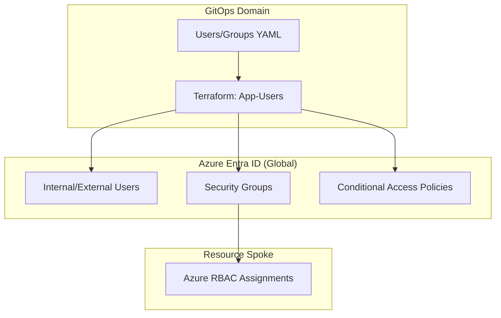

[ Previous: 321. Microsoft Entra ID Integration](321-MICROSOFT_ENTRA_ID_INTEGRATION.md) | [ Home](../README.md) | [ Next: 323. Key Vault Trust Architecture](323-KEY_VAULT_TRUST_ARCHITECTURE.md)

---

# 322. Identity Governance Automation

---

##  Table of Contents

- [1. Architectural Overview: Identity-as-Code](#1-architectural-overview-identity-as-code)
    - [1.1 Key Components:](#11-key-components)
- [2. YAML-Driven User Orchestration](#2-yaml-driven-user-orchestration)
    - [2.1 Technical Logic: The `flatten()` Pattern](#21-technical-logic-the-flatten-pattern)
- [3. Entra ID Group Hierarchy and Role Mapping](#3-entra-id-group-hierarchy-and-role-mapping)
    - [3.1 Naming Convention](#31-naming-convention)
    - [3.2 Dynamic Mapping](#32-dynamic-mapping)
- [4. B2B Collaboration: Guest Invitation Lifecycle](#4-b2b-collaboration-guest-invitation-lifecycle)
- [5. Governance and Security: Conditional Access Policies](#5-governance-and-security-conditional-access-policies)
- [6. Inventory of Identity Resources](#6-inventory-of-identity-resources)
- [7. Best Practices and Identity Roadmap](#7-best-practices-and-identity-roadmap)
    - [7.1 Modernization Path](#71-modernization-path)
- [8. Validated Reference Library (Official and Community)](#8-validated-reference-library-official-and-community)

---

## 1. Architectural Overview: Identity-as-Code

The repository implements a **Federated Identity Model** where the entire lifecycle of users, groups, and permissions is managed through declarative code.



### 1.1 Key Components:
*   **Provider**: `hashicorp/azuread`.
*   **Automation Strategy**: Decoupled YAML configurations for business teams to manage access without touching HCL.

## 2. YAML-Driven User Orchestration

The "Logic Engine" in `App-Users` parses structured YAML files to provision hundreds of identities dynamically.

### 2.1 Technical Logic: The `flatten()` Pattern
The engine utilizes advanced HCL functions to transform nested YAML lists into flat resource maps.
*   **Evidence**: [`06-locals.tf`](../App-Users/terraform-manifests/06-locals.tf).

```hcl
locals {
  load_yaml_users = yamldecode(file("${local.yaml_filename_internal_users}"))
  yaml_internal_users = flatten([
    for user_key, user in local.load_yaml_users : [
      for role in lookup(user, "appcore-admin-role", []) : {
        email = user.email
        role  = role
        # ... additional metadata
      }
    ]
  ])
}
```

## 3. Entra ID Group Hierarchy and Role Mapping

Permissions are never assigned to users directly. Instead, they are mapped to functional **Security Groups**.

### 3.1 Naming Convention
Groups follow a strict taxonomy: `cg-{product}-{center}-{role}-{env}`.
*   **Admin Groups**: `cg-appcore-enterprise-admin_role-nedev`.
*   **User Groups**: `cg-appcore-client-user_role-nepro`.

### 3.2 Dynamic Mapping
Groups are programmatically associated with specific Azure RBAC roles (e.g., `Reader`, `Contributor`) in downstream modules.

## 4. B2B Collaboration: Guest Invitation Lifecycle

The platform automates the onboarding of external partners via **Azure AD B2B**.

*   **Mechanism**: `azuread_invitation`.
*   **Automation**: When an external email is added to [`50-external-users-mainbranch.yaml`](../App-Users-Config/50-external-users-mainbranch.yaml), Terraform automatically triggers a guest invitation and assigns the user to the corresponding tenant group.
*   **Evidence**: [`09-azuread-external-users.tf`](../App-Users/terraform-manifests/09-azuread-external-users.tf).

## 5. Governance and Security: Conditional Access Policies

To fulfill Zero-Trust requirements, the environment enforces **Conditional Access (CA)**.

*   **Policies**:
    *   **MFA Enforcement**: Required for all administrative roles.
    *   **Location-Based Access**: Restricted to corporate VPN ranges.
    *   **Compliant Devices**: Required for accessing Production tiers.
*   **Implementation**: [`12-conditional-access-policy.tf`](../App-Users/terraform-manifests/12-conditional-access-policy.tf).

## 6. Inventory of Identity Resources

| Resource Type | Purpose | File Reference |
| :--- | :--- | :--- |
| `azuread_user` | Lifecycle of internal identities. | [`07-azuread-internal-users.tf`](../App-Users/terraform-manifests/07-azuread-internal-users.tf) |
| `azuread_group` | Functional permission silos. | [`08-azuread-internal-groups.tf`](../App-Users/terraform-manifests/08-azuread-internal-groups.tf) |
| `azuread_invitation` | Automated B2B onboarding. | [`09-azuread-external-users.tf`](../App-Users/terraform-manifests/09-azuread-external-users.tf) |
| `azuread_conditional_access_policy` | Advanced security gates. | [`12-conditional-access-policy.tf`](../App-Users/terraform-manifests/12-conditional-access-policy.tf) |

## 7. Best Practices and Identity Roadmap

### 7.1 Modernization Path
1.  **Entra ID Governance (P2)**: Transitioning from manual YAML to **Entra ID Access Reviews** and **Privileged Identity Management (PIM)** for JIT access.
2.  **Passkey Enforcement**: Phasing out legacy SMS/App MFA in favor of FIDO2-based Passkeys.
3.  **Custom Security Attributes**: Utilizing the new metadata tags in Entra ID to enable dynamic group memberships based on business centers.

---

## 8. Validated Reference Library (Official and Community)

*   **[Terraform Provider: AzureAD Documentation](https://registry.terraform.io/providers/hashicorp/azuread/latest/docs)**
*   **[Advanced YAML Transformation in HCL](https://plainenglish.io/blog/terraform-yaml)**
*   **[Microsoft Graph API for Identity Automation](https://developer.microsoft.com/en-us/graph)**

---

[ Previous: 321. Microsoft Entra ID Integration](321-MICROSOFT_ENTRA_ID_INTEGRATION.md) | [ Home](../README.md) | [ Next: 323. Key Vault Trust Architecture](323-KEY_VAULT_TRUST_ARCHITECTURE.md)

---

*Technical Documentation: Entra ID Identity Governance and IAM Automation | Vision 2026 Architectural Guide*