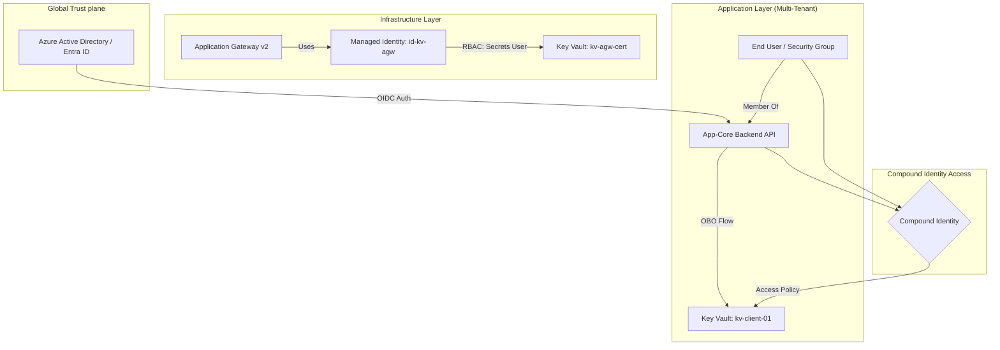
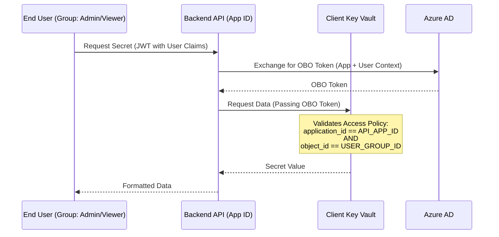

[ Previous: 322. Identity Governance Automation](322-ENTRA_ID_IDENTITY_GOVERNANCE_AUTOMATION.md) | [ Home](../README.md) | [ Next: 324. Security-by-Design Checklist](324-SECURITY_BY_DESIGN_CHECKLIST.md)

---

# 323. Key Vault Trust Architecture

---

##  Table of Contents

- [1. High-Level Trust Model](#1-high-level-trust-model)
- [2. Key Vault Hierarchy: Hub and Spoke Vaults](#2-key-vault-hierarchy-hub-and-spoke-vaults)
- [3. Infrastructure Identity: RBAC Model (AGW)](#3-infrastructure-identity-rbac-model-agw)
- [4. Application Identity: Compound Identity (App-plus-User)](#4-application-identity-compound-identity-app-plus-user)
    - [4.1 The Logic Flow](#41-the-logic-flow)
    - [4.2 Implementation Detail (Terraform)](#42-implementation-detail-terraform)
- [5. Multi-Tenant Secret Isolation](#5-multi-tenant-secret-isolation)
- [6. Hardening: Firewall and Purge Protection](#6-hardening-firewall-and-purge-protection)
- [7. Validated Reference Library (Official and Community)](#7-validated-reference-library-official-and-community)

---

## 1. High-Level Trust Model

The project utilizes two distinct Key Vault types to separate infrastructure secrets from application data.



## 2. Key Vault Hierarchy: Hub and Spoke Vaults

We avoid a monolithic Key Vault to prevent credential exposure across different environments and organizational boundaries.

*   **Hub Key Vault (External)**: Hosts global wildcard certificates (`*.Enterprise.com`) and shared service principals. Referenced via `data` lookups in AKS modules.
*   **Infrastructure Vaults (`kv-agw-cert-*`)**: Dedicated vaults for regional AGW certificates. Defined in [`22-key-vault-app-gateway.tf`](../App-Core/terraform-manifests/modules/appcore_module/22-key-vault-app-gateway.tf).
*   **Tenant Vaults (`kv-{client}-*`)**: Individual vaults per client for tenant-specific connection strings. Defined in [`23-key-vault-clients.tf`](../App-Core/terraform-manifests/modules/appcore_module/23-key-vault-clients.tf).

## 3. Infrastructure Identity: RBAC Model (AGW)

For the Application Gateway integration, the project has transitioned to the modern **Azure RBAC** permission model.

*   **Implementation**: [`27-rbac-azurerm.tf`](../App-Core/terraform-manifests/modules/appcore_module/27-rbac-azurerm.tf)
*   **Managed Identity**: The AGW uses the `appcore_agw` user-assigned identity ([`21-app-gateway.tf`](../App-Core/terraform-manifests/modules/appcore_module/21-app-gateway.tf)).
*   **Trust Mechanism**:
    *   `Key Vault Secrets User`: Allows the AGW instances to retrieve the private key of the certificate for TLS termination.
    *   `Key Vault Certificates Officer`: Allows management and rotation of the certificate object.
*   **Versionless URIs**: The architecture supports automatic rotation by referencing secret identifiers without specifying a version (e.g., `https://kv.vault.azure.net/secrets/cert/`).

## 4. Application Identity: Compound Identity (App-plus-User)

One of the most advanced patterns in this repo is the use of **Compound Identity** for client-specific secrets. This ensures that a user can only access secrets *if and only if* they are accessing them through the authorized Backend API.

### 4.1 The Logic Flow



### 4.2 Implementation Detail (Terraform)

Defined in [`23-key-vault-clients.tf`](../App-Core/terraform-manifests/modules/appcore_module/23-key-vault-clients.tf):

```hcl
resource "azurerm_key_vault_access_policy" "compound_identity_appcore_back_api_app_role_admin" {
  for_each       = toset(var.client_names)
  key_vault_id   = azurerm_key_vault.appcore_keyvault_myclient[each.key].id
  tenant_id      = azuread_service_principal.appcore_back_api.application_tenant_id
  
  # The User/Group Context
  object_id      = azuread_group.appcore_admin_role[each.key].object_id
  
  # The Application Context (Enables Compound Identity)
  application_id = azuread_service_principal.appcore_back_api.application_id
  
  secret_permissions = ["Get", "List"]
}
```

## 5. Multi-Tenant Secret Isolation

For hundreds of clients, we dynamically provision secrets within the vault.

*   **Logic**: `for_each` loops in [`23-key-vault-clients.tf`](../App-Core/terraform-manifests/modules/appcore_module/23-key-vault-clients.tf) generate secrets like `${client}-db` or `${client}-mkey`.
*   **Automated Injection**: Connection strings built in Terraform (e.g., MongoDB Atlas URLs) are injected directly into Key Vault secrets, ensuring they are never exposed in log files or CI/CD console outputs.

## 6. Hardening: Firewall and Purge Protection

Every vault is configured with production-grade security:

1.  **Soft Delete and Purge Protection**: Enabled by default in 2026 standards. Note the `StatusCode=403` error documented in the code when attempting to purge without proper retention logic.
2.  **Firewall Isolation**: The architecture supports "Trusted Services" bypass, allowing Application Gateway to reach the vault even if `default_action = "Deny"`.
3.  **Network Boundaries**: Access is restricted to specific Virtual Network subnets and trusted IP ranges where applicable.

| Feature | Resource / Logic | File Reference |
| :--- | :--- | :--- |
| **Secret Rotation** | Versionless URIs | `27-rbac-azurerm.tf` |
| **Multi-Tenancy** | `for_each` over `client_names` | `23-key-vault-clients.tf` |
| **OBO Flow** | `azuread_application.applink_cloud_api` | `23-key-vault-clients.tf` |
| **RBAC Roles** | `Key Vault Secrets User` | `27-rbac-azurerm.tf` |

---

## 7. Validated Reference Library (Official and Community)

- **[Microsoft Learn: Azure Key Vault security recommendations](https://learn.microsoft.com/en-us/azure/key-vault/general/security-recommendations)**
- **[Azure Key Vault trust architecture and security boundaries](https://learn.microsoft.com/en-us/azure/key-vault/general/security-overview)**
- **[Apply Zero Trust principles to Azure Key Vault](https://learn.microsoft.com/en-us/security/zero-trust/azure-infrastructure-key-vault)**
- **[Best practices for using Key Vault](https://learn.microsoft.com/en-us/azure/key-vault/general/best-practices)**
- **[On-behalf-of (OBO) authentication with Azure AD](https://learn.microsoft.com/en-us/entra/identity-platform/v2-oauth2-on-behalf-of-flow)**
- **[Configure Azure Key Vault firewalls and virtual networks](https://learn.microsoft.com/en-us/azure/key-vault/general/network-security)**

---

[ Previous: 322. Identity Governance Automation](322-ENTRA_ID_IDENTITY_GOVERNANCE_AUTOMATION.md) | [ Home](../README.md) | [ Next: 324. Security-by-Design Checklist](324-SECURITY_BY_DESIGN_CHECKLIST.md)

---

*Technical Documentation: Azure Key Vault: Trust Architecture and Compound Identity Deep-Dive | Vision 2026 Architectural Guide*