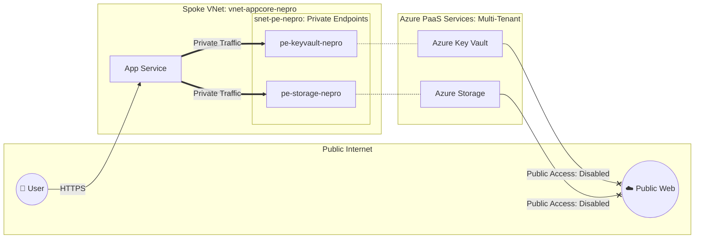
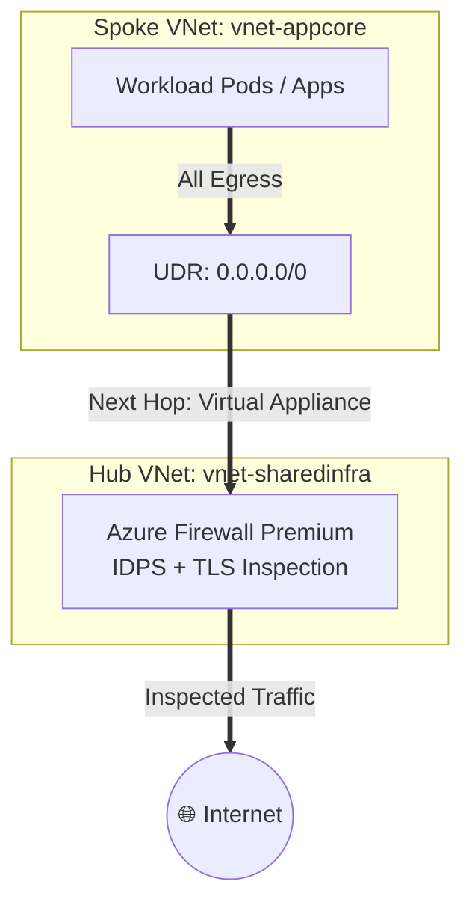

[ Previous: 323. Key Vault Trust Architecture](323-KEY_VAULT_TRUST_ARCHITECTURE.md) | [ Home](../README.md) | [ Next: 331. AKS Compute Hub](331-AKS_COMPUTE_HUB_AND_ML_ORCHESTRATION.md)

---

# 324. Security-by-Design Checklist

---

##  Table of Contents

- [1. Zero Public Endpoints: Private Link Isolation](#1-zero-public-endpoints-private-link-isolation)
- [2. Forced Egress Inspection: Hub Firewall Premium](#2-forced-egress-inspection-hub-firewall-premium)
- [3. CMK Encryption: Customer-Managed Keys](#3-cmk-encryption-customer-managed-keys)
- [4. TLS+ Sovereignty: Hardened Handshakes](#4-tls-sovereignty-hardened-handshakes)
- [5. DDoS Protection: Hub Backbone Safeguard](#5-ddos-protection-hub-backbone-safeguard)
- [6. Defender for Cloud: Unified Security Monitoring](#6-defender-for-cloud-unified-security-monitoring)
- [7. Validated Reference Library (Official and Community)](#7-validated-reference-library-official-and-community)

---

## 1. Zero Public Endpoints: Private Link Isolation

- **Strategic Overview (High-Level)**:
  The attack surface is eliminated by disabling public access to all PaaS services. Applications consume these services exclusively through the Azure internal network using **Private Endpoints**, ensuring that data never traverses the public internet.

- **Technical Implementation (Low-Level)**:
  - **Network Injection**: Resources are projected into dedicated `snet-pe-*` subnets using the `azurerm_private_endpoint` resource.
  - **Access Restriction**: The `public_network_access_enabled = false` parameter is enforced in Storage, Key Vault, and Cosmos DB resources.
  - **Technical Evidence**: Refer to the subnet logic in [Doc 311: Shared Infra Networking](./311-SHARED_INFRA_NETWORKING_HUB_SPOKE_BACKBONE.md).

## 2. Forced Egress Inspection: Hub Firewall Premium

- **Strategic Overview (High-Level)**:
  Implementation of a **Zero-Trust Egress** posture. No resource in the Spoke can communicate with the outside world without passing through the central Hub Firewall, allowing for L7 inspection, FQDN filtering, and intrusion prevention (IDPS).

- **Technical Implementation (Low-Level)**:
  - **Route Table**: An `azurerm_route_table` is associated with each workload subnet.
  - **Forced Tunneling**: A `0.0.0.0/0` route is defined with `next_hop_type = "VirtualAppliance"` pointing to the Azure Firewall's private IP.
  - **Technical Evidence**: Defined in `App-Core/terraform-manifests/modules/appcore_module/05-vnet.tf` (UDR logic).

## 3. CMK Encryption: Customer-Managed Keys

- **Strategic Overview (High-Level)**:
  Ensures data sovereignty by allowing the organization to manage its own encryption keys instead of using Microsoft-managed keys. This complies with strict regulatory standards such as HIPAA or GDPR.

- **Technical Implementation (Low-Level)**:
  - **Key Vault Integration**: RSA keys are stored in Key Vaults protected with "Purge Protection".
  - **Assignment**: The `customer_managed_key` block is used in `azurerm_storage_account` resources and MongoDB Atlas encryption configurations.
  - **Technical Evidence**: Documented as a mitigation strategy in [Doc 01: Architecture Strategy](./01-ARCHITECTURE_2026.md).

## 4. TLS+ Sovereignty: Hardened Handshakes

- **Strategic Overview (High-Level)**:
  Old and insecure SSL/TLS protocol versions (such as SSLv3, TLS 1.0 and 1.1) are prohibited to protect communications against downgrade attacks.

- **Technical Implementation (Low-Level)**:
  - **Storage**: `min_tls_version = "TLS1_2"` in `07-storage-account.tf`.
  - **App Service**: Configuration of `min_tls_version` in the `site_config` block of `azurerm_linux_web_app`.
  - **Technical Evidence**: See security parameters in `App-Core/terraform-manifests/modules/appcore_module/18-app-service-back-api.tf`.

## 5. DDoS Protection: Hub Backbone Safeguard

- **Strategic Overview (High-Level)**:
  Protection against volumetric and flood attacks at the network layer (Layer 3 and 4). By protecting the Hub VNet, the availability of critical entry points like the Firewall and Application Gateway is ensured.

- **Technical Implementation (Low-Level)**:
  - **Protection Plan**: Creation of an `azurerm_network_ddos_protection_plan` resource.
  - **VNet Link**: The Shared Infrastructure VNet is associated with the plan using the `ddos_protection_plan` block.
  - **Technical Evidence**: Referenced in [Doc 08: Shared Infra Networking](./08-SHARED_INFRA_NETWORKING_HUB_SPOKE_BACKBONE.md).

## 6. Defender for Cloud: Unified Security Monitoring

- **Strategic Overview (High-Level)**:
  Provides unified security management and advanced threat protection across hybrid cloud workloads. It acts as the platform's native SOC (Security Operations Center).

- **Technical Implementation (Low-Level)**:
  - **Pricing Tier**: Configuration of `azurerm_security_center_subscription_pricing` to enable the `Standard` tier (or `Free` for basic compliance) across ARM, App Services, Key Vaults, and Containers.
  - **Auto-Provisioning**: Automated enabling of the Log Analytics agent across all VMs and nodes.
  - **Technical Evidence**: Implemented in `Shared-Infra/terraform-manifests/modules/sharedinfra_microsoft_defender_cloud/05-microsoft-defender.tf`.

---

## 7. Validated Reference Library (Official and Community)

- **[Microsoft Well-Architected Framework: Security Design Review Checklist](https://learn.microsoft.com/en-us/azure/well-architected/security/checklist)**
- **[Azure Security Benchmark (ASB) v3: Controls and Guidance](https://learn.microsoft.com/en-us/security/benchmark/azure/introduction)**
- **[Microsoft Security Development Lifecycle (SDL) Practices](https://www.microsoft.com/en-us/securityengineering/sdl/practices)**
- **[Azure Private Link Security Overview](https://learn.microsoft.com/en-us/azure/private-link/private-link-security)**
- **[Zero Trust Egress Security with Azure Firewall](https://learn.microsoft.com/en-us/azure/firewall/zero-trust-egress)**
- **[Microsoft Defender for Cloud: Advanced Workload Protection](https://learn.microsoft.com/en-us/azure/defender-for-cloud/defender-for-cloud-introduction)**

---

[ Previous: 323. Key Vault Trust Architecture](323-KEY_VAULT_TRUST_ARCHITECTURE.md) | [ Home](../README.md) | [ Next: 331. AKS Compute Hub](331-AKS_COMPUTE_HUB_AND_ML_ORCHESTRATION.md)

---

*Technical Documentation: Security-by-Design Checklist: Hardening and Perimeter Defense | Vision 2026 Architectural Guide*