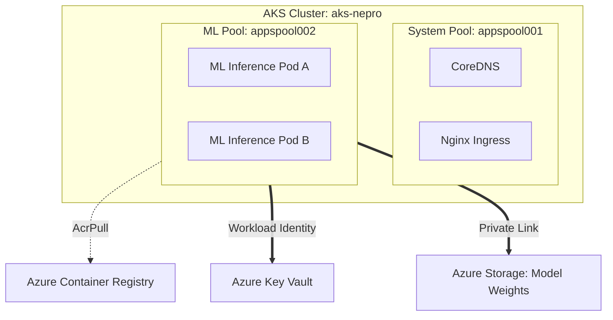

[ Previous: 324. Security-by-Design Checklist](324-SECURITY_BY_DESIGN_CHECKLIST.md) | [ Home](../README.md) | [ Next: 332. AKS Networking Masterclass](332-AKS_NETWORKING_MASTERCLASS.md)

---

# 331. AKS Compute Hub

---

##  Table of Contents

- [1. Architectural Overview: The Compute Hub](#1-architectural-overview-the-compute-hub)
    - [1.1 Key Components:](#11-key-components)
- [2. Specialized Node Pool Strategy](#2-specialized-node-pool-strategy)
    - [2.1 System Node Pool (`appspool001`)](#21-system-node-pool-appspool001)
    - [2.2 Machine Learning Node Pool (`appspool002`)](#22-machine-learning-node-pool-appspool002)
- [3. Machine Learning (ML) Inference Orchestration](#3-machine-learning-ml-inference-orchestration)
- [4. Network Fabric: Azure CNI and Isolation](#4-network-fabric-azure-cni-and-isolation)
    - [4.1 Subnet Segmentation](#41-subnet-segmentation)
- [5. Identity and Security: Workload Identity Federation](#5-identity-and-security-workload-identity-federation)
    - [5.1 The OIDC Trust Chain](#51-the-oidc-trust-chain)
- [6. Kubernetes and Helm Provider Orchestration](#6-kubernetes-and-helm-provider-orchestration)
- [7. Inventory of AKS Resources](#7-inventory-of-aks-resources)
- [8. Best Practices and Kubernetes Roadmap](#8-best-practices-and-kubernetes-roadmap)
    - [8.1 Modernization Path](#81-modernization-path)
- [9. Validated Reference Library (Official and Community)](#9-validated-reference-library-official-and-community)

---

## 1. Architectural Overview: The Compute Hub

The repository orchestrates production-hardened AKS clusters as the primary compute hub for both microservices and data-intensive AI workloads.

### 1.1 Key Components:
*   **Version**: Managed via `var.kubernetes_version` (1.15+ Target).
*   **SKU**: `Standard` (Uptime SLA enabled).
*   **OS SKU**: `AzureLinux` (optimized for performance and security).

## 2. Specialized Node Pool Strategy

To prevent resource contention, the cluster utilizes a **Multi-Node Pool** architecture.

### 2.1 System Node Pool (`appspool001`)
*   **Purpose**: Infrastructure components (Monitoring, Ingress, DNS).
*   **VM Size**: `Standard_DS2_v2`.
*   **Autoscale**: Min: 1, Max: 6.
*   **Evidence**: [`07-aks-cluster-nodepool-001-infra.tf`](../AKS/terraform-manifests/modules/sharedinfra_aks_module/07-aks-cluster-nodepool-001-infra.tf).

### 2.2 Machine Learning Node Pool (`appspool002`)
*   **Purpose**: High-Memory and GPU-accelerated workloads.
*   **VM Size**: `Standard_E8as_v4` (Memory Optimized).
*   **Labels**: `app = mljobs`.
*   **Evidence**: [`08-aks-cluster-nodepool-002-enterprise-ml-jobs.tf`](../AKS/terraform-manifests/modules/sharedinfra_aks_module/08-aks-cluster-nodepool-002-enterprise-ml-jobs.tf).

## 3. Machine Learning (ML) Inference Orchestration

The cluster is pre-configured to host complex AI models. 

*   **Compute Isolation**: ML pods are scheduled exclusively on `appspool002` using node selectors.
*   **Data Persistence**: Model weights and datasets are fetched JIT from **Azure Storage** via Private Endpoints.
*   **Secret Management**: API keys for inference engines are retrieved from **Key Vault** using the AKS Secret Store CSI Driver.

## 4. Network Fabric: Azure CNI and Isolation

The cluster implements a high-performance **Azure CNI** network plugin, providing pods with full VNet connectivity.

### 4.1 Subnet Segmentation
Pods and Nodes are segregated into dedicated subnets to enforce strict Network Security Group (NSG) rules.
*   **Node Subnet**: `azurerm_subnet.aks_nodes_data_plane`.
*   **Pod Subnet**: `azurerm_subnet.aks_pods_data_plane`.
*   **Evidence**: [`15-virtual-network.tf`](../AKS/terraform-manifests/modules/sharedinfra_aks_module/15-virtual-network.tf).

## 5. Identity and Security: Workload Identity Federation

Following the 2026 Zero-Trust standard, the cluster eliminates the need for manual Service Account tokens.

### 5.1 The OIDC Trust Chain
The AKS cluster acts as an **OIDC Issuer**.
1.  **Identity**: A User-Assigned Managed Identity is created for the application.
2.  **Federation**: A federated identity credential links the K8s Service Account to the Azure Identity.
3.  **Authentication**: Pods use the identity to get tokens for Key Vault or Storage without client secrets.
*   **Evidence**: [`06-aks-cluster.tf:oidc_issuer_enabled`](../AKS/terraform-manifests/modules/sharedinfra_aks_module/06-aks-cluster.tf).

## 6. Kubernetes and Helm Provider Orchestration

Beyond cluster provisioning, this repository leverages the **Kubernetes** and **Helm** providers to bootstrap internal services directly via HCL.

*   **Version-Aware Resources**: Implementation of the **`_v1`** resource standard (e.g., `kubernetes_namespace_v1`) ensures compatibility with the latest API versions and provider standards.
*   **Helm Bootstrapping**: Critical services like the **Nginx Ingress Controller** and **Azure Key Vault Secret Store CSI Driver** are deployed as `helm_release` resources within the same IaC lifecycle.
*   **Client-Specific Namespacing**: For multi-tenant isolation, the `kubernetes_namespace_v1` resource is used with `for_each` loops to dynamically create sandboxes per client.
*   **Code Evidence**: Refer to [`20-k8s.tf`](../App-Catalog/terraform-manifests/modules/appanalysis_module/20-k8s.tf) for dynamic namespace and secret orchestration.

## 7. Inventory of AKS Resources

| Resource Type | Purpose | File Reference |
| :--- | :--- | :--- |
| `azurerm_kubernetes_cluster` | Control Plane and Cluster Logic. | [`06-aks-cluster.tf`](../AKS/terraform-manifests/modules/sharedinfra_aks_module/06-aks-cluster.tf) |
| `azurerm_kubernetes_cluster_node_pool` | Vertical compute scaling. | [`07-aks-cluster-nodepool-001-infra.tf`](../AKS/terraform-manifests/modules/sharedinfra_aks_module/07-aks-cluster-nodepool-001-infra.tf) |
| `azurerm_container_registry` | Private image management. | [`12-acr.tf`](../AKS/terraform-manifests/modules/sharedinfra_aks_module/12-acr.tf) |
| `azurerm_role_assignment` | Automatic `AcrPull` permissions. | [`14-rbac.tf`](../AKS/terraform-manifests/modules/sharedinfra_aks_module/14-rbac.tf) |
| `azurerm_log_analytics_workspace` | Centralized telemetry. | [`04-log-analytics-workspace.tf`](../AKS/terraform-manifests/modules/sharedinfra_aks_module/04-log-analytics-workspace.tf) |

## 8. Best Practices and Kubernetes Roadmap

### 8.1 Modernization Path
1.  **Karpenter for Azure**: Transitioning from Cluster Autoscaler to Karpenter for faster, intent-driven node provisioning.
2.  **Azure Service Mesh (Istio)**: Implementation of the managed Istio addon for mTLS and advanced traffic splitting.
3.  **Ephemeral OS Disks**: Switching all node pools to ephemeral disks for faster re-imaging and lower costs.

---

## 9. Validated Reference Library (Official and Community)

*   **[Kubernetes Autoscaler FAQ](https://github.com/kubernetes/autoscaler/blob/master/cluster-autoscaler/FAQ.md)**
*   **[Terraform Provider: Kubernetes (_v1 resource standard)](https://registry.terraform.io/providers/hashicorp/kubernetes/latest/docs)**
*   **[Terraform Provider: Helm (Helm Release orchestration)](https://registry.terraform.io/providers/hashicorp/helm/latest/docs)**
*   **[Artifact Hub: Kube-Prometheus-Stack](https://artifacthub.io/packages/helm/prometheus-community/kube-prometheus-stack)**

---

[ Previous: 324. Security-by-Design Checklist](324-SECURITY_BY_DESIGN_CHECKLIST.md) | [ Home](../README.md) | [ Next: 332. AKS Networking Masterclass](332-AKS_NETWORKING_MASTERCLASS.md)

---

*Technical Documentation: AKS Compute Hub and Machine Learning Orchestration | Vision 2026 Architectural Guide*