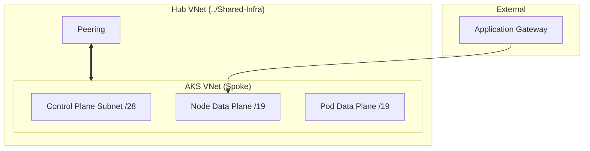
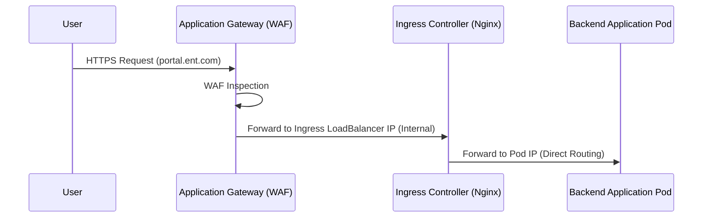

[ Previous: 331. AKS Compute Hub](331-AKS_COMPUTE_HUB_AND_ML_ORCHESTRATION.md) | [ Home](../README.md) | [ Next: 341. Database Architecture](341-DATABASE_ARCHITECTURE_AND_PERSISTENCE_STRATEGY.md)

---

# 332. AKS Networking Masterclass

---

##  Table of Contents

- [1. Deep Dive into API Server Integration, CNI and Edge Ingress (Vision 2026)](#1-deep-dive-into-api-server-integration-cni-and-edge-ingress-vision-2026)
- [2. Advanced VNet Architecture: Plan Isolation](#2-advanced-vnet-architecture-plan-isolation)
- [3. API Server VNet Integration](#3-api-server-vnet-integration)
- [4. Data Plane: Node and Pod Subnet Strategy](#4-data-plane-node-and-pod-subnet-strategy)
- [5. Traffic Flow: From Application Gateway to Pod](#5-traffic-flow-from-application-gateway-to-pod)
- [6. Identity and Security: Workload Identity and RBAC](#6-identity-and-security-workload-identity-and-rbac)
- [7. Validated Reference Library (Official and Community)](#7-validated-reference-library-official-and-community)

---

## 1. Deep Dive into API Server Integration, CNI and Edge Ingress (Vision 2026)

This document provides a technical autopsy of the Kubernetes networking architecture implemented in this repository. It covers the advanced "plumbing" that allows the AKS cluster to operate securely within the enterprise VNet fabric and integrate with the Application Gateway.

## 2. Advanced VNet Architecture: Plan Isolation

The AKS implementation in [`AKS/terraform-manifests/modules/sharedinfra_aks_module/15-virtual-network.tf`](../AKS/terraform-manifests/modules/sharedinfra_aks_module/15-virtual-network.tf) moves away from the default single-subnet approach. It uses a **Three-Subnet isolation model**:

## 3. API Server VNet Integration

This is a cutting-edge feature implemented in [`06-aks-cluster.tf`](../AKS/terraform-manifests/modules/sharedinfra_aks_module/06-aks-cluster.tf#L141).

*   **Logic**: The API server endpoint is projected directly into the `aks-control-plane-pods-subnet` ([`Line 104`](../AKS/terraform-manifests/modules/sharedinfra_aks_module/15-virtual-network.tf#L104)).
*   **Advantage**: It eliminates the need for Private Links or tunnels (like Konnectivity) for Node-to-Control Plane communication. All traffic stays within the private Azure backbone.
*   **Security**: The API server is accessible via a private IP address, reducing the surface area for DDoS attacks.

## 4. Data Plane: Node and Pod Subnet Strategy

We use the **BYO (Bring Your Own) Subnet** pattern to allow for massive scale:

1.  **Nodes Subnet**: [`aks-data-plane-nodes-subnet`](../AKS/terraform-manifests/modules/sharedinfra_aks_module/15-virtual-network.tf#L125). A `/19` range providing 8,192 addresses for VMs.
2.  **Pods Subnet**: [`aks-data-plane-pods-subnet`](../AKS/terraform-manifests/modules/sharedinfra_aks_module/15-virtual-network.tf#L130). A dedicated `/19` range for Pods.
*   **Why a dedicated Pod Subnet?**: This indicates we are using **Azure CNI with Dynamic Pod IP Allocation**. Pods get IPs from a separate range, preventing "IP exhaustion" in the node subnet and allowing more pods per node (up to 250).

## 5. Traffic Flow: From Application Gateway to Pod

The integration between the AGW and AKS is handled via the **Ingress-Nginx** pattern (or the modern **Web App Routing** add-on).

*   **Ingress Logic**: The AGW points to the **Internal Load Balancer** IP of the Nginx Ingress Controller.
*   **Dynamic DNS**: Managed via the `web_app_routing` block ([`Line 67`](../AKS/terraform-manifests/modules/sharedinfra_aks_module/06-aks-cluster.tf#L67)), which integrates with Azure DNS zones.

## 6. Identity and Security: Workload Identity and RBAC

The cluster is fully hardened with identity-based security:

*   **Workload Identity**: Enabled via `oidc_issuer_enabled = true` and `workload_identity_enabled = true`. This allows pods to assume Azure AD identities without using secrets.
*   **Managed RBAC**: Integrated with Entra ID (Azure AD). The `aks_administrators` group ([`05-aks-administrators-azure-ad.tf`](../AKS/terraform-manifests/modules/sharedinfra_aks_module/05-aks-administrators-azure-ad.tf)) is the only way to get admin access.
*   **Node Pools**: Separation of concerns between `systempool` (for Kubernetes add-ons) and `userpool` (for application workloads).

---

## 7. Validated Reference Library (Official and Community)

### Official AKS Networking Documentation
*   **[API Server VNet Integration](https://learn.microsoft.com/en-us/azure/aks/api-server-vnet-integration)**: Detailed guide on the control plane connectivity.
*   **[Azure CNI Dynamic Pod Allocation](https://learn.microsoft.com/en-us/azure/aks/azure-cni-dynamic-ip-allocation)**: Why we use separate subnets for pods and nodes.
*   **[Workload Identity Overview](https://learn.microsoft.com/en-us/azure/aks/workload-identity-overview)**: The foundation of secret-less security.

### Terraform and Community Patterns
*   **[azurerm_kubernetes_cluster resource](https://registry.terraform.io/providers/hashicorp/azurerm/latest/docs/resources/kubernetes_cluster)**: Documentation for the complex cluster resource.
*   **[Terraform Kubernetes Provider](https://registry.terraform.io/providers/hashicorp/kubernetes/latest/docs)**: Official documentation for K8s resource management.
*   **[Nginx Ingress on AKS](https://kubernetes.github.io/ingress-nginx/deploy/#azure)**: Best practices for the ingress layer.

---

[ Previous: 331. AKS Compute Hub](331-AKS_COMPUTE_HUB_AND_ML_ORCHESTRATION.md) | [ Home](../README.md) | [ Next: 341. Database Architecture](341-DATABASE_ARCHITECTURE_AND_PERSISTENCE_STRATEGY.md)

---

*Technical Documentation: AKS Networking and Connectivity Masterclass | Vision 2026 Architectural Guide*