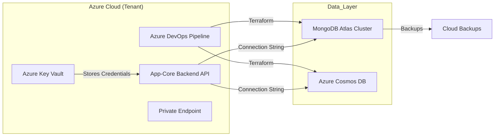
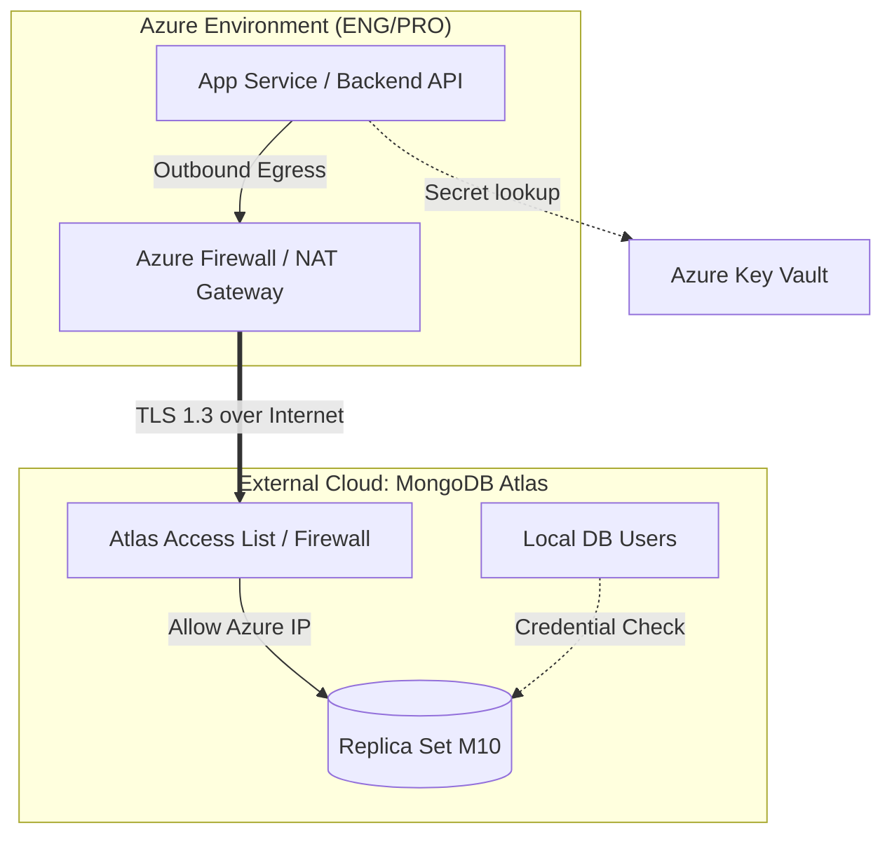
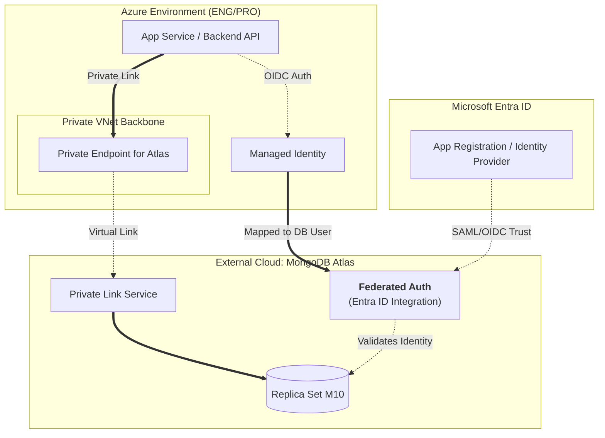
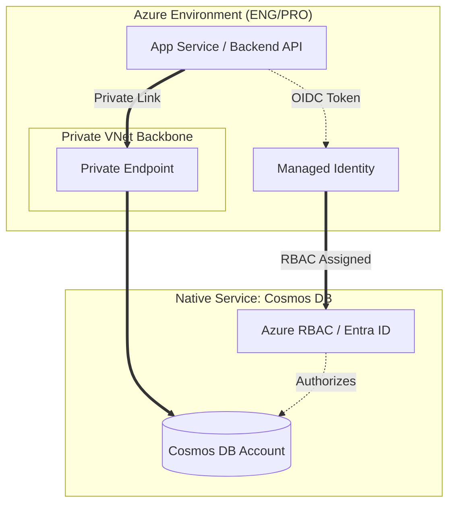

[ Previous: 332. AKS Networking Masterclass](332-AKS_NETWORKING_MASTERCLASS.md) | [ Home](../README.md) | [ Next: 342. Storage Governance](342-STORAGE_GOVERNANCE_AND_LIFECYCLE.md)

---

# 341. Database Architecture

---

##  Table of Contents

- [1. Architectural Overview: Hybrid Persistence Model](#1-architectural-overview-hybrid-persistence-model)
- [2. MongoDB Atlas: Advanced Multi-Tenant Architecture](#2-mongodb-atlas-advanced-multi-tenant-architecture)
    - [2.1 Multi-Tenant Isolation Strategy](#21-multi-tenant-isolation-strategy)
    - [2.2 Network Security and Access Control](#22-network-security-and-access-control)
    - [2.3 Identity and Security: Azure Entra ID Integration](#23-identity-and-security-azure-entra-id-integration)
    - [2.4 Comparative Networking and Security Architecture](#24-comparative-networking-and-security-architecture)
        - [2.4.1 A. MongoDB Atlas (Current Implementation: IP Allowlisting)](#241-a-mongodb-atlas-current-implementation-ip-allowlisting)
        - [2.4.2 B. MongoDB Atlas (Hardened: Private Link + Entra ID Federated)](#242-b-mongodb-atlas-hardened-private-link--entra-id-federated)
        - [2.4.3 C. Azure Cosmos DB POC (Native: Network-Sovereign + RBAC)](#243-c-azure-cosmos-db-poc-native-network-sovereign--rbac)
    - [2.5 Strategic Comparison and Decision Matrix](#25-strategic-comparison-and-decision-matrix)
        - [2.5.1 Cost Analysis](#251-cost-analysis)
    - [2.6 Ranking: The "Vision 2026" Hierarchy](#26-ranking-the-vision-2026-hierarchy)
    - [2.7 Conclusion: The Path to Data Sovereignty](#27-conclusion-the-path-to-data-sovereignty)
- [3. POC: Azure Cosmos DB for MongoDB API](#3-poc-azure-cosmos-db-for-mongodb-api)
    - [3.1 Strategic Advantages of the POC](#31-strategic-advantages-of-the-poc)
    - [3.2 Technical Compatibility and Migration Analysis (2026)](#32-technical-compatibility-and-migration-analysis-2026)
- [4. Connection Orchestration and Security](#4-connection-orchestration-and-security)
- [5. Automated Provisioning and Data Lifecycle (Day-2)](#5-automated-provisioning-and-data-lifecycle-day-2)
- [6. Inventory of Database Resources](#6-inventory-of-database-resources)
- [7. Validated Reference Library (Official and Community)](#7-validated-reference-library-official-and-community)

---

## 1. Architectural Overview: Hybrid Persistence Model

The repository orchestrates a dual-strategy for NoSQL databases, allowing organizations to choose between managed MongoDB Atlas or Azure-native Cosmos DB.

## 2. MongoDB Atlas: Advanced Multi-Tenant Architecture

### 2.1 Multi-Tenant Isolation Strategy
1.  **Shared Cluster / Dedicated Database (../App-Core)**: One large cluster hosts multiple databases prefixed with `modb-`.
    *   **Evidence**: [`29-mongodbatlas.tf`](../App-Core/terraform-manifests/modules/appcore_module/29-mongodbatlas.tf).
2.  **Dedicated Cluster per Tenant (../App-Catalog)**: Uses `for_each` to provision an entirely separate Atlas Project and Cluster for each client.
    *   **Evidence**: [`15-mongodb.tf`](../App-Catalog/terraform-manifests/modules/appanalysis_module/15-mongodb.tf).

### 2.2 Network Security and Access Control
*   **IP Access Lists**: Every project includes an `ip_access_list` that restricts connections to the CIDR blocks of the Azure environment.
    *   **Evidence**: [`29-mongodbatlas.tf:38`](../App-Core/terraform-manifests/modules/appcore_module/29-mongodbatlas.tf#L38).
*   **Private Link (Hardening Option)**: To achieve true network sovereignty, the architecture can be upgraded to **Azure Private Link**.

### 2.3 Identity and Security: Azure Entra ID Integration
*   **Federated Identity (SSO)**: configuration for developers and admins to log into the Atlas Portal using **Azure Entra ID (Azure AD)**.
    *   **Evidence**: [`30-mongodbatlas-federated-identity-provider.tf`](../App-Core/terraform-manifests/modules/appcore_module/30-mongodbatlas-federated-identity-provider.tf).

### 2.4 Comparative Networking and Security Architecture

#### 2.4.1 A. MongoDB Atlas (Current Implementation: IP Allowlisting)
**Status**: Currently implemented in this repository.
*   **Security Posture**: Relies on Azure Firewall/NAT Gateway egress IP validation.
*   **Networking**: Traffic traverses the public backbone encrypted via TLS 1.3.

#### 2.4.2 B. MongoDB Atlas (Hardened: Private Link + Entra ID Federated)
*   **Management Control**: Federated settings at the Atlas Organization level.
*   **Application Control**: Backend APIs use Managed Identities mapped to Atlas External Database Users.

#### 2.4.3 C. Azure Cosmos DB POC (Native: Network-Sovereign + RBAC)
The gold standard for 2026. Security is **Native Identity-based**.

### 2.5 Strategic Comparison and Decision Matrix

| Feature | Scenario A: Atlas (Legacy) | Scenario B: Atlas (Hardened) | Scenario C: Cosmos DB (POC) |
| :--- | :--- | :--- | :--- |
| **Network Path** | Public Internet (NAT/FW) | **Private Link (Backbone)** | **Private Link (Native)** |
| **Authentication** | Local User / Password | **Entra ID Federated (RBAC)** | **Native Azure RBAC** |
| **Latency** | Medium (Cross-Cloud) | Medium (Cross-Cloud) | **Lowest (Local DC)** |

#### 2.5.1 Cost Analysis
*   **Scenario A**: Cheapest for small labs.
*   **Scenario C**: Best cost-to-performance ratio.

### 2.6 Ranking: The "Vision 2026" Hierarchy
1. 🏆 Scenario C (Cosmos DB)
2. 🥈 Scenario B (Hardened Atlas)
3. 🥉 Scenario A (Legacy Atlas)

### 2.7 Conclusion: The Path to Data Sovereignty
Identity is the new Perimeter. Transitioning to **Azure Cosmos DB** represents the highest level of maturity.

## 3. POC: Azure Cosmos DB for MongoDB API

### 3.1 Strategic Advantages of the POC
*   **Identity Sovereignty (Zero-Trust)**: Uses Azure RBAC.
*   **Network Sovereignty**: Full support for Private Endpoints.

### 3.2 Technical Compatibility and Migration Analysis (2026)

| Feature | MongoDB Atlas | Azure Cosmos DB |
| :--- | :--- | :--- |
| **API Version** | v8.0+ (Native) | v4.2/5.0/6.0 (Emulated) |
| **Multi-Region** | Global Zones | Native Active-Active Writes |

## 4. Connection Orchestration and Security
Connection strings are constructed using Terraform `replace()` and stored in Key Vault.

## 5. Automated Provisioning and Data Lifecycle (Day-2)
*   **"Creation-Time" Import**: Using `mongoimport`.
*   **Backup and Restore**: Continuous Cloud Backup with PITR.

## 6. Inventory of Database Resources

| Resource Type | Description | Key File Reference |
| :--- | :--- | :--- |
| `mongodbatlas_cluster` | Replica set on Azure. | [`15-mongodb.tf`](../App-Catalog/terraform-manifests/modules/appanalysis_module/15-mongodb.tf) |
| `azurerm_cosmosdb_account` | Native Azure MongoDB account. | [`29-cosmosdb-mongodb.tf`](../App-Core/poc-cosmosdb-mongo/terraform-manifests/modules/appcore_module/29-cosmosdb-mongodb.tf) |

---

## 7. Validated Reference Library (Official and Community)
*   **[MongoDB Atlas Terraform Provider](https://registry.terraform.io/providers/mongodb/mongodbatlas/latest/docs)**
*   **[Cosmos DB for MongoDB API](https://learn.microsoft.com/en-us/azure/cosmos-db/mongodb/introduction)**

---

[ Previous: 332. AKS Networking Masterclass](332-AKS_NETWORKING_MASTERCLASS.md) | [ Home](../README.md) | [ Next: 342. Storage Governance](342-STORAGE_GOVERNANCE_AND_LIFECYCLE.md)

---

*Technical Documentation: Database Architecture and Persistence Strategy | Vision 2026 Architectural Guide*