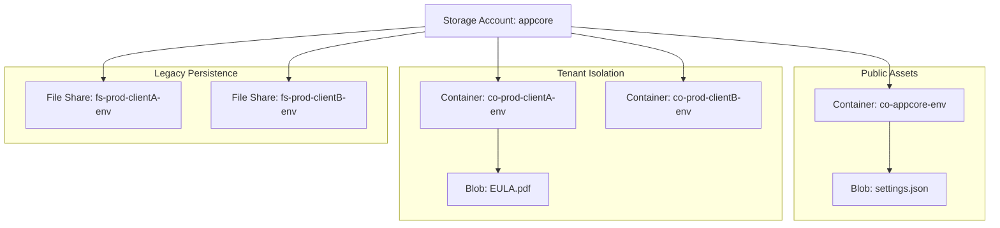
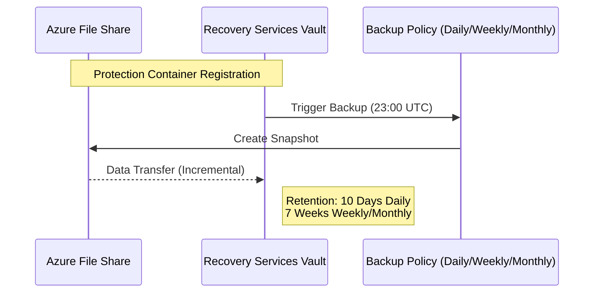

[ Previous: 341. Database Architecture](341-DATABASE_ARCHITECTURE_AND_PERSISTENCE_STRATEGY.md) | [ Home](../README.md) | [ Next: 411. Azure DevOps Pipelines](411-AZURE_DEVOPS_PIPELINES_ORCHESTRATION.md)

---

# 342. Storage Governance

---

##  Table of Contents

- [1. Multi-Layer Storage Architecture](#1-multi-layer-storage-architecture)
- [2. Isolation and Network Hardening](#2-isolation-and-network-hardening)
- [3. Multi-Tenant Data Management](#3-multi-tenant-data-management)
- [4. Security and Governance Models (RBAC/SAS)](#4-security-and-governance-models-rbacsas)
    - [4.1 Identity-Based Access (RBAC)](#41-identity-based-access-rbac)
    - [4.2 SAS Delegation (Time-Limited Access)](#42-sas-delegation-time-limited-access)
- [5. Data Protection and Backup Strategy (BCDR)](#5-data-protection-and-backup-strategy-bcdr)
    - [5.1 Implementation Detail](#51-implementation-detail)
- [6. Validated Reference Library (Official and Community)](#6-validated-reference-library-official-and-community)

---

## 1. Multi-Layer Storage Architecture

The system segregates data into three primary tiers based on access patterns and security requirements:

1.  **Shared Blob Tier**: Publicly accessible (but secure) configuration and assets.
2.  **Multi-Tenant Container Tier**: Isolated blob containers for client-specific EULAs and documents.
3.  **Encrypted File Share Tier**: SMB-based persistence for legacy integrations, protected by Azure Backup.

## 2. Isolation and Network Hardening

Following the **Zero Trust** model, Storage Accounts are strictly governed to prevent unauthorized exposure.

*   **Implementation**: [`07-storage-account.tf`](../App-Core/terraform-manifests/modules/appcore_module/07-storage-account.tf).
*   **Security Pillars**:
    *   **HTTPS Only**: Enforced via `enable_https_traffic_only = true`.
    *   **Private Connectivity**: Integration with VNet-specific settings.
    *   **Trusted Services Bypass**: Allowed to bypass network rules for backup and monitoring purposes.

## 3. Multi-Tenant Data Management

For multi-tenant applications, we dynamically provision storage containers and file shares per client.

*   **Logic**: Loops in [`08-storage-account-clients.tf`](../App-Core/terraform-manifests/modules/appcore_module/08-storage-account-clients.tf) and [`09-file-share-clients.tf`](../App-Core/terraform-manifests/modules/appcore_module/09-file-share-clients.tf) iterate over `var.client_names`.
*   **Naming Convention**: `co-{product}-{client}-{env}`, ensuring names comply with Azure's character constraints defined in [`locals.tf`](../App-Core/terraform-manifests/modules/appcore_module/03-locals.tf).

## 4. Security and Governance Models (RBAC/SAS)

### 4.1 Identity-Based Access (RBAC)
Instead of shared access keys, modern front-end and back-end services use **RBAC assignments** to access blob data.
*   **Front-end SPA**: Assigned `Storage Blob Data Reader` on specific containers.
*   **Implementation**: [`27-rbac-azurerm.tf`](../App-Core/terraform-manifests/modules/appcore_module/27-rbac-azurerm.tf).

### 4.2 SAS Delegation (Time-Limited Access)
For secure uploads/downloads, the backend generates time-limited **Shared Access Signatures (SAS)**.
*   **Logic**: Uses `data.azurerm_storage_account_blob_container_sas` in [`01-main.tf`](../App-Core/terraform-manifests/modules/appcore_module/01-main.tf).

## 5. Data Protection and Backup Strategy (BCDR)

The project implements a **Recovery Services Vault (RSV)** for the File Share tier to ensure Business Continuity and Disaster Recovery (BCDR).

### 5.1 Implementation Detail
Defined in [`10-file-share-clients-backup-policy.tf`](../App-Core/terraform-manifests/modules/appcore_module/10-file-share-clients-backup-policy.tf):
*   **Governance**: Automatic registration of storage accounts via `azurerm_backup_container_storage_account`.

| Feature | Resource / Logic | File Reference |
| :--- | :--- | :--- |
| **Dynamic Provisioning** | `for_each` over `client_names` | `08-storage-account-clients.tf` |
| **K8s Integration** | Persistent Volume mounting | `32-k8s.tf` |
| **RBAC Roles** | `Storage Blob Data Reader` | `27-rbac-azurerm.tf` |
| **Backup Policy** | Daily/Weekly/Monthly retention | `10-file-share-clients-backup-policy.tf` |

---

## 6. Validated Reference Library (Official and Community)

- [Storage Account Security Overview](https://learn.microsoft.com/en-us/azure/storage/common/storage-account-security-controls)
- [Azure Files Backup Architecture](https://learn.microsoft.com/en-us/azure/backup/backup-architecture)
- [SAS Token Best Practices](https://learn.microsoft.com/en-us/azure/storage/common/storage-sas-overview)
- [Azure Storage Lifecycle Management](https://learn.microsoft.com/en-us/azure/storage/blobs/lifecycle-management-overview)
- [Azure Backup for Azure File Shares](https://learn.microsoft.com/en-us/azure/backup/azure-file-share-backup-overview)
- [Azure Storage Security Guide](https://learn.microsoft.com/en-us/azure/storage/common/storage-security-guide)

---

[ Previous: 341. Database Architecture](341-DATABASE_ARCHITECTURE_AND_PERSISTENCE_STRATEGY.md) | [ Home](../README.md) | [ Next: 411. Azure DevOps Pipelines](411-AZURE_DEVOPS_PIPELINES_ORCHESTRATION.md)

---

*Technical Documentation: Storage Governance and Data Lifecycle Management | Vision 2026 Architectural Guide*