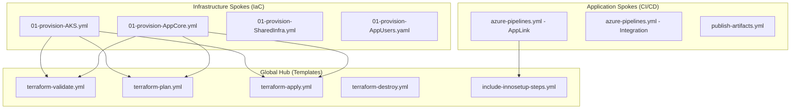
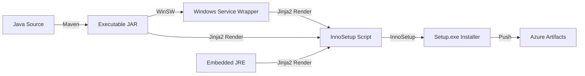
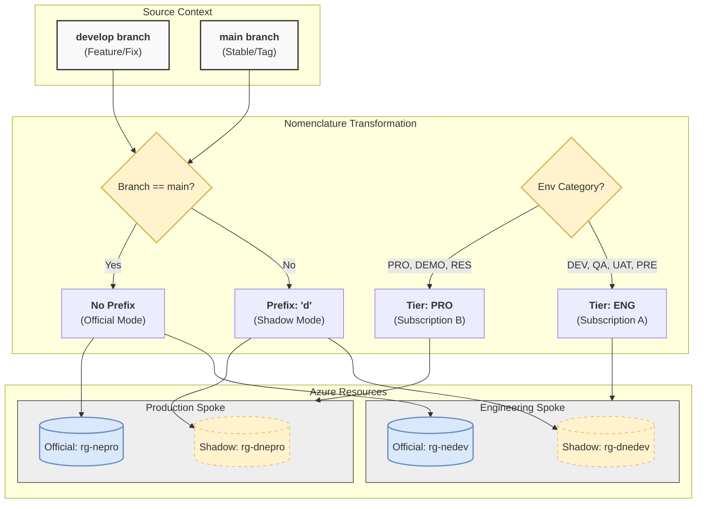

[ Previous: 342. Storage Governance](342-STORAGE_GOVERNANCE_AND_LIFECYCLE.md) | [ Home](../README.md) | [ Next: 412. Pipeline Security and Governance](412-AZURE_DEVOPS_PIPELINE_SECURITY_AND_GOVERNANCE.md)

---

# 411. Azure DevOps Pipelines

---

##  Table of Contents

- [1. Orchestration Architecture: The Hub-and-Spoke Model](#1-orchestration-architecture-the-hub-and-spoke-model)
    - [1.1 Why this is a "Good Design":](#11-why-this-is-a-good-design)
    - [1.2 Technical Implementation: Parameter Injection and Parallelism](#12-technical-implementation-parameter-injection-and-parallelism)
    - [1.3 Multi-Repo Pipeline Federation](#13-multi-repo-pipeline-federation)
        - [1.3.1 Repository Mapping Inventory](#131-repository-mapping-inventory)
- [2. App-Link Deep-Dive: Windows Binary and Installer Lifecycle](#2-app-link-deep-dive-windows-binary-and-installer-lifecycle)
    - [2.1 The Build Chain (Technical Flow)](#21-the-build-chain-technical-flow)
    - [2.2 Advanced Implementation Details](#22-advanced-implementation-details)
- [3. Terraform IaC Pipelines: Modular Execution Flow](#3-terraform-iac-pipelines-modular-execution-flow)
    - [3.1 The Multi-Stage Lifecycle Matrix](#31-the-multi-stage-lifecycle-matrix)
    - [3.2 Advanced State Management](#32-advanced-state-management)
    - [3.3 The Immutable "Plan-and-Apply" Strategy](#33-the-immutable-plan-and-apply-strategy)
- [4. Variable Governance and Environment Hierarchy](#4-variable-governance-and-environment-hierarchy)
    - [4.1 Hierarchy Flow: Branch-to-Environment Mapping (IaC Lab Mode)](#41-hierarchy-flow-branch-to-environment-mapping-iac-lab-mode)
        - [4.1.1 High-Level Workflow: The "Lab Mode" Philosophy](#411-high-level-workflow-the-lab-mode-philosophy)
        - [4.1.2 Low-Level Implementation (Terraform Logic)](#412-low-level-implementation-terraform-logic)
        - [4.1.3 Enhanced Architectural Logic Flow](#413-enhanced-architectural-logic-flow)
        - [4.1.4 Global Nomenclature Matrix (Detailed Inventory)](#414-global-nomenclature-matrix-detailed-inventory)
    - [4.2 Resource Nomenclature Rules and Constraints](#42-resource-nomenclature-rules-and-constraints)
    - [4.3 Pipeline Library: Global Variable Groups (Key Vault Integration)](#43-pipeline-library-global-variable-groups-key-vault-integration)
        - [4.3.1 How it works:](#431-how-it-works)
        - [4.3.2 Real-World Examples from the Repo:](#432-real-world-examples-from-the-repo)
        - [4.3.3 Example: Conditional Variable Loading](#433-example-conditional-variable-loading)
        - [4.3.4 Why this is a "Good Design":](#434-why-this-is-a-good-design)
- [5. GitOps Strategy: Branches, Tags, and Traceability](#5-gitops-strategy-branches-tags-and-traceability)
    - [5.1 CI Triggers and Manual Gates](#51-ci-triggers-and-manual-gates)
        - [5.1.1 Automated Triggers (Continuous Integration)](#511-automated-triggers-continuous-integration)
        - [5.1.2 Manual Gates (Deployment Orchestration)](#512-manual-gates-deployment-orchestration)
- [6. Comprehensive Pipeline and Artifact Inventory](#6-comprehensive-pipeline-and-artifact-inventory)
    - [6.1 Infrastructure-as-Code (Terraform)](#61-infrastructure-as-code-terraform)
    - [6.2 Configuration and Variable Management Inventory (Global Variable Groups)](#62-configuration-and-variable-management-inventory-global-variable-groups)
    - [6.3 Automation and Helper Scripts](#63-automation-and-helper-scripts)
- [7. Best Practices and Design Recommendations](#7-best-practices-and-design-recommendations)
    - [7.1 Modernization Path](#71-modernization-path)
- [8. Validated Reference Library (Official and Community)](#8-validated-reference-library-official-and-community)

---

## 1. Orchestration Architecture: The Hub-and-Spoke Model

The repository follows a **Template-First** design pattern. Logic is decoupled into reusable building blocks to ensure consistency across the enterprise.



### 1.1 Why this is a "Good Design":
*   **Dry (Don't Repeat Yourself)**: Changes to the Terraform `init` logic are updated once in the template and propagate to all 10+ pipelines.
*   **Standardization**: Every environment (DEV, QA, UAT, PRO) follows the exact same validation and security gates.
*   **Scalability**: Adding a new microservice or infrastructure component takes minutes by referencing existing templates.

### 1.2 Technical Implementation: Parameter Injection and Parallelism
The core pipelines use YAML `template` directives combined with `parameters` to dynamically build the stages at runtime.

```yaml
- stage: TerraformQA
  dependsOn: []    # Removes implicit dependency on previous stage, enabling PARALLEL execution
  displayName: Terraform QA
  condition: ${{parameters.createQA}}
  jobs:
    - template: templates/terraform-validate.yml
      parameters:
        environment: ${{ variables.QA_ENVIRONMENT }}
        SERVICE_CONNECTION_NAME_TFSTATE: ${{ variables.SERVICE_CONNECTION_NAME_TFSTATE }}
```

**Key Mechanisms:**
1.  **`dependsOn: []`**: By default, Azure DevOps runs stages sequentially. By passing an empty array, the pipeline runs DEV, QA, UAT, and PRO simultaneously, drastically reducing end-to-end execution time.
2.  **`condition: ${{parameters.createQA}}`**: Provides a GUI-driven way for engineers to selectively deploy environments via manual trigger parameters.
3.  **Parameter Passing**: Injects the specific Service Connection and Environment string (`qa`) into the generic template.

### 1.3 Multi-Repo Pipeline Federation

While this project is stored as a **Mono-Repo on GitHub**, it is built to run as a **Federated Multi-Repo** in Azure DevOps. Each major directory maps to a sovereign Git repository.

#### 1.3.1 Repository Mapping Inventory
The table below identifies the mapping between theoretical production repositories and the physical directories in this workspace.

| Production Git Repository (ADO) | Mono-Repo Folder | Functional Domain |
| :--- | :--- | :--- |
| `https://dev.azure.com/ORGANIZATION/Shared-Infra` | [`/Shared-Infra`](../Shared-Infra) | Network Backbone and DNS |
| `https://dev.azure.com/ORGANIZATION/AKS` | [`/AKS`](../AKS) | AKS Control Plane and Nodes |
| `https://dev.azure.com/ORGANIZATION/App-Core` | [`/App-Core`](../App-Core) | Traffic Engine, APIs and Storage |
| `https://dev.azure.com/ORGANIZATION/App-Catalog` | [`/App-Catalog`](../App-Catalog) | Service Registry and MongoDB |
| `https://dev.azure.com/ORGANIZATION/App-Users` | [`/App-Users`](../App-Users) | Identity Governance and Groups |
| `https://dev.azure.com/ORGANIZATION/Day2-ops` | [`/Day2-ops`](../Day2-ops) | Monitoring and K8s Ingress |
| `https://dev.azure.com/ORGANIZATION/Integration-Service` | [`/Integration-Service`](../Integration-Service) | Hybrid Tunnels and Windows Build |

**Orchestration Logic**:
In the production Multi-Repo setup, cross-repo triggers are used. For example, a commit to the `Shared-Infra` repo triggers a pipeline that, upon success, can automatically trigger a **Plan** in the `AKS` repo to ensure networking changes haven't broken compute connectivity.

## 2. App-Link Deep-Dive: Windows Binary and Installer Lifecycle

The **App-Link** (Integration Service) pipeline is the most complex build process in the repo. It transforms a Java Backend into a self-contained Windows Service with a graphical installer.

### 2.1 The Build Chain (Technical Flow)


### 2.2 Advanced Implementation Details
*   **Service Wrapping**: Uses **WinSW** (Windows Service Wrapper) to allow the Java application to run as a native Windows service.
*   **JRE Embedding**: The pipeline downloads a specific JRE (Java Runtime Environment), unzips it, and bundles it into the `resources/` folder to ensure the app is truly "portable".
*   **Dynamic Template Rendering**:
    *   **Tool**: `jinja2-cli` (Python-based).
    *   **Source**: [`Integration-Service/templates/innoSetupScript.j2`](../Integration-Service/templates/innoSetupScript.j2).
    *   **Output**: Dynamically generated `.iss` file with the correct version numbers and paths.
*   **Evidence**: 
    *   Steps: [`Integration-Service/templates/include-innosetup-build-steps.yml`](../Integration-Service/templates/include-innosetup-build-steps.yml).
    *   InnoSetup Logic: [`Integration-Service/boilerplates/innoSetupScript.iss`](../Integration-Service/boilerplates/innoSetupScript.iss).

## 3. Terraform IaC Pipelines: Modular Execution Flow

The Infrastructure-as-Code (IaC) lifecycle is strictly governed by a multi-stage process to ensure Zero-Downtime deployments.

### 3.1 The Multi-Stage Lifecycle Matrix

| Stage | Template | Purpose | Evidence |
| :--- | :--- | :--- | :--- |
| **Validate** | `terraform-validate.yml` | Syntax check and TFLint. | [AKS Template](../AKS/templates/terraform-validate.yml) |
| **Plan** | `terraform-plan.yml` | Binary Plan Generation. | [Core Template](../App-Core/templates/terraform-plan.yml) |
| **Approval** | (Manual Gate) | Peer Review / Stakeholder. | YAML Environment |
| **Apply** | `terraform-apply.yml` | Plan Execution. | [Shared-Infra Template](../Shared-Infra/templates/terraform-apply.yml) |
| **Destroy** | `terraform-destroy.yml` | Controlled Cleanup. | [Catalog Template](../App-Catalog/templates/terraform-destroy.yml) |

### 3.2 Advanced State Management
To prevent state corruption, each branch and environment has its own `.tfstate` file:
*   **Naming Pattern**: `$(INFRA_NAME)-$(GIT_BRANCH)branch-$(ENVIRONMENT).tfstate`
*   **Storage**: Azure Blob Storage with Lease-based locking (managed via `backendAzureRmKey`).
*   **Unlock Flow**: Specialized pipelines for emergency state management ([`05-terraform-force-unlock.yml`](../App-Core/05-terraform-force-unlock.yml)).

### 3.3 The Immutable "Plan-and-Apply" Strategy
The architecture enforces a strict decoupling between planning and execution.

1.  **Binary Plan**: The `terraform-plan.yml` stage generates a binary file (`.out`). This file contains the exact sequence of API calls that will be made.
2.  **Artifact Hand-off**: The plan is published as a Pipeline Artifact (`PublishPipelineArtifact@1`).
3.  **Atomic Apply**: The `terraform-apply.yml` stage downloads this specific artifact and executes it.

```yaml
- task: TerraformTaskV3@3
  displayName: Terraform apply
  inputs:
    command: 'apply'
    commandOptions: '$(FOLDER_PATH)/$(environment)-$(Build.BuildId).out'
```

**Architectural Benefit**: This guarantees that the infrastructure applied is **exactly** what was reviewed in the plan stage. It eliminates "Race Conditions" where a resource might change between the plan and apply stages if they were run as separate, independent commands.

## 4. Variable Governance and Environment Hierarchy

The repository implements a strict hierarchy that links Git branches to specific environment tiers and resource naming conventions.

### 4.1 Hierarchy Flow: Branch-to-Environment Mapping (IaC Lab Mode)

The repository implements a sophisticated **Branch Awareness** logic that segregates stable infrastructure from experimental IaC engineering. This is achieved via a "Shadow Infrastructure" pattern.

#### 4.1.1 High-Level Workflow: The "Lab Mode" Philosophy
*   **Engineering Phase (`develop` branch)**: Acts as a laboratory for Platform Engineers. Any deployment from this branch automatically receives a **`d`** prefix, creating a parallel "Shadow" environment that doesn't conflict with official resources.
*   **Stable Execution (`main` branch)**: Represents the gold standard. Resources lack the `d` prefix and are considered the official state of the enterprise cloud.

#### 4.1.2 Low-Level Implementation (Terraform Logic)
The "DNA" of every resource name is calculated dynamically in the `locals.tf` of each module.

```hcl
gitbranch = (var.gitbranch != "main") ? "d" : "" # If branch != main, prefix is 'd'

sharedinfra_environment = (var.environment != "pro" andand var.environment != "dem" andand var.environment != "res") ? "eng" : "pro"

instance_suffix = "${local.gitbranch}${var.region_code}${var.environment}"
```

#### 4.1.3 Enhanced Architectural Logic Flow



#### 4.1.4 Global Nomenclature Matrix (Detailed Inventory)

| Git Branch | Env Code | Functional Tier | Resource Type | Generated Name (Example) | Context |
| :--- | :--- | :--- | :--- | :--- | :--- |
| `develop` | `dev` | **ENG** | Resource Group | `rg-appcore-dnedev` | IaC Lab testing for Dev |
| `develop` | `pro` | **PRO** | Resource Group | `rg-appcore-dnepro` | **Shadow PRO** (IaC Test) |
| `main` | `dev` | **ENG** | Resource Group | `rg-appcore-nedev` | Official Development |
| `main` | `pro` | **PRO** | Resource Group | `rg-appcore-nepro` | **Stable Production** |
| `main` | `dem` | **PRO** | Storage Account | `stnprodem` | Official Demo Env |
| `develop` | `res` | **PRO** | App Service | `app-back-dneres` | IaC Test for Research |

### 4.2 Resource Nomenclature Rules and Constraints
*   **The "No-Dash" Rule**: For global services like **Storage Accounts** and **Key Vaults**, dashes are removed and the name is restricted to 24 characters (`st` + `d` + `ne` + `dev`).
*   **OIDC Linkage**: Service Connections in ADO are mapped 1:1 to the Tier (ENG/PRO). A pipeline running a `Shadow PRO` deployment uses the **PRO Service Connection** but creates resources with the `d` prefix, effectively isolating them from the live environment.

### 4.3 Pipeline Library: Global Variable Groups (Key Vault Integration)

In addition to YAML-based variables, the architecture leverages **Azure DevOps Library Variable Groups**. These act as a secure bridge between the pipelines and **Azure Key Vault**.

#### 4.3.1 How it works:
1.  **Secret Linking**: Variables are not stored in Azure DevOps. Instead, the Variable Group is "backed" by an Azure Key Vault.
2.  **Runtime Injection**: When the pipeline runs, the agent fetches the secrets from Key Vault via the Variable Group and injects them as environment variables (masked in logs).

#### 4.3.2 Real-World Examples from the Repo:
Defined in [`App-Core/configuration/variable-group-with-secrets.yml`](../App-Core/configuration/variable-group-with-secrets.yml):

*   **`group: DevOps-appcore`**: Contains sensitive application secrets like database passwords (`secret_mongodb_password`) and API keys.
*   **`group: Wildcard-Certificates`**: Centralized group for SSL/TLS certificates. It contains the binary content or identifiers for `*.Enterprise.com` and `*.eng.Enterprise.com`.
*   **`group: DevOps-aks`**: Stores critical Kubernetes infrastructure secrets, such as the `kubeconfig` or service principal credentials needed to authenticate against AKS.

#### 4.3.3 Example: Conditional Variable Loading
The repository uses a sophisticated pattern to load the correct context based on the branch and environment:

```yaml
variables:
  - group: DevOps-appcore
  - name: TERRAFORM_ENV
    value: ${{ parameters.environment }} # dev, qa, pro, etc.
  - name: GIT_BRANCH
    ${{ if eq(variables['Build.SourceBranchName'], 'main') }}:
      value: main
    ${{ else }}:
      value: develop
```

#### 4.3.4 Why this is a "Good Design":
*   **Zero-Knowledge CI/CD**: The pipeline code never "sees" the secrets; they are only available in memory during execution.
*   **Centralized Rotation**: If a password changes, you update it in Key Vault. All pipelines automatically pick up the new value on the next run.
*   **Separation of Concerns**: Infrastructure teams manage the Key Vault access, while DevOps engineers manage the Variable Group mapping.

## 5. GitOps Strategy: Branches, Tags, and Traceability

| Feature | implementation | Value |
| :--- | :--- | :--- |
| **Branch Policy** | `develop` -> Engineering / `main` -> Production | Environment isolation. |
| **CI Trigger** | `batch: true` | Prevents pipeline congestion on high-frequency commits. |
| **Traceability** | `$(Build.SourceVersion)` | Maps every deployment to a specific Git Commit SHA. |
| **Tagging** | `$(Build.BuildId)` | Unique identifier for artifacts in Azure Artifacts. |

### 5.1 CI Triggers and Manual Gates
The repository balances automation with human oversight through a dual-trigger model.

#### 5.1.1 Automated Triggers (Continuous Integration)
*   **Trigger Configuration**: `trigger: - develop`, `trigger: - main`.
*   **Batching**: `batch: true` is used to group multiple commits into a single run, preventing resource exhaustion in the agent pool.
*   **Validation Only**: Automated triggers typically only run the **Validate** and **Plan** stages to provide immediate feedback on PRs without risk.

#### 5.1.2 Manual Gates (Deployment Orchestration)
For actual deployments to PRO or UAT, the pipelines utilize **Manual Trigger Parameters**.

```yaml
parameters:
- name: 'createPRO'
  displayName: 'Create PRO App-Core (Production)'
  type: boolean
  default: false
```

**Workflow**:
1.  Developer triggers the pipeline manually in the Azure DevOps Portal.
2.  Selects the checkbox for `createPRO`.
3.  The pipeline evaluates the condition `${{parameters.createPRO}}` and initiates the deployment stages only for the selected environments.

## 6. Comprehensive Pipeline and Artifact Inventory

### 6.1 Infrastructure-as-Code (Terraform)

| Category | Main Pipeline | Templates | Scripts / Manifests |
| :--- | :--- | :--- | :--- |
| **AKS Hub** | [`01-provision-AKS.yml`](../AKS/01-terraform-provision-AKS-pipeline.yml) | [`AKS/templates/`](../AKS/templates/) | [`AKS/manifests/namespace.yml`](../AKS/manifests/namespace.yml) |
| **App-Core** | [`01-provision-AppCore.yml`](../App-Core/01-terraform-provision-appcore-pipeline.yml) | [`App-Core/templates/`](../App-Core/templates/) | [`App-Core/scripts/`](../App-Core/scripts/) |
| **App-Catalog** | [`01-provision-catalog3.yml`](../App-Catalog/01-terraform-provision-catalog3-pipeline.yml) | [`App-Catalog/templates/`](../App-Catalog/templates/) | [`App-Catalog/scripts/`](../App-Catalog/scripts/) |
| **Shared-Infra** | [`01-provision-shared.yml`](../Shared-Infra/01-terraform-provision-sharedinfra-pipeline.yml) | [`Shared-Infra/templates/`](../Shared-Infra/templates/) | [`Shared-Infra/scripts/`](../Shared-Infra/scripts/) |
| **App-Users** | [`01-provision-AppUsers.yaml`](../App-Users/01-terraform-provision-appcore-users-pipeline.yaml) | [`App-Users/templates/`](../App-Users/templates/) | [`App-Users-Config/`](../App-Users-Config/) |

### 6.2 Configuration and Variable Management Inventory (Global Variable Groups)
Each module maintains its own configuration set, mimicking the Azure DevOps Library (Variable Groups).

| Module | Shared Global Vars (YAML) | Variable Group Mapping | Service Connections (Dev) | Service Connections (Main) |
| :--- | :--- | :--- | :--- | :--- |
| **AKS Cluster** | [`shared-vars.yml`](../AKS/configuration/shared-azure-devops-pipeline-vars.yml) | [`group-map.yml`](../AKS/configuration/variable-group-with-secrets.yml) | [`dev-svc.yml`](../AKS/configuration/developbranch-service-connections.yml) | [`main-svc.yml`](../AKS/configuration/mainbranch-service-connections.yml) |
| **App-Core** | [`shared-vars.yml`](../App-Core/configuration/shared-azure-devops-pipeline-vars.yml) | [`group-map.yml`](../App-Core/configuration/variable-group-with-secrets.yml) | [`dev-svc.yml`](../App-Core/configuration/developbranch-service-connections.yml) | [`main-svc.yml`](../App-Core/configuration/mainbranch-service-connections.yml) |
| **App-Catalog** | [`shared-vars.yml`](../App-Catalog/configuration/shared-azure-devops-pipeline-vars.yml) | [`group-map.yml`](../App-Catalog/configuration/variable-group-with-secrets.yml) | [`dev-svc.yml`](../App-Catalog/configuration/developbranch-service-connections.yml) | [`main-svc.yml`](../App-Catalog/configuration/mainbranch-service-connections.yml) |
| **Shared-Infra** | [`shared-vars.yml`](../Shared-Infra/configuration/shared-azure-devops-pipeline-vars.yml) | [`group-map.yml`](../Shared-Infra/configuration/variable-group-with-secrets.yml) | [`dev-svc.yml`](../Shared-Infra/configuration/developbranch-service-connections.yml) | [`main-svc.yml`](../Shared-Infra/configuration/mainbranch-service-connections.yml) |
| **Integration** | [`app-env.yml`](../Integration-Service/configuration/app-env.yml) | [Marketplace Artifacts] | [`devapp.yml`](../Integration-Service/configuration/devapp.yml) | [`app.yml`](../Integration-Service/configuration/app.yml) |

### 6.3 Automation and Helper Scripts

| Script Type | Filename | Purpose |
| :--- | :--- | :--- |
| **Azure AD** | [`create-aad-custom-domains.ps1`](../AKS/scripts/01-create-aad-custom-domains-names-powershell5.ps1) | DNS Automation for AKS. |
| **App Gateway** | [`setup-keyvault-cert-ref.ps1`](../App-Core/scripts/07-appgateway_setup_keyvault_certificate_reference.ps1) | Key Vault integration for WAF. |
| **Storage** | [`createStorageQueue.ps1`](../Integration-Service/scripts/05-createStorageQueue.ps1) | Queue-based messaging setup. |
| **Terraform** | [`terraform-var-file-parser.ps1`](../App-Core/boilerplates/terraform-var-file-parser.ps1) | Advanced variable validation. |

## 7. Best Practices and Design Recommendations

### 7.1 Modernization Path
1.  **Terraform Stacks Migration**: The primary goal for 2026 is to replace pipeline-based orchestration with **Terraform Stacks**. This moves the dependency graph from YAML pipelines to native HCL, enabling unified planning and native component orchestration.
2.  **Workload Identity (OIDC)**: Eliminate Client Secrets in Service Connections to follow Zero-Trust standards.
3.  **Containerized Jobs**: Move from static VM agents to AKS-based ephemeral runners for improved scalability and isolation.
4.  **Policy Enforcement**: Add `Checkov` or `tfsec` as mandatory steps in `terraform-validate.yml` to ensure compliance before deployment.

---

## 8. Validated Reference Library (Official and Community)

*   **[Add and use variable groups](https://learn.microsoft.com/en-us/azure/devops/pipelines/library/variable-groups)**: Official guide on managing global variables.
*   **[Link a variable group to Azure Key Vault](https://learn.microsoft.com/en-us/azure/devops/pipelines/library/variable-groups?view=azure-devopsandtabs=yaml#link-secrets-from-an-azure-key-vault)**: Technical details on the secure bridge used in this repo.
*   **[InnoSetup Official Downloads and Scripts](https://jrsoftware.org/isinfo.php)**: Technical reference for the installer build.
*   **[WinSW (Windows Service Wrapper) GitHub](https://github.com/winsw/winsw)**: Documentation for running Java as a Windows Service.
*   **[Terraform Task for Azure DevOps (Marketplace)](https://github.com/microsoft/azure-pipelines-terraform)**: Source code for the tasks used in our templates.
*   **[Jinja2 CLI Documentation](https://jinja.palletsprojects.com/en/3.1.x/)**: Guide for the template engine used in App-Link.

---

[ Previous: 342. Storage Governance](342-STORAGE_GOVERNANCE_AND_LIFECYCLE.md) | [ Home](../README.md) | [ Next: 412. Pipeline Security and Governance](412-AZURE_DEVOPS_PIPELINE_SECURITY_AND_GOVERNANCE.md)

---

*Technical Documentation: Azure DevOps Pipelines: Global Orchestration and Multi-Layer Lifecycle | Vision 2026 Architectural Guide*