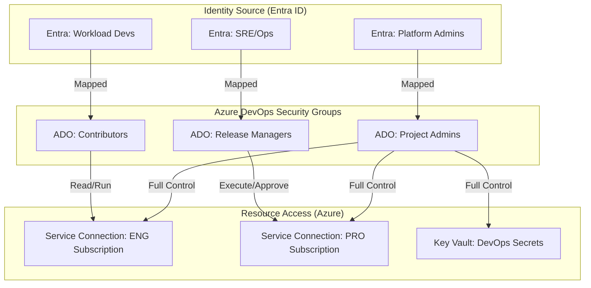
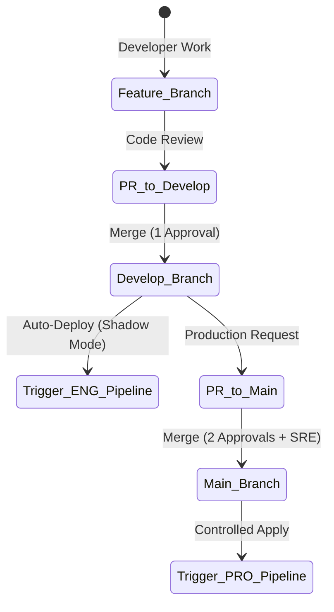
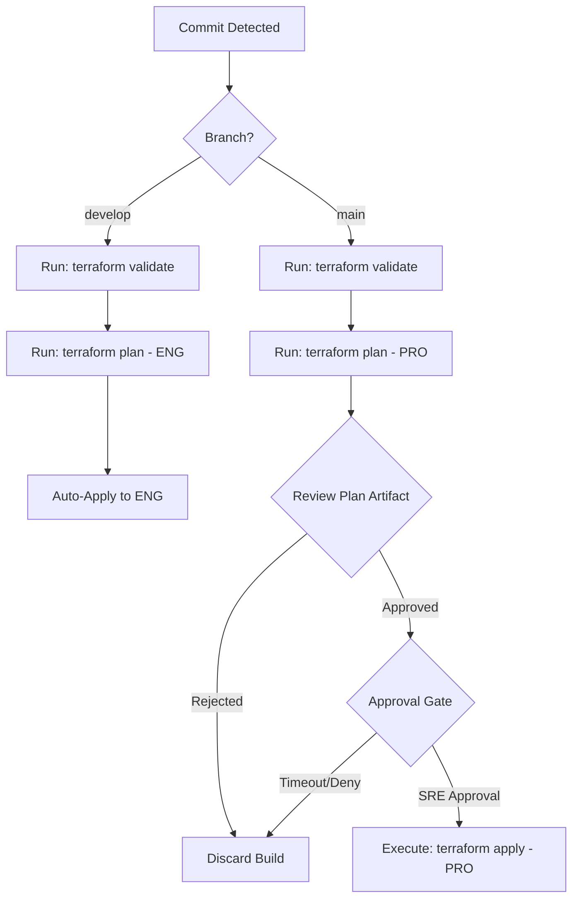

[ Previous: 411. Azure DevOps Pipelines](411-AZURE_DEVOPS_PIPELINES_ORCHESTRATION.md) | [ Home](../README.md) | [ Next: 421. Observability and Day2 Operations](421-OBSERVABILITY_AND_DAY2_OPERATIONS.md)

---

# 412. Pipeline Security and Governance

---

##  Table of Contents

- [1. Architectural Overview: The Zero-Trust CI/CD Model](#1-architectural-overview-the-zero-trust-cicd-model)
- [2. Entra ID (Azure AD) to Azure DevOps Identity Mapping](#2-entra-id-azure-ad-to-azure-devops-identity-mapping)
    - [2.1 Identity Synchronization Matrix](#21-identity-synchronization-matrix)
- [3. Permission Matrix: RBAC, Execution and Gates](#3-permission-matrix-rbac-execution-and-gates)
    - [3.1 Low-Level Permissions by Environment Tier](#31-low-level-permissions-by-environment-tier)
- [4. Branch Protection and GitOps Governance](#4-branch-protection-and-gitops-governance)
    - [4.1 Branch-Specific Security Policies](#41-branch-specific-security-policies)
- [5. Pipeline Execution Flows and Decision Trees](#5-pipeline-execution-flows-and-decision-trees)
    - [5.1 IaC Lifecycle Decision Tree](#51-iac-lifecycle-decision-tree)
    - [5.2 Multi-Stage Approval Workflow](#52-multi-stage-approval-workflow)
- [6. Root Module Security and Folder-Level Isolation](#6-root-module-security-and-folder-level-isolation)
    - [6.1 Monorepo Security Strategy](#61-monorepo-security-strategy)
- [7. Low-Level Implementation: Security-as-Code](#7-low-level-implementation-security-as-code)
    - [7.1 YAML Security Constraints](#71-yaml-security-constraints)
- [8. Best Practices and Governance Roadmap](#8-best-practices-and-governance-roadmap)
- [9. Validated Reference Library (Official and Community)](#9-validated-reference-library-official-and-community)

---

## 1. Architectural Overview: The Zero-Trust CI/CD Model

The security of the Infrastructure-as-Code (IaC) lifecycle is built on the principle of **Least Privilege**. Every pipeline execution, service connection, and secret access is tied to a verified identity, whether human or machine.



---

## 2. Entra ID (Azure AD) to Azure DevOps Identity Mapping

Identity Governance ensures that group memberships managed in Entra ID automatically translate into permissions within Azure DevOps.

### 2.1 Identity Synchronization Matrix

| Entra ID Group Taxonomy | ADO Security Group | Primary Responsibility | Scope |
| :--- | :--- | :--- | :--- |
| `cg-platform-admins-pro` | **Project Administrators** | System config, SC management, Library security. | Global |
| `cg-appcore-sre-pro` | **Release Managers** | Production approvals, Plan review, Emergency overrides. | Production |
| `cg-appcore-dev-eng` | **Contributors** | Feature development, PR creation, ENG deployments. | Engineering |
| `cg-security-audit-pro` | **Readers** | Compliance auditing, Log review, Security scanning. | Global |

---

## 3. Permission Matrix: RBAC, Execution and Gates

Permissions are granularly applied at the Pipeline, Environment, and Library levels.

### 3.1 Low-Level Permissions by Environment Tier

| Permission Area | Engineering (ENG/DEV) | Production (PRO/UAT) | Governance Mechanism |
| :--- | :--- | :--- | :--- |
| **Pipeline Execution** | Automatic (on Merge/PR) | Manual (with Approval) | `manualTrigger` parameter |
| **Branch Policy** | 1 Peer Review + Valid Build | 2 Peer Reviews + SRE Approval | Branch Policies |
| **Service Connection** | Contributor (d-prefixed) | Reader (Plan) / Owner (Apply) | RBAC on Service Principal |
| **Library (Secrets)** | Read-Only (Non-Prod KV) | Access Restricted (Prod KV) | Variable Group Permissions |
| **Approval Gates** | None (Automated) | **Mandatory** (Human Gate) | ADO Environments |

---

## 4. Branch Protection and GitOps Governance

The repository implements strict **Branch Sovereignty** to prevent unauthorized changes to stable infrastructure.

### 4.1 Branch-Specific Security Policies



| Branch | Destination | Protection Level | Requirements |
| :--- | :--- | :--- | :--- |
| `develop` | Engineering Tiers | **High** | Minimum 1 reviewer, build validation successful, no comments open. |
| `main` | Production Tiers | **Critical** | Minimum 2 reviewers, SRE sign-off, mandatory "Lab Mode" verification. |
| `hotfix/*` | Production Tiers | **Emergency** | Restricted to SRE team, immediate PR to both branches. |

---

## 5. Pipeline Execution Flows and Decision Trees

The IaC cycle follows a predictable path with integrated security checkpoints.

### 5.1 IaC Lifecycle Decision Tree



### 5.2 Multi-Stage Approval Workflow

For Production environments, the pipeline leverages **Azure DevOps Environments** to enforce mandatory human intervention.

1.  **Stage: Plan**: Generates the binary plan file.
2.  **Environment: PRO-Environment**:
    - **Check**: Approval from `cg-appcore-sre-pro`.
    - **Check**: Business Hours (Optional).
3.  **Stage: Apply**: Consumes the approved plan file only after all checks pass.

---

## 6. Root Module Security and Folder-Level Isolation

Since this monorepo originated from separate repositories, security is enforced per-directory (Root Module).

### 6.1 Monorepo Security Strategy

| Folder (Original Repo) | Security Posture | Identity Type | Dependency |
| :--- | :--- | :--- | :--- |
| [`Shared-Infra/`](../Shared-Infra) | **Highest** | Networking Admin | Foundation for all Spokes. |
| [`AKS/`](../AKS) | **Critical** | Cluster Admin | Relies on Shared-Infra VNet. |
| [`App-Core/`](../App-Core) | **High** | Application Owner | Relies on AKS and Shared-Infra. |
| [`App-Users/`](../App-Users) | **Critical** | IAM / Security Admin | Modifies Entra ID and RBAC. |

**Folder-Level Permissions**:
Access is restricted via **Path-based Branch Policies** and **Code Owners**. Changes to `Shared-Infra` require explicit approval from the Network Architecture team, regardless of the branch.

---

## 7. Low-Level Implementation: Security-as-Code

Security logic is embedded directly into the YAML templates.

### 7.1 YAML Security Constraints

Example of conditional stage execution and environment-based variable loading to ensure security:

```yaml
# templates/terraform-apply.yml
parameters:
  - name: environment
    type: string

jobs:
- deployment: ApplyTerraform
  environment: ${{ parameters.environment }} # Ties to ADO Environment Gates
  strategy:
    runOnce:
      deploy:
        steps:
        - checkout: self
          persistCredentials: false # Prevents secret leakage
        
        - task: TerraformTaskV3@3
          displayName: 'Apply Approved Plan'
          inputs:
            command: 'apply'
            environmentServiceNameAzureRM: '$(SERVICE_CONNECTION_NAME)'
            commandOptions: '$(Pipeline.Workspace)/$(environment)-plan.out'
```

---

## 8. Best Practices and Governance Roadmap

1.  **Workload Identity Federation (OIDC)**: Transitioning from static Client Secrets in Service Connections to short-lived OIDC tokens.
2.  **Secretless Backends**: Using Managed Identities for the Terraform Backend (Storage Account) to eliminate storage keys from pipelines.
3.  **Policy-as-Code (PaC)**: Integrating `Checkov` or `Sentinel` as a mandatory blocking gate in the `Validate` stage.
4.  **Audit Logs**: Centralizing Azure DevOps Audit logs into the core Log Analytics Workspace for unified SRE visibility.

---

## 9. Validated Reference Library (Official and Community)

- **[Security best practices for Azure Pipelines](https://learn.microsoft.com/en-us/azure/devops/pipelines/security/best-practices)**
- **[Granting permissions to pipelines](https://learn.microsoft.com/en-us/azure/devops/pipelines/security/permissions)**
- **[Azure DevOps Environment Checks](https://learn.microsoft.com/en-us/azure/devops/pipelines/process/approvals)**
- **[Terraform with Azure DevOps OIDC](https://developer.hashicorp.com/terraform/tutorials/azure-get-started/azure-ad-federation)**

---

[ Previous: 411. Azure DevOps Pipelines](411-AZURE_DEVOPS_PIPELINES_ORCHESTRATION.md) | [ Home](../README.md) | [ Next: 421. Observability and Day2 Operations](421-OBSERVABILITY_AND_DAY2_OPERATIONS.md)

---

*Technical Documentation: Azure DevOps Pipeline Security and Governance | Vision 2026 Architectural Guide*