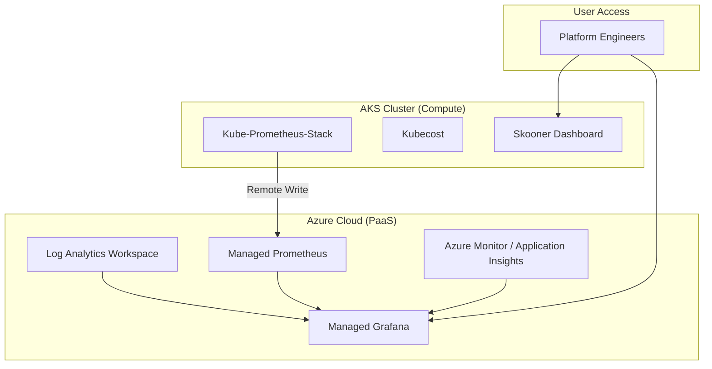

[ Previous: 412. Pipeline Security and Governance](412-AZURE_DEVOPS_PIPELINE_SECURITY_AND_GOVERNANCE.md) | [ Home](../README.md) | [ Next: 811. DR and BCP Arch Analysis](811-DR_BCP_ARCH_ANALYSIS.md)

---

# 421. Observability and Day2 Operations

---

##  Table of Contents

- [1. Observability Blueprint: The Unified Telemetry Hub](#1-observability-blueprint-the-unified-telemetry-hub)
    - [1.1 Key Pillars:](#11-key-pillars)
- [2. Centralized Logging: Azure Log Analytics](#2-centralized-logging-azure-log-analytics)
- [3. Cloud-Native Monitoring: Kube-Prometheus-Stack](#3-cloud-native-monitoring-kube-prometheus-stack)
    - [3.1 Performance Isolation](#31-performance-isolation)
    - [3.2 Advanced Grafana Integration](#32-advanced-grafana-integration)
- [4. In-Cluster Governance: Kubeapps and Kubecost](#4-in-cluster-governance-kubeapps-and-kubecost)
    - [4.1 Kubeapps: Internal Marketplace](#41-kubeapps-internal-marketplace)
    - [4.2 Kubecost: FinOps Visibility](#42-kubecost-finops-visibility)
- [5. Operational Access: Skooner and Azure AD SSO](#5-operational-access-skooner-and-azure-ad-sso)
- [6. Ingress Observability: Nginx and WebApp Routing](#6-ingress-observability-nginx-and-webapp-routing)
- [7. Inventory of Day2 Operations Resources](#7-inventory-of-day2-operations-resources)
- [8. Best Practices and Observability Roadmap](#8-best-practices-and-observability-roadmap)
    - [8.1 Modernization Path](#81-modernization-path)
- [9. Validated Reference Library (Official and Community)](#9-validated-reference-library-official-and-community)

---

## 1. Observability Blueprint: The Unified Telemetry Hub

The architecture follows a "Single Pane of Glass" philosophy, integrating native Azure monitoring with industry-standard open-source tools.

### 1.1 Key Pillars:
*   **Infrastructure Telemetry**: Collected via Azure Monitor Agent and Prometheus.
*   **Application Logs**: Unified in Log Analytics for correlation.
*   **Cost Management**: Granular K8s cost visibility via Kubecost.

## 2. Centralized Logging: Azure Log Analytics

The foundation of the observability stack is a regional **Log Analytics Workspace**.

*   **Implementation**: [`04-log-analytics-workspace.tf`](../AKS/terraform-manifests/modules/sharedinfra_aks_module/04-log-analytics-workspace.tf).
*   **Data Retention**: Configured for 30 days (standard) up to 730 days for compliance.
*   **Diagnostic Settings**: Every resource (WAF, AKS, SQL, App Service) is programmatically linked to this workspace upon creation.

## 3. Cloud-Native Monitoring: Kube-Prometheus-Stack

For Kubernetes-specific metrics, we deploy a highly customized **Kube-Prometheus-Stack** via Helm.

### 3.1 Performance Isolation
Monitoring components are pinned to the **Infra Node Pool** to avoid impacting business workloads.
*   **Node Selector**: `{ agentpool: appspool001, app: infra }`.
*   **Evidence**: [`01-helm-kube-prometheus-stack.tf`](../Day2-ops/terraform-manifests/modules/day2_ops_module/01-helm-kube-prometheus-stack.tf).

### 3.2 Advanced Grafana Integration
Grafana is the primary visualization engine, featuring:
*   **Azure AD SSO**: Login via corporate credentials using Entra ID App Registrations ([`01-app-register-kube-prometheus-stack.tf`](../Day2-ops/terraform-manifests/modules/day2_ops_module/01-app-register-kube-prometheus-stack.tf)).
*   **Ingress Class**: Uses the `webapprouting.kubernetes.azure.com` (Azure managed ingress).
*   **TLS Termination**: Automated via Key Vault secrets.

## 4. In-Cluster Governance: Kubeapps and Kubecost

### 4.1 Kubeapps: Internal Marketplace
Provides a graphical interface for managing Helm releases across all namespaces.
*   **SSO Integration**: [`02-app-register-kubeapps.tf`](../Day2-ops/terraform-manifests/modules/day2_ops_module/02-app-register-kubeapps.tf).
*   **Evidence**: [`02-helm-kubeapps.tf`](../Day2-ops/terraform-manifests/modules/day2_ops_module/02-helm-kubeapps.tf).

### 4.2 Kubecost: FinOps Visibility
Enables real-time cost tracking of namespaces, pods, and deployments.
*   **Evidence**: [`03-helm-kubecost.tf`](../Day2-ops/terraform-manifests/modules/day2_ops_module/03-helm-kubecost.tf).

## 5. Operational Access: Skooner and Azure AD SSO

To reduce complexity, we provide a developer-friendly Kubernetes dashboard (**Skooner**).

*   **Authentication**: Integrated with Azure AD via [`02-app-register-skooner.tf`](../Day2-ops/terraform-manifests/modules/day2_ops_module/02-app-register-skooner.tf).
*   **Dynamic DNS**: Accessible via `skooner.${local.dns_child_zone}.Enterprise.com`.
*   **Evidence**: [`05-helm-skooner.tf`](../Day2-ops/terraform-manifests/modules/day2_ops_module/05-helm-skooner.tf).

## 6. Ingress Observability: Nginx and WebApp Routing

The platform utilizes **Nginx Ingress Controller** for L7 traffic management within the cluster.

*   **Customization**: Enhanced with custom headers for traceability (`X-Request-ID`).
*   **Metrics**: Prometheus scrape targets are enabled for Nginx to monitor latency, 4xx/5xx errors, and throughput.
*   **Evidence**: [`04-helm-ingress-nginx.tf`](../Day2-ops/terraform-manifests/modules/day2_ops_module/04-helm-ingress-nginx.tf).

## 7. Inventory of Day2 Operations Resources

| Component | Technology | Logic / Helm | SSO / App Register |
| :--- | :--- | :--- | :--- |
| **Prometheus/Grafana** | Helm | [`01-helm-kube-prometheus-stack.tf`](../Day2-ops/terraform-manifests/modules/day2_ops_module/01-helm-kube-prometheus-stack.tf) | [`01-app-register-kp-stack.tf`](../Day2-ops/terraform-manifests/modules/day2_ops_module/01-app-register-kube-prometheus-stack.tf) |
| **Log Analytics** | Azure Native | [`04-log-analytics-workspace.tf`](../AKS/terraform-manifests/modules/sharedinfra_aks_module/04-log-analytics-workspace.tf) | Azure Native |
| **Ingress Controller**| Nginx | [`04-helm-ingress-nginx.tf`](../Day2-ops/terraform-manifests/modules/day2_ops_module/04-helm-ingress-nginx.tf) | - |
| **Cost Analysis** | Kubecost | [`03-helm-kubecost.tf`](../Day2-ops/terraform-manifests/modules/day2_ops_module/03-helm-kubecost.tf) | - |
| **Catalog UI** | Kubeapps | [`02-helm-kubeapps.tf`](../Day2-ops/terraform-manifests/modules/day2_ops_module/02-helm-kubeapps.tf) | [`02-app-register-kubeapps.tf`](../Day2-ops/terraform-manifests/modules/day2_ops_module/02-app-register-kubeapps.tf) |
| **K8s Dashboard** | Skooner | [`05-helm-skooner.tf`](../Day2-ops/terraform-manifests/modules/day2_ops_module/05-helm-skooner.tf) | [`02-app-register-skooner.tf`](../Day2-ops/terraform-manifests/modules/day2_ops_module/02-app-register-skooner.tf) |
| **Legacy Prometheus** | Helm | [`06-helm-prometheus.tf`](../Day2-ops/terraform-manifests/modules/day2_ops_module/06-helm-prometheus.tf) | [`07-app-register-prom.tf`](../Day2-ops/terraform-manifests/modules/day2_ops_module/07-app-register-prometheus.tf) |

## 8. Best Practices and Observability Roadmap

### 8.1 Modernization Path
1.  **OpenTelemetry (OTel)**: Transitioning from vendor-specific agents to OTel Collectors for logs, metrics, and traces.
2.  **Azure Managed Grafana**: Full migration to the PaaS version of Grafana to reduce operational overhead of patching Helm instances.
3.  **AIOps with Sentinel**: Integrating Log Analytics with Microsoft Sentinel for automated threat hunting and anomaly detection.

---

## 9. Validated Reference Library (Official and Community)

*   **[Kube-Prometheus-Stack Helm Chart](https://github.com/prometheus-community/helm-charts/tree/main/charts/kube-prometheus-stack)**
*   **[Skooner K8s Dashboard](https://github.com/skooner-k8s/skooner)**
*   **[Kubecost Official Website](https://www.kubecost.com/)**

---

[ Previous: 412. Pipeline Security and Governance](412-AZURE_DEVOPS_PIPELINE_SECURITY_AND_GOVERNANCE.md) | [ Home](../README.md) | [ Next: 811. DR and BCP Arch Analysis](811-DR_BCP_ARCH_ANALYSIS.md)

---

*Technical Documentation: Observability and Day2 Operations: Unified Monitoring and Management | Vision 2026 Architectural Guide*