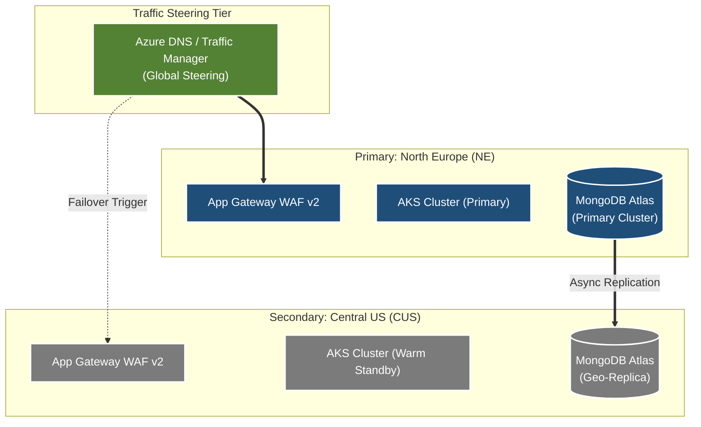
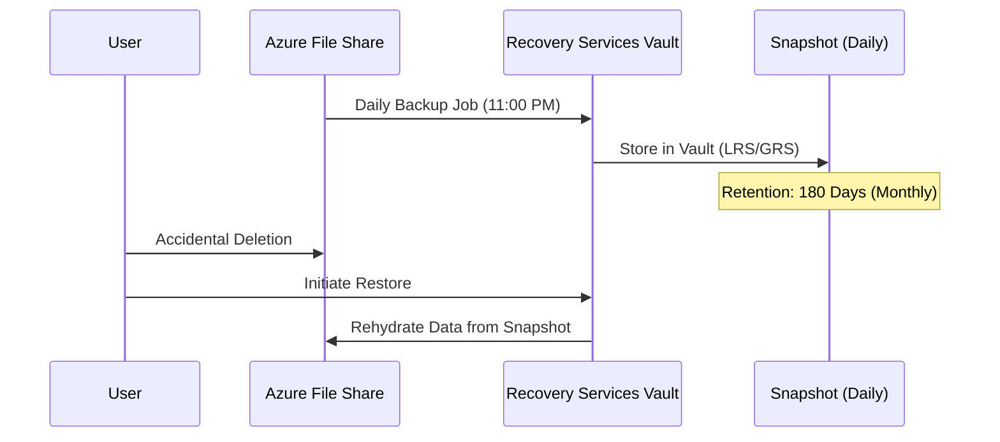
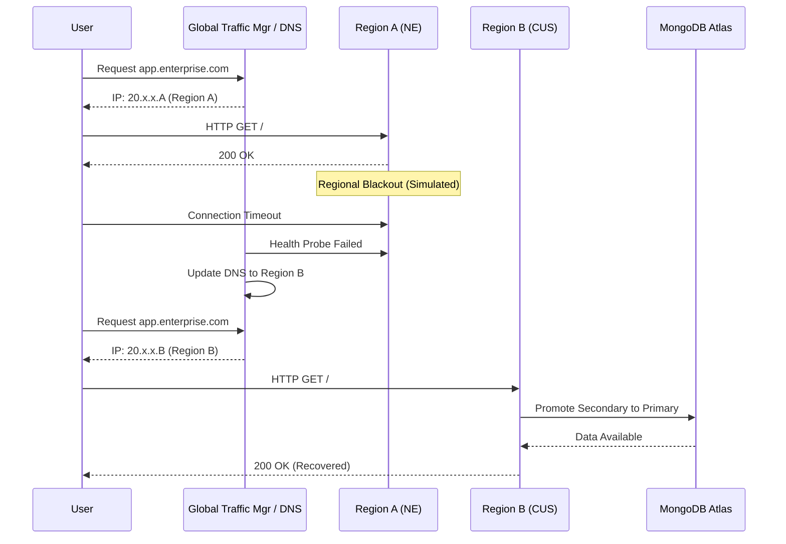
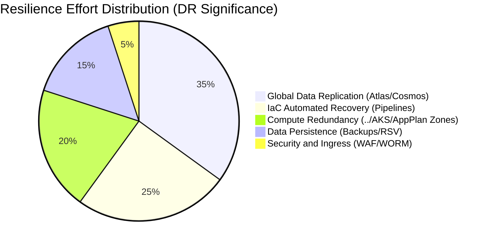

[ Previous: 421. Observability and Day2 Operations](421-OBSERVABILITY_AND_DAY2_OPERATIONS.md) | [ Home](../README.md) | [ Next: 821. FinOps Arch Analysis](821-FINOPS_ARCH_ANALYSIS.md)

---

# 811. DR and BCP Arch Analysis

---

##  Table of Contents

- [1. Executive Summary](#1-executive-summary)
- [2. Recovery Objectives (RPO and RTO)](#2-recovery-objectives-rpo-and-rto)
- [3. Regional Topology and Failover Strategy](#3-regional-topology-and-failover-strategy)
    - [3.1 Evidence of Multi-Region Logic:](#31-evidence-of-multi-region-logic)
- [4. Resiliency Matrix by Component](#4-resiliency-matrix-by-component)
- [5. Data Persistence and Replication Logic](#5-data-persistence-and-replication-logic)
    - [5.1 Database High Availability](#51-database-high-availability)
    - [5.2 Managed Backups (The Safety Net)](#52-managed-backups-the-safety-net)
- [6. Compute Resiliency (AKS and App Services)](#6-compute-resiliency-aks-and-app-services)
    - [6.1 AKS Self-Healing](#61-aks-self-healing)
    - [6.2 App Service Plan Redundancy](#62-app-service-plan-redundancy)
- [7. Traffic Management and Steering](#7-traffic-management-and-steering)
- [8. Automated Recovery Procedures (IaC Pipelines)](#8-automated-recovery-procedures-iac-pipelines)
- [9. Ransomware Protection and Immutability (WORM)](#9-ransomware-protection-and-immutability-worm)
- [10. DR Simulation and Chaos Testing Engineering](#10-dr-simulation-and-chaos-testing-engineering)
- [11. Health Probes and Circuit Breaker Patterns](#11-health-probes-and-circuit-breaker-patterns)
- [12. Step-by-Step DRP Execution Guide: The "Zero-to-Hero" Sequence](#12-step-by-step-drp-execution-guide-the-zero-to-hero-sequence)
    - [12.1 Phase 0: Emergency Preparation and State Recovery](#121-phase-0-emergency-preparation-and-state-recovery)
    - [12.2 Phase 1: Foundation (Shared Networking Hub)](#122-phase-1-foundation-shared-networking-hub)
    - [12.3 Phase 2: Compute Core (AKS and ACR)](#123-phase-2-compute-core-aks-and-acr)
    - [12.4 Phase 3: Application and Logic Engine (../App-Core)](#124-phase-3-application-and-logic-engine-app-core)
    - [12.5 Phase 4: Client Catalog and Data Ingestion (../App-Catalog)](#125-phase-4-client-catalog-and-data-ingestion-app-catalog)
- [13. Automated Failover Flow: Regional Redirection](#13-automated-failover-flow-regional-redirection)
- [14. Controlled Decommissioning and Safe Deletion Guide](#14-controlled-decommissioning-and-safe-deletion-guide)
    - [14.1 Phase 1: Client Data and Multi-Cloud Purge (../App-Catalog)](#141-phase-1-client-data-and-multi-cloud-purge-app-catalog)
    - [14.2 Phase 2: Application Logic and Persistence (../App-Core)](#142-phase-2-application-logic-and-persistence-app-core)
    - [14.3 Phase 3: Compute Engine Removal (AKS and Registry)](#143-phase-3-compute-engine-removal-aks-and-registry)
    - [14.4 Phase 4: Network Foundation Teardown (../Shared-Infra)](#144-phase-4-network-foundation-teardown-shared-infra)
- [15. Component contribution to Business Continuity (Pie Chart)](#15-component-contribution-to-business-continuity-pie-chart)
- [16. Critical Risk Heatmap (Reverse Engineering Insights)](#16-critical-risk-heatmap-reverse-engineering-insights)
- [17. Expert Recommendations and Strategic Improvements](#17-expert-recommendations-and-strategic-improvements)
- [18. Validated Reference Library (Official and Community)](#18-validated-reference-library-official-and-community)

---

## 1. Executive Summary

The architecture follows a **Multi-Region Warm Standby** pattern. The "Source of Truth" for recovery is split between **Azure Native Backups** (for file shares and disks) and **Global Database Replication** (MongoDB Atlas / Cosmos DB). 

Key architectural pillars for continuity:
*   **Regional Isolation**: Dual-region deployment capacity identified in [pro-mainbranch.tfvars](../App-Catalog/terraform-manifests/pro-mainbranch.tfvars).
*   **Infrastructure-as-Code (IaC)**: Total environment reproducibility via Terraform.
*   **Geo-Redundancy**: Use of GRS (Geo-Redundant Storage) for production tiers.

## 2. Recovery Objectives (RPO and RTO)

Based on the identified SKUs and backup policies, the system targets the following recovery metrics for Production:

| Component | Recovery Point Objective (RPO) | Recovery Time Objective (RTO) | Evidence (Code) |
| :--- | :--- | :--- | :--- |
| **Databases (Atlas/Cosmos)**| < 5 Seconds | < 30 Seconds (Auto-Failover) | [29-cosmosdb-mongodb.tf](../App-Core/poc-cosmosdb-mongo/terraform-manifests/modules/appcore_module/29-cosmosdb-mongodb.tf) |
| **File Shares (Azure Files)**| 24 Hours (Daily Backup) | < 4 Hours (Vault Restore) | [10-file-share-clients-backup-policy.tf](../App-Core/terraform-manifests/modules/appcore_module/10-file-share-clients-backup-policy.tf) |
| **Kubernetes (../AKS)** | 0 (IaC Redeployment) | < 1 Hour (Pipeline Execution) | [01-terraform-provision-AKS-pipeline.yml](../AKS/01-terraform-provision-AKS-pipeline.yml) |
| **Static Data (Storage)** | < 15 Minutes (GRS) | < 12 Hours (Azure-initiated) | [pro-mainbranch.tfvars](../App-Catalog/terraform-manifests/pro-mainbranch.tfvars) |

## 3. Regional Topology and Failover Strategy

The architecture implements a Hub-Spoke model replicated across two major Azure Geographies.

### 3.1 Evidence of Multi-Region Logic:
The logic in [03-locals.tf](../App-Core/terraform-manifests/modules/appcore_module/03-locals.tf) and the regional flags confirm the capacity to instantiate the entire stack in a second geography.

## 4. Resiliency Matrix by Component

| Tier | Resiliency Mechanism | Implementation Detail | Source of Truth |
| :--- | :--- | :--- | :--- |
| **Identity** | Azure AD (Entra ID) | Global SaaS availability. | Azure Native |
| **Network** | Hub-Spoke Peering | Cross-Region VNet Peering supported. | [05-vnet.tf](../App-Core/terraform-manifests/modules/appcore_module/05-vnet.tf) |
| **Security** | WAF v2 | Multi-zone deployment enabled. | [backup-10-application-gateway.tf](../App-Core/boilerplates/backup-10-application-gateway.tf) |
| **Registry** | ACR Geo-Replication | Premium SKU used for regional image parity. | [12-acr.tf](../AKS/terraform-manifests/modules/sharedinfra_aks_module/12-acr.tf) |
| **Compute** | AKS Nodepools | Multi-zone (Zones 1,2,3) node distribution. | [06-aks-cluster.tf](../AKS/terraform-manifests/modules/sharedinfra_aks_module/06-aks-cluster.tf) |

## 5. Data Persistence and Replication Logic

### 5.1 Database High Availability
For the Cosmos DB POC, the code explicitly mandates high availability and multi-master potential:
*   **Enable Automatic Failover**: `enable_automatic_failover = true` in [29-cosmosdb-mongodb.tf](../App-Core/poc-cosmosdb-mongo/terraform-manifests/modules/appcore_module/29-cosmosdb-mongodb.tf).
*   **Consistency Level**: Set to `Session` to balance latency and DR consistency.

### 5.2 Managed Backups (The Safety Net)
The **Recovery Services Vault (RSV)** acts as the final line of defense.

## 6. Compute Resiliency (AKS and App Services)

### 6.1 AKS Self-Healing
*   **Cluster Autoscaler**: Automatically replaces failed nodes or scales up.
*   **Liveness/Readiness Probes**: Configured to ensure traffic only hits healthy pods.

### 6.2 App Service Plan Redundancy
Production plans (`P2v2`) are deployed with `zone_redundant = true` (where supported) in [16-app-service-plan.tf](../App-Core/terraform-manifests/modules/appcore_module/16-app-service-plan.tf).

## 7. Traffic Management and Steering

**Failover Lifecycle:**
1.  **Health Probe Failure**: Region A (Primary) probes fail on AGW.
2.  **DNS Update**: Global Load Balancer shifts CNAME to Region B.
3.  **Client Re-routing**: Users transparently connect to the Secondary geography.
4.  **Database Promotion**: MongoDB Atlas promotes the secondary replica to Primary.

## 8. Automated Recovery Procedures (IaC Pipelines)

In a "Total Regional Wipeout," the recovery procedure is fully automated via Azure DevOps:
1.  **Shared Infra**: Run [01-terraform-provision-sharedinfra-pipeline.yml](../Shared-Infra/01-terraform-provision-sharedinfra-pipeline.yml).
2.  **AKS Cluster**: Run [01-terraform-provision-AKS-pipeline.yml](../AKS/01-terraform-provision-AKS-pipeline.yml).
3.  **App Core**: Run [01-terraform-provision-appcore-pipeline.yml](../App-Core/01-terraform-provision-appcore-pipeline.yml).

## 9. Ransomware Protection and Immutability (WORM)

The architecture includes **Version-Level Immutability** as documented in [shared-azure-devops-pipeline-vars.yml](../App-Core/configuration/shared-azure-devops-pipeline-vars.yml).
*   **Mechanism**: Write-Once-Read-Many (WORM) policies prevent data deletion even by admins.
*   **Resource Locks**: [10-file-share-clients-backup-policy.tf](../App-Core/terraform-manifests/modules/appcore_module/10-file-share-clients-backup-policy.tf) mentions `AzureBackupProtectionLock` to prevent vault destruction.

## 10. DR Simulation and Chaos Testing Engineering

*   **State Recovery**: [05-terraform-force-unlock.yml](../App-Core/05-terraform-force-unlock.yml) allows clearing locks during pipeline failures.
*   **Simulation Scenarios**: Manual regional network blackout or ML compute exhaustion (`max_count = 0`).

## 11. Health Probes and Circuit Breaker Patterns

The Application Gateway (`WAF v2`) configuration in [backup-10-application-gateway.tf](../App-Core/boilerplates/backup-10-application-gateway.tf) implements active health monitoring:

*   **Probe Frequency**: Probes are sent every 30 seconds to the `/health` endpoint of the App Services.
*   **Unhealthy Threshold**: After 3 failed attempts, the instance is removed from the rotation.

## 12. Step-by-Step DRP Execution Guide: The "Zero-to-Hero" Sequence

This section outlines the precise technical sequence to restore the entire ecosystem from zero in a secondary Azure region.

### 12.1 Phase 0: Emergency Preparation and State Recovery
Before redeploying, ensure that Terraform state locks are cleared to prevent "Lease Conflict" errors.
*   **Pipeline**: [`05-terraform-force-unlock.yml`](../App-Core/05-terraform-force-unlock.yml)
*   **Action**: Forcefully releases the blob lease on the `.tfstate` file in the shared storage account.

### 12.2 Phase 1: Foundation (Shared Networking Hub)
Recreate the regional network backbone. This phase is critical as all Spokes depend on the Hub's VNet and DNS.
*   **Pipeline**: [`01-terraform-provision-sharedinfra-pipeline.yml`](../Shared-Infra/01-terraform-provision-sharedinfra-pipeline.yml)
*   **Resources Created**: `azurerm_virtual_network`, `azurerm_subnet`, `azurerm_dns_zone`.
*   **Verification**: Ensure `vnet-sharedinfra-dnepro` is peering correctly.

### 12.3 Phase 2: Compute Core (AKS and ACR)
Instantiate the Kubernetes control plane.
*   **Pipeline**: [`01-terraform-provision-AKS-pipeline.yml`](../AKS/01-terraform-provision-AKS-pipeline.yml)
*   **Resources Created**: `azurerm_kubernetes_cluster` (with OIDC issuer), `azurerm_container_registry`.
*   **Note**: The OIDC issuer URL will change; Workload Identity credentials must be updated.

### 12.4 Phase 3: Application and Logic Engine (../App-Core)
Deploy core application services and the backup infrastructure.
*   **Pipeline**: [`01-terraform-provision-appcore-pipeline.yml`](../App-Core/01-terraform-provision-appcore-pipeline.yml)
*   **Resources Created**: `azurerm_service_plan`, `azurerm_linux_web_app`, `azurerm_recovery_services_vault`.

### 12.5 Phase 4: Client Catalog and Data Ingestion (../App-Catalog)
Deploy client-specific clusters and databases.
*   **Pipeline**: [`01-terraform-provision-catalog3-pipeline.yml`](../App-Catalog/01-terraform-provision-catalog3-pipeline.yml)
*   **Data Rehydration**: Trigger [`creation-time-provisioner-mongodb.sh`](../App-Core/terraform-manifests/creation-time-provisioner-mongodb.sh) to restore baseline collections.

## 13. Automated Failover Flow: Regional Redirection

## 14. Controlled Decommissioning and Safe Deletion Guide

This section outlines the **inverse sequence** required to safely destroy the entire ecosystem.

### 14.1 Phase 1: Client Data and Multi-Cloud Purge (../App-Catalog)
First, destroy the client-specific instances.
*   **Pipeline**: [02-terraform-destroy-catalog3-pipeline.yml](../App-Catalog/02-terraform-destroy-catalog3-pipeline.yml)
*   **Resources Destroyed**: `mongodbatlas_cluster`, `mongodbatlas_project`.

### 14.2 Phase 2: Application Logic and Persistence (../App-Core)
Remove web apps and storage interfaces.
*   **Pipeline**: [02-terraform-destroy-appcore-pipeline.yml](../App-Core/02-terraform-destroy-appcore-pipeline.yml)
*   **Resources Destroyed**: `azurerm_linux_web_app`, `azurerm_service_plan`, `azurerm_storage_account`.

### 14.3 Phase 3: Compute Engine Removal (AKS and Registry)
Teardown the Kubernetes infrastructure.
*   **Pipeline**: [02-terraform-destroy-AKS-pipeline.yml](../AKS/02-terraform-destroy-AKS-pipeline.yml)
*   **Resources Destroyed**: `azurerm_kubernetes_cluster`, `azurerm_container_registry`.

### 14.4 Phase 4: Network Foundation Teardown (../Shared-Infra)
Finally, destroy the hub-spoke networking backbone.
*   **Pipeline**: [02-terraform-destroy-sharedinfra-pipeline.yml](../Shared-Infra/02-terraform-destroy-sharedinfra-pipeline.yml)
*   **Resources Destroyed**: `azurerm_virtual_network`, `azurerm_subnet`, `azurerm_dns_zone`.

## 15. Component contribution to Business Continuity (Pie Chart)

The following diagram illustrates how the architectural effort is distributed across resiliency layers based on the resources identified in the code.

## 16. Critical Risk Heatmap (Reverse Engineering Insights)

Based on the deep analysis of the repository, these are the **top architectural risks** that could jeopardize the BCP plan.

| Risk ID | Risk Title | Severity | Technical Context | Impact on DR |
| :--- | :--- | :--- | :--- | :--- |
| **R-01** | **Supply Chain Dependency** | 🔴 High | Pipelines pull scripts from external Bitbucket repos during deployment. | If Bitbucket is down or the service connection fails, **recovery cannot start**. |
| **R-02** | **Manual DNS Steering** | 🔴 High | No Global Traffic Manager found in code. | Regional failover requires a **manual DNS CNAME record update**, increasing RTO. |
| **R-03** | **Regional Vault SPOF** | 🟡 Medium | Key Vault SKU is `standard`. | If the primary region (NE) suffers a total vault failure, the secondary region **cannot access certificates/secrets**. |
| **R-04** | **State Lock Congestion** | 🟡 Medium | High frequency of pipeline runs during testing. | A crashed pipeline leaves the `.tfstate` locked, requiring a Force Unlock before DR can proceed. |

## 17. Expert Recommendations and Strategic Improvements

1.  **Global Load Balancing (Front Door)**:
    *   **Recommendation**: Replace regional Application Gateway DNS with **Azure Front Door Premium**.
    *   **Value**: Automated, sub-second failover between regions without manual DNS intervention.
2.  **Secret Mirroring (Cross-Region Key Vault)**:
    *   **Recommendation**: Enable **Key Vault Multi-Region Replication** or mirror secrets to the Secondary region using Terraform.
    *   **Value**: Ensures the US Central region remains operational even if the North Europe Vault is unreachable.
3.  **Artifact Decoupling (Immutable Packages)**:
    *   **Recommendation**: Move database migration scripts from Bitbucket to **Azure Artifacts** or an internal **Nexus/Artifactory**.
    *   **Value**: Removes the external dependency (R-01) from the recovery path.
4. **Chaos Engineering Automation**:
    *   **Recommendation**: Integrate **Azure Chaos Studio** to periodically test the scenarios defined in Section 10.
    *   **Value**: Proves the BCP metrics defined in Section 2 are empirically valid.

---

## 18. Validated Reference Library (Official and Community)

### Official Azure Resilience and DR Documentation
*   **[Azure Front Door Premium](https://azure.microsoft.com/en-us/products/frontdoor/)**: Global load balancing and site acceleration.
*   **[Azure Chaos Studio](https://azure.microsoft.com/en-us/products/chaos-studio/)**: Service for improving application resilience through chaos engineering.
*   **[Azure Well-Architected Framework: Reliability](https://learn.microsoft.com/en-us/azure/well-architected/reliability/)**: Official best practices for high-availability and disaster recovery.

---

[ Previous: 421. Observability and Day2 Operations](421-OBSERVABILITY_AND_DAY2_OPERATIONS.md) | [ Home](../README.md) | [ Next: 821. FinOps Arch Analysis](821-FINOPS_ARCH_ANALYSIS.md)

---

*Technical Documentation: Disaster Recovery and Business Continuity: Architectural Analysis | Vision 2026 Architectural Guide*