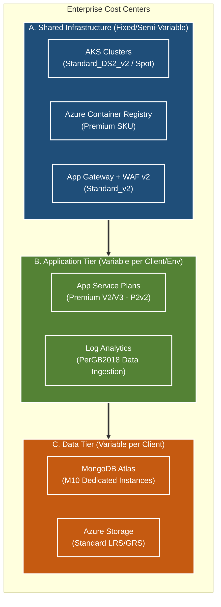
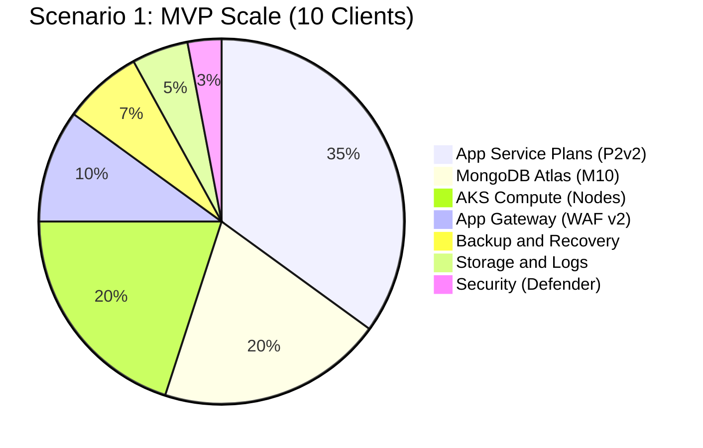
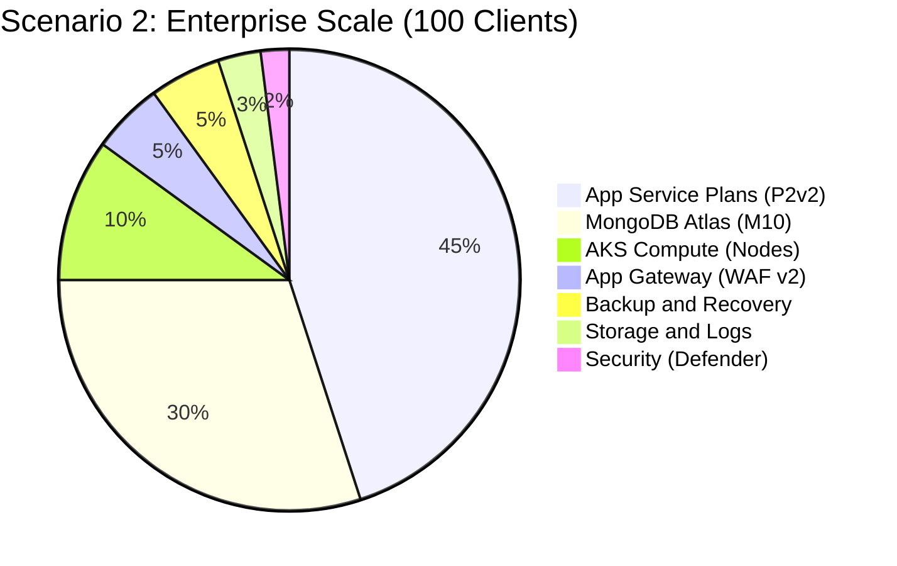
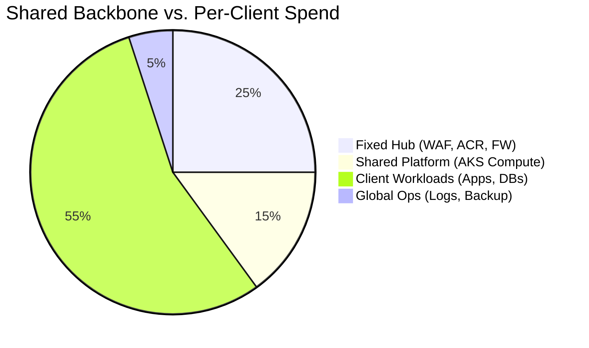
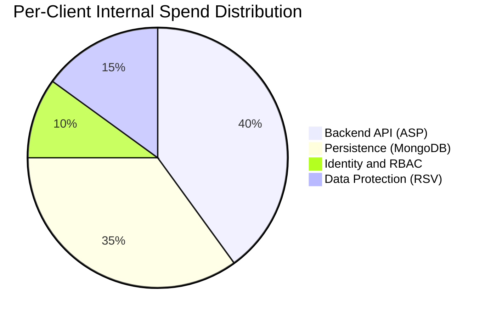
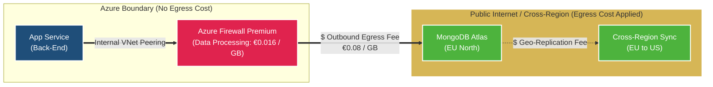
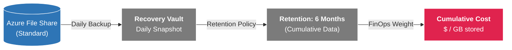
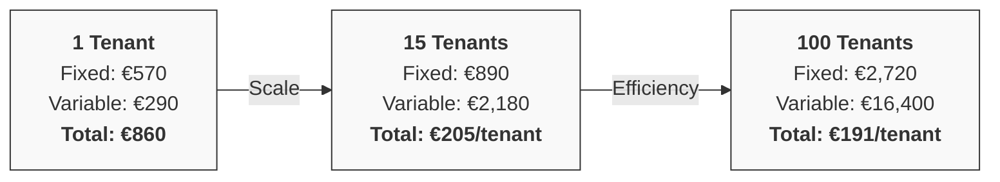
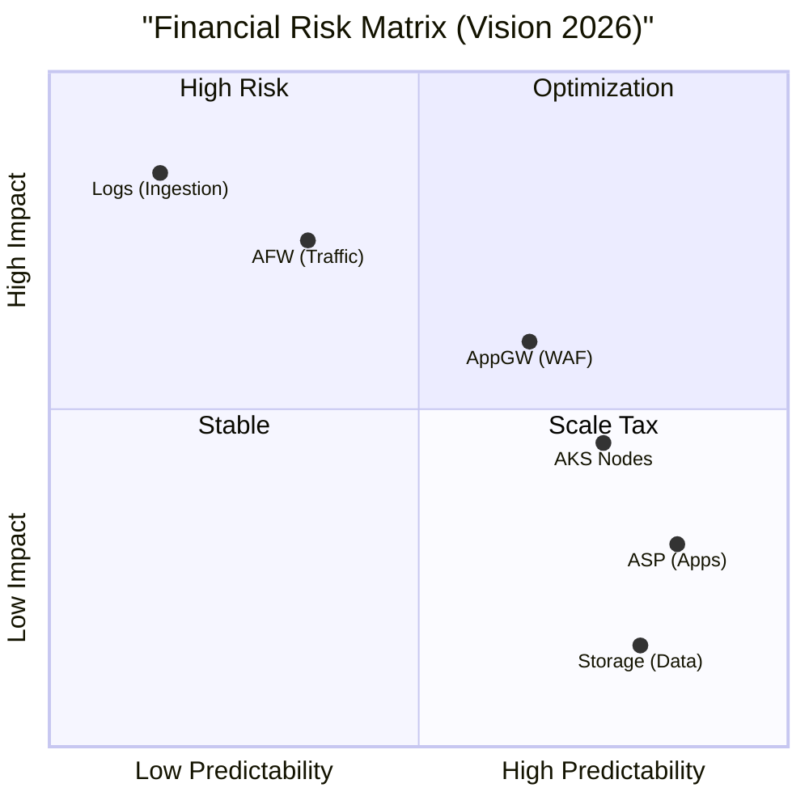

[ Previous: 811. DR and BCP Arch Analysis](811-DR_BCP_ARCH_ANALYSIS.md) | [ Home](../README.md) | [ Next: 911. Troubleshooting and Runbooks](911-TROUBLESHOOTING_AND_OPERATIONAL_RUNBOOKS.md)

---

# 821. FinOps Arch Analysis

---

##  Table of Contents

- [1. Executive Summary](#1-executive-summary)
- [2. Cost Center Structure and Architecture](#2-cost-center-structure-and-architecture)
    - [2.1 Evidence from Code:](#21-evidence-from-code)
- [3. Estimated Monthly Cost Distribution (Pie Chart)](#3-estimated-monthly-cost-distribution-pie-chart)
    - [3.1 Scaling Scenarios (MVP vs. Enterprise)](#31-scaling-scenarios-mvp-vs-enterprise)
    - [3.2 Functional Cost Breakdown](#32-functional-cost-breakdown)
- [4. SKU and Pricing Reverse Engineering Matrix](#4-sku-and-pricing-reverse-engineering-matrix)
- [5. Environment and Lifecycle Cost Impact (ENG vs PRO)](#5-environment-and-lifecycle-cost-impact-eng-vs-pro)
    - [5.1 The "Shadow Infrastructure" Cost Multiplier](#51-the-shadow-infrastructure-cost-multiplier)
- [6. Volumetric Scaling Scenarios (Multi-Tenant Growth)](#6-volumetric-scaling-scenarios-multi-tenant-growth)
- [7. FinOps Optimization Levers (Quick Wins)](#7-finops-optimization-levers-quick-wins)
- [8. Advanced Day-2 Analytics and Data Gravity](#8-advanced-day-2-analytics-and-data-gravity)
    - [8.1 The Cost of "Data Gravity" and Egress Routing](#81-the-cost-of-data-gravity-and-egress-routing)
    - [8.2 Database Economics: Cosmos DB (POC) vs. MongoDB Atlas](#82-database-economics-cosmos-db-poc-vs-mongodb-atlas)
- [9. GreenOps vs FinOps Matrix](#9-greenops-vs-finops-matrix)
- [10. High-Performance Compute (../AKS) and ML Economics](#10-high-performance-compute-aks-and-ml-economics)
    - [10.1 The "High-Memory" vs. "GPU" Cost Dilemma](#101-the-high-memory-vs-gpu-cost-dilemma)
- [11. Security Posture and Defender scaling](#11-security-posture-and-defender-scaling)
    - [11.1 Microsoft Defender for Cloud Scaling](#111-microsoft-defender-for-cloud-scaling)
- [12. Business Continuity and Backup Retention Economics](#12-business-continuity-and-backup-retention-economics)
    - [12.1 Backup Retention Multipliers](#121-backup-retention-multipliers)
- [13. Unit Economics: Cost per Tenant Amortization](#13-unit-economics-cost-per-tenant-amortization)
- [14. Commitment-Based Optimization (RI and Savings Plans)](#14-commitment-based-optimization-ri-and-savings-plans)
- [15. Financial Risk Heatmap: The "Burn Rate" Radar](#15-financial-risk-heatmap-the-burn-rate-radar)
- [16. Strategic Recommendations (CFO/CTO Roadmap)](#16-strategic-recommendations-cfocto-roadmap)
- [17. Validated Reference Library (Official and Community)](#17-validated-reference-library-official-and-community)

---

## 1. Executive Summary

This repository implements a robust, Zero-Trust Hub-Spoke architecture. From a **FinOps perspective**, the infrastructure is divided into **Fixed Costs** (Shared Infrastructure like AKS, WAF, ACR) and **Variable Costs** (Application App Service Plans and MongoDB Atlas clusters, which scale linearly per client and per region). 

The use of a custom Logic Engine (with the `d` prefix for branch awareness) means that **Platform Engineering testing directly duplicates cost** by spinning up "Shadow Infrastructure" during the IaC lifecycle.

## 2. Cost Center Structure and Architecture

Based on the reverse engineering of the code, the architecture allocates budget across three main tiers.



### 2.1 Evidence from Code:
*   **AKS Compute:** Node pools define `Standard_DS2_v2` and `Standard_E8as_v4` in [08-aks-cluster-nodepool-002-enterprise-ml-jobs.tf](../AKS/terraform-manifests/modules/sharedinfra_aks_module/08-aks-cluster-nodepool-002-enterprise-ml-jobs.tf).
*   **App Service:** The SKU `P2v2` is requested via variables in [variables.tf](../App-Catalog/terraform-manifests/variables.tf).
*   **Data Tier:** MongoDB Atlas relies on the `M10` provider instance size in [15-mongodb.tf](../App-Catalog/terraform-manifests/modules/appanalysis_module/15-mongodb.tf).

## 3. Estimated Monthly Cost Distribution (Pie Chart)

The following diagrams illustrate the cost distribution across different scaling scenarios and functional buckets.

### 3.1 Scaling Scenarios (MVP vs. Enterprise)





### 3.2 Functional Cost Breakdown

To optimize the architecture, it is critical to distinguish between the **Shared Backbone** (Hub) and the **Per-Tenant Workload** (Spoke).





## 4. SKU and Pricing Reverse Engineering Matrix

All estimates assume **Pay-As-You-Go** rates in the **North Europe** region.

| Azure Resource | SKU Discovered | Cost Est. (Monthly) | Evidence and Pricing Reference |
| :--- | :--- | :--- | :--- |
| **AKS Nodepools** | `Standard_DS2_v2` | **€110 / $120** per Node | [07-aks-cluster-nodepool-001-infra.tf](../AKS/terraform-manifests/modules/sharedinfra_aks_module/07-aks-cluster-nodepool-001-infra.tf). |
| **AKS ML Pool** | `Standard_E8as_v4` | **€450 / $490** per Node | [08-aks-cluster-nodepool-002-enterprise-ml-jobs.tf](../AKS/terraform-manifests/modules/sharedinfra_aks_module/08-aks-cluster-nodepool-002-enterprise-ml-jobs.tf). |
| **App Service Plan**| `P2v2` (Premium V2) | **€185 / $200** per Instance | [16-app-service-plan.tf](../App-Core/terraform-manifests/modules/appcore_module/16-app-service-plan.tf). |
| **App Gateway** | `Standard_v2 + WAF` | **€305 / $330** (Base) | [backup-10-application-gateway.tf](../App-Core/boilerplates/backup-10-application-gateway.tf). |
| **MongoDB Atlas** | `M10` (Dedicated) | **€65 / $70** per Client | [15-mongodb.tf](../App-Catalog/terraform-manifests/modules/appanalysis_module/15-mongodb.tf). |
| **Recovery Vault** | `Standard` | **€30 / $33** per Instance | [10-file-share-clients-backup-policy.tf](../App-Core/terraform-manifests/modules/appcore_module/10-file-share-clients-backup-policy.tf). |
| **ACR Registry** | `Premium` | **€45 / $50** | [12-acr.tf](../AKS/terraform-manifests/modules/sharedinfra_aks_module/12-acr.tf). |
| **Log Analytics** | `PerGB2018` | **€2.30 / $2.50** per GB | [35-log-analytics-workspace.tf](../App-Core/terraform-manifests/modules/appcore_module/35-log-analytics-workspace.tf). |

## 5. Environment and Lifecycle Cost Impact (ENG vs PRO)

### 5.1 The "Shadow Infrastructure" Cost Multiplier
When deploying from the `develop` branch, the Logic Engine prepends a **`d`** to all resource names (e.g., `rg-d-appcore-ne-pro`).
*   **Logic Switch:** `gitbranch = (var.gitbranch != "main") ? "d" : ""` in [03-locals.tf](../App-Core/terraform-manifests/modules/appcore_module/03-locals.tf).
*   **FinOps Impact:** If an engineer tests a deployment on `develop`, they spin up a completely independent stack. This **doubles the cost** (e.g., an extra **€800 / $860/mo**) until the sandbox is destroyed.

## 6. Volumetric Scaling Scenarios (Multi-Tenant Growth)

The platform is designed for **linear cost predictability**. As client volume increases, the "Hub" costs are amortized, while the "Spoke" costs scale with tenancy.

| Metric | MVP (1 Client) | Growth (15 Clients) | Large (50 Clients) | Enterprise (100 Clients) |
| :--- | :--- | :--- | :--- | :--- |
| **Regions** | 1 (NE) | 1 (NE) | 2 (NE and CUS) | 3 (Global) |
| **Hub/Network** | €350 / $380 | €450 / $490 | €900 / $980 | €1,400 / $1,520 |
| **AKS Infra** | €220 / $240 | €440 / $480 | €880 / $960 | €1,320 / $1,440 |
| **AKS ML** | €0 / $0 | €450 / $490 | €1,800 / $1,960 | €4,500 / $4,900 |
| **App Service** | €185 / $200 | €555 / $600 | €1,850 / $2,000 | €3,700 / $4,000 |
| **MongoDB M10** | €65 / $70 | €975 / $1,050 | €3,250 / $3,500 | €6,500 / $7,000 |
| **Backup/RSV** | €30 / $33 | €150 / $165 | €500 / $550 | €1,000 / $1,080 |
| **Egress** | €10 / $11 | €50 / $55 | €300 / $330 | €700 / $760 |
| **Total Est. MRR**| **€860 / $934** | **€3,070 / $3,330** | **€9,480 / $10,320** | **€19,120 / $20,700** |

## 7. FinOps Optimization Levers (Quick Wins)

1.  **Spot Instances (Implemented):** Node pool [11-aks-cluster-nodepool-004-spot.tf](../AKS/terraform-manifests/modules/sharedinfra_aks_module/11-aks-cluster-nodepool-004-spot.tf) reduces compute costs for non-critical pods by **~70%**.
2.  **MongoDB Consolidation:** Current logic creates 1 x M10 per client. Consolidating to shared clusters for DEV/QA would save **€60 / $65 per client**.
3.  **Log Retention Optimization:** Code enforces `retention_in_days = 30` in [19-log-analytics-workspace.tf](../App-Catalog/terraform-manifests/modules/appanalysis_module/19-log-analytics-workspace.tf), avoiding the higher default 90-day cost.
4.  **Auto-Shutdown:** Enforce `terraform destroy` on all `d-` prefixed resources using [02-terraform-destroy-AKS-pipeline.yml](../AKS/02-terraform-destroy-AKS-pipeline.yml) every Friday evening.

## 8. Advanced Day-2 Analytics and Data Gravity

Beyond the initial provisioning SKUs, the repository reveals several architectural decisions that generate "hidden" operational costs. Chief among these are data transfer (egress) and database scaling mechanisms.

### 8.1 The Cost of "Data Gravity" and Egress Routing

In a Zero-Trust Hub-Spoke architecture, all outbound traffic from the App Service and AKS clusters is forcibly routed through the **Azure Firewall Premium** (`0.0.0.0/0` UDR). 



**FinOps Insight**: 
*   **Firewall Processing Cost**: The Azure Firewall Premium charges **~€0.016 ($0.018)** per GB processed.
*   **Internet Egress Cost**: Reaching MongoDB Atlas over the public internet incurs standard Azure egress charges of **~€0.08 ($0.087)** per GB (after the first 100GB).

### 8.2 Database Economics: Cosmos DB (POC) vs. MongoDB Atlas

The repository contains a POC for migrating from MongoDB Atlas to **Azure Cosmos DB** in [29-cosmosdb-mongodb.tf](../App-Core/poc-cosmosdb-mongo/terraform-manifests/modules/appcore_module/29-cosmosdb-mongodb.tf).

| Database Tier | Pricing Model identified in Repo | Base Monthly Cost | Scaling Factor |
| :--- | :--- | :--- | :--- |
| **MongoDB Atlas (M10)** | Dedicated VM (`provider_instance_size_name = "M10"`) | **~€65 / $70** | Flat rate. Safe for predictable loads. |
| **Cosmos DB (POC)** | Provisioned Throughput (`throughput = 400` RU/s) | **~€22 / $24** (Minimum) | Costs multiply by 2 if `enable_automatic_failover = true` is enabled. |

## 9. GreenOps vs FinOps Matrix

Financial operations (FinOps) and Sustainability (GreenOps) are deeply intertwined in this repository.

| Architectural Decision in Code | FinOps Benefit (Cost Reduction) | GreenOps Benefit (Carbon Reduction) | Code Evidence |
| :--- | :--- | :--- | :--- |
| **AKS Spot Nodepools** | **~70% Savings** on compute. | Reduces idle server waste. | [11-aks-cluster-nodepool-004-spot.tf](../AKS/terraform-manifests/modules/sharedinfra_aks_module/11-aks-cluster-nodepool-004-spot.tf) |
| **AKS Cluster Autoscaler** | Only pays for nodes when pods are pending. | Drastically lowers energy consumption during off-peak hours. | [07-aks-cluster-nodepool-001-infra.tf](../AKS/terraform-manifests/modules/sharedinfra_aks_module/07-aks-cluster-nodepool-001-infra.tf) |
| **Log Analytics Purging** | **€2.30 / $2.50 per GB** saved. | Less cold-storage disk spinning in datacenters. | [35-log-analytics-workspace.tf](../App-Core/terraform-manifests/modules/appcore_module/35-log-analytics-workspace.tf) |

## 10. High-Performance Compute (../AKS) and ML Economics

The repository includes specialized node pools for **Machine Learning (ML) Models** in [`08-aks-cluster-nodepool-002-enterprise-ml-jobs.tf`](../AKS/terraform-manifests/modules/sharedinfra_aks_module/08-aks-cluster-nodepool-002-enterprise-ml-jobs.tf).

### 10.1 The "High-Memory" vs. "GPU" Cost Dilemma

The code reveals a transition in compute strategy. While `Standard_DS2_v2` is used for system pods, ML jobs utilize much larger instances:

*   **Current Selection:** `Standard_E8as_v4` (8 vCPUs, 64 GB RAM).
    *   **Monthly Cost:** **~€450 / $490** per node (Pay-As-You-Go).
*   **Scale-to-Zero:** The logic `min_count = 0` found in [08-aks-cluster-nodepool-002-enterprise-ml-jobs.tf](../AKS/terraform-manifests/modules/sharedinfra_aks_module/08-aks-cluster-nodepool-002-enterprise-ml-jobs.tf) ensures nodes are only billed during inference.

## 11. Security Posture and Defender scaling

Reverse engineering the security modules reveals a "dormant" cost driver in the infrastructure's protection layer.

### 11.1 Microsoft Defender for Cloud Scaling
In [05-microsoft-defender.tf](../Shared-Infra/terraform-manifests/modules/sharedinfra_microsoft_defender_cloud/05-microsoft-defender.tf), the tier is currently set to `Free`, but the code contains commented-out `Standard` (now known as Defender for Cloud plans) tiers.

```hcl
resource "azurerm_security_center_subscription_pricing" "defender_servers" {
  tier          = "Free" # Manual swap to "Standard" impacts billing by ~$15/server/month
  resource_type = "Servers"
}
```

**FinOps Impact:** Switching to production-grade security (Defender for Servers, Defender for Databases) adds a hidden multiplier of **~$15/server/month**. For an AKS cluster with 10 nodes, this is an automatic **+$150/mo** bill increase.

## 12. Business Continuity and Backup Retention Economics

The architecture ensures data durability through a centralized **Recovery Services Vault (RSV)** found in [10-file-share-clients-backup-policy.tf](../App-Core/terraform-manifests/modules/appcore_module/10-file-share-clients-backup-policy.tf).

### 12.1 Backup Retention Multipliers
The cost of backups in this repo is not just for the instance but for the **retention logic** defined in the `.tfvars`.

*   **Logic:** Monthly retention is set to `6` months in [pro-mainbranch.tfvars](../App-Core/terraform-manifests/pro-mainbranch.tfvars).
*   **Cost of Inactivity:** Even if the client data is static, the Recovery Vault charges for the storage of the snapshots.



## 13. Unit Economics: Cost per Tenant Amortization

As the platform scales, the **"Hub Tax"** (Shared Infrastructure) is distributed across more tenants, significantly improving the gross margin.



**Strategic Insight**: Reaching 15 clients is the "tipping point" where the fixed costs of high-availability (WAF, Firewall, AKS Hub) become less than 30% of the total monthly spend.

## 14. Commitment-Based Optimization (RI and Savings Plans)

By moving from Pay-As-You-Go (PAYG) to **3-Year Reserved Instances (RI)** for the stable backbone, the organization can achieve massive savings.

| Resource Group | PAYG (Monthly) | 3-Yr RI (Est.) | Savings % | Impact |
| :--- | :--- | :--- | :--- | :--- |
| **AKS DS2_v2 Nodes** | €220 | €72 | **~67%** | High (Foundation) |
| **App Service P2v2** | €185 | €83 | **~55%** | Extreme (Tenant Scale) |
| **Cosmos DB RUs** | €22 | €8 | **~63%** | Medium (POC Phase) |
| **Total Backbone** | **€427** | **€163** | **€264 Saved/mo** | **€3,168 Annual Profit** |

## 15. Financial Risk Heatmap: The "Burn Rate" Radar

Not all costs are created equal. Some SKUs in this repository have high "explosive potential" if traffic spikes or configurations drift.



*   **Critical Risk**: **Log Analytics** and **Firewall Data Processing** are the most dangerous. A single misconfigured "noisy" pod can generate thousands of Euros in unexpected ingestion fees in hours.

## 16. Strategic Recommendations (CFO/CTO Roadmap)

1.  **Tag-Based Chargeback**: Implement mandatory `ClientName` tags in all modules (e.g., [`18-app-service.tf`](../App-Core/terraform-manifests/modules/appcore_module/18-app-service-back-api.tf)) to enable automated departmental billing.
2.  **Tiered Tenancy**: Offer "Bronze" tiers using **Shared App Service Plans** for smaller clients, reducing the €185/tenant entry cost to ~€40/tenant.
3.  **Governance Guardrails**: Implement **Azure Budgets** at the Resource Group level (mapped to the `d-` prefix logic) to automatically kill engineering sandboxes that exceed €500.
4.  **Graviton/Arm64 Transition**: Move AKS nodepools to **Dpsv5 (Arm64)** series to gain ~20% better price/performance once Docker images are multi-arch compatible.

---

## 17. Validated Reference Library (Official and Community)

### Official Pricing Calculators and Blueprints
*   **[Azure Pricing Calculator](https://azure.microsoft.com/pricing/calculator/)**: Global tool for estimating Azure consumption.
*   **[AKS Pricing Details](https://azure.microsoft.com/pricing/details/kubernetes-service/)**: Official costs for the Kubernetes control plane and nodes.
*   **[Virtual Machines Pricing (Linux)](https://azure.microsoft.com/en-us/pricing/details/virtual-machines/linux/#pricing)**: Rates for the DS2_v2 and E8as_v4 instances used in AKS.
*   **[App Service Pricing (Linux)](https://azure.microsoft.com/pricing/details/app-service/linux/)**: Costs for the P2v2 plans used by back-end APIs.
*   **[Application Gateway Pricing](https://azure.microsoft.com/pricing/details/application-gateway/)**: Fixed and variable costs for WAF v2.
*   **[MongoDB Atlas Pricing](https://www.mongodb.com/pricing)**: Dedicated M10 instance costs per client.
*   **[Azure Backup Pricing](https://azure.microsoft.com/pricing/details/backup/)**: Costs for the Recovery Services Vault and retention.
*   **[Azure Container Registry Pricing](https://azure.microsoft.com/pricing/details/container-registry/)**: Premium SKU costs for geo-replication.
*   **[Azure Monitor (Log Analytics) Pricing](https://azure.microsoft.com/pricing/details/monitor/)**: Data ingestion rates for PerGB2018.

### Strategic Optimization Patterns
*   **[Azure Well-Architected Framework: Cost Optimization](https://learn.microsoft.com/en-us/azure/well-architected/cost-optimization/)**: Official best practices for Azure FinOps.
*   **[Cloud FinOps (FinOps Foundation)](https://www.finops.org/introduction/what-is-finops/)**: Industry standards for cloud financial management.

---

[ Previous: 811. DR and BCP Arch Analysis](811-DR_BCP_ARCH_ANALYSIS.md) | [ Home](../README.md) | [ Next: 911. Troubleshooting and Runbooks](911-TROUBLESHOOTING_AND_OPERATIONAL_RUNBOOKS.md)

---

*Technical Documentation: FinOps Architecture Analysis: Cost Reverse Engineering | Vision 2026 Architectural Guide*