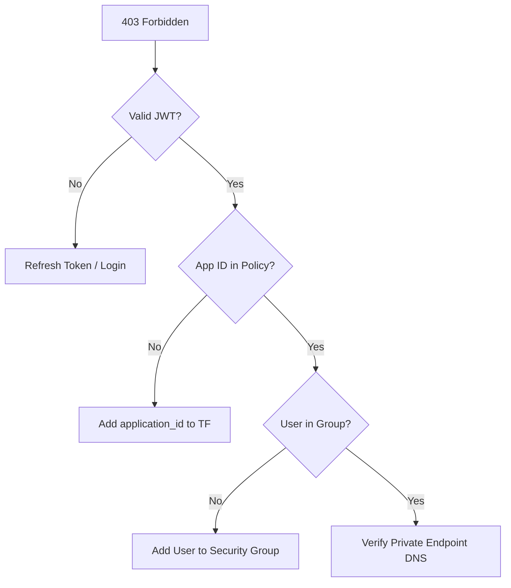

[ Previous: 821. FinOps Arch Analysis](821-FINOPS_ARCH_ANALYSIS.md) | [ Home](../README.md) | [ Next: 999. Future Roadmap and Backlog](999-FUTURE_ROADMAP_AND_IMPROVEMENT_BACKLOG.md)

---

# 911. Troubleshooting and Runbooks

---

##  Table of Contents

- [1. Operational KPIs](#1-operational-kpis)
- [2. Identity and Auth Failures (OIDC/OBO)](#2-identity-and-auth-failures-oidcobo)
    - [2.1 OIDC Federation Failures](#21-oidc-federation-failures)
    - [2.2 Compound Identity and OBO (403 Forbidden)](#22-compound-identity-and-obo-403-forbidden)
- [3. Network and Connectivity (UDR/Firewall)](#3-network-and-connectivity-udrfirewall)
    - [3.1 The "Black Hole" Egress (UDR Blocking)](#31-the-black-hole-egress-udr-blocking)
- [4. Infrastructure State and Locks](#4-infrastructure-state-and-locks)
    - [4.1 Error: State file is locked"](#41-error-state-file-is-locked)
- [5. AKS and Compute Orchestration](#5-aks-and-compute-orchestration)
    - [5.1 ImagePullBackOff (ACR Permissions)](#51-imagepullbackoff-acr-permissions)
- [6. Diagnostic Tools Matrix](#6-diagnostic-tools-matrix)
- [7. Validated Reference Library (Official and Community)](#7-validated-reference-library-official-and-community)

---

## 1. Operational KPIs

The following metrics are used to measure the health of the troubleshooting and recovery processes.

| KPI | Target | Measured via... |
| :--- | :---: | :--- |
| **MTTR** (Mean Time To Recovery) | < 30 min | Azure Monitor Alerts |
| **State Consistency** | 100% | `terraform plan` (Zero drift) |
| **Pipeline Success Rate** | > 95% | Azure DevOps Analytics |
| **Secret Rotation Compliance** | 100% | Key Vault Event Grid logs |

## 2. Identity and Auth Failures (OIDC/OBO)

### 2.1 OIDC Federation Failures
**Symptom**: Pipeline fails during `terraform init` or `apply` with `AuthorizationFailed` or `Invalid Audience`.

**Reverse Engineering Evidence**:
The OIDC trust is defined in the Service Connection and consumed in [`providers.tf`](../App-Core/terraform-manifests/providers.tf) via `use_oidc = true`.

| Error | Root Cause | Resolution |
| :--- | :--- | :--- |
| `Subject mismatch` | The branch name doesn't match the Federated Identity Subject in Entra ID. | Check if branch is `develop` or `main`. Verify subject pattern in Entra ID App Registration. |
| `Invalid Audience` | The `client_id` used in the provider doesn't match the App Registration. | Verify `var.client_id` in the pipeline variable group. |

### 2.2 Compound Identity and OBO (403 Forbidden)
**Symptom**: Application logs show `403 Forbidden` when attempting to fetch secrets from Key Vault.

**Logic Source of Truth**: [`23-key-vault-clients.tf`](../App-Core/terraform-manifests/modules/appcore_module/23-key-vault-clients.tf).
```hcl
resource "azurerm_key_vault_access_policy" "compound_identity" {
  application_id = azuread_service_principal.api.application_id
  object_id      = azuread_group.authorized_users.object_id
}
```

**Diagnostic Flow**:


## 3. Network and Connectivity (UDR/Firewall)

### 3.1 The "Black Hole" Egress (UDR Blocking)
**Symptom**: AKS pods or App Service cannot reach MongoDB Atlas or the Public Internet.

**Architecture Constraint**:
As defined in [`05-vnet.tf`](../App-Core/terraform-manifests/modules/appcore_module/05-vnet.tf), all traffic is routed to the Firewall.

**Validation Command**:
```bash
kubectl exec -it debug-pod -- curl -I https://cloud.mongodb.com
```

**Resolution**:
1. Check **Azure Firewall Application Rules**. Ensure the FQDN `*.mongodb.com` is allowed.
2. Verify the Route Table `rt-force-fw` is associated with the source subnet.

## 4. Infrastructure State and Locks

### 4.1 Error: State file is locked"
**Symptom**: Pipeline fails because another process (or a crashed run) holds the lease on the `.tfstate` blob.

**Runbook**:
1. Identify the Lease ID in the error log.
2. Navigate to the **05-terraform-force-unlock** pipeline.
3. Provide the **Lock ID** as a parameter and run.
4. **Source Code**: Refer to [`App-Core/05-terraform-force-unlock.yml`](../App-Core/05-terraform-force-unlock.yml).

## 5. AKS and Compute Orchestration

### 5.1 ImagePullBackOff (ACR Permissions)
**Symptom**: Pods fail to start.

**Verification**:
The RBAC link is established in [`14-rbac.tf`](../AKS/terraform-manifests/modules/sharedinfra_aks_module/14-rbac.tf).
```hcl
resource "azurerm_role_assignment" "aks_acr_pull" {
  role_definition_name = "AcrPull"
  principal_id         = azurerm_kubernetes_cluster.aks.kubelet_identity[0].object_id
}
```

**Diagnostic**:
Verify the `kubelet_identity` has the `AcrPull` role on the specific ACR resource via Azure CLI:
```bash
az role assignment list --assignee <kubelet_object_id> --scope <acr_resource_id>
```

## 6. Diagnostic Tools Matrix

| Tool | Use Case | Link |
| :--- | :--- | :--- |
| **Kube-Login** | AAD Auth for Kubectl | Kubelogin docs |
| **Azure Monitor** | Kusto Queries for Logs | [Log Analytics Workspace](../App-Core/terraform-manifests/modules/appcore_module/35-log-analytics-workspace.tf) |
| **TCPing** | Private Link Connectivity | TCPing reference |
| **Terraform Plan** | Dependency visualization | [Terraform Dependency Graphs](./221-TERRAFORM_VISUALIZATIONS_AND_DEPENDENCY_GRAPHS.md) |

---

## 7. Validated Reference Library (Official and Community)

### Official Diagnostic Tools and Documentation
*   **[Kubelogin (Azure)](https://azure.github.io/kubelogin/)**: Tool for Entra ID authentication with kubectl.
*   **[TCPing Reference](https://github.com/dandavison/tcping)**: Utility for testing TCP connectivity over Private Links.
*   **[Azure Monitor Kusto Query Language (KQL)](https://learn.microsoft.com/en-us/azure/data-explorer/kusto/query/)**: Official reference for diagnostic logging queries.

### Internal Operational References
*   **[Terraform Visualizations and Dependency Graphs](./221-TERRAFORM_VISUALIZATIONS_AND_DEPENDENCY_GRAPHS.md)**: Guide for analyzing complex IaC dependencies.

---

[ Previous: 821. FinOps Arch Analysis](821-FINOPS_ARCH_ANALYSIS.md) | [ Home](../README.md) | [ Next: 999. Future Roadmap and Backlog](999-FUTURE_ROADMAP_AND_IMPROVEMENT_BACKLOG.md)

---

*Technical Documentation: Troubleshooting and Operational Runbooks | Vision 2026 Architectural Guide*