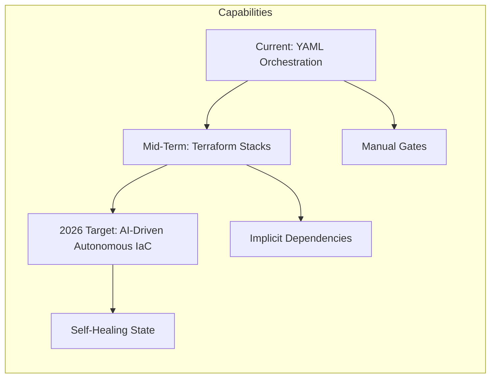

[ Previous: 911. Troubleshooting and Runbooks](911-TROUBLESHOOTING_AND_OPERATIONAL_RUNBOOKS.md) | [ Home](../README.md)

---

# 999. Future Roadmap and Strategic Architectural Backlog

---

##  Table of Contents

- [1. Strategic Vision: The Path to AI-Assisted Engineering](#1-strategic-vision-the-path-to-ai-assisted-engineering)
- [2. Architectural Evolution: Pipeline-to-Stack Migration](#2-architectural-evolution-pipeline-to-stack-migration)
- [3. Security Hardening: The Secretless Frontier](#3-security-hardening-the-secretless-frontier)
- [4. FinOps and GreenOps: Automated Sustainability](#4-finops-and-greenops-automated-sustainability)
- [5. AIOps: Intelligent Observability](#5-aiops-intelligent-observability)
- [6. Strategic Impact Matrix: Prioritized Backlog](#6-strategic-impact-matrix-prioritized-backlog)
- [7. Improvement Deep-Dive: High-Level and Low-Level Breakdown](#7-improvement-deep-dive-high-level-and-low-level-breakdown)
    - [7.1 Security-as-Code: IDE-Integrated Protection](#71-security-as-code-ide-integrated-protection)
    - [7.2 Private Link for MongoDB Atlas: The Private Backbone](#72-private-link-for-mongodb-atlas-the-private-backbone)
    - [7.3 Terraform Stacks Migration: State-Aware Orchestration](#73-terraform-stacks-migration-state-aware-orchestration)
    - [7.4 Resource Cleanup: Automated Hygiene and FinOps](#74-resource-cleanup-automated-hygiene-and-finops)
    - [7.5 Cost-Aware Pipelines: Real-Time Financial Feedback](#75-cost-aware-pipelines-real-time-financial-feedback)
    - [7.6 Microsoft Defender for Cloud: Advanced CSPM and CWPP](#76-microsoft-defender-for-cloud-advanced-cspm-and-cwpp)
- [8. Validated Reference Library (Official and Community)](#8-validated-reference-library-official-and-community)

---

## 1. Strategic Vision: The Path to AI-Assisted Engineering

The Vision 2026 strategy aims to transition from traditional "Human-Scripted" infrastructure to **Autonomous Cloud Engineering**. This roadmap focuses on reducing cognitive load for developers while increasing the resilience and security of the platform.

### 1.1 High-Level Goals
*   **Zero-Cognitive Load**: Application teams should define "What" (Business Intent) while the Platform Team manages the "How" (Implementation Patterns).
*   **Elastic Sustainability**: Moving beyond cost-saving to carbon-aware scheduling of non-critical workloads.

---

## 2. Architectural Evolution: Pipeline-to-Stack Migration

Currently, the repository uses **Azure DevOps YAML** to orchestrate dependencies between root modules (e.g., Shared-Infra -> AKS). This is a "Pipeline-Centric" model.

### 2.1 Low-Level Improvement: Terraform Stacks (GA)
*   **Goal**: Replace brittle `data` sources and manual pipeline triggers with native HCL `stack` and `component` blocks.
*   **Justification**: This moves dependency logic from an external orchestrator (ADO) into the code itself, enabling **Unified Plans** across multiple environments and subscriptions.

---

## 3. Security Hardening: The Secretless Frontier

While the platform already prioritizes Managed Identities, several "Legacy Traps" remain to be cleared.

### 3.1 OIDC-First Migration
*   **Task**: Transition all Service Connections from Client Secrets to **Workload Identity Federation (OIDC)**.
*   **Benefit**: Eliminates the need to rotate secrets and removes static credentials from the CI/CD environment.

### 3.2 Policy-as-Code (PaC) Integration
*   **Task**: Implement mandatory `Checkov` or `Sentinel` scans in the `Validate` stage.
*   **Enforcement**: PRs cannot be merged if they violate security rules (e.g., Public IP on a Database).

---

## 4. FinOps and GreenOps: Automated Sustainability

Expanding the current FinOps analysis into a real-time enforcement engine.

### 4.1 Carbon-Aware Scheduling
*   **Implementation**: Use `azurerm_resource_group` tagging to identify "Non-Critical" workloads and automatically shut down AKS Spot Nodepools during high-carbon intensity periods (using the Carbon Intensity API).

---

## 5. AIOps: Intelligent Observability

The transition from "Dashboards" to "Insights".

### 5.1 Automated Remediation
*   **Goal**: Leverage Azure Monitor AIOps to trigger `terraform apply` (Auto-Healing) when drift is detected.

---

## 6. Strategic Impact Matrix: Prioritized Backlog

| Improvement | Effort | Benefit | Domain | Detail and Traceability |
| :--- | :---: | :---: | :--- | :--- |
| **Security-as-Code** | Low | **High** | DevSecOps | [Deep-Dive 7.1](#71-security-as-code-ide-integrated-protection) |
| **Private Link (Atlas)** | Medium | **Critical** | Cost/Perf | [Deep-Dive 7.2](#72-private-link-for-mongodb-atlas-the-private-backbone) |
| **Terraform Stacks** | High | **Critical** | Orchestration | [Deep-Dive 7.3](#73-terraform-stacks-migration-state-aware-orchestration) |
| **Resource Cleanup** | Medium | **High** | Tech Debt | [Deep-Dive 7.4](#74-resource-cleanup-automated-hygiene-and-finops) |
| **Cost-Aware Pipelines** | Low | **High** | FinOps | [Deep-Dive 7.5](#75-cost-aware-pipelines-real-time-financial-feedback) |
| **Defender for Cloud** | Low | **Critical** | Security | [Deep-Dive 7.6](#76-microsoft-defender-for-cloud-advanced-cspm-and-cwpp) |

---

## 7. Improvement Deep-Dive: High-Level and Low-Level Breakdown

### 7.1 Security-as-Code: IDE-Integrated Protection
*   **High-Level**: Shift security to the earliest point of the development lifecycle (Shift-Left). Identifying misconfigurations in the IDE is 100x cheaper than remediating them in Production.
*   **Low-Level Technical Detail**:
    *   **Integration**: Add a `Validate` job step in `templates/terraform-validate.yml` to execute `checkov -d . --soft-fail` initially.
    *   **Scope**: Audit for unencrypted storage, public ingress, and missing tags as defined in [324. Security-by-Design Checklist](./324-SECURITY_BY_DESIGN_CHECKLIST.md).
    *   **External Reference**: [Checkov Policies Library](https://www.checkov.io/2.Policies/Introduction.html).

### 7.2 Private Link for MongoDB Atlas: The Private Backbone
*   **High-Level**: Eliminate public egress from the Azure VNet to MongoDB Atlas. This significantly improves the security posture by keeping database traffic within the private backbone.
*   **Low-Level Technical Detail**:
    *   **Implementation**: Create an `azurerm_private_endpoint` in the database subnet, mapped to the **Private Link Service** provided by MongoDB Atlas (see [341. Database Architecture](./341-DATABASE_ARCHITECTURE_AND_PERSISTENCE_STRATEGY.md)).
    *   **Impact**: Traffic stays on the Microsoft backbone, never traversing the public internet.
    *   **External Reference**: [Atlas Azure Private Link Architecture](https://www.mongodb.com/docs/atlas/security-private-endpoint/).

### 7.3 Terraform Stacks Migration: State-Aware Orchestration
*   **High-Level**: Move from a "Repo-per-Layer" or "Pipeline-per-Layer" model to a single unified HCL definition. This allows Terraform to understand the entire environment as one atomic unit.
*   **Low-Level Technical Detail**:
    *   **Implementation**: Transition from separate root modules to a unified `main.tfstack.hcl`. This enables **Unified Plans**, where a change in [311. Shared-Infra](./311-SHARED_INFRA_NETWORKING_HUB_SPOKE_BACKBONE.md) accurately predicts the impact on the App-Core layer.
    *   **Context**: Addresses the complexity mentioned in [111. Architecture Strategy](./111-ARCHITECTURE_2026.md).
    *   **External Reference**: [Terraform Stacks Overview](https://developer.hashicorp.com/terraform/language/stacks).

### 7.4 Resource Cleanup: Automated Hygiene and FinOps
*   **High-Level**: Periodic automated cleanup of "Orphaned" resources created during testing phases. This reduces "Cloud Rot" and lowers monthly spend.
*   **Low-Level Technical Detail**:
    *   **Implementation**: Deploy an Azure Logic App or Automation Account script that scans for resources with the tag `env=dev` and `decommission_date < today`.
    *   **Coordination**: Integrates with the [821. FinOps Arch Analysis](./821-FINOPS_ARCH_ANALYSIS.md) dashboard.
    *   **State Management**: Refer to [911. Troubleshooting](./911-TROUBLESHOOTING_AND_OPERATIONAL_RUNBOOKS.md) for state-unlock procedures.

### 7.5 Cost-Aware Pipelines: Real-Time Financial Feedback
*   **High-Level**: Empower engineers to make cost-conscious decisions during the PR phase.
*   **Low-Level Technical Detail**:
    *   **Integration**: Add **Infracost** to the CI pipeline. Every PR will receive a comment showing the "Current Monthly Cost" vs "Proposed Monthly Cost".
    *   **Guardrails**: Block PRs that increase monthly cost by >$500 without a mandatory "FinOps Approval" label.
    *   **Evidence**: Build upon the data provided in [821. FinOps Arch Analysis](./821-FINOPS_ARCH_ANALYSIS.md).
    *   **External Reference**: [Infracost CLI Reference](https://www.infracost.io/docs/).

### 7.6 Microsoft Defender for Cloud: Advanced CSPM and CWPP
*   **High-Level**: Moving from reactive logging to proactive threat detection and workload protection for Kubernetes and App Services.
*   **Low-Level Technical Detail**:
    *   **Implementation**: Enable `Defender for Containers` at the subscription level to scan images in ACR and pods in AKS for runtime anomalies.
    *   **Evidence**: Build upon the hardening standards in [412. Pipeline Security](./412-AZURE_DEVOPS_PIPELINE_SECURITY_AND_GOVERNANCE.md).
    *   **External Reference**: [Azure Defender for Cloud Documentation](https://learn.microsoft.com/en-us/azure/defender-for-cloud/defender-for-cloud-introduction).

---

## 8. Validated Reference Library (Official and Community)

- **[HashiCorp Stacks GA 2025 Roadmap](https://www.hashicorp.com/blog/announcing-terraform-stacks)**
- **[Azure Workload Identity Federation (OIDC) Guide](https://learn.microsoft.com/en-us/azure/active-directory/workload-identities/workload-identity-federation)**
- **[Checkov: Static Code Analysis for IaC](https://www.checkov.io/docs/home)**
- **[Infracost: Cloud Cost Estimates for Terraform](https://www.infracost.io/)**
- **[Atlas Azure Private Link Setup Guide](https://www.mongodb.com/docs/atlas/security-private-endpoint/)**
- **[Green Software Foundation: Carbon Aware SDK](https://github.com/Green-Software-Foundation/carbon-aware-sdk)**
- **[Azure Well-Architected Framework: Sustainability Pillar](https://learn.microsoft.com/en-us/azure/well-architected/sustainability/sustainability-index)**
- **[Microsoft Sentinel AIOps and Automated Remediation](https://learn.microsoft.com/en-us/azure/sentinel/aiops)**

---

[ Previous: 911. Troubleshooting and Runbooks](911-TROUBLESHOOTING_AND_OPERATIONAL_RUNBOOKS.md) | [ Home](../README.md)

---

*Technical Documentation: Future Roadmap and Strategic Architectural Backlog | Vision 2026 Architectural Guide*